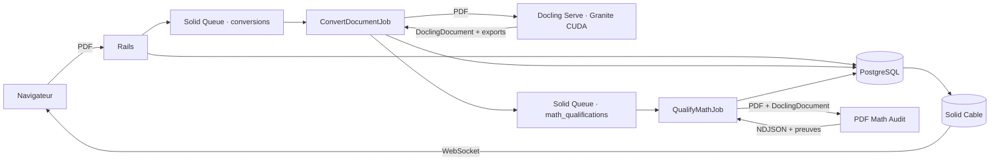

# Processus de conversion et de qualification PDF

Toutes les pages sont confiées à Docling Serve avec le preset Granite CUDA. Il
n’existe ni routage de pages, ni moteur alternatif, ni fallback CPU.

## Conversion Docling

Rails vérifie l’extension `.pdf`, le type MIME, la taille configurée et la
signature `%PDF-`. Il calcule le SHA-256 et conserve les octets originaux avec
Active Storage. Une `ConversionAttempt` distincte porte l’état, les horaires,
les erreurs et les sorties de chaque exécution.

`ConvertDocumentJob` appelle une seule fois `/v1/convert/file`. La limite
Docling est de 24 heures. Une réussite conserve sans les modifier la réponse
brute, le `DoclingDocument` JSON, les DocTags, l’HTML et le Markdown. Une erreur
réseau, HTTP ou Docling passe la tentative à `failed` et conserve toutes les
sorties déjà reçues. Il n’existe ni retry automatique ni moteur de secours.

Le job inscrit son `job_id` dans la tentative lorsqu’il prend le travail. Si ce
même job est redélivré alors que la tentative est encore `converting`, son
processus précédent a disparu sans produire d’état terminal : la tentative passe
explicitement à `failed` avec `interrupted_execution`. Un job d’un autre
identifiant ne peut pas prendre la place d’une exécution active. Le déploiement
qui introduit cette propriété rend aussi terminales les anciennes exécutions
intermédiaires dépourvues d’identifiant.

Solid Queue ne redélivre pas automatiquement un job perdu : il crée une
`FailedExecution`. Le job récurrent `ReconcileInterruptedExecutionsJob` relie
cet échec durable au `job_id`, sous verrou dans la même transaction PostgreSQL,
et rend alors la tentative `failed`. Sa cadence est configurée par
`INTERRUPTED_EXECUTION_RECONCILIATION_SCHEDULE`. Il ne déduit jamais une perte
d’un délai ou d’un log. Chaque écriture du job original revérifie l’état et son
identifiant, de sorte qu’un ancien processus encore vivant ne peut pas écraser
l’échec terminal.

Une relance crée une nouvelle tentative sur le même document. L’URL, le PDF
source et l’historique restent inchangés.

## Qualification mathématique

La réussite Docling crée atomiquement une `MathQualification` et son job dans
la file dédiée `math_qualifications`. Une impossibilité d’enqueue explicitement
identifiée laisse la conversion `succeeded` et persiste une qualification
`failed`. Un rollback de la transaction principale annule ensemble les sorties,
la qualification et le job. Une livraison répétée du même job de conversion est
refusée avant tout appel HTTP : elle ne remplace ni les sorties ni l’unique
qualification déjà persistée.

Le service Python `pdf_math_audit` reçoit exactement le PDF source, le
`DoclingDocument`, leurs SHA-256, la version du contrat et le profil de
capacités. Il recalcule les empreintes avant l’analyse. Son endpoint
`POST /v1/qualifications` diffuse un flux NDJSON composé de :

- progressions monotones `source_analysis`, `docling_alignment` et
  `candidate_evaluation` ;
- fragments base64 des preuves et du rapport ;
- un unique événement terminal `result` ou `error`.

Le service est sans base et sans file. La taille des deux fichiers, le délai
d’upload, la durée d’analyse, la concurrence, le spool multipart et les tailles
de fragments sont configurés par variables d’environnement. Une déconnexion
tue le processus enfant, libère immédiatement la capacité et ne déclenche aucun
autre traitement.

Rails persiste la phase et la progression, puis vérifie l’ordre des événements,
les séquences, tailles et SHA-256 des artefacts. Il vérifie aussi que la version,
le profil et les empreintes du rapport correspondent exactement à la
qualification. Le flux brut et le total des artefacts sont bornés par
configuration ; un dépassement échoue explicitement en conservant le préfixe
admis. Une coupure ou un échec conserve le flux et les fragments déjà reçus. Les
sorties Docling restent intactes.

La qualification revendique elle aussi son exécution par le `job_id`. Une
redélivrance après disparition brutale du même processus produit
`interrupted_execution` ; elle ne relance pas silencieusement l’analyse. Une
autre exécution ne peut pas remplacer un job encore actif. Le même
réconciliateur traite les `FailedExecution` de `QualifyMathJob` et les gardes
d’écriture empêchent toute reprise tardive de la progression ou du résultat.

Le verdict est volontairement borné :

- `contradicted` si au moins une région prouvée contredit le candidat ;
- `non_verifiable` si aucune région n’est évaluable ou si toutes le sont ainsi ;
- `partial` si preuves positives et régions non vérifiables coexistent ;
- `conformant_within_scope` uniquement pour le périmètre effectivement prouvé.

La preuve sémantique exige des signaux Unicode source cohérents. Un nom CFF et
un GID identique au rendu ne suffisent pas à imposer un sens : toute divergence
entre AGL, `ToUnicode` et Unicode extrait produit `conflicting`, puis
`non_verifiable`.

Le rapport affiche toujours la couverture, les pages exclues, leurs raisons et
les boîtes PDF des régions. Cette phase ne corrige jamais le document.

## Mise à jour de l’interface

L’interface lit exclusivement l’état Active Record. Solid Cable transporte les
changements via sa base PostgreSQL séparée. Aucun polling HTTP n’est utilisé.

Les changements de conversion rafraîchissent la page du document. À la
connexion ou reconnexion Cable, Stimulus recharge une fois le Turbo Frame afin
de couvrir un changement survenu juste avant l’abonnement. Les changements de
qualification remplacent seulement la section `MathQualification`; ils ne
recréent pas la souscription Cable et le dernier verdict ne peut pas être perdu
dans une rafale de refreshs.

Le compteur de durée est purement visuel : il part des horodatages persistés et
n’interroge aucun service. L’HTML Docling exact est isolé dans une iframe
`sandbox`, le Markdown est affiché comme texte échappé et le PDF reste la
référence visuelle.

## Services

- `postgres` : données Rails, Solid Queue et base distincte Solid Cable ;
- `web` : Rails, Turbo et Action Cable ;
- `jobs` : files `default`, `conversions` et `math_qualifications` ;
- `docling-serve` : image officielle CUDA épinglée par digest ;
- `math-audit` : service Python borné, sans GPU ;
- `test` : Minitest et Chromium, exclusivement dans Docker.

Le PDF de référence est
`reference/ostrading-environment-qualification-5-pages.pdf`. Le corpus
mathématique représentatif est l’extrait réel de deux pages déclaré dans
`qualification/math_audit/manifest.json`.
