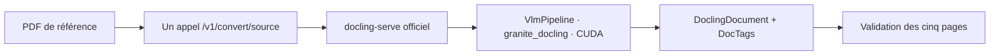

# Processus documentaire actuel

Toutes les pages du PDF sont confiées à Granite Docling. Il n'existe ni
qualification de page, ni routage, ni moteur alternatif.

Le client de qualification transmet le PDF complet en une seule requête. Le
preset public `default` est configuré par le serveur pour désigner
`granite_docling`. Le moteur `auto_inline` sélectionne Transformers sur
`cuda:0` dans l'image Linux qualifiée.

La qualification vérifie successivement les empreintes du modèle, la présence
réelle de CUDA, les versions exposées par le serveur, un statut `success` sans
erreur, le `DoclingDocument`, les DocTags et les pages `1..5`.
L'URL appelée et le répertoire d'actifs sont dérivés du conteneur Compose lui-même
afin que ces preuves portent sur une seule instance.

`/health` est une liveness HTTP, pas une readiness Granite. Le préchargement de
`docling-serve` vise la pipeline PDF standard ; la readiness Granite est donc
établie uniquement par la conversion réelle de qualification.

À ce stade, aucun client de production, stockage, index PostgreSQL, file de
travail ou mécanisme de reprise n'est construit. La réponse officielle contient
le document, les DocTags et les timings ; elle n'expose pas tous les détails
internes de `VlmPrediction`, comme les jetons et leurs logprobabilités.
