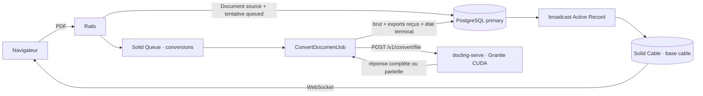

# Processus de conversion PDF

Toutes les pages du PDF sont confiées à Granite Docling. Il n’existe ni
qualification de page, ni routage, ni moteur alternatif.

## Dépôt et conversion

Rails vérifie l’extension `.pdf`, le type MIME `application/pdf`, la taille
configurée et la signature `%PDF-`. Il calcule le SHA-256 en flux et conserve les
octets originaux avec Active Storage. Le `Document` porte uniquement cette
source et son identité. Une `ConversionAttempt` distincte porte le statut, le
contrat Docling, les horaires, l’erreur et les sorties. La première tentative
`queued` et son `ConvertDocumentJob` sont créés avec le document dans la même
transaction PostgreSQL.

Le job passe la tentative à `converting`, puis appelle une fois l’endpoint
synchrone `/v1/convert/file`. Le preset public `default` désigne le preset
Granite administré par le conteneur qualifié. L’appel demande ensemble le
DoclingDocument JSON, les DocTags, l’HTML et le Markdown, avec les images
intégrées en base64. Pour la version Docling épinglée, les images complètes de
page sont conservées à l’échelle 2 et la seconde matérialisation des images
individuelles est désactivée afin d’éviter le double changement d’échelle connu
du pipeline VLM. Il n’existe ni retry automatique, ni fallback CPU.
La limite de traitement Docling est de 24 heures. Le délai de lecture HTTP est
légèrement supérieur afin de laisser au service le temps de renvoyer son état
terminal.

Une réussite conserve le PDF source sur le document, puis la réponse Docling
brute, le DoclingDocument canonique, les DocTags, l’HTML et le Markdown sur la
tentative. Les cinq sorties et l’état `succeeded` sont validés dans une même
transaction. Une erreur réseau,
HTTP ou Docling produit un état `failed` visible et laisse aussi le job en échec
dans Solid Queue. Quand Docling a répondu, le corps brut et chacune des sorties
partielles effectivement présentes sont conservés avant l’état d’échec et
restent téléchargeables depuis l’écran.

Le bouton de relance conserve le même document et la même URL. Sous verrou du
document, il vérifie que la dernière tentative a échoué, puis crée une nouvelle
tentative `queued` et son propre job. Les sorties et l’erreur des tentatives
précédentes restent intactes et téléchargeables dans l’historique. Il n’existe
toujours aucun retry automatique.

## Mise à jour de l’interface

Chaque changement persistant d’une `ConversionAttempt` publie un refresh sur le
flux de son document dans la file courte `default`. Solid Cable transporte le signal par sa base PostgreSQL
dédiée. Le signal ne contient aucun résultat : Turbo relit le document
persisté. À chaque connexion ou reconnexion WebSocket, un contrôleur Stimulus
recharge une fois le Turbo Frame pour couvrir le changement qui aurait précédé
l’abonnement. Aucun polling navigateur n’est utilisé.

La durée écoulée part de l’horodatage persistant de la tentative courante. Un
petit contrôleur Stimulus actualise uniquement cet affichage chaque seconde ; il
n’interroge ni Rails ni Docling. Quand la tentative atteint un état terminal, la
durée est figée à `completed_at`.

Quand la conversion réussit, l’écran affiche le PDF original et l’HTML Docling
côte à côte. L’HTML exact est isolé dans une iframe `sandbox` avec une politique
CSP restrictive. Le Markdown est affiché comme texte brut échappé. La liste des
pages, la page vide et la localisation des images viennent exclusivement du
DoclingDocument JSON canonique.

L’index `/documents` présente les documents du plus récent au plus ancien avec
le statut de leur tentative courante et un lien vers chaque écran de détail. Il
masque les ancêtres des anciennes chaînes de relance et s’abonne à un flux Cable
global : chaque changement persistant d’une tentative rafraîchit automatiquement
la liste. Les tentatives actives ajoutent aussi temporairement leur flux de
document afin que les conversions déjà en cours lors d’un déploiement restent
supervisées jusqu’à leur état terminal. Comme l’écran de détail, l’index recharge
une fois son Turbo Frame après chaque connexion ou reconnexion Cable : un
changement survenu entre la lecture initiale et l’abonnement ne peut donc pas
laisser un statut périmé affiché indéfiniment.

## Services

- `postgres` héberge la base principale et une base séparée pour Solid Cable ;
- `setup` crée les bases et applique les schémas avant le démarrage ;
- `web` sert Rails et Action Cable ;
- `jobs` exécute une file `default` et une file `conversions` distinctes ;
- `docling-serve` est l’image CUDA officielle épinglée par digest ;
- `test` exécute Ruby, Rails, Minitest et Chromium exclusivement dans Docker.

Le PDF de référence de cinq pages est
`reference/ostrading-environment-qualification-5-pages.pdf`. La qualification
réelle a vérifié sans rechargement manuel : la transition jusqu’à `succeeded`,
les cinq pages dont la page 5 vide, les deux images aux pages 2 et 3 dans le JSON
et dans l’HTML, ainsi que le Markdown brut. Le run GREEN mesuré a duré 113,3 s,
dont 108,427 s rapportées par Docling. Un essai séparé avec Docling arrêté a
produit `failed/network_error` et une exécution Solid Queue échouée, sans retry
ni moteur alternatif.
