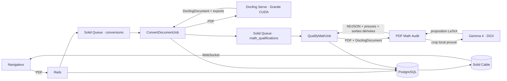

# Processus de conversion et de qualification PDF

Toutes les pages sont confiées à Docling Serve avec le preset Granite CUDA. Il
n’existe ni routage de pages, ni moteur alternatif, ni fallback CPU.

## Conversion Docling

Rails vérifie l’extension `.pdf`, le type MIME, la taille configurée et la
signature `%PDF-`. Il calcule le SHA-256 et conserve les octets originaux avec
Active Storage. Une `ConversionAttempt` distincte porte l’état, les horaires,
les erreurs et les sorties de chaque exécution.

`ConvertDocumentJob` appelle une seule fois `/v1/convert/file`. La limite
Docling est de 24 heures. Une réussite conserve sans les modifier la réponse
brute, le `DoclingDocument` JSON, les DocTags, l’HTML et le Markdown. Une erreur
réseau, HTTP ou Docling passe la tentative à `failed` et conserve toutes les
sorties déjà reçues. Il n’existe ni retry automatique ni moteur de secours.

Le job inscrit son `job_id` dans la tentative lorsqu’il prend le travail. Si ce
même job est redélivré alors que la tentative est encore `converting`, son
processus précédent a disparu sans produire d’état terminal : la tentative passe
explicitement à `failed` avec `interrupted_execution`. Un job d’un autre
identifiant ne peut pas prendre la place d’une exécution active. Le déploiement
qui introduit cette propriété rend aussi terminales les anciennes exécutions
intermédiaires dépourvues d’identifiant.

Solid Queue ne redélivre pas automatiquement un job perdu : il crée une
`FailedExecution`. Le job récurrent `ReconcileInterruptedExecutionsJob` relie
cet échec durable au `job_id`, sous verrou dans la même transaction PostgreSQL,
et rend alors la tentative `failed`. Sa cadence est configurée par
`INTERRUPTED_EXECUTION_RECONCILIATION_SCHEDULE`. Il ne déduit jamais une perte
d’un délai ou d’un log. Chaque écriture du job original revérifie l’état et son
identifiant, de sorte qu’un ancien processus encore vivant ne peut pas écraser
l’échec terminal.

Une relance crée une nouvelle tentative sur le même document. L’URL, le PDF
source et l’historique restent inchangés.

## Qualification mathématique

La réussite Docling crée atomiquement une `MathQualification` et son job dans
la file dédiée `math_qualifications`. Une impossibilité d’enqueue explicitement
identifiée laisse la conversion `succeeded` et persiste une qualification
`failed`. Un rollback de la transaction principale annule ensemble les sorties,
la qualification et le job. Une livraison répétée du même job de conversion est
refusée avant tout appel HTTP : elle ne remplace ni les sorties ni la
qualification déjà persistée.

Une qualification échouée ou produite par une ancienne version de l’analyseur
peut être relancée indépendamment depuis le même document. La relance crée une
nouvelle `MathQualification` à partir des mêmes sorties Docling et remet seulement
un job `math_qualifications` en file : elle ne reconvertit pas le PDF. La
qualification précédente, son erreur et toutes ses preuves restent consultables
dans l’historique. Une qualification courante en attente, en cours ou réussie ne
peut pas être relancée. Une fois terminale, son contenu et ses pièces jointes ne
sont plus remplaçables ni supprimables par l’application.

Le service Python `pdf_math_audit` reçoit exactement le PDF source, le
`DoclingDocument`, leurs SHA-256, la version du contrat et le profil de
capacités. Il recalcule les empreintes avant l’analyse. Son endpoint
`POST /v1/qualifications` diffuse un flux NDJSON composé de :

- progressions monotones `source_analysis`, `docling_alignment`,
  `candidate_evaluation`, `correction_proposal` et `correction_export` ;
- fragments base64 des preuves et du rapport ;
- un unique événement terminal `result` ou `error`.

Le même `DoclingDocument` natif produit aussi une vue HTML de navigation. Le
sérialiseur Docling conserve une section par page ; l’analyseur lui ajoute les
ancres `page-N`. Les images pleine page ne sont pas dupliquées dans cette vue de
7 Mo environ pour le PDF de référence de 152 pages : elles restent conservées
dans le JSON canonique, tandis que les images de contenu restent embarquées dans
l’HTML. L’HTML natif exact reçu de Docling Serve reste lui aussi conservé
séparément. Changer la page du visualiseur PDF met à jour le fragment de l’onglet
HTML vers l’ancre correspondante, sans rechercher approximativement du texte.
Si cette vue paginée n’a pas été produite, l’interface affiche l’HTML natif exact
sans fragment et signale explicitement que la synchronisation par page est
indisponible.

Le service est sans base et sans file. La taille des deux fichiers, le délai
d’upload, la durée d’analyse, la concurrence, le spool multipart et les tailles
de fragments sont configurés par variables d’environnement. Une déconnexion
tue le processus enfant, libère immédiatement la capacité et ne déclenche aucun
autre traitement.

Rails persiste la phase et la progression, puis vérifie l’ordre des événements,
les séquences, tailles et SHA-256 des artefacts. Il vérifie aussi que la version,
le profil et les empreintes du rapport correspondent exactement à la
qualification. Le flux brut et le total des artefacts sont bornés par
configuration ; un dépassement échoue explicitement en conservant le préfixe
admis. Une coupure ou un échec conserve le flux et les fragments déjà reçus. Les
sorties Docling restent intactes.

Pendant la correction, chaque registre, crop, requête et réponse terminés est
aussi checkpointé sur disque. Si le processus atteint son timeout global ou
échoue ensuite, le service diffuse ces preuves partielles avant l'erreur
terminale ; Rails les attache à la qualification en échec. Les limites fournies
admettent un `DoclingDocument` de 256 Mio, jusqu'à 768 Mio d'artefacts et un flux
NDJSON de 1 152 Mio ; le worker Rails dispose de 8 Gio. Ces octets, pas un nombre
de pages supposé, constituent la limite explicite des documents longs.

La progression persistée reste la source des mises à jour Hotwire. Les
transitions d’état remplacent immédiatement le panneau de qualification ; au
sein d’une phase, seuls les franchissements de paliers de 5 % diffusent le
fragment léger de progression. Aucun job Turbo n’est créé pour chaque unité.
En développement seulement, l’interface permet aussi de recréer une
qualification courante afin de rejouer l’analyse et les corrections ; chaque
exécution précédente reste immuable dans l’historique. La nouvelle qualification
recalcule depuis les entrées natives son registre, ses preuves, son
`DoclingDocument` dérivé, son HTML et son Markdown ; aucun artefact dérivé de
l’exécution précédente n’est recopié.

Chaque région `contradicted` n'est corrigible que si son lien Docling est
unique, son charspan correspond encore au texte natif et la preuve source
établit les glyphes, leur style gras éventuel et leurs relations
indice/exposant, racine ou fraction. Les traits horizontaux issus du programme
de dessin PDF délimitent la portée d'une racine et séparent le numérateur du
dénominateur ; leur géométrie fait partie de la preuve. PyMuPDF calcule un crop
qui contient toute la boîte source, traits compris.
Le verdict compare ces relations à la signature MathML du candidat : une suite
de symboles identique mais aplatie n'est jamais déclarée conforme.
Gemma reçoit seulement ce crop et la séquence logique prouvée ; il propose du
LaTeX local, sans traiter la page entière. Une panne est `failed` et une
proposition non exactement prouvée est `rejected` : aucun moteur de secours
n'est appelé. Les formes typographiques mathématiquement identiques sont
normalisées avant cette comparaison stricte ; `\dots` est ainsi comparé aux
trois points consécutifs réellement prouvés par le PDF. Dans la vue HTML,
l’espacement de deux barres verticales adjacentes est neutralisé sans fusionner
leurs nœuds MathML, modifier les valeurs absolues ni altérer l’annotation TeX.

Les polices Type1/CFF, les polices composites Type0 `Identity-H` et les polices
TrueType simples à programme embarqué sont décodées. Pour Type0, la CMap
`ToUnicode`, la largeur de code, la correspondance CID/GID Identity et le GID
rendu doivent concorder. Pour une police TrueType simple, `ToUnicode` fournit
le caractère et le programme embarqué fournit le GID ; la trace rendue doit
confirmer ce GID. Le nom local d'une ressource, par exemple `/G1`, ne constitue
jamais une règle d'acceptation.

Une page qui contient encore une police non supportée est déclarée
`partially_traced` et chaque police ignorée est nommée dans le rapport. Aucun
fragment de cette page ne peut produire une correction : une trace amputée ne
prouve pas l'absence de glyphes entre deux éléments supportés.

Le texte d'un `Form XObject`, y compris dans ses formulaires imbriqués, est lu
récursivement avec les ressources de police du formulaire et rattaché à la
trace rendue par son GID. Le contenu vectoriel reste explicitement hors
qualification : sa `/BBox`, composée avec sa `/Matrix`, la matrice d'invocation
et le repère de la page, est conservée en coordonnées `TOPLEFT`, et la page est
`traced_with_exclusions`. Les glyphes textuels restent conservés comme preuve,
mais une région qui intersecte la boîte du formulaire reste `non_verifiable` :
le texte seul ne prouve pas le contenu graphique superposé. Un XObject image
appelé directement est lui aussi conservé comme exclusion matricielle et suit
la même règle conservatrice.

Pour les polices Latin Modern Math embarquées, les noms CFF explicites des
opérateurs, délimiteurs extensibles, variantes grecques et pièces de radicaux
utilisés par le livre font autorité lorsque les tables Unicode du PDF divergent.
Ils ne sont acceptés que pour les familles Latin Modern explicitement
qualifiées et avec concordance du GID rendu ; une autre police ou une nouvelle
variante reste non vérifiable. La règle reste inscrite dans la preuve. Le langage
structurel conserve le radicand dans la limite exacte de sa
barre, les bornes d'une somme, le numérateur et le dénominateur d'une fraction,
au même titre que les indices et exposants ordinaires.
Les pièces haute et basse d’un crochet extensible sont identifiées comme des
fragments, mais ne sont jamais aplaties en un faux crochet complet. Pour une
somme ou un produit, la ligne de base peut traverser horizontalement l’opérateur :
elle est séparée de part et d’autre, tandis que les bornes de plus petit corps
restent rattachées à l’opérateur même lorsque TeX les décale légèrement à droite.
Les corps successivement plus petits permettent aussi de prouver une relation
imbriquée, par exemple un indice dans un exposant. Quand cette géométrie prouve
une expression structurée mais que les fragments `$...$` de Docling ne forment
pas du LaTeX analysable, le candidat est contradictoire. La correction ne devient
cependant acceptable que si sa séquence et toutes ses relations correspondent
exactement à cette preuve source ; elle produit alors un unique MathML inline.
La première proposition est construite de façon déterministe à partir de cette
séquence et de ces relations. Elle n'est retenue qu'après une nouvelle analyse
LaTeX qui reproduit exactement la preuve. Si cette sérialisation ressemble à un
mot éclaté en variables isolées, Gemma doit la confirmer visuellement sans
recevoir la preuve source. Sa proposition reste soumise à la même égalité de
jetons et de structure.

Pour relier une formule source à un fragment inline Docling, les provenances
Docling sont d’abord ramenées dans les coordonnées de la page PDF à partir des
dimensions respectives des deux pages. L’unique conteneur géométrique est ensuite
aligné avec les glyphes source pour produire `docling_ref`, `docling_charspan` et
`docling_text`. L’alignement compare les symboles canoniques des commandes LaTeX
et assimile l’apostrophe ASCII de Docling au prime mathématique du PDF. Dans un
texte mixte, deux bornes identiques et ordonnées peuvent délimiter un fragment
si son intervalle canonique garde la même longueur et si une majorité stricte de
ses glyphes est appariée, même lorsque son contenu comporte une substitution ;
cette substitution est alors évaluée comme telle au lieu de faire disparaître
le candidat. Les macros structurelles qui enveloppent cet intervalle, telles que
`\mathbf`, `\hat` ou `\mathcal`, restent incluses dans le charspan. Une
correspondance partielle sans ces preuves reste `not_linked`. Une région contenue dans une
`picture` Docling sans transcription, une absence de conteneur et un alignement
incomplet restent trois causes distinctes. Le rapport expose aussi l’étape
d’échec du candidat : acquisition, alignement, analyse LaTeX ou structure
mathématique.

Une correction acceptée crée une copie validée du `DoclingDocument`. Seul le
charspan prouvé de cette copie change ; `orig`, les provenances source et le
document natif restent inchangés. Le registre conserve la correspondance entre
le span original et sa valeur dérivée. Le Markdown est exporté depuis cette
copie unique. Son HTML conserve une ancre `page-N` par page, remplace le LaTeX
accepté par son MathML prouvé et rend aussi les fragments LaTeX inline natifs
non ambigus en MathML côté serveur avec `latex2mathml`. Ce post-traitement ne
s'applique pas aux nœuds déjà typés `formula` par Docling : leur
sérialisation MathML native reste l'unique autorité de rendu. Un `$` isolé,
notamment dans une unité monétaire telle que `M$`, reste du texte.
Quand cette sérialisation contient explicitement un fragment `$...$` dans un
`mtext`, seul ce fragment est rendu en MathML imbriqué ; l'annotation TeX brute
reste inchangée et aucun `$` monétaire hors formule n'est interprété.
Les `&` utilisés par LaTeX pour aligner les colonnes sont retirés de la seule
présentation MathML ; une `\&` littérale est conservée. Un mélange dont la
correspondance ne peut pas être établie sans ambiguïté fait échouer l'export.
Le LaTeX alternatif ajouté par Docling aux formules reste conservé dans un
`<annotation encoding="TeX">`, replacé sous le conteneur MathML standard
`<semantics>` afin qu'il ne soit pas rendu comme une seconde formule. Une
structure d'annotation inattendue fait échouer explicitement l'export.
Dans une formule de bloc, les limites de `max`, `min`, `arg max` et `arg min`
sont rendues par `<munder>` : la condition reste centrée sous l'opérateur, sans
modifier le LaTeX Docling conservé dans l'annotation.
Les régions partielles qui désignent un même élément Docling `formula` sont
regroupées en une seule cible. La formule complète est validée et remplacée de
façon atomique : aucune région du groupe ne peut être appliquée seule. La
transcription visuelle indépendante ne reçoit ni les jetons ni la structure
source et doit pourtant reproduire exactement cette preuve. Si la formule
native est déjà prouvée, elle est conservée telle quelle. Sinon, toutes les
substitutions sont construites puis le LaTeX complet doit être analysable et
rendu en MathML. Un chevauchement ou une reconstruction incomplète produit
`full_formula_reconstruction_unproven`, sans document partiellement modifié.

Une région source établie sans candidat Docling reste une cible d'acquisition
observable, mais elle n'est pas insérée dans le flux visible : aucune position
Docling ou relation de lecture n'est alors prouvée. Elle est rejetée avec
`formula_insertion_rendering_unproven`. De même, une cible fusionnée qui
absorberait du contexte, une correction qui contient de la prose ou un mot
mathématique sérialisé comme une suite ambiguë de variables est refusée. Une
commande LaTeX qui subsiste dans le MathML visible fait échouer l'export.

Pour une correction complète, le LaTeX brut remplace le nœud et son `<math>`
sérialisé est remplacé en bloc ; aucun marqueur interne ne peut devenir du
contenu visible. Chaque marqueur temporaire est absent de tout le contenu
Docling sérialisable et son occurrence HTML doit être unique. Un charspan vide,
inversé, négatif ou hors limites est rejeté avant toute transformation.
Le `DoclingDocument`, le Markdown et
les sorties natives conservent leurs chaînes originales. Rails
conserve séparément le registre, le ZIP des crops/requêtes/réponses, le document
dérivé et ses deux exports. Il vérifie leurs tailles et SHA-256 avant de les
attacher. Rails recoupe aussi les cibles et statuts du registre avec le rapport
et refuse un document dérivé qui n'est pas un objet `DoclingDocument`.
L'interface identifie explicitement ces sorties comme dérivées. L’onglet
« HTML corrigé » est synchronisé avec la page PDF. Deux onglets distincts
conservent la resérialisation native paginée et l’HTML natif exact reçu de
Docling Serve. Toutes les routes conservent leur politique `sandbox` et les
artefacts bruts restent téléchargeables séparément.

Le contrat v2.1 et les paramètres `MATH_CORRECTION_ENDPOINT`,
`MATH_CORRECTION_MODEL`, `MATH_CORRECTION_DPI`,
`MATH_CORRECTION_PADDING_POINTS`, `MATH_CORRECTION_TIMEOUT_SECONDS` et
`MATH_CORRECTION_MAX_RESPONSE_BYTES` rendent ce dimensionnement explicite.

La qualification revendique elle aussi son exécution par le `job_id`. Une
redélivrance après disparition brutale du même processus produit
`interrupted_execution` ; elle ne relance pas silencieusement l’analyse. Une
autre exécution ne peut pas remplacer un job encore actif. Le même
réconciliateur traite les `FailedExecution` de `QualifyMathJob` et les gardes
d’écriture empêchent toute reprise tardive de la progression ou du résultat.

Le verdict est volontairement borné :

- `contradicted` si au moins une région prouvée contredit le candidat ;
- `non_verifiable` si aucune région n’est évaluable ou si toutes le sont ainsi ;
- `partial` si preuves positives et régions non vérifiables coexistent ;
- `conformant_within_scope` uniquement pour le périmètre effectivement prouvé.

La preuve sémantique exige des signaux Unicode source cohérents. Un nom CFF et
un GID identique au rendu ne suffisent pas à imposer un sens : toute divergence
entre AGL, `ToUnicode` et Unicode extrait produit `conflicting`, puis
`non_verifiable`. Chaque preuve distingue la valeur source, sa méthode (`agl` ou
`to_unicode`) et la valeur AGL éventuelle ; cette dernière reste absente quand
la source provient de `ToUnicode`. Un candidat Docling vide ne prouve aucune omission : il reste
`not_evaluated` et produit également `non_verifiable`.

Le rapport affiche toujours la couverture, les pages exclues, leurs raisons et
les boîtes PDF des régions. Cette phase ne corrige jamais le document.

## Mise à jour de l’interface

L’interface lit exclusivement l’état Active Record. Solid Cable transporte les
changements via sa base PostgreSQL séparée. Aucun polling HTTP n’est utilisé.

Les changements de conversion rafraîchissent la page du document. À la
connexion ou reconnexion Cable, Stimulus recharge une fois le Turbo Frame afin
de couvrir un changement survenu juste avant l’abonnement. Les changements de
la qualification courante remplacent seulement la section stable
`MathQualification`; ils ne
recréent pas la souscription Cable et le dernier verdict ne peut pas être perdu
dans une rafale de refreshs.

Le compteur de durée est purement visuel : il part des horodatages persistés et
n’interroge aucun service. PDF.js affiche une seule page du PDF original ; ses
commandes précédente, suivante et numéro de page constituent l’état de navigation
partagé avec l’onglet JSON.

Le visualiseur à onglets charge à la demande un seul format Docling : l’HTML
corrigé paginé lorsqu’il existe, l’HTML natif paginé ou exact, le Markdown brut
ou une projection JSON de la page PDF courante. Cette
projection contient l’objet `page` et les `texts`, `pictures`, `tables`,
`key_value_items` et `form_items` dont `prov.page_no` correspond. Son bloc
`_projection` signale explicitement la sélection et les structures globales
exclues. Son bloc `_math_links` expose, pour cette page, les relations dérivées
entre boîtes et glyphes PDF, références et charspans Docling ; il ne modifie pas
le JSON canonique. La projection ne se présente donc jamais comme un
`DoclingDocument` canonique.
Oj parcourt le JSON canonique en flux et ne construit en mémoire que les objets
de la page demandée. Le fichier canonique reste inchangé et téléchargeable dans
son intégralité. Chaque format est isolé dans la même iframe `sandbox` ; ils ne
sont jamais injectés ensemble.

## Services

- `postgres` : données Rails, Solid Queue et base distincte Solid Cable ;
- `web` : Rails, Turbo et Action Cable ;
- `jobs` : files `default`, `conversions` et `math_qualifications` ;
- `docling-serve` : image officielle CUDA épinglée par digest ;
- `math-audit` : service Python borné, sans GPU, client du Gemma distant pour
  les seules régions contradictoires prouvées ;
- `test` : Minitest et Chromium, exclusivement dans Docker.

Le PDF de référence est
`reference/ostrading-environment-qualification-5-pages.pdf`. Le corpus
mathématique représentatif est l’extrait réel de deux pages déclaré dans
`qualification/math_audit/manifest.json`.
