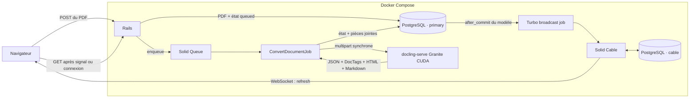

# Plan V1 — Interface Rails de conversion PDF

## Résultat attendu

Construire dans `ui/` une application Ruby on Rails qui permet de déposer un
PDF, lance sa conversion Granite en arrière-plan et affiche, dès qu'elle est
disponible, l'export HTML Docling en regard du PDF original. L'export Markdown
brut reste consultable comme vue technique secondaire.

Le navigateur ne sonde aucun endpoint. Chaque changement persistant du
document déclenche, après commit Active Record, un signal Turbo transmis par
Action Cable et Solid Cable. Le navigateur recharge alors la représentation
persistée du document. À chaque connexion ou reconnexion WebSocket, une
relecture unique réconcilie aussi l'écran avec PostgreSQL afin qu'un signal
émis juste avant l'abonnement ne soit pas perdu. Le contrôleur et le job ne
diffusent aucun événement Hotwire directement.

La V1 doit prouver ce parcours sur le PDF de référence de cinq pages déjà
versionné. Elle ne constitue ni un benchmark de charge ni une promesse sur des
PDF de 100 Mo ou de 1 000 pages.

## Scénario d'acceptation

```gherkin
Étant donné que PostgreSQL, le worker Solid Queue et Docling Serve Granite CUDA sont démarrés
Et que l'utilisateur consulte l'écran de dépôt
Quand il dépose le PDF de référence de cinq pages
Alors la requête HTTP Rails se termine sans attendre la conversion
Et le premier rendu affiche l'état persistant courant, « en attente » ou « conversion en cours »
Et une mise à jour Active Record déclenche chaque rafraîchissement via WebSocket
Et une connexion établie après un changement relit une fois l'état persistant
Et l'écran terminé présente le PDF original et l'HTML Docling sandboxé côte à côte
Et les deux images extraites du PDF de référence sont visibles dans l'HTML
Et la liste canonique identifie les cinq pages, y compris la cinquième page vide
Et le PDF, la réponse brute, le DoclingDocument JSON, les DocTags, l'HTML et le Markdown sont conservés
```

En cas d'échec réseau, HTTP ou Docling, le document passe à l'état « échec »,
l'erreur est visible dans l'interface et le job reste visible comme échoué dans
Solid Queue. Il n'existe ni nouvelle tentative automatique, ni conversion CPU,
ni autre fallback silencieux.

## Architecture retenue



### Choix structurants

- Rails serveur avec Hotwire, Turbo et importmap ; pas de SPA ni de framework
  JavaScript supplémentaire.
- Rails ne tourne jamais directement sur l'hôte, y compris en développement et
  pendant les tests. Une image Linux commune fournit Ruby, Rails et les gems aux
  services `web`, `jobs` et aux commandes de test.
- Ruby 4.0.6 et Rails 8.1.3 sont figés dans l’image et `Gemfile.lock` ; ils
  constituaient leurs dernières versions stables compatibles au démarrage de
  l’implémentation. L’image de base est elle aussi épinglée par digest.
- Un seul service PostgreSQL. Chaque environnement Rails possède une base
  principale isolée (`development` ou `test`) pour le métier, Active Storage et
  Solid Queue, ainsi qu'une base `cable` séparée réservée à Solid Cable. Cette
  séparation suit l'installation officielle de Solid Cable sans ajouter une
  seconde instance PostgreSQL. Aucun fichier SQLite ne doit subsister.
- Active Storage sur disque local pour les fichiers ; PostgreSQL conserve leurs
  métadonnées et index. Le chemin de stockage est configuré, jamais enfoui dans
  le code.
- Solid Queue exécute les conversions dans le conteneur `jobs` avec son mode
  Linux normal. Il ne partage pas le processus Puma du service `web`.
- Solid Cable est l'adaptateur Action Cable dès le développement. Il remplace
  Redis mais interroge lui-même sa table PostgreSQL. Il n'y a aucun polling dans
  le navigateur ni auprès de l'API asynchrone de Docling.
- Le job appelle une fois l'endpoint synchrone `POST /v1/convert/file` de
  Docling Serve par son nom de service Docker. L'asynchronisme appartient à
  Rails et Solid Queue.
- `DoclingDocument` JSON et la réponse Docling complète font autorité. HTML et
  Markdown sont deux projections dérivées indépendantes, conservées sans
  remplacer les données canoniques.
- L'HTML Docling est la vue de contrôle par défaut : il préserve notamment les
  cellules fusionnées et MathML, que Markdown représente avec davantage de
  pertes. Il reste toutefois linéaire et ne remplace jamais le PDF ou le JSON.
- Cette V1 contrôle le texte, l'ordre de lecture, les tables, les formules et la
  présence visuelle des images extraites. Le PDF reste la référence graphique :
  l'HTML est linéaire et ne reconstitue pas la mise en page d'origine.
- Les images sont demandées en mode `embedded` afin que l'HTML les montre sans
  service de fichiers supplémentaire. Le surcoût base64 est accepté pour cette
  V1 ; il ne provoque jamais un retour silencieux à `placeholder`.

## Contrat de données

### Modèles `Document` et `ConversionAttempt`

`Document` conserve l’identité et les octets originaux du PDF. Chaque lancement
ou relance crée une `ConversionAttempt` distincte rattachée au même document,
afin de ne jamais écraser un résultat ou un échec antérieur.

Champs applicatifs minimaux de `Document` :

| Champ | Rôle |
| --- | --- |
| `source_sha256` | Identité du PDF reçu |

Pièce jointe Active Storage de `Document` :

- `source_pdf` : octets originaux immuables.

Champs applicatifs minimaux de `ConversionAttempt` :

| Champ | Rôle |
| --- | --- |
| `status` | `queued`, `converting`, `succeeded` ou `failed` |
| `conversion_options` | Options Docling exactes, en `jsonb` |
| `page_count` | Nombre de pages annoncé par le DoclingDocument terminé |
| `processing_seconds` | Durée fournie par Docling, si présente |
| `started_at` / `completed_at` | Horodatage réel des transitions |
| `error_code` / `error_message` | Erreur terminale bornée et présentable |

Pièces jointes Active Storage de `ConversionAttempt` :

- `docling_response` : réponse JSON brute complète ;
- `docling_document` : `document.json_content` canonique ;
- `doctags` : `document.doctags_content` exact ;
- `html` : `document.html_content` exact ;
- `markdown` : `document.md_content` exact.

Les contraintes PostgreSQL interdisent un statut inconnu. Le passage à
`succeeded` et l'association des cinq sorties ont lieu dans une même
transaction Active Record. Une sortie absente ou un statut Docling autre que
`success` constitue un échec explicite.

### Transitions

```text
création -> queued -> converting -> succeeded
                              \--> failed
```

Il n'existe pas de transition implicite, de pourcentage fabriqué ni de retour
automatique vers `queued`. La V1 affiche uniquement les états réellement
observables.

### Contrat Docling

L'appel multipart transmet le PDF et demande au minimum :

- la pipeline `vlm` et le preset Granite autorisé par le conteneur qualifié ;
- les formats `json`, `html`, `md` et `doctags` dans la même conversion ;
- l'arrêt sur erreur ;
- un marqueur de saut de page distinctif dans le Markdown ;
- `include_images=false`, `include_page_images=true`, `images_scale=2.0` et
  `image_export_mode=embedded` ;
- le délai document configuré pour Rails et cohérent avec celui du serveur.

`document.html_content` et `document.md_content` sont produits par Docling Serve
à partir du même DoclingDocument, via `export_to_html` et
`export_to_markdown`. Les demander ensemble ne relance pas Granite. Rails ne
reconstruit pas un objet Python et ne réimplémente aucun sérialiseur.

Le client Rails utilise `Net::HTTP`, qui sait émettre un formulaire multipart,
avant d'envisager une dépendance HTTP supplémentaire. L'URL de Docling Serve,
les délais et la taille maximale du PDF viennent de la configuration. Le client
ne suit pas d'URL fournie par l'utilisateur, ne retente pas un POST ambigu et
rejette toute réponse incomplète.

## Interface V1

Routes publiques minimales :

- `GET /` : formulaire de dépôt d'un PDF, via `documents#new` ;
- `POST /documents` : persistance puis mise en file, avec redirection immédiate ;
- `GET /documents/:id` : état ou résultat de la conversion ;
- `GET /documents/:id/html_preview` : HTML Docling servi uniquement à l'iframe
  avec ses en-têtes de confinement.

La page d'un document contient `turbo_stream_from @document`, hors du Turbo
Frame qui porte son contenu mutable. Le modèle utilise le mécanisme déclaratif
`broadcasts_refreshes` de Turbo après commit. Le signal WebSocket ne contient
ni PDF, ni HTML, ni Markdown : il demande seulement un rafraîchissement, puis
Rails relit l'état et les fichiers persistés. La connexion et chaque
reconnexion rechargent ce Frame exactement une fois. Comme ce remplacement ne
remonte pas la source Cable, le rattrapage ne peut pas déclencher une boucle de
reconnexion ; il n'est ni périodique ni une source d'état concurrente.

À l'état `succeeded`, l'écran présente :

- à gauche, le PDF original via le visualiseur PDF natif du navigateur ;
- à droite, l'HTML Docling avec ses images intégrées, par défaut dans un iframe
  sandboxé ;
- le Markdown brut exact dans une vue technique secondaire, échappé dans un
  élément `<pre>` ;
- l'inventaire des pages issu de `DoclingDocument.pages`, avec les pages sans
  aucun élément de provenance signalées explicitement ;
- le nombre et la page des images issus du JSON canonique, indépendamment de
  leur présence dans la projection HTML ;
- un avertissement indiquant que l'HTML et le Markdown suivent l'ordre de
  lecture mais ne restituent ni boîtes ni géométrie complète.

Il n'y a pas de synchronisation automatique du défilement dans cette version.

## Sécurité et limites d'entrée

- Un seul fichier par soumission.
- Extension, type MIME, taille configurée et signature `%PDF-` vérifiés avant
  mise en file. Une validation réussie ne prétend pas rendre un PDF sûr.
- Le conteneur Docling reste isolé, sans service distant, plugin externe ni
  fallback CPU, comme dans le déploiement déjà qualifié.
- L'HTML Docling complet n'est jamais injecté dans le DOM Rails. La vue l'ouvre
  dans `iframe sandbox=""`, sans `allow-scripts` ni `allow-same-origin`.
  L'endpoint de prévisualisation ajoute une CSP de document avec `sandbox`,
  `default-src 'none'`, `style-src 'unsafe-inline'`, `img-src data:`,
  `form-action 'none'` et `base-uri 'none'`. Cette barrière est requise car les
  liens Docling peuvent conserver des protocoles `javascript:` ou `data:`.
- Le Markdown n'est pas rendu en HTML dans cette V1. Sa source est affichée par
  l'échappement ERB normal ; aucun contenu extrait ne reçoit `html_safe`.
- La CSP principale autorise seulement ce qui est nécessaire au PDF servi par
  l'application, à l'iframe confinée et à Action Cable.
- Les messages d'erreur affichés ne contiennent ni pile Ruby, ni corps HTML
  distant, ni secret de configuration.

## Dimensionnement initial configurable

- File `conversions` : un thread de conversion au départ, réglable par
  configuration pour respecter la capacité du conteneur Granite.
- File `default` : un worker indépendant pour les petits jobs de diffusion
  Turbo. Une conversion longue ne doit jamais retarder son propre changement
  d'état dans l'interface.
- Les noms de files sont explicites ; aucun wildcard Solid Queue.
- Intervalle de Solid Cable et durée de rétention des messages explicités dans
  `config/cable.yml` et surchargeables par environnement.
- Les pools Active Record `primary` et `cable` sont dimensionnés séparément pour
  chaque processus (`web` et `jobs`) selon ses threads réels ; leurs valeurs sont
  calculées et documentées lors de l'implémentation.
- Les limites CPU, mémoire, ports, volumes et nombres de processus des services
  Rails sont définis dans Compose ou son fichier d'environnement, pas dans le
  code applicatif.

## Exécution Docker

- `ui/Dockerfile` construit une image Linux unique pour le développement et le
  test. Le code source est monté en développement ; les gems restent dans un
  volume Docker nommé.
- Un fichier Compose applicatif ajoute `postgres`, `web` et `jobs` sans recopier
  la définition de `docling-serve`. Les deux fichiers Compose sont combinés pour
  placer tous les services sur le même réseau.
- `web` publie uniquement le port Rails sur `127.0.0.1`. PostgreSQL n'est publié
  sur l'hôte que si un besoin de diagnostic explicite le justifie.
- `jobs` réutilise exactement la même image et le même `Gemfile.lock` que `web`.
- Les tests sont lancés par une commande Compose éphémère avec
  `RAILS_ENV=test`, contre la base PostgreSQL de test. Aucun Ruby, Bundler,
  navigateur de test ni gem installé sur Windows ne participe au résultat.
- Le stockage Active Storage de développement utilise un volume nommé. Celui
  des tests est éphémère et supprimé à la fin de la commande.
- Les préparations de base sont des commandes explicites ; aucun entrypoint ne
  masque une migration ou un chargement de schéma.

## Dépendances

Réutiliser d'abord les composants Rails : `pg`, Active Storage, Active Job,
Solid Queue, Action Cable, Solid Cable et Turbo Rails. Aucune dépendance de rendu
documentaire supplémentaire n'est nécessaire dans cette V1.

Ne pas ajouter Faraday, Redis, Sidekiq, React, PDF.js, un client Python ou une
couche de repository. Une dépendance supplémentaire exige un problème concret
non résolu proprement par ce socle.

## Étapes d'implémentation

### 1. Initialiser le socle Rails et PostgreSQL

- Générer `ui/` depuis une image Ruby éphémère avec Rails 8, PostgreSQL, Hotwire
  et les tests Minitest, en excluant les modules inutiles à cette V1.
- Ajouter le Dockerfile Rails, le Compose applicatif et un exemple de
  configuration sans secret réel. Réutiliser le Compose Docling qualifié par
  composition, sans le recopier ni le modifier.
- Construire une seule image Rails et prouver que `web`, `jobs` et la commande
  de test rapportent le même digest d'image et le même `Gemfile.lock`.
- Installer Active Storage dans la base principale. Pour Solid Queue, appliquer
  sa procédure officielle « single database » : transférer sans altération les
  tables de `db/queue_schema.rb` dans une migration primaire, supprimer ce
  schéma séparé et retirer `config.solid_queue.connects_to`.
- Conserver le schéma généré de Solid Cable et sa connexion vers la base
  `cable` dédiée.
- Configurer Solid Queue et Solid Cable aussi en développement, puis vérifier
  qu'aucun adaptateur `async` en mémoire ou SQLite n'est utilisé.
- Prouver par un test de démarrage conteneurisé que Rails et le worker partagent
  la base principale, tandis qu'Action Cable utilise la base `cable` de la même
  instance PostgreSQL, dans chaque environnement.

### 2. Persister un dépôt sans conversion

- Créer `Document`, ses contraintes et ses pièces jointes.
- Implémenter le dépôt, la consultation et les vues des états `queued` et
  `failed`.
- Valider le PDF et calculer son SHA-256 en flux, sans dupliquer ses octets en
  base.
- Tester le dépôt valide, chaque refus d'entrée et l'absence de conversion dans
  la requête contrôleur.
- Vérifier qu'un échec de mise en file est explicite et ne laisse jamais un
  document durablement `queued` sans job associé.

### 3. Écrire la frontière Docling

- Créer un unique `DoclingClient` responsable du multipart et de la validation
  stricte de la réponse.
- Conserver la réponse brute avant d'en extraire les quatre représentations.
- Tester le décodage sur une réponse représentative et les erreurs de contrat,
  sans prétendre que ces tests simulent CUDA.
- Ajouter un test live ciblé de `/v1/convert/file` avec le PDF de référence ; il
  réutilise le conteneur déjà démarré et ne reconstruit aucune image.

### 4. Exécuter la conversion avec Solid Queue

- Créer `ConvertDocumentJob` sur la file `conversions`.
- Le job ne fait que charger le document, enregistrer `converting`, appeler le
  client, attacher les sorties et enregistrer `succeeded` ou `failed`.
- Après avoir persisté l'échec attendu, le job relève l'exception afin que Solid
  Queue conserve lui aussi la preuve d'échec.
- Aucun appel à Turbo ou Action Cable n'est autorisé dans le contrôleur, le job
  ou le client Docling.
- Tester les transitions, la complétude atomique et l'absence de retry automatique.

### 5. Brancher Hotwire sur Active Record avec Solid Cable

- Déclarer le rafraîchissement Turbo dans `Document` et s'abonner depuis la vue.
- Garder la source Cable hors du Turbo Frame mutable et recharger uniquement ce
  Frame à la connexion et à la reconnexion, sans minuteur ni boucle de requêtes.
- Séparer le worker `default` du worker `conversions`.
- Tester qu'un simple `document.update!` après commit produit le broadcast et
  que le rendu relit la valeur persistée.
- Tester en processus séparés que le WebSocket reçoit l'événement via Solid
  Cable ; le test doit échouer si l'adaptateur revient silencieusement à
  `async`.
- Retarder volontairement l'abonnement jusqu'après un commit terminal et
  vérifier que la réconciliation affiche cet état sans attendre un autre
  changement.

### 6. Construire le visualiseur de qualité

- Afficher le PDF et l'HTML Docling côte à côte avec une mise en page utilisable
  sur un écran de développement ; garder le Markdown brut en vue secondaire.
- Servir l'HTML exact et ses images `data:` dans l'iframe confinée, sans le
  transformer ni l'injecter dans la page Rails.
- Tirer du JSON canonique la liste complète des pages, les pages vides et les
  indicateurs d'images ; ne les déduire ni de l'HTML ni du Markdown.
- Tester le confinement avec du texte HTML et des liens `javascript:`/`data:`,
  l'affichage des images `data:image/...;base64` et l'échappement de la source
  Markdown.

### 7. Qualifier la chaîne réelle une seule fois

- Démarrer PostgreSQL, Docling Serve, Rails et Solid Queue ensemble par Compose,
  avec leurs vraies configurations et sans processus Rails sur l'hôte.
- Déposer le PDF de référence depuis le navigateur et mesurer séparément le
  temps de réponse du dépôt et le temps de conversion.
- Après l'abonnement WebSocket, observer sans rechargement manuel le passage de
  l'état courant (`queued` ou `converting`) à `succeeded`. Ne pas imposer que le
  navigateur voie un état déjà commité avant son abonnement.
- Vérifier dans le JSON canonique les cinq pages, le tableau, les deux images et
  l'absence d'élément de provenance sur la page 5 ; vérifier aussi que les deux
  images intégrées sont présentes dans l'HTML, que l'interface les affiche, que
  le Markdown brut est accessible à la demande et que les six fichiers sont
  conservés.
- Arrêter Docling lors d'un second essai et vérifier l'état terminal `failed`,
  sans retry automatique ni fallback.
- Mettre alors seulement `README.md` et `PROCESS.md` en conformité avec le
  pipeline réellement construit.

## Boucle de vérification

Pendant le développement : tests Rails ciblés du modèle, du client, du job ou
de la vue concernée dans le conteneur de test, avec un objectif inférieur à dix
secondes. À la fin d'une unité cohérente : suite Rails rapide complète dans la
même image. Une fois la V1 assemblée : un seul test réel PostgreSQL + Solid
Queue + Solid Cable + Docling CUDA.

Les doubles de test prouvent les contrats locaux. Seul le dernier essai prouve
que les processus, PostgreSQL, le WebSocket et Granite fonctionnent ensemble.

## Budget de code et points d'arrêt

Le code généré par Rails, Active Storage, Solid Queue et Solid Cable est suivi
mais n'est pas du code métier à réinventer. Le code applicatif spécifique visé
reste de l'ordre de 250 à 350 lignes hors vues, styles, migrations générées et
tests : un modèle, un contrôleur, un job et un client Docling. La
prévisualisation HTML reste une action confinée, pas une couche générique.

Après environ 200 lignes de production spécifique, relire l'ensemble et retirer
les abstractions ou dépendances sans valeur. Si une responsabilité dépasse 250
lignes ou si le total dépasse nettement cette estimation, arrêter et expliquer
le besoin avant d'ajouter une couche.

## Hors périmètre

- authentification, comptes ou droits d'accès ;
- édition ou correction du Markdown ;
- Qdrant, recherche, embeddings ou découpage sémantique ;
- conversions parallèles volontaires du même document, réordonnancement ou
  déduplication ;
- plusieurs serveurs Granite ou régulation distribuée ;
- rendu du Markdown en HTML et synchronisation du défilement PDF/HTML ;
- stockage objet distant, déploiement de production ou observabilité complète ;
- benchmark du PDF de 38 pages ou cible de charge de production.

## Terminé lorsque

- le scénario d'acceptation passe sur le PDF réel de cinq pages ;
- le dépôt HTTP ne dure pas le temps de la conversion ;
- les changements visuels relisent exclusivement l'état Active Record
  persistant, après un broadcast ou la réconciliation d'une connexion Cable ;
- le développement et tous les tests Rails s'exécutent dans Docker à partir de
  l'image commune ;
- aucun polling navigateur, Redis, retry automatique ou fallback n'existe ;
- les données brutes et les projections sont toutes récupérables après
  redémarrage ;
- les tests ciblés restent rapides et la qualification réelle est distincte ;
- `README.md` et `PROCESS.md` décrivent exactement ce qui fonctionne.

## Références techniques

- [Rails — Active Job et Solid Queue](https://guides.rubyonrails.org/active_job_basics.html)
- [Solid Queue — documentation officielle](https://github.com/rails/solid_queue)
- [Solid Cable — documentation officielle](https://github.com/rails/solid_cable)
- [Turbo Rails — diffusions depuis les modèles](https://github.com/hotwired/turbo-rails)
- [Docling — compromis des sérialiseurs](https://docling-project.github.io/docling/concepts/serialization/)
- [Docling Serve — déploiement](https://docling-project.github.io/docling/usage/api_server/deployment/)
