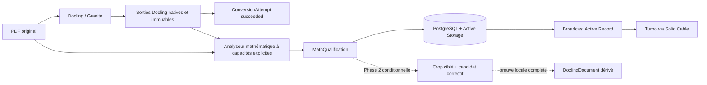

# Plan — Qualification mathématique des conversions PDF

## État au 1er août 2026

La première phase est implémentée. Le corpus représentatif est GREEN sur ses
53 régions : 39 sont sémantiquement prouvées et 14 conflits sont correctement
refusés. La chaîne réelle Rails → Solid Queue → service d’audit →
PostgreSQL → Solid Cable est raccordée. La phase 2 de correction ciblée reste
hors périmètre et nécessitera une décision distincte.

Le gate recalcule maintenant les empreintes des trois fichiers de preuve
indépendants déclarés par l’oracle. Les jobs de conversion et de qualification
persistent leur identifiant d’exécution. Un réconciliateur lie les pertes de
worker constatées par Solid Queue à ces identifiants et termine l’état métier
par `interrupted_execution`, sans recommencer silencieusement. Chaque écriture
du processus original est gardée contre une terminaison concurrente.

## Résultat attendu

Ajouter au pipeline Rails une qualification mathématique automatique, distincte
de la réussite technique de Docling. Cette qualification confronte les éléments
du `DoclingDocument` aux glyphes et à la géométrie du PDF source, publie le
périmètre réellement couvert et rend toute contradiction ou impossibilité de
preuve observable.

La première version ne corrige aucun contenu et n'appelle aucun modèle
supplémentaire. Elle doit d'abord établir que la preuve PDF peut être généralisée
et alignée avec les provenances Docling sur un corpus représentatif. Une
correction ciblée ne sera étudiée que dans une seconde phase, si cette couverture
est suffisante.

Le PDF source reste l'autorité. Les sorties Docling natives restent immuables.
Une qualification ou une future correction est une donnée dérivée, versionnée et
reproductible ; elle ne remplace jamais silencieusement une sortie existante.

## Ce que l'expérience a établi

L'expérience conservée dans `experiments/math_pipeline_comparison/` porte sur
deux pages et neuf faits mathématiques présélectionnés :

- Marker `force_ocr` et Gemma 4 à 200 dpi obtiennent 9/9 ;
- Docling/Granite et MinerU obtiennent 8/9 ;
- Gemma 4 à 300 dpi obtient 8/9 ;
- la réconciliation de deux pages entières à 200 et 300 dpi obtient 7/9 ;
- les neuf mutations contrôlées sont rejetées ;
- sur ce PDF précis, 4 088 codes texte ont été reliés à un CharString CFF puis
  au même GID rendu par MuPDF ;
- les cinq crops ciblés obtiennent 9/9 avec l'image seule comme avec l'image
  accompagnée des faits extraits du PDF.

Ces résultats autorisent l'étude d'un audit fondé sur le PDF source. Ils ne
prouvent pas qu'un moteur est globalement supérieur, que la preuve source
améliore causalement Gemma, ni que les deux pages sont intégralement qualifiées.

## Ce qui ne peut pas entrer en production tel quel

Les scripts expérimentaux sont liés au spécimen :

- les neuf faits et les cinq crops sont codés en dur ;
- les candidats sont évalués par recherche de sous-chaînes prédéfinies ;
- le vérificateur structurel exige un SHA-256, deux pages, des polices, des
  coordonnées, des indices d'opération et des totaux exacts ;
- plusieurs constructions PDF sont rejetées : fontes Type0/CID ou Type3, CMap
  complexes, XObjects, images, rotations et certains opérateurs ;
- la chaîne `code PDF -> CharString -> GID rendu` ne prouve pas à elle seule
  l'Unicode, l'apparence raster ou la sémantique LaTeX ;
- le premier crop de l'expérience était incomplet et a dû être corrigé après
  inspection, ce qui prouve que le calcul automatique des régions reste à
  construire ;
- le verdict expérimental fusionne parfois absence et contradiction, deux états
  qui doivent être distincts dans le produit.

`run_experiment.py` reste donc une preuve expérimentale. Il ne doit être ni
appelé par Rails, ni déplacé tel quel dans un module de production.

## Principes de conception

1. Séparer la conversion technique de la qualification du contenu.
2. Qualifier un périmètre déclaré, jamais le document entier par extrapolation
3. Conserver les entrées, sorties brutes, versions et empreintes de chaque
   calcul.
4. Produire `non_verifiable` lorsqu'une preuve manque, est ambiguë ou sort des
   capacités annoncées.
5. Ne considérer ni l'accord de plusieurs modèles ni une confiance numérique
   comme une preuve positive.
6. Ne modifier aucune sortie Docling pendant la première phase.
7. Ne pas ajouter Marker ou MinerU au chemin d'exécution tant qu'un corpus réel
   n'a pas démontré leur intérêt global, leur coût et leur stabilité.
8. Utiliser les bibliothèques PDF existantes ; ne pas écrire un nouveau parseur
   PDF ou LaTeX généraliste.
9. Garder Solid Queue comme unique orchestrateur asynchrone et PostgreSQL comme
   source de l'état présenté par l'interface.
10. N'introduire aucun fallback : une capacité absente produit un état explicite.

## Scénarios d'acceptation de la première phase

```gherkin
Étant donné une tentative Docling réussie et ses sorties natives persistées
Quand la qualification mathématique démarre
Alors son état technique, sa phase et sa progression sont enregistrés en base
Et chaque mise à jour de l'interface provient d'un changement Active Record
Et les sorties Docling originales restent inchangées
```

```gherkin
Étant donné une région Docling alignable avec des glyphes PDF supportés
Quand le candidat Docling contredit un symbole démontré par le PDF
Alors la qualification publie la région, la contradiction et son évidence
Et elle ne corrige pas le candidat
Et elle ne présente pas le document comme intégralement qualifié
```

```gherkin
Étant donné une région dont la police, le contenu ou l'alignement n'est pas pris en charge
Quand l'analyse atteint cette région
Alors son verdict est non_verifiable avec une raison stable
Et aucune autre méthode ou lecture de modèle n'est utilisée silencieusement
```

```gherkin
Étant donné une qualification interrompue par une erreur technique
Quand le job atteint son état terminal
Alors l'erreur et les artefacts déjà reçus sont conservés
Et la tentative Docling reste techniquement réussie
Et Solid Queue conserve également l'échec du job de qualification
```

```gherkin
Étant donné un job de conversion ou de qualification tué sans pouvoir persister son échec
Quand Solid Queue redélivre le même identifiant de job
Alors l'état intermédiaire devient failed avec interrupted_execution
Et aucun appel externe n'est rejoué silencieusement
Et un job d'un autre identifiant ne peut pas usurper l'exécution active
```

## Architecture cible de la première phase



La qualification et sa tentative d'enqueue sont matérialisées dans la même
transaction PostgreSQL que la persistance réussie des sorties Docling. Si
l'enqueue aboutit, le job Solid Queue est commité avec la qualification
`queued`. S'il échoue de manière récupérable, la conversion reste `succeeded`
et la même transaction conserve une qualification `failed` avec son erreur.
Elle ne change donc pas le sens du statut de `ConversionAttempt` : `succeeded`
signifie seulement que le contrat Docling a été exécuté avec succès.

## Contrat persistant Rails

### `MathQualification`

Une `ConversionAttempt` possède exactement une qualification. Une contrainte
d’unicité sur la tentative empêche tout remplacement silencieux ; une politique
d’historisation multiversion exigera une évolution explicite du modèle.

Champs minimaux :

| Champ | Rôle |
| --- | --- |
| `conversion_attempt_id` | Tentative Docling qualifiée |
| `status` | `queued`, `running`, `succeeded` ou `failed` |
| `verdict` | Verdict terminal agrégé, absent avant `succeeded` |
| `phase` | Phase réelle actuellement exécutée |
| `completed_units` / `total_units` | Progression persistante, généralement en pages |
| `contract_version` | Version du format échangé |
| `analyzer_version` | Version exacte du code d'analyse |
| `capability_profile` | Capacités activées et limites annoncées |
| `input_fingerprint` | Empreinte déterministe de toutes les entrées |
| `source_sha256` | Identité du PDF analysé |
| `docling_document_sha256` | Identité du candidat Docling |
| `summary` | Couverture, régions et exclusions synthétiques en `jsonb` |
| `started_at` / `completed_at` | Horodatage réel |
| `error_code` / `error_message` | Erreur technique terminale éventuelle |

`conformant_within_scope` ne signifie jamais « document entièrement exact ».
Le périmètre et sa couverture doivent être affichés avec le verdict. Le terme
`rejected` est réservé à une éventuelle proposition de correction de phase 2,
pas au document ou à la qualification entière.

Le verdict terminal est dérivé sans choix discrétionnaire :

| Régions observées | Verdict agrégé |
| --- | --- |
| Au moins une région `contradicted` | `contradicted` |
| Aucune région évaluable | `non_verifiable` |
| Au moins une région conforme et au moins une région non vérifiable | `partial` |
| Toutes les régions du périmètre observé sont conformes | `conformant_within_scope` |

Une qualification `queued`, `running` ou `failed` n'a pas de verdict métier.
Un échec technique conserve seulement son état et son erreur ; il ne fabrique
pas de conclusion sur le contenu.

Pièces jointes Active Storage minimales :

- réponse brute de l'analyseur ;
- manifeste de preuve source ;
- rapport de qualification versionné ;
- éventuels artefacts de diagnostic explicitement annoncés par le contrat.

Les pièces jointes Docling actuelles restent exclusivement sur
`ConversionAttempt` et ne sont jamais réattachées ou écrasées.

### Progression publique

Les phases initiales sont :

- `source_analysis` : lecture des capacités et des glyphes du PDF ;
- `docling_alignment` : association aux pages et boîtes de provenance ;
- `candidate_evaluation` : comparaison dans les régions alignées ;
- `persisting_result` : vérification et stockage du rapport terminal.

Chaque progression enregistrée comporte une phase, un nombre d'unités réalisées
et un total. L'interface ne déduit rien des logs ou du temps écoulé. Le modèle
`MathQualification` remplace après commit sa seule section dans le flux du
document. Ce remplacement ciblé conserve la souscription Cable pendant les
mises à jour rapprochées. Le navigateur ne fait aucun polling.

## Contrat de l'analyseur

### Entrées

- PDF source exact ;
- DoclingDocument JSON exact ;
- SHA-256 annoncés par Rails ;
- version de contrat et profil de capacités demandés.

L'analyseur recalcule les empreintes avant de traiter les données. Une divergence
est une erreur de contrat, pas un avertissement.

### Résultat par région

Chaque région contient au minimum :

- numéro de page et boîte dans un repère nommé ;
- référence de l'élément Docling et texte candidat ;
- méthode d'identification de la région ;
- statut de traçabilité structurelle : `traced`, `unsupported`, `ambiguous` ou
  `not_traced` ;
- statut sémantique : `established`, `conflicting`, `ambiguous` ou
  `not_established` ;
- statut du candidat : `matching`, `missing`, `contradicting` ou `not_evaluated` ;
- verdict régional dérivé : `conformant_within_scope`, `contradicted` ou
  `non_verifiable` ;
- références vers les glyphes, ressources de police, codes PDF, GID et conflits
  effectivement utilisés ;
- raison stable lorsqu'aucune conclusion n'est possible.

La traçabilité `code PDF -> CharString -> GID` ne produit jamais à elle seule un
statut sémantique `established`. `ToUnicode`, le nom CFF/AGL, le GID, la trace et
l'apparence sont enregistrés comme signaux indépendants, sans priorité globale
implicite. Une sémantique n'est établie que par une règle nommée, versionnée,
déclarée dans le profil de capacités et validée sur le corpus. Si ces signaux se
contredisent sans règle applicable, la région est `non_verifiable`.

Le profil `type1-cff-agl-rendered-sequence-v3` refuse tout conflit entre AGL,
`ToUnicode` et Unicode extrait. L’égalité du GID CFF et du GID rendu identifie le
même glyphe, mais ne prouve ni sa forme ni sa signification : elle ne peut donc
jamais départager seule les signaux. Le rapport conserve le conflit et produit
`non_verifiable`.

Une simple présence de sous-chaîne ne suffit pas. Par exemple, un candidat qui
contient à la fois `wx-b=0` et `wx≠b=0` doit être contradictoire, jamais conforme
parce que la première chaîne est présente.

### Capacités

Le rapport publie séparément :

- constructions PDF supportées ;
- constructions rencontrées mais non supportées ;
- glyphes structurellement reliés au rendu ;
- conflits entre `ToUnicode`, nom de glyphe et rendu ;
- régions Docling alignées de manière univoque ;
- régions absentes, ambiguës ou incomplètes.

Un format non supporté ne fait pas échouer silencieusement le reste du document.
Il produit une région ou une page `non_verifiable` et réduit explicitement la
couverture. Une erreur du processus, une entrée incohérente ou un rapport invalide
reste en revanche un échec technique.

## Découpage de l'implémentation

### Étape 1 — Extraire la bibliothèque de preuve générique

- Créer un petit package Python de production distinct de l'expérience.
- Extraire uniquement les fonctions réellement génériques de lecture des CMap,
  encodages, fontes, CharStrings, opérations texte et traces MuPDF.
- Supprimer tous les SHA, comptes, noms de ressources, indices et coordonnées
  propres au livre de référence.
- Remplacer les assertions spécifiques par des capacités ou refus structurés.
- Définir un contrat JSON versionné et une commande CLI pure : fichiers en
  entrée, événements de progression et rapport en sortie.
- Conserver les entrées, sorties et verdicts expérimentaux comme preuves figées.
  Les scripts ne sont jamais appelés en production ; ils peuvent importer les
  fonctions génériques extraites afin d'éviter leur duplication, sous réserve
  que leur résultat figé reste vérifié par un test de non-régression.

Bibliothèques candidates déjà éprouvées dans l'expérience : PyMuPDF, pypdf et
fontTools. `pdfplumber`, `pdfminer.six` et Pillow ne restent que si une
responsabilité non couverte le justifie. Aucun parseur PDF maison n'est ajouté.

### Étape 2 — Construire l'alignement PDF / Docling

- Valider le repère et les boîtes `prov.bbox` réellement fournis par Docling.
- Associer les glyphes sources aux régions Docling par page et géométrie.
- Détecter et publier les associations multiples, régions tronquées et glyphes
  non attribués.
- Commencer par le périmètre déclaré par Docling : éléments `formula` et portions
  mathématiques délimitées dans les éléments texte.
- Mesurer séparément les régions mathématiques détectées par des indices du PDF
  mais absentes du marquage Docling.
- Comparer la détection à l'oracle exhaustif du corpus de qualification ; ne
  publier aucun « rappel » sans ce dénominateur indépendant.
- Ne générer aucun crop et ne lancer aucun modèle dans cette étape.

### Étape 3 — Évaluer sans corriger

- Comparer le candidat uniquement aux glyphes et relations géométriques couverts
  par la preuve disponible.
- Distinguer conformité, absence, contradiction et non-évaluation.
- Refuser une conclusion lorsque l'ordre ou l'association est ambigu.
- Produire les métriques par page, par région et pour le périmètre total observé.
- Ajouter des mutations qui combinent contenu correct et contradictoire afin de
  démontrer que le validateur n'accepte pas par simple présence.

### Étape 4 — Mesurer la couverture sur un corpus réel

- Constituer avant l'exécution un oracle qui annote exhaustivement la présence et
  les boîtes des régions mathématiques du corpus.
- Pour chaque région, annoter aussi les assertions sémantiques attendues ou les
  déclarer explicitement ambiguës : symboles, ordre et relations géométriques
  nécessaires au verdict. Chaque assertion cite son évidence de référence ; un
  conflit non couvert par une règle nommée reste ambigu dans l'oracle et ne peut
  produire de faux verdict conforme.
- Cette annotation qualifie le détecteur et les règles sémantiques en
  développement ; elle n'introduit aucune vérification humaine dans le pipeline
  produit.
- Figer dans le manifeste du corpus, avant de voir les résultats, les seuils
  d'acceptation. Le minimum pour ouvrir l'intégration Rails est 100 % de rappel
  des régions annotées et zéro faux verdict conforme sur le jeu de mutations.
- Mesurer séparément la précision de détection, la couverture de traçabilité et
  la couverture sémantique ; aucune de ces métriques ne remplace les autres.
- Exécuter la commande hors Rails sur des PDF représentatifs des documents
  réellement utilisés : documents nés numériques, Type0/CID, rotations,
  formules en ligne, formules isolées et pages scannées.
- Rapporter la couverture, les faux alignements, les contradictions détectées,
  les exclusions, le temps CPU et la mémoire.
- Conserver un petit corpus de régression redistribuable ou généré, avec ses
  empreintes et résultats attendus.
- Ne pas utiliser une cible de charge de production comme test de qualification.

Point d'arrêt : toute région annotée manquée ou tout faux verdict conforme bloque
la création du service Rails. La couverture de preuve est rapportée sans seuil
inventé après observation ; le développeur fixe dans une nouvelle version du
manifeste le minimum produit acceptable avant tout nouveau run. Si ce minimum
n'est pas atteint, ne pas présenter l'analyse comme une fonction produit.

### Étape 5 — Ajouter une frontière d'exécution minimale

Cette étape n'est ouverte qu'après validation de la commande et du corpus.

- Envelopper le même code par un petit service Python stateless ; aucune base,
  aucune queue et aucun stockage métier dans ce service.
- Recevoir le PDF et le DoclingDocument en multipart et en flux.
- Renvoyer des événements de progression par flux NDJSON, puis un rapport
  terminal. Rails persiste chaque événement avant que Turbo ne le présente.
- Borner CPU, mémoire, taille d'entrée, durée et concurrence par configuration.
- Conserver une image Python épinglée et un verrou de dépendances reproductible.
- Ne pas ajouter les bibliothèques Python et PDF à l'image Rails.

Le flux HTTP n'est pas une seconde orchestration : le job Solid Queue reste
bloqué sur un seul calcul réel supervisé. Une rupture du flux échoue
explicitement ; elle ne déclenche ni polling, ni retry, ni autre moteur.

### Étape 6 — Raccorder Rails

- Créer `MathQualification`, ses contraintes et ses pièces jointes.
- Créer un `MathQualificationClient` strict, responsable du multipart, des
  empreintes, du flux de progression et de la validation du rapport final.
- Créer `QualifyMathJob` dans une file `math_qualifications` configurée.
- Dans la transaction qui attache les sorties et passe la tentative Docling à
  `succeeded`, créer la `MathQualification` et tenter d'insérer son job Solid
  Queue dans la même base primaire. Forcer l'enqueue transactionnel requis ;
  aucun callback après commit ne doit rouvrir une fenêtre de perte.
- Isoler l'insertion du job dans un savepoint. Une erreur d'enqueue récupérable
  annule ce savepoint, puis passe la qualification à `failed` dans la transaction
  principale ; elle n'annule ni les sorties ni le succès technique Docling. Une
  perte de la transaction principale annule au contraire ensemble la réussite,
  la qualification et l'éventuel job.
- Ajouter une contrainte d'unicité sur la tentative et refuser sa réexécution
  avant tout nouvel appel au service.
- Tester les trois issues atomiques : succès Docling + qualification `queued` +
  job ; succès Docling + qualification `failed` sans job après erreur d'enqueue ;
  rollback global sans réussite, qualification ni job.
- Conserver `input_fingerprint` pour la provenance exacte ; une relance produit
  une nouvelle tentative, jamais le remplacement d’une qualification existante.
- Persister l'échec attendu avant de relever l'exception afin que Solid Queue
  conserve lui aussi l'échec.
- Revendiquer chaque exécution avec le `job_id` Active Job. Une redélivrance du
  même identifiant après perte du processus rend l'état terminal avec
  `interrupted_execution`, sans nouvel appel externe ; un autre identifiant est
  refusé comme exécution concurrente.
- Réconcilier périodiquement, à cadence configurée, les seuls états actifs dont
  Solid Queue possède une `FailedExecution` verrouillée pour le même `job_id` et
  la classe attendue. Revérifier l’état avant toute progression, tout résultat
  ou tout échec afin qu’un processus tardif ne puisse pas réécrire le terminal.
- Limiter la modification de `ConvertDocumentJob` à cette persistance et cette
  mise en file atomiques ; ne modifier aucune sortie native déjà attachée.

### Étape 7 — Présenter le résultat

Ajouter à la page du document une section « Qualification mathématique » qui
affiche :

- état, phase et progression persistés ;
- périmètre analysé et couverture ;
- nombre de régions conformes, contradictoires et non vérifiables ;
- pages et boîtes concernées ;
- raison de chaque exclusion ;
- liens vers le rapport et les preuves brutes.

L'écran continue d'afficher le PDF et l'HTML Docling exacts. Il ne présente
aucune correction pendant cette phase. L'index n'affiche la qualification que si
ce besoin est confirmé ; dans ce cas seulement, `MathQualification` diffuse
aussi vers le flux global `documents`.

### Étape 8 — Qualifier la chaîne réelle

- Démarrer PostgreSQL, Rails, Solid Queue, Docling CUDA et l'analyseur ensemble.
- Déposer un PDF réel sans attendre sa conversion dans la requête HTTP.
- Observer successivement la conversion puis la qualification, sans rechargement
  manuel et sans polling.
- Vérifier en base les phases, unités, totaux, verdicts et erreurs.
- Vérifier que les sorties Docling sont bit à bit inchangées.
- Provoquer un format non supporté et obtenir `non_verifiable` sans fallback.
- Arrêter l'analyseur et obtenir un échec technique visible sans rétrograder la
  conversion Docling.
- Mettre `PROCESS.md` à jour seulement lorsque cette chaîne réelle fonctionne.

## Phase 2 conditionnelle — Correction ciblée

Cette phase nécessite une décision distincte fondée sur les mesures de phase 1.

### Expérience préalable

- Comparer sur le corpus les crops seuls, les crops accompagnés de preuve et une
  correction déterministe lorsque celle-ci est possible.
- Répéter les appels afin de mesurer la variance.
- Mesurer les erreurs introduites hors du symbole ciblé, la latence et le coût.
- Comparer Marker et MinerU comme candidats de laboratoire, sans fallback
  runtime.
- Refuser la phase produit si la preuve source n'apporte pas un critère
  d'acceptation plus fort que l'apparence du crop.

### Règles d'une éventuelle correction

- traiter uniquement une région contradictoire et alignée sans ambiguïté ;
- calculer automatiquement un crop complet et vérifier qu'il couvre toute la
  région ;
- ne demander qu'une transcription locale, jamais une page entière ;
- accepter uniquement les modifications localisées dont les glyphes et
  relations sont couverts ;
- refuser une proposition qui change un contenu extérieur au locus prouvé ;
- produire un nouveau `DoclingDocument` canonique dérivé ;
- générer HTML et Markdown depuis ce document dérivé unique ;
- conserver requête, réponse, avant, après, preuve et versions ;
- ne jamais écraser le DoclingDocument, l'HTML ou le Markdown natifs.

Une région partiellement couverte reste non vérifiable. L'accord entre Docling,
Marker, MinerU et Gemma ne suffit jamais à la promouvoir.

## Vérification rapide

La boucle de développement commence par des tests unitaires de la fonction ou du
contrat concerné sur de très petits PDF générés. Les tests doivent être
indépendants et parallélisables.

Tests Python minimaux :

- lecture d'une fonte et association source/rendu supportées ;
- refus structuré de chaque capacité non supportée ;
- alignement univoque et ambigu avec une provenance Docling ;
- contradiction par omission, substitution et contenu contradictoire ajouté ;
- absence de constantes propres au PDF expérimental ;
- validation stricte du contrat et des empreintes ;
- progression monotone et état terminal unique.

Tests Rails minimaux :

- création et historique des qualifications ;
- enchaînement uniquement après une conversion réussie ;
- progression persistée et broadcast après commit ;
- conservation des artefacts partiels lors d'un échec ;
- aucune modification des pièces jointes Docling ;
- absence de retry et de fallback ;
- affichage exact du périmètre et des exclusions.

Les doubles prouvent les contrats locaux. Une seule qualification réelle prouve
la frontière Docker, le traitement PDF et la mise à jour Hotwire.

## Budget et points d'arrêt

Le cœur de preuve, l'alignement Docling, le transport HTTP et l'intégration Rails
sont quatre responsabilités distinctes. Chacune doit rester une petite unité de
production avec ses tests, sans cadre générique préalable.

Avant toute nouvelle dépendance, vérifier si PyMuPDF, pypdf ou fontTools couvre
le besoin. Arrêter et redécouper si une responsabilité dépasse environ 250 lignes
ou si la généralisation commence à reproduire un parseur PDF, un moteur LaTeX ou
une plateforme de jobs.

Le service HTTP, l'interface Rails et la phase de correction sont chacun soumis
à leur point d'arrêt explicite. L'échec d'une étape ne justifie jamais
l'activation silencieuse de la suivante.

## Hors périmètre de la première phase

- remplacement de Docling par Marker, MinerU ou Gemma ;
- correction automatique du DoclingDocument, de l'HTML ou du Markdown ;
- réconciliation de pages entières ;
- qualification exhaustive d'un document ;
- preuve sémantique générale du LaTeX ;
- traitement distribué ou file propre au service Python ;
- polling navigateur ou API asynchrone parallèle à Solid Queue ;
- benchmark de charge de documents de plusieurs centaines de pages.

## Terminé lorsque

La première phase est terminée lorsque :

- aucun fait, crop, SHA, nombre de pages ou ressource du spécimen n'est codé en
  dur dans le package de production ;
- chaque région observée reçoit un résultat explicite et une raison vérifiable ;
- la couverture et ses limites sont mesurées sur le corpus réel ;
- la qualification Rails démarre après Docling et publie une progression
  persistante sans polling ;
- une contradiction, un format non supporté et une panne du service suivent
  chacun leur chemin terminal attendu ;
- les sorties Docling restent intactes et téléchargeables ;
- aucun appel Gemma, Marker ou MinerU n'existe dans le chemin produit ;
- la chaîne Docker réelle a été exécutée une fois ;
- `PROCESS.md` décrit exactement le pipeline alors construit.

## Références du dépôt

- `experiments/math_pipeline_comparison/README.md` ;
- `experiments/math_pipeline_comparison/source-render-proof/PLAN.md` ;
- `experiments/math_pipeline_comparison/source-render-proof/RESULTS.md` ;
- `experiments/math_pipeline_comparison/source-render-proof/DEVIATIONS.md` ;
- `experiments/math_pipeline_comparison/source-render-proof/run_experiment.py` ;
- `experiments/math_pipeline_comparison/source-render-proof/verify_all_glyphs.py` ;
- `PROCESS.md` ;
- `ui/app/models/conversion_attempt.rb` ;
- `ui/app/jobs/convert_document_job.rb` ;
- `ui/app/services/docling_client.rb`.
