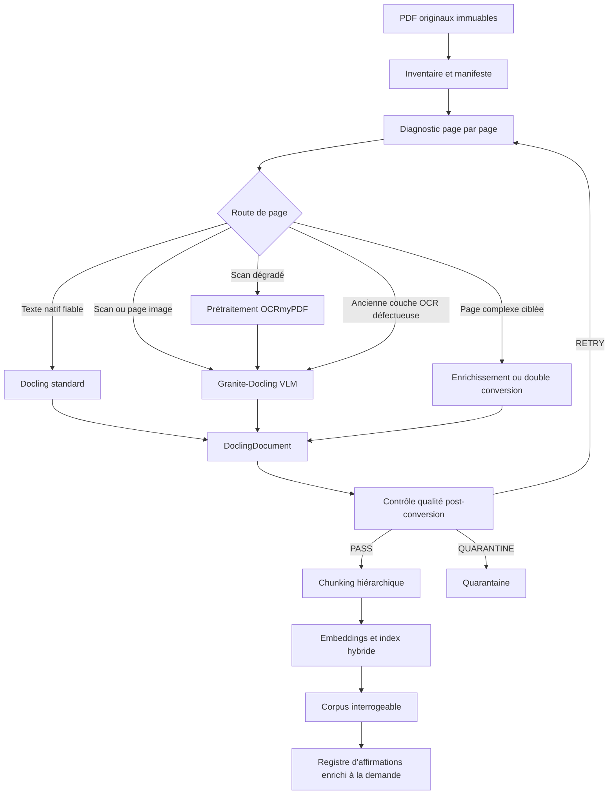
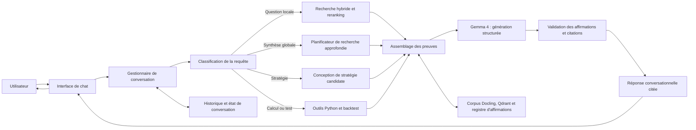

# Spécification technique détaillée — Chatbot personnel local de recherche documentaire et de synthèse de stratégies de trading

**Version :** 3.1  
**Date :** 20 juin 2026  
**Statut :** spécification d’architecture et d’implémentation  
**Périmètre :** usage strictement personnel, fonctionnement local-first  
**Plateforme cible :** NVIDIA DGX Spark  
**Corpus principal :** PDF consacrés au trading, à l’investissement, à la finance quantitative et à la gestion du risque

**Révision 3.1 :** clarification explicite de la nature conversationnelle du produit et ajout de la couche chatbot, des conversations, des tours de dialogue et de leur API.

---

## 0. Conventions normatives

Les termes suivants ont une signification normative :

- **DOIT** : exigence obligatoire ;
- **NE DOIT PAS** : comportement interdit ;
- **DEVRAIT** : recommandation forte, dont l’écart doit être justifié ;
- **PEUT** : option facultative ;
- **canonique** : artefact faisant autorité pour les traitements ultérieurs ;
- **preuve primaire** : passage, tableau, formule ou figure directement issu du document source ;
- **affirmation** : proposition atomique attribuée à une source et pouvant être vérifiée séparément ;
- **route documentaire** : chaîne de traitement choisie pour une page ou un document.

---

# 1. Nature et finalité du produit

Le produit final est un **chatbot personnel spécialisé en trading et en investissement**. L’utilisateur interagit avec lui au moyen d’une interface conversationnelle : il pose une question en langage naturel, poursuit la discussion par des questions de suivi, demande une comparaison, une synthèse, une stratégie candidate ou un backtest, puis reçoit une réponse structurée accompagnée de citations ouvrables.

Ce qui distingue ce chatbot d’un « chat avec PDF » élémentaire n’est pas sa nature — il reste bien un chatbot — mais la profondeur de son moteur interne. Derrière l’interface de dialogue, il orchestre la conversion documentaire, la recherche hybride, la vérification des preuves, l’analyse multi-sources, le registre d’affirmations et, lorsque la demande l’exige, des outils de calcul ou de backtest.

## 1.1 Expérience utilisateur cible

Le chatbot DOIT permettre à l’utilisateur de :

1. poser des questions libres en français ou en anglais ;
2. poursuivre une conversation en conservant le contexte utile des tours précédents ;
3. choisir ou laisser le système choisir un mode de traitement :
   - réponse documentaire rapide ;
   - recherche approfondie multi-sources ;
   - comparaison de méthodes ou d’auteurs ;
   - conception d’une stratégie candidate ;
   - calcul ou backtest ;
4. consulter, pour chaque affirmation importante, les sources et pages correspondantes ;
5. ouvrir le PDF original à l’emplacement cité ;
6. distinguer immédiatement ce qui provient des sources, ce qui relève d’une déduction du système et ce qui constitue un choix de conception ;
7. demander une reformulation, un approfondissement ou une vérification au sein de la même conversation ;
8. retrouver l’historique de ses conversations et recherches approfondies.

## 1.2 Capacités du moteur interne

Pour fournir cette expérience conversationnelle, le système doit pouvoir :

1. inventorier une grande bibliothèque de PDF ;
2. convertir chaque document en une représentation structurée et traçable ;
3. retrouver précisément les passages, tableaux, formules et figures pertinents ;
4. répondre à des questions documentaires avec citations vérifiables ;
5. effectuer des synthèses multi-sources couvrant l’ensemble du corpus ;
6. identifier les convergences, contradictions, limites et dépendances entre sources ;
7. transformer les résultats documentaires en stratégies candidates formalisées ;
8. générer et exécuter des protocoles de backtest reproductibles ;
9. distinguer strictement :
   - le contenu des sources ;
   - les déductions du système ;
   - les choix de conception ;
   - les paramètres calibrés ;
   - les notes personnelles ;
10. conserver une chaîne de provenance complète entre toute réponse conversationnelle et le PDF original.

En résumé : **le produit visible est un chatbot ; le système sous-jacent est un assistant de recherche quantitative fondé sur les preuves.**

---

# 2. Hors périmètre initial

La première version ne cherche pas à :

- prendre des décisions de trading autonomes ;
- envoyer des ordres à un courtier ;
- garantir la rentabilité d’une stratégie ;
- considérer une fréquence élevée de citation comme une preuve scientifique ;
- remplacer la validation économétrique par une synthèse linguistique ;
- absorber en temps réel des données de marché non documentaires ;
- entraîner ou fine-tuner un LLM sur toute la bibliothèque ;
- indexer automatiquement un document dont la conversion n’a pas passé le contrôle qualité.

---

# 3. Décisions d’architecture

Les décisions ci-dessous sont matérialisées dans le registre ADR du projet : `docs/adr/`.

Toute nouvelle décision structurante DOIT être ajoutée au registre ADR. Une décision acceptée ne doit pas être modifiée silencieusement pour changer son sens : elle doit être remplacée par une nouvelle ADR explicite.

## ADR-001 — Artefacts canoniques

Pour chaque document, les artefacts faisant autorité sont :

```text
PDF original immuable
+
DoclingDocument sérialisé en JSON
```

Le PDF original reste la référence éditoriale et visuelle. Le `DoclingDocument` constitue la représentation structurée utilisée pour le chunking, l’indexation et la provenance. Docling représente notamment le texte, les tableaux, les images, la hiérarchie, les coordonnées et la provenance des éléments.[^docling-document]

Les exports Markdown, HTML, texte ou images sont des artefacts dérivés et régénérables.

## ADR-002 — Routage hybride Docling

Le pipeline documentaire DOIT employer deux modes principaux :

```text
PDF numérique avec texte natif fiable
→ pipeline Docling standard

Page image, scan ou structure visuelle nécessitant une conversion end-to-end
→ pipeline VLM Docling avec Granite-Docling
```

Granite-Docling produit des `DocTags` représentant le contenu et la structure, ensuite intégrés au `DoclingDocument`. Il est optimisé pour les écritures latines et propose un support précoce du japonais, du chinois et de l’arabe.[^granite-docling][^granite-languages]

## ADR-003 — OCRmyPDF est conditionnel

OCRmyPDF NE DOIT PAS être appliqué à tous les PDF.

Il intervient uniquement comme outil de correction physique des scans lorsque nécessaire :

- rotation ;
- redressement ;
- préparation d’une image très dégradée ;
- nettoyage prudent ;
- réparation exceptionnelle d’une couche OCR.

Sa sortie n’est pas le format final du système. Le format final reste le `DoclingDocument`.

## ADR-004 — Autorité textuelle unique par page

Chaque page DOIT avoir une seule autorité textuelle :

- texte natif du PDF ;
- sortie Granite-Docling ;
- sortie d’un OCR amont explicitement retenu.

Le système NE DOIT PAS fusionner silencieusement plusieurs transcriptions concurrentes.

## ADR-005 — Recherche hybride

La recherche DOIT combiner :

- recherche dense sémantique ;
- recherche sparse ou BM25 ;
- filtres de métadonnées ;
- reranking ;
- diversification par document et auteur ;
- expansion vers les fragments parents.

Qdrant permet la fusion dense/sparse, notamment par RRF ou DBSF, ainsi que des requêtes multi-étapes.[^qdrant-hybrid]

## ADR-006 — Registre d’affirmations séparé de l’index documentaire

L’index vectoriel stocke des fragments documentaires. Le registre d’affirmations stocke des propositions structurées, leurs preuves, leurs conditions, leurs limites et leurs relations.

Le registre ne remplace pas les passages sources ; il sert de couche d’analyse et d’audit.

## ADR-007 — Déploiement local sur DGX Spark

Le DGX Spark cible dispose d’une architecture Grace Blackwell et de 128 Go de mémoire unifiée.[^dgx-hardware]

Les services DOIVENT être liés à l’interface locale, sauf décision explicite d’accès depuis un réseau privé contrôlé.

## ADR-008 — LLM principal servi par vLLM

Le moteur d’inférence principal est **vLLM**, avec API locale compatible OpenAI. vLLM prend en charge les sorties structurées et les appels d’outils contraints par schéma JSON.[^vllm-tools]

### Modèles à benchmarker

| Statut | Modèle | Rôle |
|---|---|---|
| Référence recommandée | `nvidia/Gemma-4-31B-IT-NVFP4` | modèle principal officiellement listé pour vLLM sur DGX Spark |
| Candidat comparatif | `YCWTG/gemma-4-31B-it-NVFP4A16-GPTQ` | checkpoint communautaire à accepter seulement après benchmark métier |
| Référence qualitative supplémentaire | `google/gemma-4-31B-it-qat-w4a16-ct` | quantification QAT W4A16 officielle Google |

Le modèle NVIDIA NVFP4 est explicitement présent dans la matrice de modèles vLLM pour DGX Spark.[^spark-vllm][^nvidia-gemma]

Le checkpoint `YCWTG/gemma-4-31B-it-NVFP4A16-GPTQ` est servi par vLLM et expose les modes instruct, thinking et tool calling, mais demeure une quantification communautaire ; il DOIT donc être comparé aux références officielles sur le corpus réel.[^ycwtg-gemma]

---

# 4. Architecture logique globale

L’architecture comporte deux chaînes complémentaires :

1. une **chaîne de préparation des connaissances**, exécutée en amont ou de manière incrémentale ;
2. une **chaîne conversationnelle**, déclenchée chaque fois que l’utilisateur dialogue avec le chatbot.

## 4.1 Chaîne de préparation des connaissances



## 4.2 Chaîne conversationnelle du chatbot



La conversation est donc le point d’entrée principal du produit. Les composants documentaires et quantitatifs sont des services internes appelés par le chatbot selon l’intention détectée.

---

# 5. Architecture de déploiement sur DGX Spark

## 5.1 Services

| Service | Fonction | Port local indicatif | Persistance |
|---|---|---:|---|
| `orchestrator-api` | orchestration et API FastAPI | 8080 | PostgreSQL |
| `gemma-vllm` | extraction, synthèse, tool calling | 8000 | cache modèles |
| `granite-docling` | conversion VLM de pages | 8001 | cache modèles |
| `qdrant` | index dense/sparse et métadonnées | 6333 | volume Qdrant |
| `postgres` | manifeste, provenance, claims, jobs | 5432 | volume PostgreSQL |
| `ui` | interface conversationnelle du chatbot | 7860 ou 8501 | aucune donnée canonique |
| `worker-documents` | diagnostic, conversion, chunking | interne | corpus et PostgreSQL |
| `worker-research` | recherche approfondie | interne | PostgreSQL |
| `worker-backtest` | calculs et backtests | interne | registre d’expériences |

Tous les ports DOIVENT par défaut être liés à `127.0.0.1`.

## 5.2 Profils de charge

Le DGX Spark utilise une mémoire unifiée. L’orchestrateur DOIT donc éviter les pics simultanés inutiles.

### Profil `INGEST_BATCH`

```text
Gemma : arrêté ou contexte réduit
Granite-Docling : actif
Conversion : batch de pages
Qdrant/PostgreSQL : actifs
```

### Profil `INTERACTIVE_RESEARCH`

```text
Gemma 4 31B : actif
Granite-Docling : inactif ou chargé à la demande
Qdrant/PostgreSQL : actifs
Backtests lourds : différés dans la file locale
```

### Profil `DEEP_RESEARCH`

```text
Gemma : contexte 32K à 64K initialement
max_num_seqs : 1 ou 2
Ingestion : suspendue
Planification multi-requêtes : active
```

### Profil `BACKTEST`

```text
Gemma : utilisé seulement pour orchestration et interprétation
Calcul déterministe : Python
Expériences : une file séquentielle ou concurrence limitée
```

## 5.3 Contexte LLM

Le contexte maximum théorique ne doit pas être utilisé par défaut.

Valeurs initiales recommandées à benchmarker :

| Tâche | Contexte cible |
|---|---:|
| Extraction d’affirmations | 8K–16K |
| Vérification locale | 8K–16K |
| Comparaison de quelques sources | 16K–32K |
| Synthèse approfondie | 32K–64K |
| Cas exceptionnel | au-delà de 64K après mesure |

La qualité de sélection des preuves prime sur la taille brute du contexte.

---

# 6. Organisation des données

```text
trading-research-assistant/
├── corpus/
│   ├── raw/                         # PDF originaux, lecture seule
│   ├── prepared/                    # artefacts de prétraitement conditionnels
│   ├── rendered-pages/              # images de pages pour VLM et QA
│   ├── docling/                     # JSON canoniques
│   ├── exports/                     # Markdown, HTML, tables, figures
│   ├── previews/                    # rendus de contrôle
│   └── quarantine/                  # documents rejetés ou à revoir
├── data/
│   ├── postgres/                    # volume DB
│   ├── qdrant/                      # volume index
│   ├── parquet/                     # diagnostics et exports analytiques
│   ├── experiments/                 # backtests et résultats
│   └── logs/
├── config/
│   ├── mandate.yaml
│   ├── routing.yaml
│   ├── docling_profiles.yaml
│   ├── models.yaml
│   ├── taxonomy.yaml
│   ├── quality_gates.yaml
│   └── security.yaml
├── app/
│   ├── inventory/
│   ├── diagnostics/
│   ├── routing/
│   ├── conversion/
│   ├── quality/
│   ├── chunking/
│   ├── indexing/
│   ├── retrieval/
│   ├── claims/
│   ├── synthesis/
│   ├── strategies/
│   ├── backtests/
│   └── api/
├── prompts/
├── schemas/
├── tests/
├── evaluation/
├── docker-compose.yml
└── pyproject.toml
```

---

# 7. Modèles de données

## 7.1 `DocumentRecord`

```json
{
  "document_id": "DOC-<sha256-prefix>",
  "sha256": "...",
  "path_original": "/corpus/raw/risk/book.pdf",
  "title": "Titre",
  "authors": ["Auteur"],
  "publication_year": 2018,
  "edition": "2",
  "languages": ["fr", "en"],
  "source_type": "book",
  "page_count": 412,
  "asset_classes": ["futures"],
  "topics": ["risk_management", "position_sizing"],
  "status": "DISCOVERED",
  "created_at": "2026-06-20T10:00:00Z",
  "updated_at": "2026-06-20T10:00:00Z"
}
```

## 7.2 `PageDiagnostic`

```json
{
  "document_id": "DOC-001",
  "page_pdf": 37,
  "native_text_chars": 0,
  "native_text_quality": 0.0,
  "image_coverage": 0.98,
  "rotation_degrees": 90,
  "skew_degrees": 2.4,
  "contrast_score": 0.61,
  "noise_score": 0.31,
  "layout_complexity": "HIGH",
  "has_table": true,
  "has_formula": false,
  "suspected_script": "LATIN",
  "existing_ocr_state": "NONE",
  "page_state": "SCAN_DEGRADED",
  "recommended_route": "PREPROCESS_GRANITE",
  "diagnostic_confidence": 0.93,
  "diagnostic_version": "diag-v1"
}
```

## 7.3 `ConversionRun`

```json
{
  "conversion_run_id": "CR-20260620-0001",
  "document_id": "DOC-001",
  "route": "MIXED_PAGEWISE",
  "source_sha256": "...",
  "prepared_artifact_sha256": null,
  "docling_version": "pinned-version",
  "granite_model": "ibm-granite/granite-docling-258M",
  "llm_runtime": "vllm",
  "configuration_hash": "...",
  "started_at": "...",
  "completed_at": "...",
  "status": "PASS_WITH_WARNINGS",
  "warnings": []
}
```

## 7.4 `DocItemRecord`

```json
{
  "item_id": "DOC-001-P037-I004",
  "document_id": "DOC-001",
  "page_pdf": 37,
  "printed_page": 21,
  "label": "paragraph",
  "section_path": ["Chapitre 2", "Volatility targeting"],
  "text": "...",
  "bbox": [0.10, 0.20, 0.85, 0.42],
  "route": "GRANITE_VLM",
  "text_authority": "granite_docling",
  "quality_score": 0.95,
  "provenance": {
    "conversion_run_id": "CR-20260620-0001",
    "source_sha256": "..."
  }
}
```

## 7.5 `ChunkRecord`

```json
{
  "chunk_id": "CHK-DOC001-S002-C004",
  "document_id": "DOC-001",
  "parent_chunk_id": "PAR-DOC001-S002",
  "item_ids": ["DOC-001-P037-I004", "DOC-001-P037-I005"],
  "pages": [37],
  "text": "...",
  "token_count": 623,
  "content_types": ["paragraph"],
  "metadata": {
    "author": "Auteur",
    "year": 2018,
    "strategy_component": "position_sizing",
    "evidence_type": "empirical_result"
  },
  "chunker_version": "chunk-v1"
}
```

## 7.6 `ClaimRecord`

```json
{
  "claim_id": "CLM-004812",
  "canonical_text": "Le dimensionnement inversement proportionnel à la volatilité réduit la concentration du risque entre instruments.",
  "claim_type": "EMPIRICAL_RESULT",
  "subject": "inverse_volatility_sizing",
  "predicate": "reduces",
  "object": "risk_concentration",
  "modality": "REPORTED_RESULT",
  "negated": false,
  "conditions": {
    "universe": ["futures"],
    "strategy_family": ["multi_asset"],
    "frequency": "daily",
    "sample_period": "1985-2018",
    "transaction_costs_included": true
  },
  "limitations": [
    "sensibilité à l’estimateur de volatilité"
  ],
  "dependency_group": "STUDY-ORIGINAL-123",
  "extraction_status": "AUTO_VERIFIED",
  "extractor_model": "gemma-4-31b",
  "extractor_prompt_version": "claim-v3"
}
```

## 7.7 `EvidenceLink`

```json
{
  "claim_id": "CLM-004812",
  "document_id": "DOC-001",
  "item_ids": ["DOC-001-P037-I004"],
  "page_pdf": 37,
  "relation": "SUPPORTS_DIRECTLY",
  "verifier_verdict": "ENTAILED",
  "verifier_score": 0.94,
  "human_review": "NOT_REVIEWED"
}
```

## 7.8 `ClaimRelation`

Relations autorisées :

```text
EQUIVALENT_TO
MORE_GENERAL_THAN
MORE_SPECIFIC_THAN
SUPPORTS
QUALIFIES
LIMITS
CONTRADICTS
APPARENTLY_CONTRADICTS
DERIVED_FROM
CITES_SAME_ORIGINAL_STUDY
```

## 7.9 `ConversationRecord`

```json
{
  "conversation_id": "CONV-20260620-0001",
  "title": "Comparaison des méthodes de position sizing",
  "created_at": "2026-06-20T10:00:00Z",
  "updated_at": "2026-06-20T10:14:00Z",
  "default_mode": "AUTO",
  "mandate_id": "MANDATE-PERSONAL-001",
  "status": "ACTIVE"
}
```

## 7.10 `ChatTurnRecord`

```json
{
  "turn_id": "TURN-000042",
  "conversation_id": "CONV-20260620-0001",
  "role": "assistant",
  "request_type": "GLOBAL_SYNTHESIS",
  "content": "...",
  "evidence_ids": ["EV-001", "EV-002"],
  "claim_ids": ["CLM-004812"],
  "answer_status": "SUPPORTED",
  "model": "gemma-4-31b",
  "prompt_version": "chat-answer-v2",
  "created_at": "2026-06-20T10:14:00Z"
}
```

L’historique conversationnel NE DOIT PAS être utilisé comme une source factuelle autonome. Les affirmations issues des tours précédents doivent être revalidées contre les preuves documentaires lorsqu’elles sont réutilisées.

---

# 8. Machine d’états documentaire

```text
DISCOVERED
→ INVENTORIED
→ DIAGNOSED
→ ROUTED
→ PREPARED              [optionnel]
→ PRE_QA_PASSED
→ CONVERTED
→ POST_QA_PASSED
→ CHUNKED
→ INDEXED
→ AVAILABLE
```

États d’échec :

```text
RETRY_PENDING
MANUAL_REVIEW
QUARANTINED
FAILED_PERMANENTLY
```

Toute transition DOIT être journalisée avec :

- horodatage ;
- version du code ;
- version des modèles ;
- configuration ;
- identifiant du job ;
- raison de la transition.

---

# 9. Phase 0 — Ingestion et inventaire

## 9.1 Déclenchement

L’ingestion peut être déclenchée par :

- dépôt manuel dans `corpus/raw/` ;
- appel API ;
- commande CLI ;
- scan périodique local.

## 9.2 Tâches

1. vérifier que le fichier est lisible ;
2. calculer son SHA-256 ;
3. détecter les doublons binaires ;
4. extraire les métadonnées PDF ;
5. identifier les quasi-doublons textuels après conversion pilote ;
6. attribuer un `document_id` stable ;
7. rendre l’original non modifiable par le pipeline ;
8. enregistrer la date d’ajout et la source locale.

## 9.3 Règles

- Deux éditions différentes NE DOIVENT PAS être fusionnées automatiquement.
- Une copie binaire exacte PEUT être dédupliquée logiquement.
- Un PDF chiffré ou corrompu passe en `MANUAL_REVIEW`.

---

# 10. Phase 1 — Diagnostic page par page

## 10.1 Objectif

Classer chaque page afin de choisir la chaîne minimale capable de produire une représentation fidèle.

## 10.2 Signaux à mesurer

### Texte natif

- nombre de caractères ;
- proportion de caractères imprimables ;
- proportion de caractères de contrôle ;
- densité textuelle ;
- détection de texte dupliqué ;
- ordre de lecture approximatif ;
- cohérence de langue ;
- présence de glyphes non mappés ;
- alignement texte/image lorsque mesurable.

### Image

- couverture image de la page ;
- résolution effective ;
- orientation ;
- inclinaison ;
- contraste ;
- bruit ;
- flou ;
- marges irrégulières ;
- pages inversées ou photographiées.

### Structure

- nombre de colonnes ;
- présence de tableaux ;
- présence de formules ;
- présence de figures ;
- notes de bas de page ;
- petits caractères ;
- encadrés ;
- pages mixtes texte natif/image.

## 10.3 États de page

```text
NATIVE_OK
NATIVE_SUSPECT
SCAN_CLEAN
SCAN_DEGRADED
OCR_BAD
MIXED_CONTENT
COMPLEX_VISUAL
UNSUPPORTED_OR_CORRUPT
```

## 10.4 Agrégation au niveau du document

Le routeur doit produire :

- distribution des états ;
- route dominante ;
- exceptions par page ;
- score de confiance ;
- liste des pages critiques ;
- échantillon de pages à contrôler ;
- décision `AUTO`, `BENCHMARK` ou `MANUAL_REVIEW`.

---

# 11. Phase 2 — Routage du document

## 11.1 Route R1 — `NATIVE_STANDARD`

### Conditions

- texte natif fiable ;
- ordre de lecture acceptable ;
- faible taux de glyphes incohérents ;
- page non dominée par une image scannée.

### Pipeline

```text
PDF original
→ Docling standard
→ OCR désactivé
→ layout et tables activés selon profil
→ DoclingDocument
```

### Autorité textuelle

```text
texte natif du PDF
```

## 11.2 Route R2 — `SCAN_GRANITE`

### Conditions

- page image propre ;
- écriture latine ou langue expérimentale acceptée ;
- qualité visuelle suffisante ;
- absence de couche textuelle fiable.

### Pipeline

```text
rendu de page
→ VlmPipeline Docling
→ Granite-Docling
→ DocTags
→ DoclingDocument
```

### Autorité textuelle

```text
Granite-Docling
```

## 11.3 Route R3 — `PREPROCESS_GRANITE`

### Conditions

- scan incliné ;
- mauvaise orientation ;
- contraste ou bruit problématique ;
- conversion Granite directe inférieure au seuil de qualité.

### Pipeline

```text
PDF original
→ prétraitement physique OCRmyPDF
→ rendu de page préparé
→ Granite-Docling
→ DoclingDocument
```

Le prétraitement DEVRAIT éviter de créer une couche OCR faisant autorité. Les paramètres exacts sont versionnés et validés visuellement.

## 11.4 Route R4 — `BAD_OCR_TO_GRANITE`

### Conditions

- couche OCR existante mais incohérente ;
- texte dupliqué ;
- mauvais encodage ;
- désalignement important ;
- langue OCR incorrecte.

### Pipeline privilégié

```text
PDF original
→ ignorer la couche OCR
→ rendre la page en image
→ Granite-Docling
→ DoclingDocument
```

### Alternative

Une nouvelle couche OCR amont peut être testée sur un benchmark contrôlé, mais elle ne devient autorité que si elle surpasse Granite-Docling sur les métriques métier.

## 11.5 Route R5 — `MIXED_PAGEWISE`

### Conditions

Le document contient plusieurs types de pages.

### Pipeline

```text
page native → Docling standard
page scannée → Granite-Docling
page dégradée → prétraitement + Granite-Docling
page complexe → route ciblée
→ fusion dans un DoclingDocument unique
```

### Exigences de fusion

- conserver le numéro de page PDF original ;
- maintenir des identifiants d’items uniques ;
- conserver l’autorité textuelle par page ;
- ne pas réordonner les pages ;
- signaler toute page manquante ;
- conserver le lien vers le PDF original.

## 11.6 Route R6 — `TARGETED_ENRICHMENT`

### Conditions

- texte natif correct mais formule/tableau/figure mal extrait ;
- nécessité d’un second avis visuel ;
- page critique pour une preuve quantitative.

### Pipeline

```text
Docling standard pour la page
+
Granite-Docling ciblé sur une région ou une page
→ adjudication
→ conservation des deux sorties et de la décision
```

Docling propose des enrichissements dédiés, y compris pour le code et les formules, qui peuvent exploiter Granite-Docling.[^docling-enrichment]

## 11.7 Table de décision

| État | Route par défaut | Prétraitement | Autorité |
|---|---|---|---|
| `NATIVE_OK` | R1 | non | texte natif |
| `NATIVE_SUSPECT` | benchmark R1/R2 | non | résultat gagnant |
| `SCAN_CLEAN` | R2 | non | Granite-Docling |
| `SCAN_DEGRADED` | R3 | oui | Granite-Docling |
| `OCR_BAD` | R4 | non par défaut | Granite-Docling |
| `MIXED_CONTENT` | R5 | par page | par page |
| `COMPLEX_VISUAL` | R6 | optionnel | adjudication |
| `UNSUPPORTED_OR_CORRUPT` | quarantaine | — | aucune |

---

# 12. Phase 3 — Contrôle qualité pré-conversion

## 12.1 Échantillonnage

Pour chaque document, sélectionner au minimum :

- première page de contenu ;
- une page au premier quart ;
- une page centrale ;
- une page au dernier quart ;
- une page de fin ;
- toute page contenant un tableau ;
- toute page contenant une formule critique ;
- toute page à faible confiance ;
- toute page appartenant à une route minoritaire.

## 12.2 Comparaison de routes

Pour les pages `NATIVE_SUSPECT` ou `COMPLEX_VISUAL`, exécuter deux routes et comparer :

- fidélité textuelle ;
- exactitude des nombres ;
- conservation des signes ;
- ordre de lecture ;
- structure du tableau ;
- formule ;
- temps de calcul ;
- stabilité sur plusieurs exécutions.

## 12.3 Statuts

```text
PASS
PASS_WITH_WARNINGS
RETRY_WITH_ALTERNATIVE_ROUTE
MANUAL_REVIEW
QUARANTINE
```

Aucun document en `QUARANTINE` ne peut être indexé.

---

# 13. Phase 4 — Conversion structurée

## 13.1 Profil Docling standard

Le profil standard est utilisé lorsque le texte natif est fiable.

Fonctions attendues :

- extraction du texte natif ;
- analyse du layout ;
- ordre de lecture ;
- hiérarchie des titres ;
- reconstruction des tables ;
- détection de figures ;
- provenance par page et coordonnées ;
- export JSON canonique.

## 13.2 Profil Granite-Docling

Le profil VLM :

- reçoit une page rendue ;
- produit des `DocTags` ;
- conserve paragraphes, titres, tableaux, code, mathématiques et hiérarchie ;
- est reconverti vers `DoclingDocument`.[^granite-docling]

## 13.3 Rendu des pages

Le rendu DOIT être :

- déterministe ;
- versionné ;
- suffisamment résolu pour les petits caractères ;
- sans compression destructrice ;
- associé au numéro de page original.

Les paramètres de résolution sont à benchmarker sur le corpus pilote ; ils ne doivent pas être figés sans mesure.

## 13.4 Fusion pagewise

La fusion doit :

1. créer un document vide avec l’origine du PDF ;
2. ajouter chaque page dans l’ordre ;
3. importer les items issus de la route de la page ;
4. normaliser les coordonnées ;
5. préserver les labels ;
6. associer les tables et figures ;
7. créer les liens de provenance ;
8. valider la cohérence globale.

## 13.5 Sorties

```text
corpus/docling/<document_id>/document.json
corpus/exports/<document_id>/document.md
corpus/exports/<document_id>/document.html
corpus/exports/<document_id>/tables/
corpus/exports/<document_id>/figures/
corpus/previews/<document_id>/
```

---

# 14. Phase 5 — Contrôle qualité post-conversion

## 14.1 Contrôles structurels obligatoires

- nombre de pages identique au PDF source ;
- JSON valide ;
- identifiants uniques ;
- pages ordonnées ;
- absence de page silencieusement vide ;
- provenance présente pour chaque item ;
- coordonnées valides ;
- route et autorité enregistrées ;
- aucun item lié à une page inexistante.

## 14.2 Contrôles de contenu

- densité de texte raisonnable ;
- absence de répétitions massives ;
- cohérence des titres ;
- préservation des nombres ;
- préservation des signes négatifs ;
- préservation des pourcentages ;
- préservation des séparateurs décimaux ;
- formules liées à leurs définitions ;
- tableaux liés à leurs titres, unités et notes ;
- figures liées à leurs légendes.

## 14.3 Comparaison visuelle ciblée

Les pages critiques DOIVENT pouvoir être affichées côte à côte :

```text
page PDF originale
vs
rendu structuré
vs
texte/table/formule extrait
```

## 14.4 Adjudication

Lorsqu’une sortie standard et une sortie Granite divergent :

1. comparer les tokens numériques ;
2. comparer les signes et unités ;
3. comparer l’ordre de lecture ;
4. vérifier la zone visuelle ;
5. choisir une autorité ;
6. conserver les deux versions ;
7. enregistrer la justification.

---

# 15. Phase 6 — Chunking hiérarchique

## 15.1 Principe

Le chunking DOIT respecter la structure documentaire.

```text
Document
└── Chapitre
    └── Section
        ├── fragment enfant
        ├── fragment enfant
        └── fragment parent
```

## 15.2 Paramètres initiaux

| Objet | Taille initiale à tester |
|---|---:|
| Fragment enfant | 400–800 tokens |
| Chevauchement | 50–120 tokens |
| Fragment parent | 1 200–2 500 tokens |
| Résumé de section | 150–400 tokens |
| Résumé de chapitre | 400–1 000 tokens |

## 15.3 Règles de découpage

Le système NE DOIT PAS :

- couper un titre de son premier paragraphe ;
- séparer une formule de la définition de ses variables ;
- découper arbitrairement un tableau ;
- séparer une conclusion de ses réserves immédiates ;
- perdre les notes ou unités d’un tableau ;
- mélanger des pages provenant de documents différents.

## 15.4 Types de chunks

```text
TEXT_CHILD
TEXT_PARENT
TABLE
FORMULA
FIGURE_CAPTION
CHAPTER_SUMMARY
DOCUMENT_SUMMARY
CLAIM_EVIDENCE
```

Chaque chunk conserve les `item_ids` et pages sources.

---

# 16. Phase 7 — Enrichissement des métadonnées

## 16.1 Métadonnées bibliographiques

- titre ;
- auteurs ;
- édition ;
- année ;
- langue ;
- type de source ;
- éditeur ou revue ;
- DOI/ISBN lorsque disponible.

## 16.2 Métadonnées métier

- classe d’actifs ;
- stratégie ;
- horizon ;
- fréquence ;
- composant de stratégie ;
- type de données ;
- marché étudié ;
- période étudiée ;
- régime de marché ;
- coûts inclus ;
- validation hors échantillon ;
- nature de la preuve ;
- source primaire ou secondaire ;
- source académique, professionnelle ou pédagogique.

## 16.3 Provenance de métadonnées

Chaque métadonnée doit indiquer :

```text
EXTRACTED_FROM_SOURCE
INFERRED_BY_MODEL
MANUALLY_ASSIGNED
IMPORTED_FROM_CATALOG
```

Les inférences du modèle ne doivent pas être confondues avec les métadonnées explicitement présentes.

---

# 17. Phase 8 — Embeddings et indexation

## 17.1 Collections Qdrant

Collections initiales recommandées :

```text
chunks_text
chunks_tables
summaries
claims
```

Une collection unique avec payload riche peut être testée, mais les performances et la maintenance doivent être comparées.

## 17.2 Vecteurs

Chaque point peut contenir :

- vecteur dense ;
- vecteur sparse/BM25 ;
- éventuellement multivecteur de late interaction ;
- payload de métadonnées ;
- texte ou référence vers PostgreSQL.

## 17.3 Fusion

Démarrage recommandé :

```text
Dense top 80
Sparse top 80
→ fusion RRF
→ 60 candidats
```

Après constitution d’un jeu d’évaluation, tester :

- Weighted RRF ;
- DBSF ;
- late interaction ;
- règles de diversité ;
- pondérations par qualité documentaire.

Qdrant recommande RRF comme défaut prudent en l’absence de scores calibrés ou de jeu d’évaluation.[^qdrant-hybrid]

## 17.4 Reranking

Le reranker examine les paires :

```text
question ↔ passage
```

Il produit :

- score de pertinence ;
- type de réponse couvert ;
- contribution à la diversité ;
- présence d’une réserve ou contradiction ;
- qualité de la provenance.

## 17.5 Indexation incrémentale

Réindexer uniquement lorsqu’un des éléments change :

- PDF source ;
- version de conversion ;
- `DoclingDocument` ;
- chunker ;
- métadonnées ;
- modèle d’embedding ;
- schéma Qdrant.

---


# 17A. Couche conversationnelle du chatbot

## 17A.1 Gestion de session

Chaque message utilisateur DOIT être rattaché à une conversation. Le gestionnaire de conversation conserve uniquement le contexte utile : mandat, définitions introduites par l’utilisateur, documents explicitement sélectionnés, préférences de présentation et résultats déjà vérifiés.

Il NE DOIT PAS recopier aveuglément tout l’historique dans le prompt. Il construit un état conversationnel compact et traçable.

## 17A.2 Résolution des références conversationnelles

Le chatbot doit comprendre les références de suivi telles que :

```text
« compare-la maintenant à Kelly »
« limite la synthèse aux futures »
« développe le deuxième point »
« teste cette stratégie avec des coûts doublés »
```

La résolution d’une référence conversationnelle doit aboutir à une requête autonome explicite avant la phase de recherche.

## 17A.3 Sélection automatique du mode

Le routeur conversationnel choisit entre :

```text
CHAT_DOCUMENTAIRE
RECHERCHE_APPROFONDIE
COMPARAISON
CONCEPTION_STRATEGIE
CALCUL
BACKTEST
CLARIFICATION_INTERNE
```

L’utilisateur PEUT forcer un mode depuis l’interface. Le mode choisi et sa justification synthétique doivent être enregistrés dans le tour de conversation.

## 17A.4 Format d’une réponse de chat

Une réponse peut être concise ou développée selon la demande, mais doit pouvoir comporter :

1. la réponse principale ;
2. les nuances ou contradictions pertinentes ;
3. les citations ouvrables ;
4. le statut de support documentaire ;
5. les hypothèses ou données manquantes ;
6. les calculs ou artefacts produits ;
7. une distinction explicite entre source, déduction et choix de conception.

## 17A.5 Mémoire conversationnelle et mémoire documentaire

La mémoire conversationnelle sert à maintenir la continuité du dialogue. La mémoire documentaire sert à établir les faits. Une phrase présente dans l’historique n’est jamais considérée comme vraie uniquement parce qu’elle a déjà été formulée par le chatbot.

---

# 18. Phase 9 — Recherche et assemblage des preuves

## 18.1 Classification de la requête

```text
FACTUAL_LOOKUP
EXACT_QUOTE
FORMULA_LOOKUP
TABLE_LOOKUP
COMPARISON
GLOBAL_SYNTHESIS
CONTRADICTION_ANALYSIS
STRATEGY_DESIGN
CALCULATION
BACKTEST_REQUEST
```

## 18.2 Recherche locale simple

```text
question
→ dense + sparse
→ fusion
→ reranking
→ expansion parent
→ 6 à 12 preuves
→ réponse citée
```

## 18.3 Recherche approfondie

```text
question
→ plan de recherche
→ sous-requêtes FR/EN
→ recherches par composant
→ couverture minimale
→ recherche d’arguments opposés
→ regroupement des preuves
→ synthèse
```

## 18.4 Diversification

L’assembleur DOIT empêcher qu’un seul document domine automatiquement la synthèse.

Contraintes possibles :

- maximum de passages par document ;
- minimum d’auteurs indépendants ;
- minimum de preuves défavorables ;
- minimum de sources primaires ;
- couverture de chaque composant du plan.

## 18.5 Abstention

Le système doit s’abstenir lorsque :

- aucune preuve suffisamment pertinente n’est retrouvée ;
- les sources ne permettent pas de résoudre la question ;
- la question exige des données actuelles absentes ;
- les citations ne soutiennent pas la conclusion ;
- la qualité documentaire est insuffisante.

---

# 19. Phase 10 — Registre d’affirmations et de preuves

## 19.1 Technique

La phase combine :

1. détection des passages argumentatifs ;
2. extraction guidée par schéma ;
3. décontextualisation ;
4. décomposition en affirmations atomiques ;
5. attribution d’un span de preuve ;
6. vérification NLI ou cross-encoder ;
7. canonicalisation sémantique ;
8. création de relations ;
9. provenance complète.

## 19.2 Rôles discursifs

```text
DEFINITION
HYPOTHESIS
RECOMMENDATION
EMPIRICAL_RESULT
THEORETICAL_RESULT
METHOD
LIMITATION
CRITICISM
OPINION
EXAMPLE
```

## 19.3 Extraction structurée

Gemma doit produire un JSON contraint par schéma, par exemple :

```json
{
  "claims": [
    {
      "claim_text": "...",
      "claim_type": "EMPIRICAL_RESULT",
      "subject": "...",
      "predicate": "...",
      "object": "...",
      "modality": "REPORTED_RESULT",
      "negation": false,
      "conditions": {},
      "study_context": {},
      "limitations": [],
      "evidence_item_ids": []
    }
  ]
}
```

Les sorties structurées et les appels d’outils de vLLM permettent de contraindre la syntaxe, mais ne garantissent pas la vérité sémantique ; la vérification reste obligatoire.[^vllm-tools]

## 19.4 Vérification indépendante

Pour chaque affirmation :

```text
prémisse = passage source
hypothèse = affirmation
```

Verdicts :

```text
ENTAILED
PARTIALLY_ENTAILED
CONTRADICTED
NEUTRAL
INSUFFICIENT_CONTEXT
```

Le vérificateur DEVRAIT être indépendant du premier appel d’extraction :

- prompt différent ;
- température déterministe ;
- éventuellement modèle NLI dédié ;
- aucune visibilité sur le raisonnement du premier appel.

## 19.5 États d’une affirmation

```text
DRAFT
AUTO_VERIFIED
AUTO_REJECTED
HUMAN_APPROVED
HUMAN_REJECTED
SUPERSEDED
```

Seules les affirmations `AUTO_VERIFIED` ou `HUMAN_APPROVED` peuvent servir de base à une synthèse finale.

## 19.6 Dépendance des sources

Le système DOIT distinguer :

```text
nombre de documents mentionnant une conclusion
vs
nombre d’études indépendantes soutenant cette conclusion
```

Les livres ou articles reprenant la même étude sont rattachés à un `dependency_group` commun.

## 19.7 Construction progressive

Le registre ne doit pas nécessairement être exhaustif dès l’ingestion.

Approche recommandée :

1. indexer tout le corpus ;
2. extraire les affirmations centrales des résumés et conclusions ;
3. enrichir le registre à la demande ;
4. conserver les affirmations validées ;
5. réviser lorsqu’une meilleure preuve apparaît.

---

# 20. Phase 11 — Évaluation de la qualité des preuves

## 20.1 Dimensions

- pertinence pour le mandat ;
- nature de la source ;
- qualité méthodologique ;
- source primaire ou secondaire ;
- taille et représentativité de l’échantillon ;
- période étudiée ;
- coûts pris en compte ;
- validation hors échantillon ;
- réplication ;
- robustesse inter-marchés ;
- sensibilité aux paramètres ;
- indépendance des confirmations ;
- faisabilité opérationnelle ;
- ancienneté de la source.

## 20.2 Niveaux indicatifs

| Niveau | Interprétation |
|---|---|
| A | réplication indépendante, hors échantillon, plusieurs marchés ou périodes |
| B | étude empirique solide mais domaine limité |
| C | résultat fragile, échantillon unique ou non répliqué |
| D | heuristique professionnelle, étude de cas ou simulation limitée |
| E | opinion, anecdote ou affirmation non étayée |

Le score n’est jamais une probabilité de vérité.

---

# 21. Phase 12 — Contradictions et compatibilités

## 21.1 Typologie

```text
GENUINE_CONTRADICTION
APPARENT_CONTRADICTION
CONTEXT_DEPENDENT
DIFFERENT_HORIZON
DIFFERENT_UNIVERSE
DIFFERENT_METRIC
DIFFERENT_COST_ASSUMPTION
DIFFERENT_REGIME
```

## 21.2 Comparaison conditionnelle

Deux affirmations ne sont comparables que si les dimensions suivantes sont compatibles :

- univers ;
- horizon ;
- fréquence ;
- métrique ;
- coûts ;
- période ;
- levier ;
- définition du signal ;
- régime de marché.

## 21.3 Compatibilité des composants d’une stratégie

Le compilateur doit vérifier :

```text
horizon du signal ≈ horizon de détention
fréquence des données compatible avec l’exécution
turnover compatible avec les coûts
sortie compatible avec la logique du signal
sizing compatible avec les queues de distribution
levier compatible avec la liquidité et la marge
filtre macro compatible avec le délai de publication
univers compatible avec les hypothèses de la source
```

---

# 22. Phase 13 — Synthèse multi-sources

## 22.1 Structure obligatoire

1. mandat retenu ;
2. périmètre documentaire ;
3. méthodes identifiées ;
4. conditions d’application ;
5. preuves favorables ;
6. preuves défavorables ;
7. niveau de preuve ;
8. dépendances entre sources ;
9. contradictions ;
10. limites ;
11. zones non documentées ;
12. conclusion et degré d’incertitude.

## 22.2 Règles de rédaction

- chaque affirmation factuelle importante doit être citée ;
- le système doit distinguer source et interprétation ;
- une fréquence élevée de mention ne devient pas un consensus scientifique ;
- une source ancienne est datée explicitement ;
- une absence de preuve est signalée ;
- les paramètres non justifiés sont interdits dans la synthèse documentaire.

---

# 23. Phase 14 — Compilation d’une stratégie candidate

## 23.1 Sortie formelle

```yaml
strategy:
  id: STRAT-00017
  name: strategy_candidate_017
  status: RESEARCH_CANDIDATE

  mandate:
    universe: []
    frequency: daily
    objective: risk_adjusted_return
    leverage_max: 1.5
    drawdown_tolerance: null

  data:
    required_fields: []
    point_in_time_required: true
    publication_lags: []
    survivorship_policy: point_in_time

  signal:
    definition: ""
    transformations: []
    evidence_ids: []
    rule_origin: SOURCE

  entry:
    rule: ""
    execution_delay: "next_open"
    evidence_ids: []
    rule_origin: DEDUCTION

  exit:
    rule: ""
    evidence_ids: []
    rule_origin: SOURCE

  sizing:
    rule: ""
    constraints: []
    evidence_ids: []
    rule_origin: SOURCE

  risk:
    volatility_target: null
    gross_exposure_limit: null
    net_exposure_limit: null
    drawdown_policy: null
    evidence_ids: []

  execution:
    commission_model: ""
    spread_model: ""
    slippage_model: ""
    borrow_model: ""

  unresolved_conflicts: []
  unsupported_design_choices: []
  parameters_to_calibrate: []

  validation_plan:
    in_sample: ""
    out_of_sample: ""
    walk_forward: ""
    stress_tests: []
```

## 23.2 Origine obligatoire des règles

```text
SOURCE
DEDUCTION
DESIGN_CHOICE
PARAMETER_TO_CALIBRATE
USER_CONSTRAINT
```

Une règle ou un paramètre sans origine explicite invalide la spécification.

---

# 24. Phase 15 — Backtest et validation

## 24.1 Séparation des responsabilités

```text
LLM
→ propose ou modifie une spécification

Code déterministe
→ calcule les signaux, positions et métriques
```

Le LLM NE DOIT PAS calculer mentalement un backtest.

## 24.2 Contrôles minimaux

- biais de survivance ;
- look-ahead bias ;
- délais de publication ;
- data snooping ;
- multiplicité des tests ;
- commissions ;
- spreads ;
- slippage ;
- financement ;
- borrow ;
- liquidité ;
- capacité ;
- stabilité inter-périodes ;
- stabilité inter-actifs ;
- sensibilité aux paramètres ;
- tests hors échantillon ;
- walk-forward ;
- stress des coûts ;
- stress des corrélations ;
- drawdown et durée du drawdown ;
- comparaison à des benchmarks simples ;
- analyse des queues.

## 24.3 Registre des expériences

Aucune expérience ne doit être supprimée.

```json
{
  "experiment_id": "EXP-000123",
  "strategy_id": "STRAT-00017",
  "spec_hash": "...",
  "data_snapshot": "...",
  "parameters": {},
  "period": {},
  "cost_model": {},
  "results": {},
  "status": "FAILED",
  "failure_reason": "...",
  "created_at": "..."
}
```

Les résultats négatifs doivent être conservés afin de limiter le biais de sélection.

---

# 25. Phase 16 — Vérification des réponses

## 25.1 Pipeline

```text
brouillon
→ extraction des affirmations de la réponse
→ association à des preuves
→ vérification entailment
→ contrôle des pages et item_ids
→ contrôle des calculs
→ suppression ou reformulation des assertions non supportées
→ réponse finale
```

## 25.2 Format de citation interne

```text
[Titre — Auteur — édition — page PDF — item_id]
```

L’interface doit permettre d’ouvrir directement le PDF à la page et d’afficher la zone source.

## 25.3 Statuts de réponse

```text
SUPPORTED
PARTIALLY_SUPPORTED
INSUFFICIENT_EVIDENCE
CONFLICTING_EVIDENCE
REQUIRES_CURRENT_DATA
```

---

# 26. API fonctionnelle

## 26.1 Ingestion

```http
POST /v1/documents
GET  /v1/documents/{document_id}
POST /v1/documents/{document_id}/diagnose
POST /v1/documents/{document_id}/convert
POST /v1/documents/{document_id}/index
```

## 26.2 Conversations et chat

```http
POST   /v1/conversations
GET    /v1/conversations/{conversation_id}
GET    /v1/conversations/{conversation_id}/turns
POST   /v1/conversations/{conversation_id}/messages
DELETE /v1/conversations/{conversation_id}
POST   /v1/chat/completions
```

L’endpoint `/v1/chat/completions` PEUT suivre le contrat compatible OpenAI pour faciliter l’intégration de clients de chat existants. Les endpoints de conversation internes conservent en plus les preuves, statuts, claims et artefacts associés à chaque tour.

## 26.3 Recherche

```http
POST /v1/search
POST /v1/answer
POST /v1/research/deep
```

Exemple :

```json
{
  "query": "Compare Kelly et le volatility targeting",
  "mode": "DEEP_RESEARCH",
  "filters": {
    "publication_year_gte": 1990,
    "source_type": ["book", "paper"]
  },
  "max_sources": 20
}
```

## 26.4 Claims

```http
POST /v1/claims/extract
POST /v1/claims/{claim_id}/verify
GET  /v1/claims/{claim_id}
GET  /v1/claims/{claim_id}/evidence
POST /v1/claims/{claim_id}/review
```

## 26.5 Stratégies

```http
POST /v1/strategies/compile
GET  /v1/strategies/{strategy_id}
POST /v1/strategies/{strategy_id}/backtest
GET  /v1/experiments/{experiment_id}
```

---

# 27. Configuration indicative

## 27.1 `models.yaml`

```yaml
llm:
  runtime: vllm
  reference_model: nvidia/Gemma-4-31B-IT-NVFP4
  candidate_models:
    - YCWTG/gemma-4-31B-it-NVFP4A16-GPTQ
    - google/gemma-4-31B-it-qat-w4a16-ct
  served_model_name: gemma-research
  host: 127.0.0.1
  port: 8000
  max_model_len_default: 32768
  max_model_len_deep_research: 65536
  max_num_seqs: 1
  reasoning_parser: gemma4
  tool_call_parser: gemma4

conversion_vlm:
  model: ibm-granite/granite-docling-258M
  runtime: vllm
  host: 127.0.0.1
  port: 8001

embeddings:
  dense_model: TO_BE_BENCHMARKED
  sparse_model: Qdrant/bm25
  multilingual_required: true

reranker:
  model: TO_BE_BENCHMARKED
  multilingual_required: true
```

## 27.2 `routing.yaml`

```yaml
routes:
  native_standard:
    native_text_quality_min: 0.95
    image_coverage_max: 0.50

  scan_granite:
    image_coverage_min: 0.80
    skew_abs_max_degrees: 1.0
    noise_score_max: 0.25

  preprocess_granite:
    skew_abs_min_degrees: 1.0
    apply_rotation: true
    apply_deskew: true
    destructive_cleanup: false

  bad_ocr_to_granite:
    duplicated_text_score_min: 0.15
    native_text_quality_max: 0.70

  benchmark:
    confidence_threshold: 0.85
```

Les seuils ci-dessus sont des valeurs initiales de développement, pas des vérités générales. Ils doivent être calibrés sur le corpus pilote.

## 27.3 `quality_gates.yaml`

```yaml
post_conversion:
  page_count_match: required
  valid_json: required
  provenance_coverage_min: 1.0
  missing_page_max: 0
  duplicate_item_id_max: 0

pilot_targets:
  numeric_token_accuracy_min: 0.995
  sign_accuracy_on_critical_spans: 1.0
  table_cell_exact_match_min: 0.98
  retrieval_recall_at_20_min: 0.90
  citation_precision_min: 0.95
```

Ces cibles doivent être mesurées sur un jeu annoté et peuvent être adaptées selon le type de document.

---

# 28. Orchestration

## 28.1 File de jobs

Types de jobs :

```text
INVENTORY
DIAGNOSE
PREPROCESS
CONVERT_STANDARD
CONVERT_GRANITE
MERGE_DOCUMENT
POST_QA
CHUNK
EMBED
INDEX
EXTRACT_CLAIMS
VERIFY_CLAIMS
DEEP_RESEARCH
COMPILE_STRATEGY
BACKTEST
VERIFY_RESPONSE
```

## 28.2 Priorités

```text
P0 : requête interactive
P1 : vérification de réponse
P2 : recherche approfondie
P3 : ingestion manuelle demandée
P4 : ingestion batch
P5 : enrichissement différé
```

## 28.3 Idempotence

Chaque job doit être idempotent à partir de :

```text
hash entrée
+
hash configuration
+
version code
+
version modèle
```

Un job déjà réussi avec les mêmes entrées ne doit pas être recalculé sans option explicite.

---

# 29. Observabilité et audit

## 29.1 Logs structurés

Chaque log contient :

- `trace_id` ;
- `job_id` ;
- `document_id` ;
- `page_pdf` si applicable ;
- phase ;
- modèle ;
- version ;
- latence ;
- mémoire ;
- statut ;
- message d’erreur.

## 29.2 Métriques

### Ingestion

- pages par minute ;
- documents par route ;
- taux de retry ;
- taux de quarantaine ;
- erreurs par modèle ;
- consommation mémoire.

### Recherche

- latence dense ;
- latence sparse ;
- latence reranker ;
- Recall@k ;
- nDCG ;
- diversité documentaire.

### Claims

- affirmations extraites par document ;
- taux `ENTAILED` ;
- taux rejeté ;
- taux de revue humaine ;
- taux de contradictions.

### Réponses

- précision des citations ;
- affirmations non supportées ;
- taux d’abstention ;
- latence totale.

---

# 30. Sécurité et confidentialité

## 30.1 Exigences

- services liés à `127.0.0.1` ;
- aucun port exposé publiquement ;
- chiffrement complet du disque ;
- sauvegardes chiffrées ;
- originaux en lecture seule ;
- secrets hors dépôt Git ;
- accès aux modèles contrôlé ;
- connexions sortantes désactivables ;
- journal des changements de configuration ;
- vérification qu’aucun fournisseur distant n’est sélectionné par erreur.

## 30.2 Réseau privé facultatif

En cas d’accès depuis un autre poste local :

- reverse proxy ;
- TLS ;
- authentification forte ;
- liste d’adresses autorisées ;
- aucune exposition directe de Qdrant, PostgreSQL ou vLLM.

---

# 31. Plan d’évaluation

## 31.1 Corpus pilote

Sélectionner 50 à 100 PDF couvrant :

- PDF numériques propres ;
- scans propres ;
- scans inclinés ;
- scans bruités ;
- anciennes couches OCR défectueuses ;
- documents mixtes ;
- textes français et anglais ;
- tableaux financiers ;
- équations ;
- graphiques ;
- colonnes multiples ;
- éditions différentes.

## 31.2 Jeu annoté page par page

Pour chaque page échantillonnée :

- état attendu ;
- route attendue ;
- transcription de référence ;
- valeurs numériques critiques ;
- structure de tableaux ;
- ordre de lecture ;
- zones de provenance.

## 31.3 Évaluation des routes documentaires

Comparer :

```text
Docling standard
Granite-Docling direct
prétraitement + Granite-Docling
double conversion et adjudication
```

Métriques :

- CER/WER sur échantillon ;
- exactitude des tokens numériques ;
- exactitude des signes ;
- fidélité des formules ;
- exactitude des cellules ;
- ordre de lecture ;
- temps par page ;
- mémoire ;
- stabilité.

## 31.4 Évaluation du LLM principal

Le benchmark métier doit comparer au minimum :

```text
nvidia/Gemma-4-31B-IT-NVFP4
YCWTG/gemma-4-31B-it-NVFP4A16-GPTQ
google/gemma-4-31B-it-qat-w4a16-ct
```

Tâches :

- JSON valide ;
- extraction atomique ;
- conservation des négations ;
- exactitude des nombres ;
- conditions d’application ;
- limites ;
- entailment ;
- contradiction ;
- synthèse FR/EN ;
- tool calling ;
- citations.

Le checkpoint communautaire n’est promu en référence que s’il égale ou dépasse les checkpoints officiels sur ces tâches.

## 31.5 Évaluation de la recherche

Créer 100 à 300 questions avec pages attendues.

Métriques :

- Recall@5, @10, @20 ;
- MRR ;
- nDCG ;
- exactitude de page ;
- diversité des documents ;
- couverture des sous-thèmes ;
- performance FR → source EN.

## 31.6 Évaluation des réponses

- exactitude ;
- fidélité ;
- précision des citations ;
- complétude ;
- abstention ;
- gestion des contradictions ;
- distinction source/déduction ;
- absence de paramètres inventés.

---

# 32. Critères d’acceptation de la version 1

La version 1 est acceptée si :

1. l’utilisateur peut créer une conversation et poser des questions en langage naturel ;
2. une question de suivi peut reprendre sans ambiguïté le contexte utile du tour précédent ;
3. le chatbot route correctement les demandes vers le mode documentaire, approfondi, stratégie, calcul ou backtest ;
4. 100 % des PDF ont un identifiant stable ;
5. aucun original n’est modifié ;
6. chaque page a une route et une autorité textuelle ;
7. les documents mixtes peuvent être fusionnés sans perdre la pagination ;
8. le JSON Docling est valide et traçable ;
9. aucune page n’est silencieusement omise ;
10. les documents en quarantaine ne sont pas indexés ;
11. la recherche retrouve la bonne page avec le Recall@20 cible ;
12. chaque réponse factuelle peut ouvrir sa preuve depuis l’interface de chat ;
13. le statut documentaire de la réponse est visible ;
14. le registre d’affirmations refuse les assertions sans support ;
15. les contradictions sont explicites ;
16. une stratégie candidate contient des règles déterministes ;
17. chaque règle indique son origine ;
18. les backtests sont reproductibles ;
19. les résultats négatifs restent enregistrés ;
20. aucun service n’est exposé publiquement.

---

# 33. Anti-patterns interdits

```text
OCRmyPDF appliqué à tout le corpus
Double OCR sans protocole expérimental
Granite-Docling appliqué par défaut à un texte natif déjà fiable
Markdown utilisé comme seul format canonique
Découpage avant validation du DoclingDocument
Indexation de documents en quarantaine
Suppression des PDF originaux
Fusion silencieuse de plusieurs éditions
Citation sans item_id ni page
Consensus déduit du simple nombre de documents
Affirmation sans conditions d’application
Paramètre de stratégie inventé par le LLM
Backtest réalisé mentalement par le LLM
Suppression des expériences négatives
Utilisation d’un checkpoint quantifié sans benchmark métier
Contexte 256K utilisé par défaut
Interface de chat sans traçabilité des conversations
Historique conversationnel traité comme source factuelle
Services vLLM ou Qdrant exposés sur Internet
```

---

# 34. Feuille de route d’implémentation

## Lot 1 — Fondations documentaires

- arborescence ;
- PostgreSQL ;
- manifeste ;
- hash ;
- diagnostic page ;
- machine d’états ;
- visualiseur de pages.

## Lot 2 — Conversion hybride

- Docling standard ;
- Granite-Docling ;
- prétraitement OCRmyPDF ;
- fusion pagewise ;
- QA ;
- JSON canonique.

## Lot 3 — Recherche

- chunking ;
- embeddings ;
- Qdrant dense/sparse ;
- reranker ;
- interface de citations.

## Lot 4 — Claims

- schéma ;
- extraction Gemma ;
- vérification ;
- canonicalisation ;
- relations ;
- revue humaine.

## Lot 5 — Synthèse approfondie

- planificateur ;
- recherches multi-requêtes ;
- couverture ;
- contradictions ;
- rapport traçable.

## Lot 6 — Stratégies et backtests

- compilateur YAML ;
- moteur de contraintes ;
- génération de code ;
- tests unitaires ;
- registre des expériences ;
- validation.

## Lot 7 — Durcissement

- sécurité ;
- sauvegardes ;
- monitoring ;
- optimisation mémoire DGX Spark ;
- tests de régression ;
- documentation d’exploitation.

---

# 35. Pseudocode principal

```python
for pdf in discover_pdf_files():
    document = inventory.register(pdf)

    page_diagnostics = diagnose_pages(pdf)
    route_plan = route_pages(page_diagnostics)

    if route_plan.requires_manual_review:
        jobs.set_status(document.id, "MANUAL_REVIEW")
        continue

    page_outputs = []

    for page in pages(pdf):
        route = route_plan.for_page(page.number)

        if route == "NATIVE_STANDARD":
            output = convert_standard(page, ocr=False)

        elif route == "SCAN_GRANITE":
            image = render_page(page)
            output = convert_granite(image)

        elif route == "PREPROCESS_GRANITE":
            prepared = preprocess_page(page)
            output = convert_granite(prepared)

        elif route == "BAD_OCR_TO_GRANITE":
            image = render_page_ignoring_text_layer(page)
            output = convert_granite(image)

        elif route == "TARGETED_ENRICHMENT":
            standard = convert_standard(page, ocr=False)
            visual = convert_granite(render_page(page))
            output = adjudicate(standard, visual)

        else:
            raise UnsupportedRoute(route)

        page_outputs.append(output)

    docling_document = merge_page_outputs(
        original_pdf=pdf,
        page_outputs=page_outputs,
        route_plan=route_plan,
    )

    qa = validate_docling_document(pdf, docling_document)

    if not qa.passed:
        jobs.retry_or_quarantine(document.id, qa)
        continue

    save_canonical_json(document.id, docling_document)

    chunks = hierarchical_chunk(docling_document)
    chunks = enrich_metadata(chunks)
    vectors = embed_dense_and_sparse(chunks)
    qdrant.upsert(vectors)

    inventory.mark_available(document.id)
```

## Recherche approfondie

```python
def deep_research(question, mandate):
    plan = research_planner.decompose(question, mandate)
    evidence_pool = []

    for subquery in plan.subqueries:
        candidates = hybrid_retrieve(subquery, limit=100)
        ranked = rerank(subquery, candidates)
        evidence_pool.extend(diversify(ranked, plan.coverage_rules))

    claims = claim_registry.extract_and_verify(evidence_pool)
    conflicts = contradiction_engine.analyze(claims)

    draft = synthesizer.generate(
        question=question,
        mandate=mandate,
        claims=claims,
        conflicts=conflicts,
    )

    return response_verifier.verify(draft, evidence_pool)
```

---

# 36. Recommandation opérationnelle finale

Le pipeline nominal est :

```text
PDF original
→ diagnostic page par page
→ routage hybride
   ├── texte natif fiable : Docling standard
   ├── scan propre : Granite-Docling
   ├── scan dégradé : prétraitement physique puis Granite-Docling
   ├── OCR défectueux : ignorer la couche et utiliser Granite-Docling
   └── page complexe : double conversion et adjudication
→ DoclingDocument JSON canonique
→ contrôle qualité
→ chunking hiérarchique
→ index dense + sparse
→ reranking
→ registre d’affirmations et de preuves
→ synthèse multi-sources
→ stratégie candidate
→ backtest et validation
→ réponse finale vérifiée et citée
```

Sur DGX Spark, le choix de départ recommandé pour le LLM principal est `nvidia/Gemma-4-31B-IT-NVFP4`, car il figure dans la matrice officielle vLLM de la plateforme. Le checkpoint `YCWTG/gemma-4-31B-it-NVFP4A16-GPTQ` doit rester un candidat comparatif tant qu’il n’a pas démontré une fidélité égale ou supérieure sur les négations, nombres, conditions, sorties structurées et citations.

---

# 37. Références techniques

[^docling-document]: Docling, *Docling document — unified representation, hierarchy, layout and provenance*: https://docling-project.github.io/docling/concepts/docling_document/

[^granite-docling]: IBM Granite, *Granite Docling*: https://www.ibm.com/granite/docs/models/docling

[^granite-languages]: IBM, *Granite-Docling: End-to-end document understanding*: https://www.ibm.com/new/announcements/granite-docling-end-to-end-document-conversion

[^docling-enrichment]: Docling, *Code and formula extraction with Granite-Docling*: https://docling-project.github.io/docling/_generated/examples/code_formula_granite_docling/

[^dgx-hardware]: NVIDIA, *DGX Spark Hardware Overview*: https://docs.nvidia.com/dgx/dgx-spark/hardware.html

[^spark-vllm]: NVIDIA, *vLLM for Inference on DGX Spark*: https://build.nvidia.com/spark/vllm

[^nvidia-gemma]: NVIDIA, *Gemma-4-31B-IT-NVFP4 model card*: https://huggingface.co/nvidia/Gemma-4-31B-IT-NVFP4

[^ycwtg-gemma]: Hugging Face, *YCWTG/gemma-4-31B-it-NVFP4A16-GPTQ model card*: https://huggingface.co/YCWTG/gemma-4-31B-it-NVFP4A16-GPTQ

[^vllm-tools]: vLLM, *Tool Calling and structured outputs*: https://docs.vllm.ai/en/stable/features/tool_calling/

[^qdrant-hybrid]: Qdrant, *Hybrid and multi-stage queries*: https://qdrant.tech/documentation/search/hybrid-queries/

---

**Fin de la spécification.**
