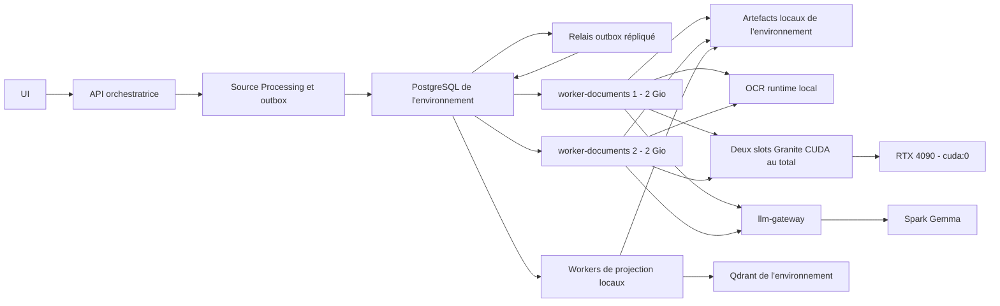

# Plan d'implémentation - Distribution locale des workers M-014

## Statut et portée

- Statut : proposé.
- Date de recadrage : 2026-07-23.
- Nature du document : planification uniquement.
- Milestone cible : `M-014 - Traitement parallèle local des PDF`.
- Prérequis : M-013 et ses sous-milestones applicables présents et GREEN dans
  `master`.
- Sous-milestones ordonnés : `M14-distribution-core`,
  `M14-local-pipeline`, puis `M14-local-qualification`.
- Hôte d'exécution : une seule machine physique, la station locale `amd64`
  équipée de la NVIDIA GeForce RTX 4090 Laptop GPU.
- Environnements concernés : `development`, `test` et `production`, avec leurs
  données, secrets, files, workers, volumes et identités étanches.
- Mécanisme de distribution : file PostgreSQL existante, sans Taskiq, Celery,
  RabbitMQ, Redis Streams, NATS ni autre broker.
- Unité de distribution prioritaire : la page documentaire routée.
- Flotte documentaire locale : exactement deux replicas généralistes
  `worker-documents`, limités à 2 Gio de RAM chacun.
- Capacité Granite locale : au plus deux conversions Granite simultanées sur
  `cuda:0`, soit un slot Granite par replica documentaire.

M-014 ne déploie aucun worker sur une autre machine. Les Mac Apple Silicon, les
PC distants, les images `arm64`, Colima, Kamal, SSH et le stockage d'objets
réseau sont reportés hors de ce milestone. Leur éventuelle reprise nécessitera
un nouveau plan explicite et une décision d'architecture dédiée.

ADR-051 continue de gouverner l'exécution CUDA stricte de Granite. ADR-052 devra
documenter, avant implémentation, la distribution locale à la page, le quota
global de deux slots Granite et la stratégie de reprise fenced.

## Objectif métier

Traiter plus rapidement un backlog important de PDF sur la machine locale en
permettant à deux workers documentaires de réclamer des pages en parallèle,
sans perdre les garanties existantes :

- routage M-003 explicite et inchangé ;
- autorité textuelle unique ;
- progression publique issue exclusivement de l'état persistant ;
- idempotence et fencing des écritures ;
- étanchéité de `development`, `test` et `production` ;
- publication canonique atomique après complétude de toutes les pages ;
- absence de fallback CPU pour Granite.

Le résultat attendu n'est pas seulement de démarrer deux conteneurs. La
distribution locale est réussie si deux pages peuvent être traitées réellement
en parallèle, si la perte d'un worker est reprise sans écriture obsolète et si
le document canonique final reste conforme au contrat M-004.

## Cadrage de capacité locale

### Workers généralistes

Les deux replicas `worker-documents` ont le même code, les mêmes actifs et les
mêmes capacités. Ils ne constituent pas deux files spécialisées : chacun peut
traiter les routes Docling standard, Granite, OCRmyPDF et les récupérations
explicitement autorisées.

La capacité Granite est une contrainte de ressource, pas une spécialisation :

- chaque replica possède au plus un slot Granite actif ;
- la station possède donc exactement deux slots Granite ;
- une troisième page Granite reste dans la file PostgreSQL jusqu'à libération
  d'un slot ;
- la saturation ne modifie jamais la route et ne déclenche jamais le CPU ;
- la disparition d'un replica réduit explicitement la capacité disponible à un
  slot jusqu'à son retour en état `READY`.

Les workers de projection restent sur la même machine et dans le même projet
Compose que leur environnement. Ils ne partagent ni identité ni claim avec les
workers documentaires.

### Baseline déjà observée

La page 2 du PDF de qualification M-013, route `MIXED_PAGEWISE`, a été exécutée
avec l'image Granite CUDA scellée, 4 CPU et une limite de 2 Gio par conteneur.
Toutes les exécutions ont produit deux items de provenance
`granite_docling` :

| Concurrence Granite | Temps du lot | Pic RAM par worker | Pic VRAM total | Pic GPU | Accélération du lot |
|---:|---:|---:|---:|---:|---:|
| 1 | médiane 20,582 s par page | non mesuré sous la limite finale | environ 1,36 Gio | non retenu | `1,00x` |
| 2 | 20,420 s pour 2 pages | environ 1,50 Gio | 2,79 Gio | 93 % | `2,02x` |
| 4 | 29,288 s pour 4 pages | 1,63 à 1,67 Gio | 5,58 Gio | 98 % | `2,81x` |

Deux workers doublent le débit sans dégrader la latence par page. Quatre
workers augmentent encore le débit, mais saturent le GPU et portent la latence
individuelle autour de 28 secondes. M-014 retient donc deux workers Granite
disponibles. Toute augmentation future doit être volontaire, requalifiée et
matérialisée dans le fichier de configuration ; aucune autosélection n'est
autorisée.

## État initial et écarts à fermer

| Sujet | État actuel | Écart M-014 local |
|---|---|---|
| File de jobs | PostgreSQL durable avec claims concurrents, leases et fencing | Le travail reste principalement réclamé au niveau document |
| Conversion | `CONVERT_DOCUMENT` orchestre les pages dans un processus local | Les pages ne sont pas encore réclamables indépendamment par les deux replicas |
| Granite | CUDA `cuda:0` stricte et deux replicas Compose | Le plafond global d'un slot Granite par replica doit être durablement vérifiable |
| Mémoire | Limite Compose de 2 Gio par worker validée sur deux et quatre conversions concurrentes | La gate doit refuser toute dérive de la limite et détecter les sorties OOM |
| Progression | Chaque page terminée incrémente une progression persistée | L'incrément doit devenir idempotent face aux reprises de jobs de pages |
| Publication | Fusion et publication faites par le worker du document | Un assembleur idempotent doit attendre tous les résultats de pages |
| Artefacts | Volumes locaux propres à chaque environnement | Les jobs doivent utiliser des identités d'artefacts vérifiées, pas des chemins libres |
| Environnements | Identité fermée pour `development`, `test` et `production` | Chaque job de page et chaque claim doivent porter et vérifier cette identité |
| Projection | Jobs PostgreSQL et deux replicas locaux | La projection doit rester locale et ne démarrer qu'après publication canonique complète |
| Observabilité | Progression publique et healthchecks de workers | Il manque les slots Granite actifs, en attente et la saturation GPU locale |

Les composants réutilisables sont `app.platform.job_runtime`, le relais outbox,
`DocumentProcessingRun`, les convertisseurs de pages M-004, la persistance
PostgreSQL, la progression publique et les contrôles M13-environments.

## Périmètre fonctionnel

### Inclus

- deux replicas `worker-documents` sur la station locale ;
- limite mémoire de 2 Gio et limite CPU explicite par replica ;
- deux slots Granite CUDA au total, un par replica ;
- distribution des conversions au niveau page par PostgreSQL ;
- workers généralistes sans file spécialisée par route ;
- résultats de pages idempotents, fenced et corrélés au traitement parent ;
- assemblage du document canonique après complétude de toutes les pages ;
- progression publique cohérente avec les résultats persistés ;
- reprise après arrêt d'un worker et expiration de lease ;
- projection locale après publication canonique ;
- métriques de file, workers, routes, RAM, VRAM, GPU et durées ;
- qualification réelle dans l'environnement `test` ;
- campagne de charge distincte avec un lot cible de cent PDF réels.

### Hors périmètre

- worker exécuté sur une autre machine physique ;
- Mac Apple Silicon, Colima, `linux/arm64` et image multiarchitecture ;
- déploiement par SSH, Kamal ou tout outil de déploiement distant ;
- stockage d'objets accessible par le réseau ;
- Taskiq ou autre framework de tâches ;
- broker externe ;
- Kubernetes, Docker Swarm ou autoscaling ;
- plus de deux conversions Granite simultanées ;
- fallback CPU, sélection `auto`, MPS ou autre accélérateur ;
- spécialisation rigide d'un replica par route documentaire ;
- modification du modèle Granite ou de la politique de routage ;
- déplacement de Gemma hors du Spark ;
- appel direct au Spark depuis un worker ;
- découpage de la projection en chunks distribués ;
- test fonctionnel systématique en `development` ou `production` ;
- accès Internet ou exposition publique d'un worker.

## Invariants non négociables

1. Tous les workers M-014 s'exécutent sur la station locale.
2. PostgreSQL reste la source de vérité des jobs, claims, leases et
   progressions ; un compteur en mémoire n'est jamais une preuve métier.
3. Source Processing reste propriétaire du `DocumentProcessingRun`, des
   résultats de pages et de la publication canonique.
4. Le pool documentaire contient exactement deux replicas configurés et
   identifiés dans l'environnement courant.
5. Au plus deux conversions Granite sont actives sur la station, avec au plus
   une conversion Granite par replica.
6. Granite cible exclusivement `cuda:0` et échoue explicitement avec
   `GRANITE_CUDA_UNAVAILABLE` si CUDA manque ; aucune reprise CPU n'est permise.
7. Les deux replicas sont généralistes et publient les mêmes capacités. Une
   route lente n'entraîne pas la création d'une file spécialisée.
8. Chaque replica est limité à 2 Gio de RAM. Un dépassement est une erreur
   observable, jamais une augmentation implicite de limite.
9. L'exécution peut être au moins une fois, mais l'effet persistant doit être
   exactement une fois grâce à l'idempotence et au fencing.
10. Un ancien détenteur de lease ne peut enregistrer ni résultat, ni
    progression, ni succès après réattribution.
11. Un worker vérifie `environment`, `deployment_id`, `configuration_hash`, la
    version de schéma et son identité de stockage avant son premier claim.
12. Une page terminée ne compte qu'une unité de progression, y compris lorsque
    `TARGETED_ENRICHMENT` produit deux candidats avant adjudication.
13. Une page `SKIP_EMPTY` est terminale et comptée sans convertisseur.
14. Une page échouée terminalement interdit toute publication partielle.
15. L'assembleur ne publie que si toutes les pages attendues possèdent un état
    terminal autorisé et des artefacts cohérents avec le manifeste.
16. Un worker ne modifie jamais la route M-003 de sa propre initiative.
17. L'UI consomme uniquement le contrat public de progression ; elle ne lit ni
    les logs, ni Docker, ni les compteurs GPU.
18. Aucun job, volume, secret, claim ou worker ne traverse la frontière entre
    `development`, `test` et `production`.
19. Les validations fonctionnelles et de charge s'exécutent dans
    l'environnement `test`. Les profils `development` et `production` sont
    contrôlés structurellement, sans rejouer le corpus de qualification.

## Topologie cible locale



Chaque environnement possède son projet Compose, son PostgreSQL, son Qdrant,
ses volumes, ses secrets et ses identités de workers. Une seule pile
d'environnement est qualifiée fonctionnellement à la fois afin de ne pas
mélanger la charge GPU et les preuves.

## Modèle d'exécution local distribué

### Orchestration parent

`CONVERT_DOCUMENT` devient l'orchestration durable du traitement :

1. valider le diagnostic et la politique de routage ;
2. figer le manifeste des pages attendues ;
3. créer idempotemment un job `CONVERT_PAGE` par page non vide ;
4. persister immédiatement les pages `SKIP_EMPTY` ;
5. publier une progression initiale avec un total stable ;
6. attendre les états persistés sans conserver une vérité locale ;
7. émettre `ASSEMBLE_CANONICAL_DOCUMENT` lorsque toutes les pages sont
   terminales et admissibles.

Une reprise de l'orchestrateur ne recrée pas de jobs différents. La clé
d'idempotence inclut le traitement, la page, la route et la version de
politique.

### Job de page

Le contrat `CONVERT_PAGE` porte au minimum :

- l'identité de l'environnement et du déploiement ;
- `document_id`, `processing_run_id` et numéro de page ;
- route décidée, version de politique et capacité requise ;
- identité et SHA-256 du PDF source ;
- versions des actifs et modèles verrouillés ;
- version du contrat de résultat ;
- clé d'idempotence.

Le job ne désigne pas un worker particulier. Les deux replicas réclament les
jobs compatibles par `FOR UPDATE SKIP LOCKED`.

### Quota Granite

Un simple sémaphore en mémoire dans chaque replica ne suffit pas à imposer une
limite globale. M-014 doit fournir un quota local fenced de deux slots Granite :

- acquisition atomique avant le lancement du sous-processus Granite ;
- association du slot au claim et à sa génération ;
- heartbeat pendant la conversion ;
- libération sur succès, échec terminal ou expiration ;
- refus de toute troisième acquisition concurrente ;
- métrique publique d'administration `active=0..2` et `waiting>=0`.

Le mécanisme exact est décidé par ADR-052. Il doit rester PostgreSQL-first et ne
doit pas introduire une seconde file locale.

### Résultat de page

Le résultat persistant contient :

- identité du job, claim, génération et token de fencing ;
- page, route, versions d'outils et provenance ;
- artefact produit, empreinte et taille ;
- état terminal ou erreur stable ;
- identité du replica ayant effectué le calcul ;
- durée, RAM maximale et métriques GPU techniques lorsqu'elles s'appliquent.

La persistance du résultat et l'incrément de progression sont atomiques. Une
écriture répétée avec la même clé ne produit aucun effet supplémentaire.

### Assemblage canonique

`ASSEMBLE_CANONICAL_DOCUMENT` :

1. verrouille logiquement le traitement ;
2. charge le manifeste et tous les résultats persistés ;
3. refuse page absente, doublon divergent ou erreur terminale ;
4. applique les règles d'autorité M-004 sans réexécuter les modèles ;
5. publie atomiquement une seule version canonique ;
6. émet l'événement de publication déclenchant la projection.

### Projection

`PROJECT_DOCUMENT` reste un job local au niveau document. Il ne démarre qu'après
publication canonique complète et écrit dans le Qdrant de l'environnement. Son
découpage en lots reste hors périmètre tant qu'une mesure ne démontre pas un
nouveau goulot d'étranglement.

## Artefacts locaux

La station unique permet de conserver les volumes locaux étanches existants.
M-014 n'introduit pas de stockage d'objets réseau.

Les jobs utilisent néanmoins une identité d'artefact appartenant à Source
Processing, accompagnée d'un SHA-256. Le résolveur local :

- vérifie que l'identité appartient à l'environnement courant ;
- résout uniquement sous la racine autorisée de cet environnement ;
- refuse les chemins absolus fournis par un payload et toute traversée ;
- vérifie l'empreinte avant lecture ;
- écrit les résultats de façon immutable.

Cette abstraction évite de coupler les contrats de jobs à un chemin Docker sans
imposer dès maintenant un stockage réseau inutile.

## Configuration et exploitation

Les commandes opérateur restent :

```text
uv run development
uv run test
uv run production
```

Elles démarrent les deux replicas documentaires du profil choisi. Aucun lanceur
`*-worker`, fichier `.env` ou paramètre SSH n'est ajouté.

La configuration validée doit exprimer sans valeur par défaut implicite :

- `worker-documents.replicas = 2` ;
- `worker-documents.memory = 2 Gio` ;
- `worker-documents.cpus = 4` ;
- `granite.device = cuda:0` ;
- `granite.max_concurrent = 2` ;
- `granite.max_concurrent_per_worker = 1`.

Les noms définitifs et leur emplacement relèvent du schéma de configuration du
projet. Les valeurs ne sont pas injectées par variables d'environnement.

Les opérations minimales sont :

- inspecter les deux replicas et leur état `READY` ;
- drainer un replica sans interrompre l'autre ;
- redémarrer un replica après expiration propre de ses claims ;
- consulter les slots Granite actifs et en attente ;
- constater explicitement une sortie OOM ou une indisponibilité CUDA ;
- refuser un troisième replica non déclaré par la configuration.

## Réseau et sécurité

M-014 n'ajoute aucun flux réseau entre machines. Les règles existantes restent
applicables :

- aucun port public pour PostgreSQL, Qdrant, les workers ou Granite ;
- accès Spark uniquement au travers de `llm-gateway` ;
- socket Docker hôte jamais monté directement dans `worker-documents` ;
- runtime OCR isolé par le socket Unix dédié existant ;
- secrets montés en lecture seule et propres à l'environnement ;
- aucune variable applicative injectée dans les services ;
- aucun fallback si PostgreSQL, Qdrant, OCR, CUDA ou le gateway est indisponible.

## Observabilité et capacité

Le contrat public métier conserve :

- phase ;
- unités réalisées ;
- total ;
- erreur terminale éventuelle.

Le contrat d'administration technique ajoute :

- deux replicas attendus, nombre `READY`, `BUSY`, `DRAINING` ou absent ;
- jobs de pages prêts, réclamés, repris et terminalement échoués ;
- slots Granite actifs et en attente ;
- durée par route et par page ;
- RAM et sorties OOM par conteneur ;
- utilisation GPU, VRAM et puissance ;
- temps d'attente avant acquisition d'un slot Granite ;
- temps d'assemblage et de projection.

L'UI métier ne lit pas ces métriques techniques pour reconstruire sa
progression.

## Scénarios BDD directeurs

### DIST-001 - Deux workers traitent deux pages Granite

- Given deux workers documentaires locaux `READY` et deux pages routées Granite
- When les deux jobs `CONVERT_PAGE` deviennent réclamables
- Then chaque worker acquiert un slot distinct, les deux conversions utilisent
  `cuda:0` et les deux résultats sont persistés sans doublon

### DIST-002 - Troisième page Granite mise en attente

- Given les deux slots Granite sont occupés
- When une troisième page Granite devient prête
- Then elle reste réclamable ou en attente sans exécution CPU, changement de
  route ni dépassement du quota

### DIST-003 - Reprise après perte d'un worker

- Given un worker détient un job de page et son slot Granite
- When le worker s'arrête avant la persistance du résultat
- Then sa lease et son slot expirent, l'autre worker peut reprendre le job et
  l'ancien détenteur ne peut plus écrire

### DIST-004 - Étanchéité des environnements

- Given les deux workers appartiennent à `test`
- When un job ou un artefact de `production` est présenté
- Then le claim ou la résolution est refusé avant tout traitement

### DIST-005 - Publication canonique atomique

- Given toutes les pages sauf une sont terminées
- When l'assemblage est évalué
- Then aucune version canonique n'est publiée avant le dernier résultat valide

### DIST-006 - Limite mémoire à 2 Gio

- Given deux puis quatre conversions Granite concurrentes dans l'environnement
  de qualification
- When Docker applique 2 Gio à chaque conteneur
- Then les sorties sont correctes, aucune exécution n'est OOM et le pic RAM par
  worker reste inférieur à la limite

### DIST-007 - Charge de cent PDF

- Given cent PDF réels planifiés dans `test` et deux workers locaux `READY`
- When la campagne de charge dédiée est lancée
- Then tous les documents atteignent un état terminal, les documents réussis
  sont canoniques et le rapport compare débit, latence, attente Granite, RAM et
  GPU au baseline mono-worker

## Découpage du milestone M-014

| Sous-milestone | Tâches | Périmètre | Précondition | Gate de sortie |
|---|---:|---|---|---|
| `M14-distribution-core` | T-001 à T-004 | Baseline, ADR-052, contrats, migrations et quota Granite local | M-013 GREEN | Deux workers et deux slots Granite sont décrits par des contrats versionnés et testables |
| `M14-local-pipeline` | T-005 à T-008 | Jobs de pages, résultats fenced, assemblage canonique et projection locale | `M14-distribution-core` | Deux workers traitent un même document sans doublon ni publication partielle |
| `M14-local-qualification` | T-009 à T-011 | Observabilité, reprise, qualification réelle et charge | `M14-local-pipeline` | Le parcours local est prouvé avec deux workers à 2 Gio et la charge est publiée |

Les dossiers de tâches attendus sont :

- `docs/tasks/milestone_014-distribution-core` ;
- `docs/tasks/milestone_014-local-pipeline` ;
- `docs/tasks/milestone_014-local-qualification`.

Un seul sous-milestone est implémenté à la fois. Le suivant ne commence que si
la gate du précédent est GREEN dans `master`.

## Tranches d'implémentation

### M14-distribution-core - Socle local durable

#### T-001 - Vérifier le baseline et les préconditions

- vérifier M-013 GREEN dans `master` ;
- mesurer un et deux workers sur le PDF de qualification ;
- inventorier les claims, leases, progressions, semaphores et volumes actuels ;
- conserver les preuves déjà observées à 2 Gio ;
- prouver que le périmètre ne contient aucun hôte distant.

#### T-002 - Décider la distribution locale dans ADR-052

- définir le fan-out à la page ;
- choisir le mécanisme PostgreSQL du quota de deux slots Granite ;
- définir acquisition, heartbeat, expiration, drainage et fencing ;
- confirmer les deux workers généralistes et l'absence de spécialisation ;
- indexer ADR-052 sans modifier le sens d'ADR-051.

#### T-003 - Publier les contrats locaux

- versionner `CONVERT_PAGE`, résultat de page et assemblage ;
- porter environnement, route, artefact, empreinte et idempotence ;
- publier les erreurs stables de quota, CUDA, mémoire et artefact ;
- ajouter la configuration stricte des replicas et limites.

#### T-004 - Ajouter les migrations et le quota Granite

- créer uniquement des migrations ascendantes ;
- ajouter les tables ou colonnes nécessaires aux jobs de pages ;
- implémenter deux slots Granite fenced ;
- prouver qu'un troisième claim Granite n'exécute aucun modèle ;
- prouver la récupération d'un slot expiré.

### M14-local-pipeline - Pipeline documentaire local distribué

#### T-005 - Éclater la conversion en jobs de pages

- figer le manifeste ;
- créer les jobs dans la transaction de l'outbox ;
- persister `SKIP_EMPTY` sans convertisseur ;
- publier un total de progression stable.

#### T-006 - Exécuter et persister une page

- réclamer un job compatible ;
- acquérir un slot Granite seulement pour les routes concernées ;
- exécuter le convertisseur décidé ;
- persister résultat et progression atomiquement sous fencing ;
- refuser les répétitions divergentes.

#### T-007 - Assembler et publier le document canonique

- vérifier la complétude ;
- refuser les pages absentes ou terminalement échouées ;
- appliquer l'autorité textuelle M-004 ;
- publier une version canonique unique ;
- prouver la reprise idempotente de l'assembleur.

#### T-008 - Projeter localement le document publié

- conserver `PROJECT_DOCUMENT` au niveau document ;
- lire uniquement la version canonique publiée ;
- écrire dans le Qdrant du même environnement ;
- prouver qu'une projection répétée reste idempotente.

### M14-local-qualification - Exploitation et qualification

#### T-009 - Publier l'observabilité et les opérations

- exposer état des deux replicas et slots Granite ;
- mesurer attente, durée, RAM, GPU, reprise et erreurs ;
- fournir inspection, drainage et redémarrage ciblé ;
- refuser un nombre de replicas ou une limite non conformes.

#### T-010 - Qualifier le parcours réel à deux workers

- lancer la pile `test` réelle ;
- soumettre un document couvrant les routes requises ;
- prouver deux pages réellement traitées en parallèle ;
- arrêter un worker et prouver la reprise fenced ;
- comparer le document canonique et la projection au baseline.

#### T-011 - Qualifier la charge et clôturer

- exécuter la campagne de cent PDF hors gate de chaque PR ;
- publier débit, latence, attente Granite, RAM, VRAM et erreurs ;
- vérifier les deux workers à 2 Gio sans OOM ;
- accepter ou remplacer explicitement ADR-052 selon les preuves ;
- consigner que le déploiement réseau reste reporté.

## Séquence et dépendances

```text
M-013 GREEN
  -> T-001 baseline
  -> T-002 ADR-052 locale
  -> T-003 contrats
  -> T-004 migrations et quota Granite
  -> T-005 fan-out pages
  -> T-006 résultats fenced
  -> T-007 assemblage canonique
  -> T-008 projection locale
  -> T-009 observabilité et opérations
  -> T-010 qualification réelle
  -> T-011 charge et clôture
```

Les tests de contrats peuvent préparer les tâches suivantes, mais les
migrations, le runtime et les preuves live restent séquentiels.

## Stratégie de tests

### Tests rapides de PR

- contrats de jobs et résultats ;
- sélection compatible et quota de deux slots ;
- refus du troisième slot ;
- expiration, fencing et idempotence ;
- progression et assemblage ;
- résolution sûre des artefacts ;
- configuration Compose : deux replicas, 2 Gio et CUDA stricte.

### Tests PostgreSQL réels

- claims concurrents ;
- crash avant et après persistance ;
- ancien détenteur refusé ;
- slot Granite expiré puis repris ;
- résultat et progression atomiques ;
- migrations depuis la version précédente.

### Tests live dans `test`

- deux workers et deux pages Granite concurrentes ;
- troisième page mise en attente ;
- arrêt d'un replica et reprise ;
- PDF de qualification couvrant les routes ;
- publication canonique et projection réelles ;
- absence de fuite vers `development` ou `production`.

Les tests live ne sont pas rejoués fonctionnellement dans les trois
environnements. `development` et `production` reçoivent seulement les contrôles
structurels de configuration, d'identité et d'étanchéité.

### Charge hors gate de PR

La campagne de cent PDF est lancée à un jalon explicite de qualification. Elle
n'est pas exécutée sur chaque PR. Le corpus réduit conserve une page par chemin
nécessaire et une page vide pour les gates usuelles.

## Critères de performance

Le rapport final doit séparer :

- débit global du backlog ;
- latence par page et par document ;
- temps d'attente d'un slot Granite ;
- temps de conversion par route ;
- temps d'assemblage et de projection ;
- pic RAM par worker ;
- utilisation GPU et VRAM ;
- reprises, erreurs terminales et OOM.

Les preuves minimales sont :

- deux pages Granite terminées simultanément en un temps de lot inférieur au
  double du baseline mono-worker ;
- deux sorties identiques au contrat de la page de qualification ;
- aucun worker au-dessus de 2 Gio ;
- aucun troisième processus Granite actif ;
- document canonique et projection identiques au baseline fonctionnel ;
- aucun gain obtenu en sautant une page, une route ou une validation.

Le résultat observé de 20,420 secondes pour deux pages constitue une baseline,
pas un seuil absolu portable. Les seuils de non-régression définitifs seront
figés en T-010 après plusieurs répétitions contrôlées.

## Migration et rollback

La migration reste ascendante et compatible avec les traitements existants :

1. ajouter les contrats et tables de pages sans supprimer `CONVERT_DOCUMENT` ;
2. écrire le manifeste et les jobs de pages sous contrôle explicite ;
3. qualifier un document dans `test` ;
4. activer le parcours local distribué pour les nouveaux traitements ;
5. laisser les traitements déjà commencés finir sous leur version d'origine.

Le rollback :

1. arrête la création de nouveaux jobs de pages ;
2. draine les deux workers ;
3. laisse expirer ou termine les claims actifs ;
4. conserve tous les résultats déjà persistés ;
5. reprend les nouveaux documents avec le parcours antérieur explicitement
   configuré ;
6. ne supprime ni table ni colonne pendant l'incident.

Aucun job ne bascule silencieusement de Granite vers CPU ou d'un environnement
vers un autre pendant le rollback.

## Risques et contrôles

| Risque | Contrôle |
|---|---|
| Quatre processus Granite malgré deux replicas | Quota PostgreSQL global de deux slots et un slot maximum par worker |
| OOM avec 2 Gio | Gate Compose, mesure live, métrique RAM et erreur terminale visible |
| GPU saturé | Deux workers retenus, attente persistée et métriques GPU |
| Sémaphore perdu après crash | Slot loué, heartbeat, expiration et fencing |
| Double progression | Résultat et incrément dans une transaction idempotente |
| Publication partielle | Assembleur bloqué tant que le manifeste n'est pas complet |
| Mélange d'environnements | Identité vérifiée avant claim et résolution d'artefact |
| Faux gain de performance | Comparaison sur mêmes pages, mêmes actifs et mêmes sorties |
| Tests trop longs | Corpus réduit dans les PR, cent PDF uniquement au jalon de charge |
| Retour implicite au réseau | Absence d'hôte distant dans configuration et gate d'architecture |

## Definition of Done M-014

M-014 est terminé lorsque :

- ADR-052 est acceptée ou explicitement remplacée après preuves ;
- exactement deux workers documentaires locaux sont configurés et observables ;
- chaque worker est limité à 2 Gio et un slot Granite ;
- deux pages Granite s'exécutent réellement en parallèle sur `cuda:0` ;
- une troisième page attend sans fallback ;
- les jobs de pages, résultats, leases et slots sont fenced ;
- un crash est repris sans doublon ni progression supplémentaire ;
- une version canonique unique est publiée après complétude ;
- la projection locale est complète et idempotente ;
- l'environnement `test` porte les preuves fonctionnelles et de charge ;
- les configurations `development` et `production` passent leurs contrôles
  structurels sans réexécution systématique du corpus ;
- la campagne de cent PDF et le rapport de capacité sont publiés ;
- aucune capacité de worker distant, SSH, Kamal, Colima ou `arm64` n'est livrée
  dans le milestone.

## Livrables attendus

- ADR-052 sur la distribution locale et le quota Granite ;
- contrats versionnés de jobs et résultats de pages ;
- migrations ascendantes ;
- quota durable de deux slots Granite ;
- fan-out transactionnel et progression idempotente ;
- assembleur canonique et projection locale ;
- configuration stricte de deux replicas à 2 Gio ;
- observabilité et opérations locales ;
- tests PostgreSQL, Compose et live dans `test` ;
- rapport de qualification et rapport de charge ;
- mise à jour de la matrice de traçabilité et des runbooks.

## Évolution réseau reportée

La distribution sur plusieurs machines n'appartient plus à M-014. Un futur
milestone pourra réexaminer, sans engagement actuel :

- workers Mac Apple Silicon et PC distants ;
- images `linux/arm64` et `linux/amd64` ;
- Colima et Docker distants ;
- Kamal et déploiement SSH ;
- stockage d'objets partagé ;
- identité et registre de nœuds réseau ;
- sécurité inter-hôtes et reprise après partition réseau.

Ce futur milestone devra repartir des mesures de M-014 et créer son propre plan
et son ADR. Aucun code M-014 ne doit préimplémenter silencieusement ces choix.

## Références canoniques

- `AGENTS.md` ;
- `docs/specs/plan_implementation_milestones_workstreams.md` ;
- `docs/specs/m004_version_canonique_publiee.md` ;
- `docs/specs/m013_environments_environnements_explicites.md` ;
- `docs/adr/ADR-024-relais-outbox-transactions-locales.md` ;
- `docs/adr/ADR-025-fencing-claims-inspection-pdf-isolee.md` ;
- `docs/adr/ADR-040-adjudication-enrichissement-cible-docling-granite.md` ;
- `docs/adr/ADR-042-capacite-docling-partagee.md` ;
- `docs/adr/ADR-046-profils-locaux-etanches-sur-autorite-docker-explicite.md` ;
- `docs/adr/ADR-051-execution-granite-cuda-stricte.md` ;
- `app/platform/job_runtime/` ;
- `app/source_processing/adapters/worker_runtime.py` ;
- `app/source_processing/adapters/docling_granite_worker.py` ;
- `deploy/environments/compose.base.yaml`.
