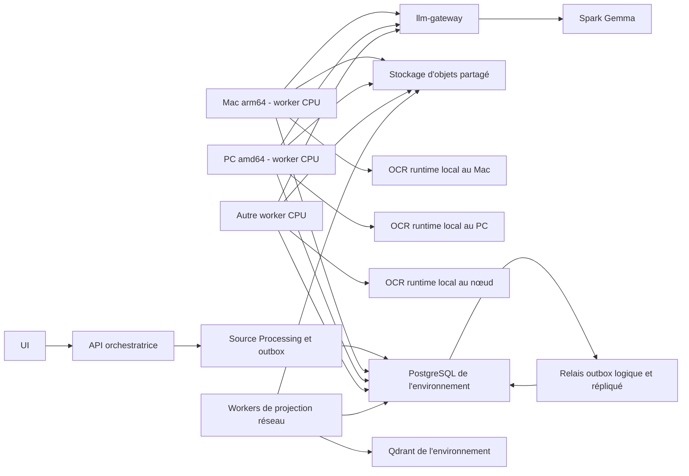

# Plan d'implémentation - Distribution CPU des workers sur le réseau local

## Statut et portée

- Statut : proposé.
- Nature du présent document : planification uniquement ; aucune capacité réseau
  distribuée n'est livrée par ce fichier.
- Milestone cible : `M-014 - Distribution CPU des workers sur le réseau local`,
  extension post-V1 dépendant de M-013 GREEN dans `master`.
- Sous-milestones ordonnés : `M14-distribution-core`, `M14-worker-fleet`,
  `M14-distributed-pipeline`, puis `M14-deployment`.
- Inscription canonique :
  `docs/specs/plan_implementation_milestones_workstreams.md` ; les dossiers de
  tâches ne sont créés qu'après validation des préconditions de leur
  sous-milestone.
- Cible matérielle initiale : Mac Apple Silicon `arm64` et PC `amd64`, exécutant
  tous les traitements documentaires sur CPU.
- Environnements concernés : `development`, `test` et `production`, sans partage
  de données, de secrets, de files ni de workers entre deux environnements.
- Mécanisme de distribution : file PostgreSQL existante, sans Taskiq, Celery,
  RabbitMQ, Redis Streams, NATS ni autre broker supplémentaire.
- Mécanisme de déploiement des nœuds : Kamal depuis une autorité de
  déploiement, par SSH sur le réseau local ; Docker est fourni par Colima sur
  les Mac et par le moteur Docker qualifié sur les PC.
- Unité de distribution prioritaire : une page documentaire routée ; la
  projection reste d'abord distribuée au niveau document et ne sera découpée en
  lots que si les mesures démontrent un nouveau goulot d'étranglement.

Ce plan prépare une évolution structurante. L'implémentation ne doit pas
commencer avant la création, l'indexation et la revue de l'ADR proposée dans la
première tranche. Son acceptation définitive intervient seulement après les
preuves live prévues par ce plan. Une ADR acceptée existante ne doit pas être
réécrite silencieusement ni déclarée remplacée avant cette acceptation.

## Objectif métier

Permettre à un lot important de PDF, notamment une centaine de documents
planifiés, d'être traité par plusieurs machines du réseau local sans perdre les
garanties actuelles : routage explicite, autorité textuelle unique, progression
publique réelle, idempotence, étanchéité des environnements et publication
canonique atomique.

Le résultat attendu n'est pas seulement de démarrer plusieurs processus. La
distribution est réussie si des pages d'un même lot sont réellement réclamées
par plusieurs machines, si la perte d'une machine est reprise sans écriture
obsolète et si le document canonique final reste identique au contrat M-004.

## Décision de cadrage CPU-first

La première livraison doit rester homogène et observable :

- les workers documentaires utilisent uniquement le CPU ;
- les images Linux sont produites pour `linux/arm64` et `linux/amd64` ;
- les deux architectures exécutent le même code métier et les mêmes versions
  verrouillées des outils ;
- aucun worker ne détecte puis n'active silencieusement CUDA ou MPS ;
- aucun job ne change de route parce qu'une machine est plus lente ou qu'un
  outil est indisponible ;
- la concurrence est déclarée explicitement par worker et bornée conformément
  à ADR-040 et ADR-042 ;
- l'architecture, le digest de l'image, les versions d'outils et l'identité du
  worker sont conservés dans la provenance technique.

L'utilisation ultérieure de CUDA sur les PC ou de MPS sur les Mac nécessitera
une décision, des images et des preuves distinctes. Elle ne doit pas être
préparée par un fallback caché dans la livraison CPU.

## État initial et écarts à fermer

| Sujet | État actuel | Écart pour la distribution réseau |
|---|---|---|
| File de jobs | PostgreSQL durable, claims concurrents avec `FOR UPDATE SKIP LOCKED` | La sélection ne porte pas encore les capacités et l'identité d'un nœud réseau enregistré |
| Sûreté des claims | Lease, heartbeat, `claim_generation` et `claim_token` | Les preuves live restent locales et doivent couvrir une partition réseau et une reprise sur un autre hôte |
| Environnements | `development`, `test` et `production` portent une identité fermée | Un worker distant doit prouver la même identité avant toute prise de job |
| Conversion | Un job `CONVERT_DOCUMENT` orchestre les pages dans un `ThreadPoolExecutor` local | Les pages ne peuvent pas être réclamées indépendamment par plusieurs machines |
| Progression | Chaque page terminée incrémente une progression persistée | L'incrément doit devenir idempotent et provenir des résultats de pages distribués |
| Publication | Fusion pagewise et publication canonique effectuées par le worker du document | Un assembleur distinct doit attendre toutes les pages et refuser toute publication partielle |
| Fichiers | Volumes et racines locales au projet Compose | Une référence locale n'est pas résoluble de façon fiable sur un autre hôte |
| Déploiement | Deux replicas documentaires et deux replicas de projection dans un Compose local | Kamal doit déployer les paquets worker-only par SSH vers une autorité Docker qualifiée, Colima sur Mac, avec destinations et identités étanches |
| Architecture CPU | Exécution qualifiée sur la station `amd64` courante | Les dépendances, modèles et images OCR doivent être prouvés sur `arm64` et `amd64` |
| OCRmyPDF | Runtime DinD local relié par socket Unix au worker | Chaque nœud documentaire doit fournir son propre sidecar OCR, sans socket Docker hôte |

Les composants réutilisables sont `app.platform.job_runtime`, le relais outbox,
les contrats de jobs techniques, `DocumentProcessingRun`, les convertisseurs de
pages M-004, la persistance PostgreSQL, la progression publique et les contrôles
d'identité M13-environments.

## Périmètre fonctionnel

### Inclus

- déploiement de workers CPU sur plusieurs machines du même réseau local ;
- déploiement et mise à jour progressive par Kamal au travers de SSH ;
- utilisation du service Colima existant comme runtime Docker Linux `arm64` sur
  les Mac Apple Silicon ;
- image worker CPU multiarchitecture ;
- commande opérateur worker-only pour chacun des trois environnements ;
- enregistrement, heartbeat, drainage et révocation d'une instance de worker ;
- distribution des conversions au niveau page ;
- stockage partagé des entrées et sorties par références immuables ;
- assemblage du document canonique après complétude de toutes les pages ;
- reprise après crash, expiration de lease et refus de l'ancien détenteur ;
- conservation de la progression publique de bout en bout ;
- exécution réseau des workers de projection au niveau document ;
- observabilité de la file, des nœuds et des durées par route ;
- qualification réelle sur Mac Apple Silicon et PC `amd64` ;
- parcours de charge avec un lot cible de cent PDF réels.

### Hors périmètre

- Taskiq ou tout autre framework de tâches distribuées ;
- broker externe ;
- CUDA, MPS, GPU, NPU ou sélection automatique d'un accélérateur ;
- Kubernetes, Docker Swarm ou autoscaling automatique ;
- utilisation de Kamal comme ordonnanceur de jobs, registre de workers ou
  source de progression métier ;
- connexion SSH directe à la machine virtuelle interne de Colima ;
- spécialisation rigide des machines par route documentaire ;
- modification du modèle Granite, de la politique de routage ou de l'autorité
  textuelle ;
- déplacement de Gemma hors du Spark ou appel direct au Spark depuis un worker ;
- téléchargement d'un modèle, d'une image OCR ou d'un actif pendant un job ;
- découpage de la projection en chunks distribués avant mesure d'un besoin réel ;
- accès depuis Internet ou exposition publique d'un worker.

## Invariants non négociables

1. PostgreSQL reste la source de vérité des jobs, claims, leases, workers et
   progressions ; un état local de machine n'est jamais une preuve métier.
2. Source Processing reste propriétaire du `DocumentProcessingRun`, des
   résultats de pages et de la publication canonique.
3. L'exécution peut être au moins une fois, mais l'effet persistant doit être
   exactement une fois grâce à l'idempotence et au fencing.
4. Un worker vérifie `environment`, `deployment_id`, `configuration_hash`, la
   version de schéma et son identité de stockage avant son premier claim.
5. Un worker ne réclame qu'un job dont la capacité requise appartient à son
   profil explicitement enregistré.
6. Un job ne contient aucun chemin absolu local, partage SMB implicite ou URL
   présignée expirante ; il transporte une identité d'artefact et son empreinte.
7. Toute entrée et sortie de page est immuable, adressée par identifiant et
   vérifiée par SHA-256 avant utilisation.
8. Une page terminée ne compte qu'une seule unité de progression, y compris
   lorsque `TARGETED_ENRICHMENT` produit deux candidats avant adjudication.
9. Une page `SKIP_EMPTY` est terminale et comptée explicitement sans appel de
   convertisseur.
10. Une page échouée terminalement interdit la publication canonique du
    document ; aucun document partiel n'est publié.
11. L'assembleur ne publie que si toutes les pages attendues possèdent un état
    terminal autorisé et des artefacts cohérents avec le manifeste.
12. Un ancien détenteur de lease ne peut enregistrer ni résultat, ni
    progression, ni succès après réattribution.
13. Un worker ne modifie jamais la route M-003 de sa propre initiative. Les
    récupérations autorisées restent uniquement celles des ADR actives.
14. L'UI lit phase, unités réalisées, total et erreur terminale depuis le
    contrat public persistant ; elle ne lit pas le registre des workers.
15. Aucun worker de `development` ou `test` ne possède un endpoint, un rôle ou
    un secret lui permettant d'accéder à `production`.
16. Kamal est exclusivement une autorité de déploiement. PostgreSQL reste la
    seule autorité des jobs et de leur progression.
17. Une destination Kamal nomme exactement un environnement, une liste fermée
    d'hôtes et des fichiers de configuration et secrets propres à cet
    environnement ; un déploiement sans destination explicite est refusé.
18. Sur un Mac, Kamal se connecte au système macOS par SSH et utilise le contexte
    Docker Colima depuis cette session. Il ne se connecte pas directement à la
    machine virtuelle Colima et n'en dépend pas par une adresse IP temporaire.
19. Un déploiement normal ne redémarre ni le Mac, ni le PC, ni Colima. Si SSH,
    Colima, Docker, le registre ou un montage requis est indisponible, le
    préflight échoue explicitement et aucun runtime alternatif n'est choisi.

## Topologie cible



Chaque environnement possède sa propre instance logique de cette topologie.
Une machine physique peut héberger plusieurs environnements seulement si leurs
projets Compose, réseaux, secrets, bases, volumes, caches et identités restent
strictement distincts conformément à ADR-046.

Les workers initient leurs connexions vers les services centraux. Aucun port de
commande entrant n'est requis sur un worker. Son état observable est publié par
heartbeat dans PostgreSQL et par son healthcheck local.

Comme dans le runtime actuel, chaque processus worker peut exécuter une instance
du relais avant sa boucle de claim. Le relais reste un composant logique unique
par son protocole : ses replicas concurrents utilisent les claims, leases et
ACK idempotents d'ADR-024. Il ne doit pas exister un relais non protégé par
machine ni une seconde file locale.

## Déploiement SSH avec Kamal

Kamal pilote le cycle de livraison des conteneurs, mais n'intervient pas dans
le protocole métier. L'autorité de déploiement construit ou référence les images
OCI scellées, les publie dans le registre, ouvre une session SSH vers chaque
hôte autorisé et demande à son moteur Docker de lancer le digest attendu.

Trois destinations fermées doivent exister : `development`, `test` et
`production`. La configuration Kamal commune décrit les rôles worker documents
et worker projection ainsi que l'accessoire runtime OCR. Chaque destination
ajoute uniquement :

- sa liste fermée d'hôtes SSH ;
- les chemins de configuration, secrets et identités de workers propres à
  l'environnement ;
- les digests autorisés et les limites CPU/RAM ;
- les endpoints de registre et d'observation nécessaires au déploiement.

Les rôles de workers n'exposent aucun proxy HTTP. Le runtime OCR est déployé
comme accessoire local du worker documentaire et partage uniquement un volume
de socket Docker privé ; le socket du moteur Docker hôte n'est jamais monté dans
le worker.

Sur Mac Apple Silicon, la cible SSH est l'hôte macOS. Le service Colima existant
fournit le moteur Docker Linux `arm64`. Le préflight exécuté dans la session SSH
non interactive doit prouver, avec des chemins de binaires déterministes :

1. que le service Colima est actif ;
2. que le contexte Docker attendu pointe vers Colima ;
3. que `docker info` annonce `aarch64` sans émulation ;
4. que l'image peut être tirée par digest depuis le registre ;
5. que les montages de configuration et secrets sont lisibles depuis Colima ;
6. que le conteneur atteint les services centraux autorisés de l'environnement.

Le compte SSH doit accéder explicitement au contexte et au socket du service
Colima existant. Kamal ne doit ni installer un second moteur Docker sur le Mac,
ni remplacer Colima, ni copier implicitement son socket vers un autre compte.

Les sources de volumes macOS doivent appartenir à un chemin explicitement
partagé avec Colima, de préférence sous le répertoire personnel du compte SSH
dédié. Leur disponibilité ne doit pas être déduite du seul fait qu'un fichier
existe sur macOS. Les fichiers de configuration, secrets et identités sont
montés en lecture seule et restent distincts par environnement.

Sur PC `amd64`, le même contrat s'applique : la session SSH non interactive doit
accéder au moteur Docker qualifié, annoncer `x86_64`, tirer le digest attendu et
atteindre les seuls services centraux autorisés. Le système d'exploitation et
le mode d'exposition de Docker sont inventoriés en T-001 et figés par ADR-051.

L'identité d'un worker provient d'un manifeste explicite propre à l'hôte,
monté en lecture seule. Elle n'est inférée ni du nom d'hôte, ni d'une variable
d'environnement. Après lancement, une vérification post-déploiement consulte le
registre public des workers et n'accepte le nœud que si le nouveau digest atteint
`READY` avec l'identité d'environnement attendue.

Une mise à jour se fait progressivement : drainage applicatif, remplacement
d'un nombre borné de conteneurs, attente de `READY`, puis passage au nœud suivant.
Elle ne redémarre pas la machine. Le démarrage de Colima après une éventuelle
relance de l'hôte relève de l'exploitation du service existant ; il n'est ni une
étape du déploiement Kamal, ni un critère de livraison de ce plan.

## Modèle d'exécution distribué

### Orchestration parent

La commande publique de conversion conserve un parcours documentaire unique :

1. Source Processing vérifie que le diagnostic et le plan de routage sont
   publiables.
2. Une transaction propriétaire crée la tentative de conversion, les unités de
   pages attendues et les messages outbox nécessaires.
3. Le relais consomme chaque message idempotemment et crée les jobs techniques
   de pages dans la plateforme.
4. Le document reste dans une phase publique de conversion tant que toutes ses
   unités ne sont pas terminales.

Le job historique `CONVERT_DOCUMENT` doit devenir un coordinateur borné. Il ne
doit plus conserver un thread par page pendant toute la conversion. Le contrat
public de l'action ne change pas : l'utilisateur déclenche toujours une
conversion de document, pas une collection de commandes de pages.

### Job de page

Le nouveau job technique `CONVERT_PAGE` doit porter au minimum :

- `environment`, `deployment_id` et `configuration_hash` ;
- `processing_run_id`, `document_id` et `page_number` ;
- route M-003 et version de la politique de routage ;
- capacité requise, par exemple `document_cpu` ou `ocr_cpu` ;
- identifiant, SHA-256 et taille de l'artefact source ;
- identifiant attendu de l'artefact résultat ;
- versions du code, des outils et du modèle dans la clé d'idempotence ;
- `trace_id` technique hors payload métier.

Le worker télécharge l'artefact, vérifie son identité, exécute exactement la
route demandée, dépose l'artefact résultat puis persiste son résultat avec le
triplet de fencing encore actif. L'ordre « artefact puis état » est obligatoire :
un état réussi ne peut jamais référencer un objet absent ou non vérifié.

### Résultat de page

Source Processing doit persister une ligne immuable par résultat accepté avec :

- identité de la tentative et de la page ;
- route, outil, autorité proposée et trace d'adjudication éventuelle ;
- références et empreintes des entrées, sorties et prétraitements ;
- worker logique, instance, architecture et digest d'image ;
- versions de Docling, Granite, OCRmyPDF, code et configuration ;
- durée observée et issue terminale ;
- génération et token du claim ayant autorisé l'écriture.

Une redélivrance strictement identique retourne le résultat existant. Une
redélivrance divergente échoue explicitement et ne remplace jamais l'artefact.

### Assemblage canonique

Lorsque la dernière unité autorisée devient terminale, la même transaction
Source Processing ajoute idempotemment un message outbox
`ASSEMBLE_CANONICAL_DOCUMENT`. Le relais le transforme en job technique sans
transaction forte intercontextes.

Cette transaction doit verrouiller ou mettre à jour optimistement la tentative,
s'appuyer sur l'unicité du résultat de page et compter les états terminaux
persistés. Elle ne doit pas effectuer un incrément aveugle. Une contrainte
unique garantit qu'au plus un message d'assemblage actif existe pour une même
tentative, même si deux pages se terminent presque simultanément.

L'assembleur :

1. ouvre un snapshot cohérent de la tentative ;
2. compare le manifeste, les routes, les pages converties et les pages ignorées ;
3. vérifie tous les SHA-256 ;
4. applique `PagewiseDoclingFusionService` et les politiques QA existantes ;
5. écrit l'artefact canonique immuable ;
6. publie la version canonique et le succès public dans l'ordre transactionnel
   prévu par Source Processing.

Deux assemblages identiques doivent produire le même effet persistant. Toute
différence d'artefact, de page, de route ou d'empreinte est terminale.

### Projection

Dans la première livraison, `PROJECT_DOCUMENT` peut être réclamé par un worker
de projection sur une autre machine dès lors que l'artefact canonique est dans
le stockage partagé et que Qdrant est joignable avec l'identité attendue.

Le découpage de la projection en lots de chunks est reporté. Il ne sera planifié
que si les métriques montrent que la projection, et non la conversion, limite
le débit d'un lot réel.

## Stockage partagé des artefacts

Le mécanisme actuel fondé sur des chemins locaux doit être remplacé, pour les
interactions réseau, par un port d'artefacts possédé par Source Processing.

L'option cible à soumettre à l'ADR est un stockage d'objets compatible S3,
déployé dans le réseau local et séparé par environnement. Cette option est
préférée à un partage SMB ou NFS parce qu'elle fournit un contrat identique aux
conteneurs Linux `arm64` et `amd64`, des identifiants d'objets et une validation
explicite des écritures.

Le contrat doit fournir uniquement les opérations requises :

- déposer un objet immuable avec taille, type et SHA-256 attendus ;
- lire un objet par identité après vérification de l'environnement ;
- vérifier l'existence et les métadonnées sans charger tout l'objet ;
- refuser l'écrasement divergent ;
- retirer un objet seulement par une opération administrative bornée et auditée.

Les credentials sont propres à l'environnement et au rôle du worker. Une URL
présignée peut être produite à l'intérieur de l'adaptateur pour un transfert
borné, mais elle ne devient jamais une identité durable enregistrée dans un job
ou un agrégat.

Les actifs de modèles restent des caches locaux régénérables, préchargés avant
readiness et scellés par manifeste. Ils ne sont pas téléchargés pendant une
conversion.

## Registre des workers et capacités

Une migration ascendante doit créer un registre technique des instances de
workers. Au moment de ce plan, la prochaine migration serait la version 022 ;
le numéro réel devra être recalculé au début de l'implémentation sans modifier
une migration déjà appliquée.

Chaque enregistrement doit contenir :

- `worker_id` logique fourni explicitement par l'exploitant ;
- `instance_id` unique pour l'incarnation courante ;
- `environment`, `deployment_id` et `configuration_hash` ;
- rôle `documents` ou `projection` ;
- architecture observée `arm64` ou `amd64` ;
- digest de l'image et version du schéma exigée ;
- ensemble fermé de capacités validées au démarrage ;
- plafonds de concurrence déclarés ;
- instant du dernier heartbeat ;
- état `STARTING`, `READY`, `DRAINING`, `STOPPED` ou `FAILED` ;
- code d'erreur terminal éventuel, sans payload documentaire.

L'architecture est une observation de provenance, pas une autorisation de
changer de comportement métier. Pour la tranche CPU, un worker documentaire
accepté doit prouver toutes les capacités obligatoires sur sa plateforme. Si
OCRmyPDF, Granite ou une dépendance ne fonctionne pas sur `arm64`, la livraison
multiarchitecture reste RED ; le système ne doit ni émuler silencieusement
`amd64`, ni retirer la capacité du Mac pour annoncer un faux succès global.

Le mode `DRAINING` interdit tout nouveau claim et laisse les leases actives se
terminer. Après le budget d'arrêt, les jobs encore actifs sont abandonnés à
l'expiration normale de leur lease ; ils ne sont pas marqués réussis localement.

## Sélection d'un job compatible

`platform.technical_jobs` doit recevoir une capacité requise obligatoire et un
index partiel aligné sur le claim des jobs `pending` ou `running` expirés. Le
claim PostgreSQL doit continuer à utiliser `FOR UPDATE SKIP LOCKED` et ajouter :

- identité exacte de l'environnement et du déploiement ;
- hash de configuration attendu ;
- job connu par le catalogue du worker ;
- capacité requise appartenant aux capacités enregistrées ;
- worker en état `READY` ;
- ordre existant de priorité, puis ancienneté.

Aucun planificateur ne préaffecte une page à une machine. Les workers prêts
prennent le prochain job compatible. Tous restent polyvalents dans le profil
CPU. Les statistiques de durée par route servent d'abord à mesurer ; elles ne
pilotent pas encore un routage automatique.

## Packaging multiarchitecture

La construction doit produire :

- une image `worker-documents-cpu` pour `linux/arm64` et `linux/amd64` ;
- une image `worker-projection-cpu` pour `linux/arm64` et `linux/amd64` ;
- un manifeste OCI commun par image ;
- un digest de plateforme conservé dans la preuve de démarrage ;
- un paquet worker-only associant le worker documentaire à son `ocr-runtime`
  local, sans API, UI, PostgreSQL ni Qdrant embarqué ;
- un paquet worker-projection sans secret documentaire inutile.

Les builds doivent partir d'un export Git propre conformément à ADR-026. Le
lock `uv`, les wheels Python, l'image OCRmyPDF et les actifs Docling/Granite
doivent être disponibles et vérifiés sur les deux architectures. Rosetta, QEMU
ou une image `amd64` émulée sur Mac sont interdits dans la preuve d'acceptation.

Les images restent CPU-only. L'absence de CUDA ou MPS doit être vérifiable dans
leur manifeste de dépendances et leur préflight.

## Commandes opérateur cibles

Les commandes existantes restent les seules commandes de pile complète :

```console
uv run development
uv run test
uv run production
```

Trois commandes worker-only doivent être ajoutées :

```console
uv run development-worker --worker-id mac-dev-01
uv run test-worker --worker-id pc-test-01
uv run production-worker --worker-id mac-prod-01
```

Chaque commande possède un mapping interne fermé vers
`config/environments/<profil>.yaml`. Elle n'accepte pas `--config`, ne lit pas
`APP_ENV`, `ENVIRONMENT`, `.env` ou `config/application.yaml`, et n'infère pas le
profil depuis le nom de la machine.

La commande worker-only doit :

1. charger et valider la configuration complète du profil ;
2. vérifier que le déploiement autorise un nœud distant ;
3. inspecter l'image, l'architecture, les actifs et les capacités CPU ;
4. vérifier PostgreSQL, le stockage d'objets et les dépendances du rôle ;
5. enregistrer l'instance avec une identité unique ;
6. publier un heartbeat puis passer à `READY` ;
7. démarrer le relais local requis et la boucle de claim ;
8. passer à `DRAINING` lors d'un arrêt demandé ;
9. terminer sans déclarer de succès si une lease n'a pas été clôturée.

Un `worker_id` vide, dupliqué dans une incarnation active ou incohérent avec le
profil provoque un refus terminal.

## Réseau et sécurité

Les services centraux ne doivent pas être ouverts à tout le LAN. La tranche doit
mettre en place :

- TLS pour PostgreSQL et le stockage d'objets ;
- comptes de service et secrets distincts par environnement et rôle ;
- droits minimaux de claim, heartbeat et persistance ;
- filtrage des adresses sources autorisées ;
- aucun montage du socket Docker hôte ;
- aucun port entrant de contrôle sur le worker ;
- Qdrant inaccessible aux workers documentaires ;
- accès Qdrant limité aux workers de projection ;
- accès au `llm-gateway` seulement pour les routes dont une ADR autorise la
  récupération Gemma ;
- absence d'accès direct au Spark depuis tous les workers ;
- journalisation technique sans PDF, texte extrait, prompt ni secret.

Une coupure de PostgreSQL, du stockage ou du gateway produit un état explicite.
Le worker ne conserve pas une file locale de secours et n'écrit pas un résultat
canonique sur son disque en attendant une reconnexion silencieuse.

## Observabilité et capacité

Les mesures suivantes doivent être persistées ou exportées sans payload :

- nombre de workers `READY`, `DRAINING`, absents et incompatibles ;
- âge du dernier heartbeat ;
- jobs `pending`, `running`, réussis, échoués et réattribués ;
- âge du plus ancien job par capacité ;
- durée de claim et taux de conflits de lease ;
- pages par minute et durée par route, architecture et worker ;
- temps de téléchargement, conversion, dépôt et persistance ;
- erreurs PostgreSQL, stockage, OCR, Docling, Granite et gateway ;
- profondeur de file et durée totale d'un document ;
- durée de projection par document ;
- CPU, RAM et I/O du conteneur au niveau technique.

Le nombre de workers reste ajusté manuellement dans cette première tranche. Les
métriques produites serviront à une décision ultérieure d'autoscaling ou
d'accélération, sans introduire maintenant de seuil automatique non calibré.

## Scénarios BDD directeurs

### DIST-001 - Distribution réelle entre architectures

- Given un document réel diagnostiqué, un Mac `arm64` CPU et un PC `amd64` CPU
  enregistrés `READY` dans le même environnement
- When la conversion crée davantage de jobs de pages que la concurrence d'un
  seul worker
- Then les deux machines réclament des pages distinctes, chaque page produit au
  plus un effet persistant et le document canonique complet est publié une fois

### DIST-002 - Reprise après perte d'un worker

- Given un worker détient une page avec une lease et un second worker compatible
- When le premier worker devient inaccessible avant la persistance du résultat
- Then la lease expire, le second worker reprend la page et toute écriture
  tardive du premier échoue avec `JOB_LEASE_LOST`

### DIST-003 - Étanchéité des environnements

- Given un worker `test` reçoit les coordonnées ou un job de `production`
- When il effectue son préflight ou tente un claim
- Then il échoue avant lecture documentaire avec l'erreur d'identité publique
  prévue et ne modifie aucune ressource `production`

### DIST-004 - Artefact partagé vérifié

- Given une page référence un objet partagé par identifiant, taille et SHA-256
- When un worker distant charge cette page
- Then il refuse un objet absent ou divergent et n'exécute le convertisseur que
  sur les octets vérifiés

### DIST-005 - Publication canonique atomique

- Given toutes les pages sauf une sont réussies
- When l'assembleur est demandé ou redélivré
- Then aucune version canonique n'est publiée avant la dernière issue autorisée
  et une redélivrance identique ne produit pas une seconde version

### DIST-006 - Drainage d'une machine

- Given un worker possède des jobs actifs et passe à `DRAINING`
- When de nouveaux jobs deviennent disponibles
- Then il ne réclame aucun nouveau job, termine ses leases encore valides et
  devient `STOPPED` seulement après leur clôture

### DIST-007 - Panne du stockage partagé

- Given PostgreSQL reste disponible mais le stockage d'objets ne l'est plus
- When un worker réclame une page
- Then la panne est publiée explicitement, aucun chemin local de remplacement
  n'est utilisé et aucun succès de page n'est enregistré

### DIST-008 - Charge de cent PDF

- Given un corpus de cent PDF réels avec manifeste et empreintes, au moins un
  Mac `arm64` et un PC `amd64` qualifiés
- When le lot est soumis par le contrat public de l'environnement choisi
- Then tous les documents atteignent une issue publique, toutes les pages sont
  comptées, aucune publication n'est dupliquée et le rapport compare le temps,
  le débit et les ressources au baseline mono-worker

### DIST-009 - Déploiement SSH multiarchitecture

- Given une destination Kamal explicite, un Mac `arm64` dont Colima tourne comme
  service et un PC `amd64` dont Docker est accessible par SSH
- When l'opérateur déploie le digest worker CPU de l'environnement choisi
- Then Kamal remplace progressivement les conteneurs sans redémarrer les
  machines, chaque nœud atteint `READY` dans le bon environnement et tout échec
  de SSH, Colima, Docker, montage ou digest arrête le déploiement sans fallback

## Découpage du milestone M-014

Le milestone M-014 reste l'unité de livraison métier. Il est découpé en quatre
sous-milestones afin que chaque frontière possède une sortie observable et
qu'aucune tâche n'ait besoin d'un livrable aval pour devenir GREEN.

| Sous-milestone | Tâches | Responsabilité | Dépendance | Gate de sortie |
|---|---|---|---|---|
| `M14-distribution-core` | T-001 à T-005 | Baseline, ADR-051, contrats, migrations et stockage partagé | M-013 GREEN | Les jobs et artefacts sont portables, versionnés et isolés sur PostgreSQL et stockage réels |
| `M14-worker-fleet` | T-006 à T-009 | Images multiarchitectures, commandes worker-only, registre et claim compatible | `M14-distribution-core` | Un Mac et un PC `READY` réclament uniquement les jobs compatibles de leur environnement |
| `M14-distributed-pipeline` | T-010 à T-013 | Conversion à la page, résultat fenced, assemblage canonique et projection réseau | `M14-worker-fleet` | Deux nœuds traitent un même document sans doublon et publient une projection complète |
| `M14-deployment` | T-014 à T-016 | Observabilité, Kamal/SSH, qualification multi-nœuds et bascule progressive | `M14-distributed-pipeline` | Le digest qualifié est déployé et repris réellement sur Mac et PC, avec rapport de charge |

Chaque sous-milestone possède son propre dossier de tâches :

- `docs/tasks/milestone_014-distribution-core` ;
- `docs/tasks/milestone_014-worker-fleet` ;
- `docs/tasks/milestone_014-distributed-pipeline` ;
- `docs/tasks/milestone_014-deployment`.

Un sous-milestone peut être livré par plusieurs PR bornées, mais il n'est GREEN
que lorsque sa gate de sortie est prouvée. M-014 n'est clôturé qu'après
`M14-deployment`, l'acceptation d'ADR-051 et la consolidation des preuves des
quatre sous-milestones.

## Tranches d'implémentation

Chaque tranche suit obligatoirement le cycle : état GREEN vérifié, scénario et
test d'acceptation RED, commit RED, tests unitaires RED, implémentation minimale,
tests GREEN, gate adaptée puis commit GREEN.

### M14-distribution-core - Socle de distribution durable

Ce sous-milestone établit les autorités et contrats partagés. Il ne démarre
aucun worker réseau de production et ne modifie pas encore l'orchestration
documentaire publique.

#### T-001 - Établir le baseline et les préconditions

- Vérifier `master`, la gate canonique et les parcours réels existants.
- Mesurer sur un même corpus le temps d'un worker documentaire CPU, les durées
  par route, la RAM, le CPU, les I/O et la progression.
- Inventorier les Mac, PC, versions Docker, architectures et ressources.
- Inventorier les comptes et clés SSH dédiés, les moteurs Docker accessibles
  depuis une session non interactive et les chemins partagés avec Colima.
- Prouver sur chaque Mac que le service Colima existant expose `aarch64` au
  compte SSH de déploiement, sans redémarrer la machine.
- Vérifier la disponibilité `arm64` de toutes les dépendances et images scellées.
- Produire un rapport sans modifier le runtime.
- Bloquer la suite si le baseline n'est pas reproductible ou si une dépendance
  obligatoire n'existe pas sur l'une des architectures cibles.

#### T-002 - Décider la topologie distribuée dans ADR-051

- Créer ADR-051 depuis `docs/adr/TEMPLATE.md`.
- Remplacer explicitement dans ADR-048 la cardinalité locale fixe des workers,
  tout en réaffirmant la progression publique, les leases et le fencing.
- Remplacer explicitement dans ADR-014 la seule clause qui impose les workers à
  `docker-local`, tout en conservant le Spark sans état, le gateway unique et
  l'interdiction d'accès direct.
- Conserver ADR-024, ADR-025, ADR-040, ADR-042 et ADR-046, puis préciser leur
  application sur chaque nœud.
- Décider PostgreSQL comme file réseau, le stockage d'objets partagé, le mode
  CPU-only, les images multiarchitectures et l'absence de broker.
- Décider Kamal comme autorité de déploiement SSH, Colima comme runtime Docker
  des Mac et le moteur Docker qualifié des PC, sans attribuer à Kamal de
  responsabilité d'ordonnancement métier.
- Fixer dans ADR-051 la cible SSH de chaque plateforme, les préflights
  bloquants, la stratégie de drainage et l'interdiction d'un déploiement sans
  destination explicite.
- Mettre à jour `docs/adr/index.md`, M-002, M-004, M13-environments et le plan
  canonique des milestones.
- Conserver ADR-014 et ADR-048 actives tant qu'ADR-051 reste proposée, puis
  renseigner leur remplacement borné au moment de l'acceptation d'ADR-051.
- Créer ensuite le dossier de tâches détaillées du milestone retenu.

#### T-003 - Publier les contrats techniques distribués

- Étendre les DTO neutres de `app.contracts.technical_jobs` avec la capacité
  requise et les identités de page nécessaires.
- Publier les contrats d'identité de worker, de heartbeat, de drainage et
  d'artefact partagé.
- Garder les bounded contexts indépendants de PostgreSQL, Docker et du stockage
  concret.
- Ajouter les tests de contrat pour valeurs absentes, inconnues, divergentes et
  sérialisation canonique.

#### T-004 - Ajouter les migrations ascendantes

- Créer le registre des workers et les index de heartbeat.
- Ajouter la capacité requise et les index de claim aux jobs techniques.
- Ajouter les unités et résultats persistants de conversion de pages sous le
  schéma propriétaire Source Processing.
- Ajouter les identités et contraintes uniques d'artefacts partagés.
- Prouver l'upgrade depuis la migration 021, l'idempotence du ledger et le refus
  d'une empreinte de migration divergente.
- Ne modifier aucun fichier de migration déjà appliqué.

#### T-005 - Implémenter le stockage d'objets partagé

- Écrire le port minimal dans Source Processing.
- Implémenter l'adaptateur retenu par ADR-051 avec TLS et credentials bornés.
- Migrer les nouvelles références de pages et résultats vers des identifiants
  d'artefacts sans exposer de chemin interne dans les contrats publics.
- Prouver immutabilité, contrôle SHA-256, conflit divergent, coupure réseau et
  isolation entre environnements.
- Maintenir la lecture des artefacts historiques seulement par une migration
  explicite ; aucun essai automatique de l'ancien chemin après un échec réseau.

### M14-worker-fleet - Flotte CPU multiarchitecture

Ce sous-milestone rend les nœuds installables, identifiables et aptes à réclamer
un travail compatible. Il ne remplace pas encore `CONVERT_DOCUMENT` par les jobs
de pages.

#### T-006 - Construire les images CPU multiarchitectures

- Produire les images documents et projection pour `arm64` et `amd64` depuis un
  export Git propre.
- Publier un manifeste OCI commun dans un registre joignable depuis les sessions
  Docker distantes et déployer exclusivement par digest.
- Sceller les versions, digests, SBOM, utilisateur non-root et entrypoints.
- Valider Docling standard, Granite-Docling et l'image OCRmyPDF sur les deux
  architectures avec de vraies pages représentatives.
- Interdire l'émulation d'architecture dans la gate live.
- Vérifier qu'aucun runtime CUDA ou MPS n'est activé dans cette tranche.

#### T-007 - Livrer le paquet et les commandes worker-only

- Ajouter `development-worker`, `test-worker` et `production-worker` aux scripts
  UV avec sélection interne fermée.
- Créer le Compose worker-only documentaire avec son sidecar OCR local.
- Créer le Compose worker-projection avec les seuls secrets nécessaires.
- Ajouter la configuration Kamal commune, les trois destinations obligatoires et
  les rôles sans proxy pour workers documents et projection.
- Déployer le runtime OCR comme accessoire local avec socket privé et cycle de
  version explicite.
- Ajouter les préflights SSH non interactifs pour Colima/Docker, architecture,
  registre, volumes en lecture seule et connectivité sortante.
- Provisionner un manifeste d'identité par hôte, sans inférence depuis le nom de
  machine ni sélection d'environnement par variable.
- Ajouter preflight, healthcheck, arrêt drainé et preuve du digest lancé.
- Refuser `--config`, les variables de sélection et tout quatrième profil.
- Documenter installation, enrôlement SSH, démarrage, arrêt, mise à jour
  Kamal, retrait d'un nœud et diagnostic de Colima.

#### T-008 - Enregistrer et superviser les workers

- Implémenter le repository et le service de registre plateforme.
- Enregistrer l'instance seulement après tous les preflights.
- Publier le heartbeat sans payload et expirer un worker silencieux selon un
  budget explicite.
- Implémenter `READY`, `DRAINING`, `STOPPED` et `FAILED` sans transition implicite.
- Prouver collision d'identifiant, incarnation successive, arrêt brutal et
  divergence de configuration.

#### T-009 - Filtrer les claims par capacité et identité

- Étendre `PostgresJobQueue.claim_next` sans retirer `SKIP LOCKED` ni le fencing.
- Joindre la capacité du job au profil enregistré du worker.
- Refuser le claim si l'instance n'est plus `READY` ou si son heartbeat est
  expiré.
- Mesurer et vérifier le plan SQL des chemins `pending` et leases expirées.
- Conserver les priorités et l'idempotence actuelles.

### M14-distributed-pipeline - Pipeline documentaire distribué

Ce sous-milestone active la distribution métier après qualification de la
flotte. La progression publique, l'autorité textuelle et la publication
canonique restent les contrats directeurs.

#### T-010 - Éclater la conversion en jobs de pages

- Remplacer l'orchestration locale du `ThreadPoolExecutor` par la création
  transactionnelle des unités Source Processing et messages outbox.
- Produire exactement un job idempotent par page convertible.
- Persister les `SKIP_EMPTY` sans convertisseur et avec progression exacte.
- Conserver toutes les routes et récupérations autorisées de M-004.
- Prouver qu'une redélivrance du parent ne crée ni page ni job supplémentaire.

#### T-011 - Exécuter et persister une page distribuée

- Adapter les convertisseurs existants au nouveau handler `CONVERT_PAGE`.
- Vérifier et charger les artefacts partagés avant démarrage du timeout de
  conversion.
- Conserver les limiteurs Docling et Granite par worker conformément à ADR-042.
- Déposer puis persister le résultat avec le claim fenced encore valide.
- Publier la progression une seule fois et réconcilier un crash entre résultat
  Source Processing et terminalisation du job plateforme.

#### T-012 - Assembler et publier le document canonique

- Déclencher l'outbox d'assemblage seulement lorsque toutes les unités sont
  terminales et autorisées.
- Réutiliser les politiques de fusion, QA et autorité textuelle existantes.
- Refuser une page absente, dupliquée, divergente ou issue d'un autre run.
- Prouver la publication unique, le replay identique et l'échec divergent.
- Conserver l'événement `CanonicalSourcePublished` et ses consommateurs.

#### T-013 - Rendre la projection exécutable sur un nœud réseau

- Remplacer ses accès aux chemins locaux par le port d'artefacts partagé.
- Conserver `PROJECT_DOCUMENT` comme unité initiale.
- Vérifier l'identité Qdrant, la clé API et la version canonique avant claim.
- Prouver le replay identique, la divergence KA et la reconstruction sur une
  autre machine.
- Ne pas introduire de projection par chunk dans cette tâche.

### M14-deployment - Déploiement et qualification multi-nœuds

Ce sous-milestone rend la distribution exploitable et livre les preuves live.
La qualification longue de charge reste une gate de livraison séparée des
validations rapides de PR.

#### T-014 - Publier observabilité et opérations réseau

- Exposer le registre des workers et les métriques techniques par des contrats
  d'administration bornés, séparés de la progression métier.
- Ajouter les tableaux de bord de backlog, heartbeat, durée et erreurs.
- Ajouter les opérations explicites d'enrôlement, drainage et révocation.
- Mettre à jour les runbooks de sauvegarde, restauration et incident réseau.
- Ne jamais rendre un PDF, un texte extrait ou un secret dans ces observations.

#### T-015 - Qualifier le parcours distribué réel

- Exécuter DIST-001 à DIST-009 avec PostgreSQL et stockage réels.
- Utiliser au moins un Mac Apple Silicon et un PC `amd64` physiques.
- Couper un worker pendant une vraie conversion et prouver la reprise fenced.
- Provoquer une divergence d'environnement et prouver l'absence de mutation.
- Comparer les artefacts canoniques produits par les deux architectures sur un
  corpus commun.
- Déployer le même digest par SSH sur le PC et le Mac, prouver le drainage, le
  remplacement progressif et `READY` sans redémarrage de machine.
- Prouver qu'un contexte Colima, un montage ou une destination divergents
  bloquent le déploiement avant le claim d'un job.
- Exécuter DIST-008 sur le lot de cent PDF réels et publier le rapport de charge.
- Garder cette qualification longue hors de la gate canonique de chaque PR ; la
  lancer explicitement avant livraison et selon une planification nocturne.

#### T-016 - Déployer progressivement et clôturer

- Sauvegarder et vérifier les autorités de données de l'environnement ciblé.
- Arrêter les nouvelles soumissions puis drainer les anciens jobs
  `CONVERT_DOCUMENT` avant la bascule.
- Appliquer la migration ascendante et déployer les services centraux compatibles.
- Enrôler un PC canari, puis un Mac Colima canari, puis les autres nœuds au
  moyen de la destination Kamal explicite de l'environnement ciblé.
- Déployer un nœud à la fois, attendre son nouveau heartbeat et son état
  `READY`, puis autoriser le nœud suivant ; aucun redémarrage de machine n'est
  inclus dans ce parcours.
- Refuser tout mélange de versions de schéma, configuration ou catalogue de jobs.
- Rejouer les parcours publics, la restauration et le rapport de charge.
- Accepter ADR-051 seulement après les preuves requises et mettre à jour sa
  traçabilité avec les commits RED/GREEN.

## Séquence et dépendances

```text
M-013 GREEN
  -> M14-distribution-core
       T-001 -> T-002 -> T-003 -> T-004 -> T-005
  -> M14-worker-fleet
       T-006 -> T-007
       T-008 -> T-009
  -> M14-distributed-pipeline
       T-010 -> T-011 -> T-012
       T-013
  -> M14-deployment
       T-014 -> T-015 -> T-016
  -> M-014 clôturé
```

`M14-worker-fleet` ne commence qu'après la gate de sortie du socle.
`M14-distributed-pipeline` exige en plus T-007 et T-009 GREEN : l'adaptateur de
stockage, le paquet worker-only et le claim compatible sont donc disponibles
avant tout fan-out de pages. T-015 est une preuve intégrée ; elle ne doit pas
être remplacée par la somme de tests unitaires ou de tests Docker sur une seule
machine.

## Stratégie de tests

### Tests unitaires

- validation des DTO, capacités, identités et transitions du registre ;
- clés d'idempotence de pages et d'assemblage ;
- calcul de progression avec succès, `SKIP_EMPTY`, retry et échec ;
- invariants de complétude avant fusion ;
- refus des références d'artefacts divergentes ;
- drainage et expiration de heartbeat ;
- sélection de job compatible sans valeur par défaut.

### Tests PostgreSQL réels

- claims concurrents sur plusieurs connexions ;
- `SKIP LOCKED` et plans d'index ;
- expiration, réattribution et ancien writer refusé ;
- heartbeat, drainage et collision d'instance ;
- fan-out idempotent de centaines de pages ;
- dernier résultat créant un seul message d'assemblage ;
- crash aux frontières SP, plateforme et stockage ;
- upgrade depuis la migration 021.

### Tests de contrats et d'architecture

- aucun bounded context ne dépend de l'adaptateur S3 ou de PostgreSQL ;
- aucun job ne contient de chemin local ou de secret ;
- aucun worker n'appelle Spark directement ;
- aucun service ne reçoit un secret qu'il ne consomme pas ;
- les trois commandes worker sélectionnent un unique profil ;
- les trois destinations Kamal exigent un nom explicite et possèdent des listes
  d'hôtes, montages et identités disjointes ;
- les rôles Kamal de workers n'exposent pas de proxy ni de port de contrôle ;
- les images CPU ne déclarent aucun accélérateur ;
- les manifests OCI contiennent `arm64` et `amd64`.

### Tests live multi-nœuds

- Mac et PC traitant simultanément un même document ;
- déploiement du même digest par Kamal et SSH sur Colima `arm64` et Docker
  `amd64`, sans redémarrage des hôtes ;
- refus avant déploiement si SSH, le contexte Colima, l'architecture, le digest,
  un montage ou l'identité d'environnement divergent ;
- remplacement progressif avec drainage puis preuve `READY` avant le nœud
  suivant ;
- arrêt forcé, expiration puis reprise ;
- coupure PostgreSQL, stockage et gateway ;
- redémarrage d'un conteneur worker avec une nouvelle incarnation ;
- comparaison de résultat entre architectures ;
- parcours document puis projection depuis deux machines ;
- isolation croisée des trois environnements ;
- charge de cent PDF réels.

### Gates

- Chaque PR exécute les tests ciblés rapides et le scope offline verrouillé du
  sous-milestone courant ; elle ne relance ni la charge de cent PDF ni les
  parcours live sans rapport avec son diff.
- La sortie de chaque sous-milestone exécute la gate canonique offline complète,
  ses tests live ciblés obligatoires et consolide un rapport de preuve propre à
  sa gate de sortie.
- Les tests PostgreSQL live ciblés sont obligatoires pour toute migration ou
  modification du protocole de claim.
- La matrice multiarchitecture construit les deux plateformes à chaque changement
  d'image ou de lock.
- Toute modification de la configuration Kamal exécute une validation statique
  des destinations et un smoke SSH sur les nœuds canaris disponibles.
- La qualification de cent PDF est une gate de livraison planifiée, pas une gate
  de développement répétée sur chaque commit.
- Aucun rapport interrompu, partiel ou dépourvu de code de sortie n'est GREEN.

## Baseline et critères de performance

Le premier rapport doit mesurer le même corpus, les mêmes routes, les mêmes
versions et la même configuration dans deux modes :

1. un seul worker CPU ;
2. au moins un Mac `arm64` et un PC `amd64` CPU.

Le rapport publie :

- durée totale et débit pages/minute ;
- distribution du travail par machine et route ;
- P50, P95 et maximum des durées de page ;
- temps d'attente en file ;
- temps de transfert des artefacts ;
- CPU, RAM, I/O et réseau ;
- nombre de retries, réattributions et échecs ;
- empreintes des versions canoniques ;
- durée de projection et nombre de chunks.

Aucun facteur d'accélération arbitraire n'est imposé avant ce baseline. La
livraison exige toutefois que les deux nœuds participent réellement sous backlog
et que le temps distribué soit inférieur au temps mono-worker sur le corpus de
qualification, sans régression fonctionnelle ni divergence d'artefact.

## Stratégie de migration et rollback

La bascule ne doit pas mélanger l'ancien job document et les nouveaux jobs de
pages pour une même tentative :

1. fermer explicitement les nouvelles demandes de conversion ;
2. laisser terminer ou terminaliser tous les jobs document existants ;
3. vérifier l'absence de lease active ;
4. sauvegarder et vérifier PostgreSQL et les artefacts ;
5. appliquer la migration ascendante ;
6. déployer API, relais et workers avec le même catalogue de jobs, puis utiliser
   la destination Kamal explicite pour remplacer progressivement les workers ;
7. rouvrir les demandes ;
8. suivre un document canari jusqu'à sa projection recherchable ;
9. enrôler progressivement les nœuds supplémentaires.

Un rollback applicatif ne supprime ni table, ni objet partagé, ni résultat de
page. Il ne peut utiliser qu'une image déclarant la version de schéma compatible.
Après création de jobs de pages, une ancienne image qui ne connaît que
`CONVERT_DOCUMENT` est incompatible et doit être refusée avant readiness. Une
correction doit être ascendante conformément à ADR-021.

## Risques et contrôles

| Risque | Contrôle prévu |
|---|---|
| PostgreSQL devient le goulot d'étranglement | Jobs page bornés, index partiels, mesure du plan SQL, backlog et latence de claim |
| Le stockage partagé devient plus lent que la conversion | Transfert pagewise borné, métriques séparées, vérification locale du SHA-256, benchmark réseau |
| Une wheel ou image manque sur ARM64 | Matrice de build et conversion réelle bloquantes avant enrôlement Mac |
| Docker fonctionne dans le terminal macOS mais pas par SSH | Préflight non interactif avec chemins de binaires et contexte Colima explicites |
| Un chemin macOS n'est pas visible depuis Colima | Chemin explicitement partagé, montage en lecture seule et test de lecture depuis un conteneur |
| Une destination Kamal vise le mauvais environnement | Destination obligatoire, inventaire d'hôtes fermé, manifeste d'identité et refus avant `READY` |
| Une mise à jour interrompt trop de workers | Drainage applicatif, remplacement borné et attente de `READY` entre deux nœuds |
| Colima ou Docker est indisponible | Déploiement arrêté explicitement ; aucun démarrage de runtime alternatif ni redémarrage de machine |
| Résultats différents entre ARM64 et AMD64 | Versions verrouillées, provenance complète et corpus de comparaison cross-architecture |
| Un Mac se met en veille pendant un job | Heartbeat, lease bornée, reprise fenced sur un autre worker |
| Deux workers publient la même page | Unicité persistante, clé d'idempotence et claim_generation/token vérifiés |
| Un objet est écrit mais l'état n'est pas committé | Objet immuable réutilisable au replay, état idempotent et collecte administrative différée |
| L'état est réussi mais l'objet manque | Ordre dépôt-vérification-persistence et contrainte de complétude de l'assembleur |
| Saturation CPU par Docling et Granite | Capacités locales partagées ADR-042 et métriques par worker |
| Fuite entre environnements | Endpoints, buckets, rôles, secrets et identités distincts ; refus avant claim |
| Version de worker hétérogène | Digest, schéma, catalogue et configuration vérifiés avant `READY` |
| OCR DinD élargit la surface d'attaque | Sidecar local, socket Unix privé, image par digest, aucun socket Docker hôte |
| Qualification trop longue pour chaque PR | Tests rapides par tranche et gate de charge séparée avant livraison |
| Une panne réseau déclenche un traitement local | Absence de file et stockage de secours ; erreur explicite et aucun fallback |

## Definition of Done

La distribution CPU est livrée seulement si toutes les conditions suivantes
sont prouvées :

- les quatre sous-milestones sont présents dans le plan canonique, leurs gates
  de sortie sont GREEN et leurs preuves sont consolidées sans statut synthétique ;
- ADR-051 est acceptée et l'index ADR est cohérent ;
- les spécifications et le plan canonique ne prescrivent plus une cardinalité
  locale fixe contradictoire ;
- les images CPU `arm64` et `amd64` sont construites, scellées et inspectées ;
- Kamal déploie par SSH le digest qualifié au travers de trois destinations
  obligatoires et étanches ;
- le Mac canari utilise son service Colima existant et le PC canari son moteur
  Docker qualifié, tous deux accessibles depuis une session SSH non interactive ;
- la mise à jour canari draine et remplace les workers sans redémarrer les
  machines, puis prouve `READY` avant de poursuivre ;
- les trois commandes worker-only sélectionnent exactement leur environnement ;
- un Mac Apple Silicon et un PC `amd64` physiques atteignent `READY` ;
- les deux machines traitent réellement des pages distinctes d'un même backlog ;
- un crash réel est repris et l'ancien writer est refusé ;
- aucun job ou artefact ne contient de chemin local non portable ;
- les artefacts partagés sont immuables et vérifiés par SHA-256 ;
- la progression publique reste exacte et ne provient pas des heartbeats ;
- un document incomplet ne peut pas être publié ;
- la version canonique assemblée est unique, complète et conforme à M-004 ;
- la projection peut être reconstruite sur un nœud distant sans divergence ;
- les tests croisés d'environnement ne produisent aucune mutation ;
- le lot de cent PDF réels possède un rapport complet, sans doublon ni page
  silencieusement omise ;
- le temps distribué mesuré est inférieur au baseline mono-worker sur le corpus
  de qualification ;
- les tests unitaires, PostgreSQL live, multiarchitecture, live multi-nœuds,
  lint et gate canonique sont GREEN ;
- les runbooks d'installation, drainage, incident, mise à jour et rollback sont
  rejoués ;
- chaque tâche possède ses commits RED et GREEN traçables.

## Livrables attendus

- ADR-051 et index mis à jour ;
- spécifications M-002, M-004 et M13-environments alignées ;
- M-014 et ses quatre sous-milestones ajoutés au plan d'implémentation canonique ;
- dossiers de tâches `milestone_014-distribution-core`,
  `milestone_014-worker-fleet`, `milestone_014-distributed-pipeline` et
  `milestone_014-deployment` ;
- migrations PostgreSQL ascendantes ;
- contrats de jobs, workers et artefacts ;
- adaptateur de stockage partagé ;
- images CPU multiarchitectures et SBOM ;
- configuration Kamal commune, destinations `development`, `test` et
  `production`, inventaires SSH et manifeste d'identité par hôte ;
- Compose worker-only documents et projection ;
- commandes `development-worker`, `test-worker` et `production-worker` ;
- registre, heartbeat, drainage et claim par capacité ;
- orchestration parent, jobs de pages et assembleur canonique ;
- projection réseau au niveau document ;
- métriques et contrats administratifs bornés ;
- tests et rapports live Mac/PC ;
- rapport de charge de cent PDF ;
- runbooks d'exploitation et de rollback.

## Références externes de déploiement

- [Kamal - Configuration des rôles](https://kamal-deploy.org/docs/configuration/roles/) ;
- [Kamal - Configuration SSH](https://kamal-deploy.org/docs/configuration/ssh/) ;
- [Kamal - Builders multiarchitectures](https://kamal-deploy.org/docs/configuration/builders/) ;
- [Kamal - Destinations de déploiement](https://kamal-deploy.org/docs/configuration/overview/) ;
- [Colima - Démarrage et runtime Docker](https://colima.run/docs/getting-started/).

## Références canoniques

- `AGENTS.md` ;
- `docs/adr/ADR-014-spark-docker-externe-sans-cle-api.md` ;
- `docs/adr/ADR-021-migrations-postgresql-au-demarrage.md` ;
- `docs/adr/ADR-024-relais-outbox-transactions-locales.md` ;
- `docs/adr/ADR-025-fencing-claims-inspection-pdf-isolee.md` ;
- `docs/adr/ADR-026-deploiement-compose-reproductible.md` ;
- `docs/adr/ADR-040-adjudication-enrichissement-cible-docling-granite.md` ;
- `docs/adr/ADR-042-capacite-docling-partagee.md` ;
- `docs/adr/ADR-046-profils-locaux-etanches-sur-autorite-docker-explicite.md` ;
- `docs/adr/ADR-048-progression-et-parallelisme-dans-profils-explicites.md` ;
- `docs/specs/m002_plateforme_locale_sure.md` ;
- `docs/specs/m004_version_canonique_publiee.md` ;
- `docs/specs/m013_environments_environnements_explicites.md` ;
- `docs/specs/plan_implementation_milestones_workstreams.md` ;
- `app/contracts/technical_jobs.py` ;
- `app/platform/job_runtime/postgres.py` ;
- `app/source_processing/application/convert_routed_pages.py` ;
- `app/source_processing/adapters/postgres_document_persistence.py` ;
- `deploy/environments/compose.base.yaml`.
