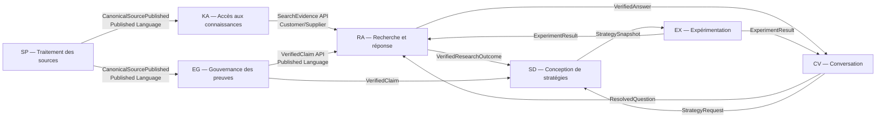
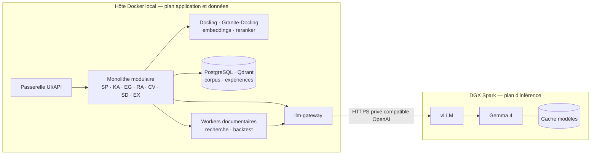
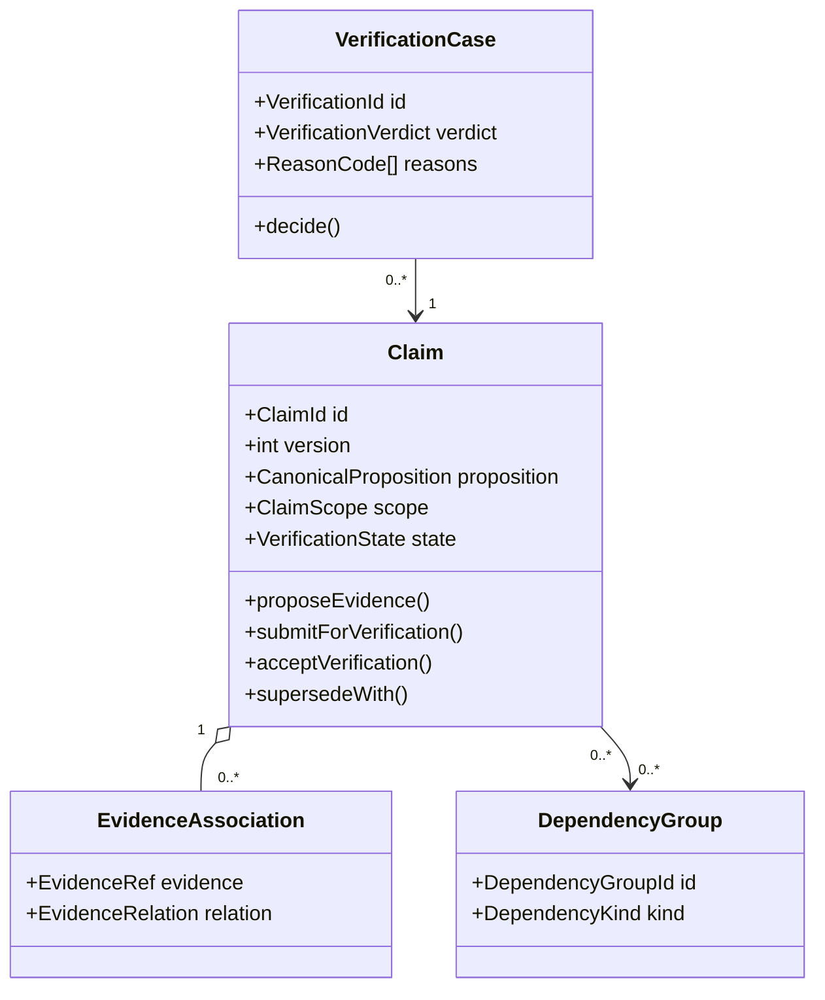
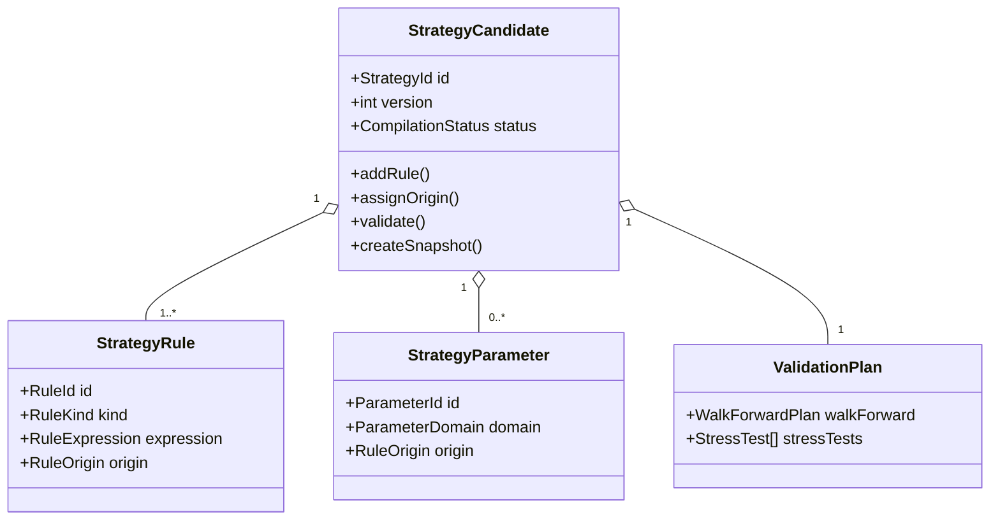
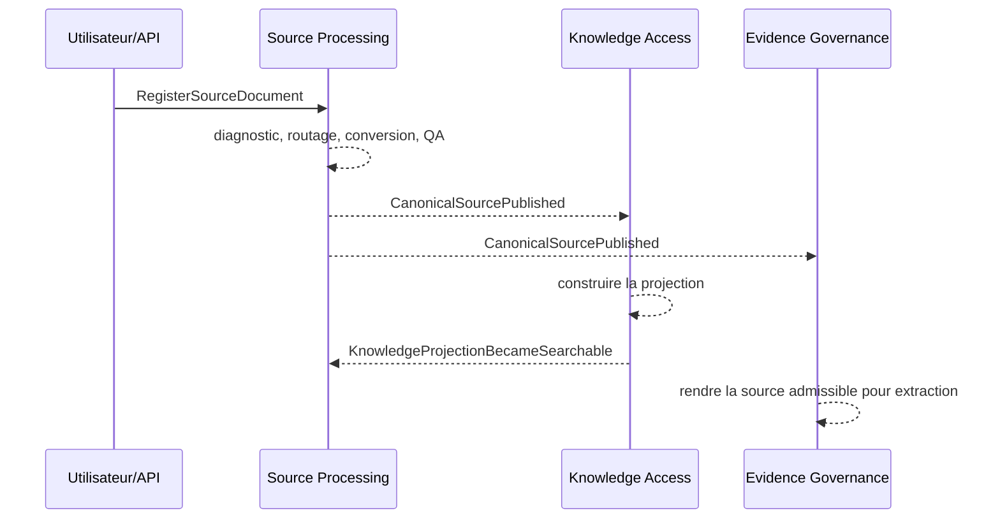
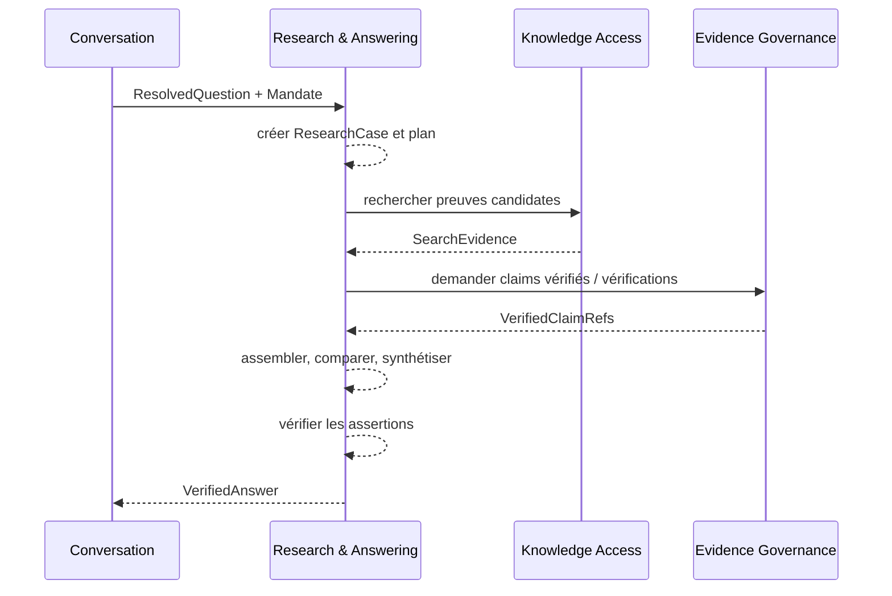
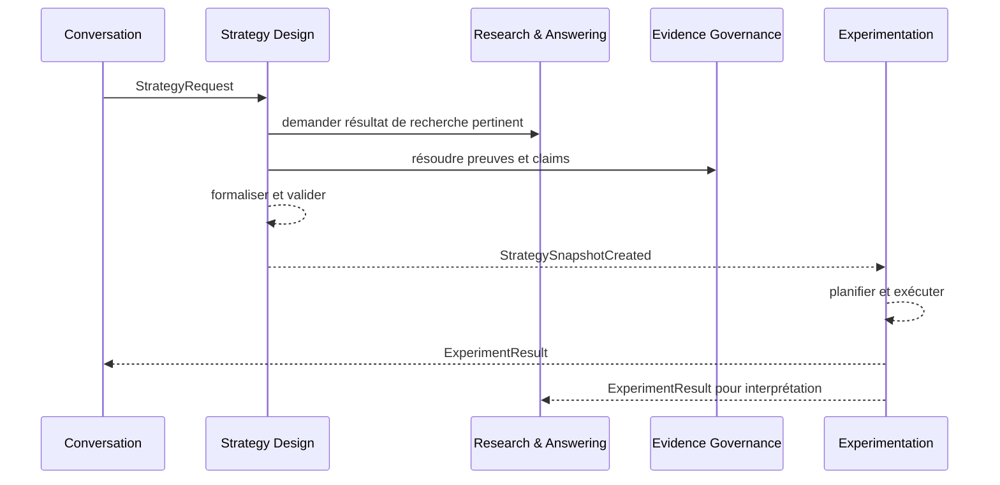
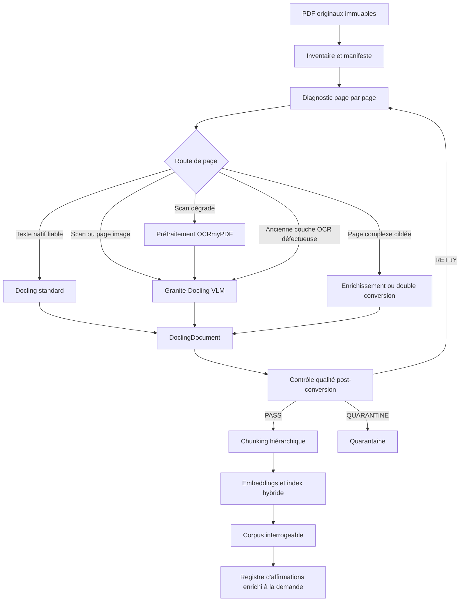
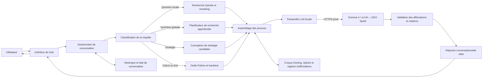
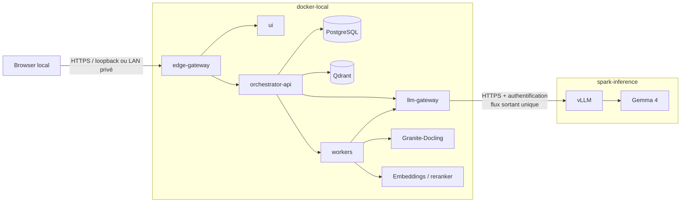

# Spécification unifiée DDD, architecture et implémentation — Chatbot personnel local de recherche quantitative et de conception de stratégies de trading

**Version :** 4.1  
**Date :** 21 juin 2026  
**Statut :** spécification normative unifiée de domaine, d’architecture et d’implémentation  
**Documents fusionnés :** spécification technique 3.1 du 20 juin 2026 et spécification DDD 1.0 du 21 juin 2026  
**Périmètre :** usage strictement personnel, local-first, recherche documentaire financière, synthèse fondée sur les preuves, conception de stratégies candidates et expérimentation quantitative  
**Plateforme cible :** topologie locale à deux hôtes : NVIDIA DGX Spark dédié à Gemma 4 et hôte Docker local dédié à l’application, aux données et aux traitements non-LLM  
**Architecture applicative cible :** monolithe modulaire orienté domaine conteneurisé sur l’hôte Docker local, complété par un service d’inférence Gemma 4 distant sur le réseau privé  
**Corpus principal :** PDF consacrés au trading, à l’investissement, à la finance quantitative et à la gestion du risque

Cette version devient la **source normative unique** du projet. Elle remplace, pour les développements futurs, les deux documents fusionnés tout en conservant leur contenu substantiel. Les références historiques aux versions 3.1 et 1.0 restent utiles pour l’audit, mais aucune exigence nouvelle ne doit être ajoutée uniquement dans ces documents archivés.

**Révision 4.1 :** la plateforme physique est scindée en deux plans. Le DGX Spark héberge exclusivement le service d’inférence Gemma 4 servi par vLLM. L’ensemble du code métier, des services documentaires, des bases, des index, des workers et des moteurs de calcul est exécuté dans des conteneurs Docker sur un hôte local distinct. Le terme « hôte Docker local » désigne, dans cette version, une machine du même réseau privé que le Spark et physiquement distincte de celui-ci.

## Sommaire

| Section | Contenu |
|---:|---|
| 0 | Statut, conventions et gouvernance |
| 1–4 | Vision, sous-domaines, ADR, context map et contrats publiés |
| 5–11 | Modèle de domaine et réalisation technique des sept bounded contexts |
| 12–17 | Processus transverses, architecture, persistance, orchestration, modèles et API |
| 18–20 | Sécurité, observabilité, tests et évaluation |
| 21–24 | Acceptation, migration, anti-patterns et synthèse normative |
| 25 | Références conceptuelles et techniques |

---

# 0. Statut, conventions et gouvernance du document

## Objet

Le présent document réunit dans une même spécification :

- la vision et le langage du domaine ;
- les sous-domaines, bounded contexts et contrats publiés ;
- les agrégats, invariants, politiques, commandes et événements ;
- le pipeline documentaire détaillé ;
- l’architecture distribuée locale entre le DGX Spark d’inférence et l’hôte Docker applicatif, ainsi que Docling, Granite-Docling, vLLM, Qdrant et PostgreSQL ;
- les API, schémas de persistance, configurations, processus d’orchestration et exigences non fonctionnelles ;
- les tests, benchmarks, critères d’acceptation et étapes de migration.

## Règle d’autorité interne

| Nature d’une décision | Partie faisant autorité |
|---|---|
| Sens d’un concept, invariant, transition métier ou propriété d’une donnée | modèle de domaine du bounded context concerné |
| Contrat entre bounded contexts | langage publié et contrat versionné |
| Détail de conversion, indexation, serving, stockage ou déploiement | réalisation technique correspondante |
| Valeur de seuil, modèle ou paramètre expérimental | configuration versionnée et rapport de benchmark |
| Valeur système nécessaire au démarrage ou au pilotage applicatif | fichier de configuration applicative unique, validé au démarrage |
| Conflit transversal | ADR explicite nouvelle ; aucune résolution silencieuse |

Une commodité technique NE DOIT PAS contourner un invariant métier. À l’inverse, le modèle de domaine NE DOIT PAS incorporer inutilement les API propres à Docling, Qdrant, vLLM, FastAPI ou au moteur de backtest.

Les variables d’environnement NE DOIVENT PAS être acceptées comme entrée de configuration applicative. Un processus applicatif DOIT recevoir le chemin explicite du fichier de configuration à charger, puis lire uniquement les valeurs présentes dans ce fichier. Aucun fallback vers `os.environ`, `process.env`, un fichier `.env`, `env_file`, `environment:` Compose ou une valeur système homonyme n’est autorisé.

## Conventions normatives

- **DOIT** : exigence obligatoire ;
- **NE DOIT PAS** : comportement interdit ;
- **DEVRAIT** : recommandation forte dont l’écart doit être justifié ;
- **PEUT** : option autorisée ;
- **invariant** : règle vraie avant et après toute transaction métier valide ;
- **agrégat** : frontière de cohérence transactionnelle possédant une racine ;
- **bounded context** : frontière dans laquelle un modèle et son langage ont un sens précis ;
- **événement de domaine** : fait métier passé, immuable et significatif ;
- **projection** : représentation dérivée, régénérable et non canonique ;
- **artefact canonique** : version acceptée faisant autorité pour les traitements aval ;
- **preuve primaire** : span directement localisable dans un document accepté ;
- **affirmation** : proposition atomique attribuée à une source et vérifiable séparément ;
- **source indépendante** : source ne dépendant pas de la même étude ou origine que les autres confirmations comptabilisées ;
- **route documentaire** : chaîne de traitement choisie pour une page ou un document.

## Non-objectifs architecturaux

L’adoption du DDD NE DOIT PAS être interprétée comme une décision de :

- transformer chaque bounded context en microservice ;
- adopter l’event sourcing pour l’ensemble du système ;
- introduire un bus distribué complexe ;
- multiplier les repositories génériques ;
- encapsuler chaque structure de données dans une classe dépourvue de comportement ;
- abandonner les pipelines scientifiques, notebooks d’évaluation ou traitements batch ;
- déplacer dans le domaine les détails propres à Docling, Qdrant, vLLM ou au moteur de backtest.

## Abréviations des bounded contexts

| Code | Bounded context |
|---|---|
| `SP` | Traitement des sources — *Source Processing* |
| `KA` | Accès aux connaissances — *Knowledge Access* |
| `EG` | Gouvernance des preuves — *Evidence Governance* |
| `RA` | Recherche et réponse — *Research & Answering* |
| `CV` | Conversation |
| `SD` | Conception de stratégies — *Strategy Design* |
| `EX` | Expérimentation |

---

# 1. Vision, nature, finalité et périmètre

## Formulation du problème métier

Le système doit transformer un corpus financier hétérogène en connaissances vérifiables, puis utiliser ces connaissances pour produire :

1. des réponses conversationnelles traçables ;
2. des synthèses multi-sources respectant les conditions et limites des études ;
3. des stratégies candidates dont chaque règle possède une origine explicite ;
4. des protocoles expérimentaux reproductibles ;
5. des résultats conservés, y compris lorsqu’ils sont défavorables.

Le problème central n’est donc pas « discuter avec des PDF ». Il consiste à gouverner une chaîne épistémique complète :

```text
Source documentaire
→ représentation canonique
→ preuve localisable
→ affirmation vérifiée
→ synthèse conditionnelle
→ hypothèse de stratégie
→ expérience reproductible
→ résultat interprétable
```

## Proposition de valeur

Le produit doit permettre à un utilisateur unique de :

- exploiter un corpus documentaire volumineux sans perdre la provenance ;
- distinguer les formulations des auteurs, les déductions du système et les choix de conception ;
- éviter qu’une réponse plausible soit présentée comme une connaissance établie ;
- comparer des résultats seulement lorsqu’ils sont méthodologiquement comparables ;
- transformer une idée documentaire en spécification testable sans inventer silencieusement des paramètres ;
- reproduire chaque expérience à partir de ses entrées, versions et hypothèses.

## Principes directeurs du domaine

### P-01 — La preuve précède l’affirmation publiée

Une affirmation factuelle ne peut pas être présentée comme vérifiée si aucune preuve admissible ne la soutient directement.

### P-02 — Toute preuve doit être localisable

Toute preuve doit permettre de retrouver le PDF, sa version, la page et le fragment source précis.

### P-03 — La portée d’une conclusion ne dépasse pas celle de ses preuves

Les conditions, limites, périodes, univers, coûts, fréquences et métriques d’une source doivent être conservés lors de la canonicalisation d’une affirmation.

### P-04 — La répétition n’est pas l’indépendance

Plusieurs documents reprenant la même étude ne valent pas plusieurs confirmations indépendantes.

### P-05 — La conversation n’est pas une source factuelle

L’historique facilite la continuité du dialogue, mais ne constitue jamais une preuve autonome.

### P-06 — Une règle de stratégie possède toujours une origine

Toute règle ou tout paramètre provient d’une source, d’une déduction, d’un choix de conception, d’une contrainte utilisateur ou d’une calibration explicitement planifiée.

### P-07 — Le calcul est déterministe

Les métriques, signaux, positions et backtests sont calculés par du code déterministe, jamais par estimation mentale du LLM.

### P-08 — Les résultats négatifs font partie de la connaissance

Une expérience défavorable ou échouée ne peut pas être effacée pour améliorer artificiellement l’historique de recherche.

### P-09 — Les modèles probabilistes proposent, le domaine décide

Une sortie de LLM, de VLM, d’OCR, de reranker ou de classificateur est une proposition assortie de provenance ; elle ne modifie l’état métier qu’après application d’une politique de décision explicite.

### P-10 — Les projections sont régénérables

Les chunks, embeddings et index de recherche peuvent être reconstruits. Ils ne sont pas la source de vérité du contenu documentaire.

### P-11 — Les versions sont des données métier

Les versions du document canonique, des règles, des modèles, des prompts, des jeux de données et des politiques participent à l’interprétation des résultats et doivent être conservées.

### P-12 — L’abstention est un résultat valide

Le système doit pouvoir conclure qu’une question est insuffisamment documentée, contradictoire ou dépendante de données actuelles absentes.

## Résultats métier attendus

Le domaine produit cinq catégories de résultats :

| Résultat | Définition | Condition de validité |
|---|---|---|
| `CanonicalSource` | représentation documentaire acceptée et versionnée | contrôle qualité réussi |
| `VerifiedClaim` | affirmation atomique soutenue par une preuve admissible | décision de vérification valide |
| `VerifiedAnswer` | réponse dont les assertions importantes sont supportées ou qualifiées | vérification finale réussie |
| `StrategySnapshot` | spécification immuable d’une stratégie compilable | invariants de stratégie satisfaits |
| `ExperimentResult` | résultat rattaché à des entrées immuables et reproductibles | exécution déterministe enregistrée |

---

## Expérience utilisateur et capacités du produit

Le produit final est un **chatbot personnel spécialisé en trading et en investissement**. L’utilisateur interagit avec lui au moyen d’une interface conversationnelle : il pose une question en langage naturel, poursuit la discussion par des questions de suivi, demande une comparaison, une synthèse, une stratégie candidate ou un backtest, puis reçoit une réponse structurée accompagnée de citations ouvrables.

Ce qui distingue ce chatbot d’un « chat avec PDF » élémentaire n’est pas sa nature — il reste bien un chatbot — mais la profondeur de son moteur interne. Derrière l’interface de dialogue, il orchestre la conversion documentaire, la recherche hybride, la vérification des preuves, l’analyse multi-sources, le registre d’affirmations et, lorsque la demande l’exige, des outils de calcul ou de backtest.

### Expérience utilisateur cible

Le chatbot DOIT permettre à l’utilisateur de :

1. poser des questions libres en français ou en anglais ;
2. poursuivre une conversation en conservant le contexte utile des tours précédents ;
3. choisir ou laisser le système choisir un mode de traitement :
   - réponse documentaire rapide ;
   - recherche approfondie multi-sources ;
   - comparaison de méthodes ou d’auteurs ;
   - conception d’une stratégie candidate ;
   - calcul ou backtest ;
4. consulter, pour chaque affirmation importante, les sources et pages correspondantes ;
5. ouvrir le PDF original à l’emplacement cité ;
6. distinguer immédiatement ce qui provient des sources, ce qui relève d’une déduction du système et ce qui constitue un choix de conception ;
7. demander une reformulation, un approfondissement ou une vérification au sein de la même conversation ;
8. retrouver l’historique de ses conversations et recherches approfondies.

### Capacités du moteur interne

Pour fournir cette expérience conversationnelle, le système doit pouvoir :

1. inventorier une grande bibliothèque de PDF ;
2. convertir chaque document en une représentation structurée et traçable ;
3. retrouver précisément les passages, tableaux, formules et figures pertinents ;
4. répondre à des questions documentaires avec citations vérifiables ;
5. effectuer des synthèses multi-sources couvrant l’ensemble du corpus ;
6. identifier les convergences, contradictions, limites et dépendances entre sources ;
7. transformer les résultats documentaires en stratégies candidates formalisées ;
8. générer et exécuter des protocoles de backtest reproductibles ;
9. distinguer strictement :
   - le contenu des sources ;
   - les déductions du système ;
   - les choix de conception ;
   - les paramètres calibrés ;
   - les notes personnelles ;
10. conserver une chaîne de provenance complète entre toute réponse conversationnelle et le PDF original.

En résumé : **le produit visible est un chatbot ; le système sous-jacent est un assistant de recherche quantitative fondé sur les preuves.**

---

## Hors périmètre initial

La première version ne cherche pas à :

- prendre des décisions de trading autonomes ;
- envoyer des ordres à un courtier ;
- garantir la rentabilité d’une stratégie ;
- considérer une fréquence élevée de citation comme une preuve scientifique ;
- remplacer la validation économétrique par une synthèse linguistique ;
- absorber en temps réel des données de marché non documentaires ;
- entraîner ou fine-tuner un LLM sur toute la bibliothèque ;
- indexer automatiquement un document dont la conversion n’a pas passé le contrôle qualité.

---

# 2. Sous-domaines, langage ubiquitaire et identifiants

## Carte des sous-domaines

### Classification

| Sous-domaine | Classification | Justification |
|---|---|---|
| Gouvernance des preuves | **Core Domain** | différenciation principale : préserver provenance, portée, dépendance et admissibilité |
| Recherche et réponse vérifiée | **Core Domain** | transforme les preuves en réponse utile sans perdre les nuances |
| Conception de stratégies | **Core Domain** | convertit une synthèse en hypothèse formalisée, attribuée et testable |
| Expérimentation quantitative | **Core Domain conditionnel** | central si le moteur expérimental est développé en propre ; supporting si délégué |
| Traitement des sources | **Supporting Domain critique** | indispensable à la qualité, mais largement fondé sur des technologies documentaires externes |
| Accès aux connaissances | **Supporting Domain** | recherche hybride, projections et assemblage de candidats |
| Conversation | **Supporting Domain** | fournit continuité, résolution des références et expérience d’interaction |
| Exécution de jobs | **Generic/Platform** | orchestration technique, reprise, priorités et idempotence |
| Serving de modèles | **Generic/Platform** | vLLM, VLM, embeddings et reranking |
| Persistance et observabilité | **Generic/Platform** | PostgreSQL, Qdrant, logs, métriques et sauvegardes |

### Allocation de l’effort de conception

Le modèle le plus riche DOIT être concentré sur :

1. les affirmations et preuves ;
2. les recherches et réponses ;
3. les règles de stratégie ;
4. les expériences reproductibles.

Les éléments suivants DEVRAIENT rester simples et orientés projection :

- chunks ;
- embeddings ;
- payloads Qdrant ;
- caches ;
- exports Markdown ou HTML ;
- métriques de serving ;
- files d’attente techniques.

---

## Langage ubiquitaire

### Glossaire transversal

| Terme | Définition normative |
|---|---|
| **Document source** | PDF original enregistré, identifié par empreinte et jamais modifié par le pipeline |
| **Version canonique** | représentation structurée d’un document ayant passé les contrôles de qualité et publiée pour les usages aval |
| **Autorité textuelle** | transcription retenue comme faisant foi pour une page donnée |
| **Route de page** | chaîne de traitement choisie pour interpréter une page |
| **Localisateur de source** | objet stable permettant d’ouvrir la version documentaire, la page et l’item précis |
| **Span de preuve** | fragment minimal du document qui soutient, limite ou contredit une affirmation |
| **Affirmation** | proposition atomique, vérifiable séparément et assortie d’une portée explicite |
| **Portée d’affirmation** | ensemble des conditions dans lesquelles l’affirmation prétend être valable |
| **Vérification** | décision structurée comparant une affirmation à une ou plusieurs preuves |
| **Admissibilité** | propriété d’une preuve autorisant son usage pour une décision donnée |
| **Groupe de dépendance** | ensemble de sources dérivant d’une même étude, donnée ou origine intellectuelle |
| **Cas de recherche** | unité de travail répondant à une question autonome sous un mandat explicite |
| **Plan de recherche** | décomposition d’une question en sous-questions et obligations de couverture |
| **Jeu de preuves** | collection versionnée de références de preuve retenues pour une recherche |
| **Assertion de réponse** | proposition factuelle extraite d’un brouillon de réponse et vérifiée séparément |
| **Réponse vérifiée** | réponse finale avec statut de support, citations et limites explicites |
| **Conversation** | continuité interactionnelle regroupant des tours, préférences et références résolues |
| **Question résolue** | reformulation autonome d’un message de suivi, compréhensible sans historique implicite |
| **Stratégie candidate** | hypothèse de stratégie en cours de formalisation, sans prétention de rentabilité |
| **Règle de stratégie** | expression déterministe régissant données, signal, entrée, sortie, sizing, risque ou exécution |
| **Origine de règle** | provenance conceptuelle d’une règle : source, déduction, conception, calibration ou contrainte utilisateur |
| **Stratégie compilable** | stratégie ne comportant aucun manque bloquant et traduisible vers un protocole exécutable |
| **Snapshot de stratégie** | version immuable d’une stratégie transmise à l’expérimentation |
| **Expérience** | exécution planifiée d’un snapshot de stratégie sur un snapshot de données et un modèle de coûts |
| **Résultat d’expérience** | sortie immuable d’une expérience terminée ou échouée |
| **Projection de connaissance** | représentation de lecture régénérable utilisée pour la recherche |
| **Mandat** | contraintes et objectifs définissant le périmètre d’une recherche ou d’une stratégie |

### Termes volontairement contextualisés

Certains mots ne doivent pas être utilisés sans préciser le contexte.

| Mot ambigu | Traitement des sources | Gouvernance des preuves | Recherche et réponse | Stratégie | Expérimentation |
|---|---|---|---|---|---|
| `source` | PDF ou version canonique | origine d’une preuve | document interrogé | origine d’une règle | origine d’une donnée |
| `preuve` | contrôle de fidélité documentaire | span soutenant une affirmation | élément supportant une assertion | justification d’une règle | résultat statistique |
| `validation` | QA documentaire | vérification d’entailment | vérification de réponse | validation de complétude | validation hors échantillon |
| `résultat` | sortie de conversion | verdict de vérification | conclusion synthétique | stratégie compilée | métriques calculées |
| `document` | source et version canonique | contenant d’une preuve | unité de diversification | référence justificative | artefact de rapport |

Les contrats intercontextes doivent utiliser des noms non ambigus : `CanonicalSourceRef`, `EvidenceRef`, `VerificationDecision`, `VerifiedAnswer`, `StrategySnapshot`, `ExperimentResult`.

### Vocabulaire interdit ou déconseillé

Les formulations suivantes NE DOIVENT PAS apparaître dans le modèle métier sans qualification :

- « vérité du LLM » ;
- « confiance » utilisée comme probabilité de vérité sans calibration ;
- « consensus » déduit du nombre brut de documents ;
- « backtest validé » sans protocole précisé ;
- « document indexé donc fiable » ;
- « affirmation prouvée » lorsque le verdict est seulement `PARTIALLY_ENTAILED` ;
- « source indépendante » sans analyse de dépendance ;
- « paramètre optimal » sans périmètre, méthode et correction du data snooping.

### Identifiants de domaine

Les identifiants sont opaques, stables et ne portent pas de signification métier mutable.

```text
DocumentId             DOC-...
ProcessingRunId        PRUN-...
CanonicalSourceId      CSRC-...
CanonicalVersionId     CVER-...
ProjectionId           PROJ-...
ClaimId                CLM-...
VerificationId         VER-...
DependencyGroupId      DEP-...
ResearchCaseId         RSC-...
EvidenceSetId          EVS-...
AnswerId               ANS-...
ConversationId         CONV-...
TurnId                 TURN-...
StrategyId             STRAT-...
StrategyVersionId      SVER-...
ExperimentId           EXP-...
DataSnapshotId         DATA-...
```

Un chemin de fichier, un titre, un hash de prompt ou un identifiant Qdrant NE DOIT PAS être utilisé comme identité métier principale.

---

# 3. Décisions d’architecture consolidées

## ADR techniques

Les décisions ci-dessous sont matérialisées dans le registre ADR du projet : `docs/adr/`.

Toute nouvelle décision structurante DOIT être ajoutée au registre ADR. Une décision acceptée ne doit pas être modifiée silencieusement pour changer son sens : elle doit être remplacée par une nouvelle ADR explicite.

### ADR-001 — Artefacts canoniques

Pour chaque document, les artefacts faisant autorité sont :

```text
PDF original immuable
+
DoclingDocument sérialisé en JSON
```

Le PDF original reste la référence éditoriale et visuelle. Le `DoclingDocument` constitue la représentation structurée utilisée pour le chunking, l’indexation et la provenance. Docling représente notamment le texte, les tableaux, les images, la hiérarchie, les coordonnées et la provenance des éléments.[^docling-document]

Les exports Markdown, HTML, texte ou images sont des artefacts dérivés et régénérables.

### ADR-002 — Routage hybride Docling

Le pipeline documentaire DOIT employer deux modes principaux :

```text
PDF numérique avec texte natif fiable
→ pipeline Docling standard

Page image, scan ou structure visuelle nécessitant une conversion end-to-end
→ pipeline VLM Docling avec Granite-Docling
```

Granite-Docling produit des `DocTags` représentant le contenu et la structure, ensuite intégrés au `DoclingDocument`. Il est optimisé pour les écritures latines et propose un support précoce du japonais, du chinois et de l’arabe.[^granite-docling][^granite-languages]

### ADR-003 — OCRmyPDF est conditionnel

OCRmyPDF NE DOIT PAS être appliqué à tous les PDF.

Il intervient uniquement comme outil de correction physique des scans lorsque nécessaire :

- rotation ;
- redressement ;
- préparation d’une image très dégradée ;
- nettoyage prudent ;
- réparation exceptionnelle d’une couche OCR.

Sa sortie n’est pas le format final du système. Le format final reste le `DoclingDocument`.

### ADR-004 — Autorité textuelle unique par page

Chaque page DOIT avoir une seule autorité textuelle :

- texte natif du PDF ;
- sortie Granite-Docling ;
- sortie d’un OCR amont explicitement retenu.

Le système NE DOIT PAS fusionner silencieusement plusieurs transcriptions concurrentes.

### ADR-005 — Recherche hybride

La recherche DOIT combiner :

- recherche dense sémantique ;
- recherche sparse ou BM25 ;
- filtres de métadonnées ;
- reranking ;
- diversification par document et auteur ;
- expansion vers les fragments parents.

Qdrant permet la fusion dense/sparse, notamment par RRF ou DBSF, ainsi que des requêtes multi-étapes.[^qdrant-hybrid]

### ADR-006 — Registre d’affirmations séparé de l’index documentaire

L’index vectoriel stocke des fragments documentaires. Le registre d’affirmations stocke des propositions structurées, leurs preuves, leurs conditions, leurs limites et leurs relations.

Le registre ne remplace pas les passages sources ; il sert de couche d’analyse et d’audit.

### ADR-007 — Topologie physique locale à deux plans

La plateforme cible est constituée de deux hôtes physiquement distincts placés sur le même réseau privé :

```text
Hôte `spark-inference`
└── DGX Spark
    └── Gemma 4 servi par vLLM

Hôte `docker-local`
└── Docker Engine / Docker Compose
    ├── application métier modulaire
    ├── interface et API
    ├── passerelle LLM
    ├── Docling et Granite-Docling
    ├── embeddings et reranking
    ├── PostgreSQL et Qdrant
    ├── workers documentaires et de recherche
    └── moteur de backtest
```

Le DGX Spark cible dispose d’une architecture Grace Blackwell, de 128 Go de mémoire unifiée et peut être utilisé comme appliance d’inférence accessible depuis un autre ordinateur du réseau local.[^dgx-hardware][^dgx-network-access]

Les responsabilités sont normatives :

- `spark-inference` DOIT exécuter Gemma 4 et son runtime vLLM ;
- `docker-local` DOIT exécuter tout le code métier, tous les adaptateurs non-LLM et tous les stockages ;
- PostgreSQL, Qdrant, le corpus, les artefacts Docling, les expériences et les sauvegardes NE DOIVENT PAS résider sur le Spark ;
- le Spark NE DOIT PAS être utilisé comme worker documentaire, serveur Qdrant, base PostgreSQL ou moteur de backtest ;
- aucun montage de volume partagé du corpus vers le Spark n’est requis ni autorisé par défaut ;
- une variante mono-hôte peut être utilisée pour le développement, mais elle n’est pas la topologie d’acceptation de la V1.

### ADR-008 — Gemma 4 servi par vLLM sur le DGX Spark

Le moteur d’inférence principal est **vLLM**, exécuté sur le DGX Spark et exposant une API compatible OpenAI. La documentation NVIDIA pour DGX Spark prévoit un conteneur vLLM spécifique à la famille Gemma 4 ; ce conteneur est géré sur le Spark indépendamment du projet Docker Compose local.[^spark-vllm][^vllm-online-serving]

Le contrat réseau du LLM est :

```text
LocalLanguageModelGateway
→ HTTPS privé
→ API vLLM compatible OpenAI sur `spark-inference`
→ Gemma 4
```

Règles obligatoires :

- seul l’adaptateur local `LocalLanguageModelGateway` ou le service conteneurisé `llm-gateway` PEUT appeler vLLM ;
- le navigateur, l’interface de chat, les workers et les bounded contexts NE DOIVENT PAS appeler directement le Spark ;
- Gemma PEUT émettre des appels d’outils structurés, mais l’exécution des outils reste exclusivement sur `docker-local` ;
- le Spark NE DOIT PAS initier de callback vers Qdrant, PostgreSQL, les workers ou les moteurs de calcul ;
- les appels sont de type requête-réponse et transportent seulement le contexte minimal nécessaire ;
- l’indisponibilité du Spark produit un état explicite `LLM_UNAVAILABLE` ; aucun basculement silencieux vers un autre modèle n’est autorisé par défaut.

vLLM prend en charge les sorties structurées, les appels d’outils, une API compatible OpenAI, les clés d’API et TLS.[^vllm-tools][^vllm-serve][^vllm-security] La clé d’API NE DOIT toutefois PAS être considérée comme l’unique barrière de sécurité : le filtrage réseau du Spark reste obligatoire, certains endpoints du serveur pouvant ne pas relever du même contrôle d’authentification.[^vllm-security]

#### Modèles à benchmarker

| Statut | Modèle | Rôle |
|---|---|---|
| Référence recommandée | `nvidia/Gemma-4-31B-IT-NVFP4` | modèle principal sur le DGX Spark |
| Candidat comparatif | `YCWTG/gemma-4-31B-it-NVFP4A16-GPTQ` | checkpoint communautaire à accepter seulement après benchmark métier |
| Référence qualitative supplémentaire | `google/gemma-4-31B-it-qat-w4a16-ct` | quantification QAT W4A16 officielle Google |

Le checkpoint communautaire reste un candidat expérimental tant qu’il n’a pas démontré une fidélité égale ou supérieure sur le corpus réel.

### ADR-009 — Le Spark est sans état métier

Le Spark conserve uniquement :

- le cache des poids et tokenizers Gemma ;
- la configuration du runtime ;
- les certificats et secrets nécessaires au serving ;
- des métriques et journaux techniques à rétention courte.

Il NE DOIT PAS conserver :

- le corpus documentaire ;
- les prompts ou réponses complets dans des logs persistants ;
- les conversations ;
- les claims ;
- les stratégies ;
- les jeux de données et résultats expérimentaux ;
- les secrets des autres services.

Toute donnée métier durable demeure la propriété de `docker-local`. Le cache de modèle du Spark est régénérable et n’entre pas dans le périmètre des sauvegardes métier.

### ADR-016 — Configuration applicative par fichier unique

Tout processus applicatif DOIT charger sa configuration depuis un fichier unique déclaré explicitement au lancement. Les clés qui pilotent la base, Qdrant, le gateway LLM, Spark, les modèles, les timeouts, les ports, les chemins métier, les profils de charge, la sécurité et la provenance modèle DOIVENT être présentes dans ce fichier.

Les variables d’environnement NE DOIVENT PAS être acceptées comme entrée de processus pour piloter l’application. La présence d’une variable d’environnement reprenant une clé applicative connue DOIT produire une erreur explicite de configuration au lieu d’être ignorée silencieusement ou utilisée comme fallback.

Les secrets restent des fichiers ou stores secrets référencés par chemin depuis la configuration; leur contenu ne devient pas une variable d’environnement applicative.

---

## ADR DDD structurantes

### DDD-ADR-001 — Monolithe modulaire

La V1 utilise un monolithe modulaire. Les bounded contexts sont des frontières de modèle et de propriété, non des microservices imposés.

### DDD-ADR-002 — Cycles de vie séparés

La machine globale documentaire est remplacée par des cycles de vie distincts pour :

- traitement de source ;
- projection de connaissance ;
- affirmation ;
- recherche ;
- stratégie ;
- expérience.

### DDD-ADR-003 — `SourceLocator` comme langage publié

La traçabilité documentaire intercontexte repose sur un contrat versionné `SourceLocator`.

### DDD-ADR-004 — Qdrant est une projection

Qdrant ne constitue ni la source documentaire canonique ni le registre d’affirmations.

### DDD-ADR-005 — `Claim` est un agrégat central

La transition vers `VERIFIED` est protégée par des invariants et une décision indépendante.

### DDD-ADR-006 — Pas d’event sourcing généralisé

Le système utilise état courant, audit, outbox et artefacts immuables.

### DDD-ADR-007 — Les modèles proposent

Aucune sortie probabiliste ne change seule un état métier protégé.

### DDD-ADR-008 — Cohérence éventuelle entre contextes

Les événements synchronisent les contextes ; les invariants forts restent locaux à un agrégat.

### DDD-ADR-009 — Snapshots immuables pour l’expérimentation

`EX` n’accède jamais à une stratégie mutable ; il reçoit un snapshot complet et hashé.

### DDD-ADR-010 — Conservation des versions négatives et supersédées

Les claims rejetés, réponses supersédées, stratégies invalides et expériences défavorables sont conservés selon leur politique de rétention.

---

# 4. Bounded contexts, context map et langage publié

## Carte des bounded contexts

### Vue d’ensemble

| Code | Bounded context | Responsabilité exclusive |
|---|---|---|
| `SP` | **Traitement des sources** (`Source Processing`) | enregistrer, diagnostiquer, convertir, contrôler et publier les versions documentaires canoniques |
| `KA` | **Accès aux connaissances** (`Knowledge Access`) | construire les projections de recherche et retourner des preuves candidates traçables |
| `EG` | **Gouvernance des preuves** (`Evidence Governance`) | créer, vérifier, relier et versionner les affirmations et leurs preuves |
| `RA` | **Recherche et réponse** (`Research & Answering`) | planifier une recherche, assembler les preuves, analyser les contradictions et produire une réponse vérifiée |
| `CV` | **Conversation** (`Conversation`) | conserver la continuité du dialogue et résoudre les références de suivi |
| `SD` | **Conception de stratégies** (`Strategy Design`) | formaliser et compiler des stratégies candidates attribuées |
| `EX` | **Expérimentation** (`Experimentation`) | exécuter des protocoles reproductibles et conserver tous les résultats |

Les services vLLM, Docling, Qdrant, PostgreSQL et le moteur de calcul sont des **adaptateurs de plateforme** ; ils ne définissent pas les frontières métier.

### Context map



### Relations entre contextes

#### SP → KA : Published Language

`SP` publie une référence immuable de source canonique. `KA` ne lit pas directement les tables internes de `SP`.

#### SP → EG : Published Language

`EG` ne peut créer une preuve admissible que sur une version canonique acceptée et publiée par `SP`.

#### KA → RA : Customer/Supplier

`RA` définit les besoins de recherche ; `KA` fournit une API de recherche indépendante de Qdrant et de l’algorithme précis de fusion.

#### EG → RA : Published Language

`RA` consomme des affirmations vérifiées sans dépendre du modèle interne de revue de `EG`.

#### RA → SD : Anti-Corruption Layer

Une conclusion de recherche n’est pas directement une règle de stratégie. `SD` traduit les éléments documentaires dans son propre langage : règle, origine, contrainte, paramètre, compatibilité et lacune.

#### SD → EX : Published Language immuable

`EX` reçoit un `StrategySnapshot` complet et immuable. Il ne lit pas l’état mutable de la stratégie candidate.

#### CV → RA/SD/EX : façade applicative

`CV` coordonne l’expérience utilisateur, mais ne possède ni les preuves, ni les stratégies, ni les expériences.

### Frontières logiques et physiques

Un bounded context est une frontière de modèle et de propriété, pas nécessairement un processus réseau. Les sept bounded contexts restent regroupés dans le monolithe modulaire conteneurisé sur `docker-local`.



La frontière physique est volontairement différente des frontières DDD :

- tous les contextes métier sont déployés sur `docker-local` ;
- le Spark expose une capacité technique unique, `LanguageModelInference` ;
- l’adaptateur anti-corruption `LocalLanguageModelGateway` masque la localisation distante et le protocole vLLM ;
- aucune base de données n’est partagée avec le Spark ;
- aucun contexte métier n’est extrait en microservice du seul fait de cette séparation matérielle.

L’extraction ultérieure d’un contexte en service autonome n’est autorisée que si un besoin concret le justifie : isolation de charge, disponibilité différente, sécurité, rythme de changement ou propriété organisationnelle distincte.

---

## Contrats et langage publié

### Règles générales

Tout contrat intercontexte DOIT :

- être versionné ;
- employer des identifiants de domaine ;
- contenir les références minimales nécessaires ;
- éviter d’exposer les tables ou classes internes du producteur ;
- être sérialisable sans dépendance à un framework ;
- préciser les versions d’artefacts et politiques pertinentes ;
- rester compatible en lecture pendant la durée de rétention convenue.

### Relations intercontextes publiées

| Relation | Producteur | Consommateur | Contrat publié | Statut M-001 | Type | Modèle interne interdit |
|---|---|---|---|---|---|---|
| SP -> KA | SP | KA | CanonicalSourcePublished | Livré | Published Language | tables, agrégats, diagnostics et chemins internes SP |
| SP -> EG | SP | EG | CanonicalSourcePublished | Livré | Published Language | tables, agrégats, diagnostics et chemins internes SP |
| KA -> RA | KA | RA | SearchEvidence API | Réservé | Customer/Supplier | Qdrant, embeddings, scores bruts et logique de fusion KA |
| EG -> RA | EG | RA | VerifiedClaimRef | Livré | Published Language | graphe de claims, cas de vérification et états internes EG |
| EG -> SD | EG | SD | VerifiedClaimRef | Livré | Published Language | graphe de claims, cas de vérification et états internes EG |
| RA -> SD | RA | SD | VerifiedResearchOutcome | Livré | Anti-Corruption Layer | brouillons de réponse, jeux de preuves et états de recherche RA |
| SD -> EX | SD | EX | StrategySnapshot | Livré | Published Language immuable | stratégie candidate mutable, paramètres ouverts et règles internes SD |
| EX -> RA | EX | RA | ExperimentResult | Livré | Published Language | registre d'expérience, diagnostics et artefacts internes EX |
| EX -> CV | EX | CV | ExperimentResult | Livré | Published Language | registre d'expérience, diagnostics et artefacts internes EX |
| CV -> RA | CV | RA | ResolvedQuestion | Réservé | façade applicative | historique conversationnel, tours et snapshots internes CV |
| CV -> SD | CV | SD | StrategyRequest | Réservé | façade applicative | historique conversationnel, préférences et tours internes CV |
| CV -> EX | EX | CV | GetExperiment | Réservé | façade applicative | registre d'expérience, diagnostics et artefacts internes EX |

### `CanonicalSourceRef`

```json
{
  "schema_version": "1.0",
  "canonical_source_id": "CSRC-000001",
  "document_id": "DOC-000001",
  "canonical_version_id": "CVER-000004",
  "source_sha256": "...",
  "canonical_artifact_sha256": "...",
  "page_count": 412,
  "accepted_at": "2026-06-21T08:30:00Z",
  "quality_policy_version": "source-qa-v3"
}
```

### `SourceLocator`

```json
{
  "schema_version": "1.0",
  "canonical_version_id": "CVER-000004",
  "document_id": "DOC-000001",
  "page_pdf": 37,
  "item_id": "DOC-000001-P037-I004",
  "bbox": [0.10, 0.20, 0.85, 0.42],
  "content_hash": "..."
}
```

#### Invariants

- `page_pdf` doit appartenir à la version canonique ;
- `item_id` doit être résolvable ;
- le `content_hash` doit permettre de détecter une citation devenue incohérente ;
- un localisateur ne peut pas pointer vers une version en quarantaine ou retirée sans avertissement explicite.

### `EvidenceRef`

```json
{
  "schema_version": "1.0",
  "evidence_id": "EVD-001204",
  "source_locator": {
    "canonical_version_id": "CVER-000004",
    "document_id": "DOC-000001",
    "page_pdf": 37,
    "item_id": "DOC-000001-P037-I004",
    "content_hash": "..."
  },
  "relation": "SUPPORTS_DIRECTLY",
  "quoted_span_hash": "..."
}
```

### `VerifiedClaimRef`

```json
{
  "schema_version": "1.0",
  "claim_id": "CLM-004812",
  "claim_version": 3,
  "canonical_text": "...",
  "scope": {
    "universe": ["futures"],
    "frequency": "daily",
    "sample_period": "1985-2018",
    "transaction_costs_included": true
  },
  "status": "VERIFIED",
  "verification_id": "VER-002991",
  "evidence_refs": ["EVD-001204"],
  "dependency_group_ids": ["DEP-000123"]
}
```

### `VerifiedResearchOutcome`

```json
{
  "schema_version": "1.0",
  "research_case_id": "RSC-000055",
  "question": "...",
  "mandate": {},
  "answer_id": "ANS-000055",
  "support_status": "SUPPORTED",
  "claim_refs": ["CLM-004812@3"],
  "unresolved_conflicts": [],
  "knowledge_gaps": [],
  "completed_at": "2026-06-21T09:30:00Z"
}
```

### `StrategySnapshot`

```json
{
  "schema_version": "1.0",
  "strategy_id": "STRAT-000017",
  "strategy_version_id": "SVER-000006",
  "spec_hash": "...",
  "status": "COMPILABLE",
  "rules": [],
  "parameters": [],
  "constraints": [],
  "data_requirements": [],
  "validation_plan": {},
  "evidence_refs": [],
  "created_at": "2026-06-21T10:00:00Z"
}
```

### `ExperimentResult`

```json
{
  "schema_version": "1.0",
  "experiment_id": "EXP-000123",
  "strategy_version_id": "SVER-000006",
  "data_snapshot_id": "DATA-000044",
  "code_version": "git:...",
  "status": "COMPLETED",
  "metrics": {},
  "diagnostics": {},
  "artifacts": [],
  "started_at": "...",
  "completed_at": "..."
}
```

### Enveloppe d’événement

```json
{
  "event_id": "EVT-...",
  "event_type": "CanonicalSourcePublished",
  "event_version": 1,
  "occurred_at": "2026-06-21T08:30:00Z",
  "aggregate_type": "CanonicalSource",
  "aggregate_id": "CSRC-000001",
  "aggregate_version": 4,
  "correlation_id": "CORR-...",
  "causation_id": "CMD-...",
  "producer_context": "SP",
  "payload": {}
}
```

Les événements sont nommés au passé. Un job demandé n’est pas un événement de domaine.

---

# 5. Bounded context SP — Traitement des sources

## Mission

`SP` transforme un PDF original immuable en une version canonique structurée, traçable et acceptée. Il possède les décisions de diagnostic, de routage, d’autorité textuelle et de qualité documentaire.

`SP` ne possède pas :

- les chunks de recherche ;
- les embeddings ;
- les affirmations ;
- les réponses ;
- les stratégies ;
- les expériences.

## Modèle tactique

### Agrégat `SourceDocument`

Responsabilités :

- attribuer une identité stable au PDF ;
- conserver l’empreinte et la localisation de l’original ;
- enregistrer les métadonnées bibliographiques validées ;
- suivre la version canonique actuellement publiée ;
- empêcher toute mutation de l’original ;
- décider de l’archivage logique du document.

État minimal :

```text
DocumentId
OriginalSourceFingerprint
OriginalStorageRef
BibliographicMetadata
RegistrationStatus
CurrentCanonicalVersionId?
AggregateVersion
```

Comportements principaux :

```text
registerOriginal()
recordBibliographicMetadata()
attachAcceptedCanonicalVersion()
retireCanonicalVersion()
archiveDocument()
```

### Agrégat `DocumentProcessingRun`

Une tentative de traitement est distincte du document. Elle conserve :

- les versions du code et des modèles ;
- le plan de diagnostic ;
- les décisions page par page ;
- les artefacts intermédiaires ;
- les rapports de contrôle ;
- la décision finale.

Une nouvelle tentative crée un nouvel agrégat ; elle ne réécrit pas l’historique d’une tentative passée.

### Agrégat `CanonicalSource`

Une version canonique acceptée est immuable. Elle possède :

```text
CanonicalSourceId
CanonicalVersionId
DocumentId
CanonicalArtifactRef
PageManifest
TextAuthorityManifest
QualityDecision
AcceptedAt
```

Une correction produit une nouvelle version canonique. Elle ne modifie pas rétroactivement la version précédente.

### Entités

- `PageDecision` : décision de route et d’autorité pour une page ;
- `QualityFinding` : anomalie ou avertissement identifié ;
- `ArtifactReference` : référence à un artefact produit par une tentative.

### Objets-valeur

- `SourceFingerprint` ;
- `PageNumber` ;
- `PageRoute` ;
- `TextAuthority` ;
- `BoundingBox` ;
- `QualityScore` ;
- `QualityDecision` ;
- `ModelVersion` ;
- `ConfigurationHash` ;
- `ArtifactHash`.

## Machine d’états

### Cycle de vie du document

```text
REGISTERED
→ PROCESSING
→ CANONICAL_AVAILABLE
→ ARCHIVED
```

`PROCESSING` est une vue agrégée : le détail appartient aux `DocumentProcessingRun`.

### Cycle de vie d’une tentative

```text
CREATED
→ DIAGNOSED
→ ROUTED
→ CONVERTED
→ QUALITY_EVALUATED
→ ACCEPTED
              ↘ REJECTED
              ↘ QUARANTINED
              ↘ FAILED
```

Une tentative `FAILED` ou `REJECTED` ne repasse pas à `CREATED`. Une nouvelle tentative est créée.

## Invariants

1. Le PDF original enregistré NE DOIT PAS être modifié par le système.
2. Deux empreintes binaires identiques PEUVENT référencer un même original logique ; deux éditions différentes NE DOIVENT PAS être fusionnées automatiquement.
3. Chaque page d’une version canonique DOIT posséder exactement une autorité textuelle.
4. Chaque page du PDF DOIT être représentée dans le manifeste, y compris lorsqu’elle est vide ou rejetée.
5. Une version canonique ne peut être publiée que si le nombre de pages concorde avec la source.
6. Tout item canonique DOIT posséder un localisateur vers la page originale.
7. Une décision d’adjudication DOIT conserver les sorties concurrentes et sa justification.
8. Une version en quarantaine NE DOIT PAS être publiée.
9. Une version canonique publiée est immuable.
10. Les seuils techniques peuvent évoluer, mais la décision doit enregistrer la version de la politique appliquée.

## Politiques de domaine

- `PageRoutingPolicy` : choisit une route à partir de diagnostics ;
- `TextAuthoritySelectionPolicy` : sélectionne l’autorité d’une page ;
- `CanonicalAcceptancePolicy` : décide si une conversion peut devenir canonique ;
- `DuplicateEditionPolicy` : distingue copie, quasi-doublon et nouvelle édition ;
- `CriticalPageSamplingPolicy` : choisit les pages soumises à contrôle renforcé.

Ces politiques reçoivent des résultats techniques, mais produisent des décisions métier explicites.

## Commandes

```text
RegisterSourceDocument
StartDocumentProcessing
RecordPageDiagnostics
ApproveRoutePlan
RecordPageConversion
SubmitForQualityEvaluation
AcceptCanonicalSource
RejectProcessingRun
QuarantineProcessingRun
PublishCanonicalSource
ArchiveSourceDocument
```

## Événements de domaine

```text
SourceDocumentRegistered
DocumentProcessingStarted
PageRouteDecided
PageTextAuthoritySelected
DocumentConversionCompleted
CanonicalSourceAccepted
CanonicalSourceRejected
CanonicalSourceQuarantined
CanonicalSourcePublished
CanonicalSourceSuperseded
SourceDocumentArchived
```

## Services applicatifs

- `RegisterSourceDocumentHandler` ;
- `ProcessDocumentHandler` ;
- `EvaluateCanonicalSourceHandler` ;
- `PublishCanonicalSourceHandler` ;
- `ResolveDocumentCitationQuery`.

Le service applicatif orchestre Docling, Granite-Docling, OCRmyPDF et le stockage d’artefacts par l’intermédiaire de ports. Le domaine ne dépend pas de ces outils.

## Ports

```text
OriginalSourceStore
DocumentInspector
PageRenderer
DocumentConverter
PhysicalScanPreprocessor
CanonicalArtifactStore
QualityEvidenceProvider
SourceDocumentRepository
ProcessingRunRepository
CanonicalSourceRepository
DomainEventPublisher
```

## Projections de lecture

- catalogue documentaire ;
- statut opérationnel d’un document ;
- rapport de pages et routes ;
- versions canoniques disponibles ;
- pages en avertissement ;
- comparaison visuelle source/canonique.

## Scénarios d’acceptation

```gherkin
Scénario: une page possède une seule autorité textuelle
  Étant donné une page avec une sortie native et une sortie Granite
  Lorsque l'adjudication est terminée
  Alors une seule sortie est déclarée autorité textuelle
  Et les deux sorties restent conservées comme artefacts d'audit
  Et la justification de la décision est enregistrée
```

```gherkin
Scénario: une version en quarantaine ne peut pas être publiée
  Étant donné une tentative de traitement au statut QUARANTINED
  Lorsque la publication canonique est demandée
  Alors la commande est refusée
  Et aucun événement CanonicalSourcePublished n'est émis
```

```gherkin
Scénario: une correction crée une nouvelle version
  Étant donné une version canonique CVER-000004 déjà publiée
  Lorsque la correction d'une page est acceptée
  Alors une nouvelle version canonique est créée
  Et CVER-000004 reste immuable et résolvable
```

---

## Réalisation technique détaillée

La séquence globale présentée ci-dessous est une **projection opérationnelle** destinée au pilotage du pipeline. Elle NE constitue PAS un agrégat unique et ne remplace pas les cycles de vie séparés de `SourceDocument`, `DocumentProcessingRun` et `CanonicalSource`.


### Vue opérationnelle consolidée du cycle de traitement

```text
DISCOVERED
→ INVENTORIED
→ DIAGNOSED
→ ROUTED
→ PREPARED              [optionnel]
→ PRE_QA_PASSED
→ CONVERTED
→ POST_QA_PASSED
→ CHUNKED
→ INDEXED
→ AVAILABLE
```

États d’échec :

```text
RETRY_PENDING
MANUAL_REVIEW
QUARANTINED
FAILED_PERMANENTLY
```

Toute transition DOIT être journalisée avec :

- horodatage ;
- version du code ;
- version des modèles ;
- configuration ;
- identifiant du job ;
- raison de la transition.

---

### Phase 0 — Ingestion et inventaire

#### Déclenchement

L’ingestion peut être déclenchée par :

- dépôt manuel dans `corpus/raw/` ;
- appel API ;
- commande CLI ;
- scan périodique local.

#### Tâches

1. vérifier que le fichier est lisible ;
2. calculer son SHA-256 ;
3. détecter les doublons binaires ;
4. extraire les métadonnées PDF ;
5. identifier les quasi-doublons textuels après conversion pilote ;
6. attribuer un `document_id` stable ;
7. rendre l’original non modifiable par le pipeline ;
8. enregistrer la date d’ajout et la source locale.

#### Règles

- Deux éditions différentes NE DOIVENT PAS être fusionnées automatiquement.
- Une copie binaire exacte PEUT être dédupliquée logiquement.
- Un PDF chiffré ou corrompu passe en `MANUAL_REVIEW`.

---

### Phase 1 — Diagnostic page par page

#### Objectif

Classer chaque page afin de choisir la chaîne minimale capable de produire une représentation fidèle.

#### Signaux à mesurer

##### Texte natif

- nombre de caractères ;
- proportion de caractères imprimables ;
- proportion de caractères de contrôle ;
- densité textuelle ;
- détection de texte dupliqué ;
- ordre de lecture approximatif ;
- cohérence de langue ;
- présence de glyphes non mappés ;
- alignement texte/image lorsque mesurable.

##### Image

- couverture image de la page ;
- résolution effective ;
- orientation ;
- inclinaison ;
- contraste ;
- bruit ;
- flou ;
- marges irrégulières ;
- pages inversées ou photographiées.

##### Structure

- nombre de colonnes ;
- présence de tableaux ;
- présence de formules ;
- présence de figures ;
- notes de bas de page ;
- petits caractères ;
- encadrés ;
- pages mixtes texte natif/image.

#### États de page

```text
NATIVE_OK
NATIVE_SUSPECT
SCAN_CLEAN
SCAN_DEGRADED
OCR_BAD
MIXED_CONTENT
COMPLEX_VISUAL
UNSUPPORTED_OR_CORRUPT
```

#### Agrégation au niveau du document

Le routeur doit produire :

- distribution des états ;
- route dominante ;
- exceptions par page ;
- score de confiance ;
- liste des pages critiques ;
- échantillon de pages à contrôler ;
- décision `AUTO`, `BENCHMARK` ou `MANUAL_REVIEW`.

---

### Phase 2 — Routage du document

#### Route R1 — `NATIVE_STANDARD`

##### Conditions

- texte natif fiable ;
- ordre de lecture acceptable ;
- faible taux de glyphes incohérents ;
- page non dominée par une image scannée.

##### Pipeline

```text
PDF original
→ Docling standard
→ OCR désactivé
→ layout et tables activés selon profil
→ DoclingDocument
```

##### Autorité textuelle

```text
texte natif du PDF
```

#### Route R2 — `SCAN_GRANITE`

##### Conditions

- page image propre ;
- écriture latine ou langue expérimentale acceptée ;
- qualité visuelle suffisante ;
- absence de couche textuelle fiable.

##### Pipeline

```text
rendu de page
→ VlmPipeline Docling
→ Granite-Docling
→ DocTags
→ DoclingDocument
```

##### Autorité textuelle

```text
Granite-Docling
```

#### Route R3 — `PREPROCESS_GRANITE`

##### Conditions

- scan incliné ;
- mauvaise orientation ;
- contraste ou bruit problématique ;
- conversion Granite directe inférieure au seuil de qualité.

##### Pipeline

```text
PDF original
→ prétraitement physique OCRmyPDF
→ rendu de page préparé
→ Granite-Docling
→ DoclingDocument
```

Le prétraitement DEVRAIT éviter de créer une couche OCR faisant autorité. Les paramètres exacts sont versionnés et validés visuellement.

#### Route R4 — `BAD_OCR_TO_GRANITE`

##### Conditions

- couche OCR existante mais incohérente ;
- texte dupliqué ;
- mauvais encodage ;
- désalignement important ;
- langue OCR incorrecte.

##### Pipeline privilégié

```text
PDF original
→ ignorer la couche OCR
→ rendre la page en image
→ Granite-Docling
→ DoclingDocument
```

##### Alternative

Une nouvelle couche OCR amont peut être testée sur un benchmark contrôlé, mais elle ne devient autorité que si elle surpasse Granite-Docling sur les métriques métier.

#### Route R5 — `MIXED_PAGEWISE`

##### Conditions

Le document contient plusieurs types de pages.

##### Pipeline

```text
page native → Docling standard
page scannée → Granite-Docling
page dégradée → prétraitement + Granite-Docling
page complexe → route ciblée
→ fusion dans un DoclingDocument unique
```

##### Exigences de fusion

- conserver le numéro de page PDF original ;
- maintenir des identifiants d’items uniques ;
- conserver l’autorité textuelle par page ;
- ne pas réordonner les pages ;
- signaler toute page manquante ;
- conserver le lien vers le PDF original.

#### Route R6 — `TARGETED_ENRICHMENT`

##### Conditions

- texte natif correct mais formule/tableau/figure mal extrait ;
- nécessité d’un second avis visuel ;
- page critique pour une preuve quantitative.

##### Pipeline

```text
Docling standard pour la page
+
Granite-Docling ciblé sur une région ou une page
→ adjudication
→ conservation des deux sorties et de la décision
```

Docling propose des enrichissements dédiés, y compris pour le code et les formules, qui peuvent exploiter Granite-Docling.[^docling-enrichment]

#### Table de décision

| État | Route par défaut | Prétraitement | Autorité |
|---|---|---|---|
| `NATIVE_OK` | R1 | non | texte natif |
| `NATIVE_SUSPECT` | benchmark R1/R2 | non | résultat gagnant |
| `SCAN_CLEAN` | R2 | non | Granite-Docling |
| `SCAN_DEGRADED` | R3 | oui | Granite-Docling |
| `OCR_BAD` | R4 | non par défaut | Granite-Docling |
| `MIXED_CONTENT` | R5 | par page | par page |
| `COMPLEX_VISUAL` | R6 | optionnel | adjudication |
| `UNSUPPORTED_OR_CORRUPT` | quarantaine | — | aucune |

---

### Phase 3 — Contrôle qualité pré-conversion

#### Échantillonnage

Pour chaque document, sélectionner au minimum :

- première page de contenu ;
- une page au premier quart ;
- une page centrale ;
- une page au dernier quart ;
- une page de fin ;
- toute page contenant un tableau ;
- toute page contenant une formule critique ;
- toute page à faible confiance ;
- toute page appartenant à une route minoritaire.

#### Comparaison de routes

Pour les pages `NATIVE_SUSPECT` ou `COMPLEX_VISUAL`, exécuter deux routes et comparer :

- fidélité textuelle ;
- exactitude des nombres ;
- conservation des signes ;
- ordre de lecture ;
- structure du tableau ;
- formule ;
- temps de calcul ;
- stabilité sur plusieurs exécutions.

#### Statuts

```text
PASS
PASS_WITH_WARNINGS
RETRY_WITH_ALTERNATIVE_ROUTE
MANUAL_REVIEW
QUARANTINE
```

Aucun document en `QUARANTINE` ne peut être indexé.

---

### Phase 4 — Conversion structurée

#### Profil Docling standard

Le profil standard est utilisé lorsque le texte natif est fiable.

Fonctions attendues :

- extraction du texte natif ;
- analyse du layout ;
- ordre de lecture ;
- hiérarchie des titres ;
- reconstruction des tables ;
- détection de figures ;
- provenance par page et coordonnées ;
- export JSON canonique.

#### Profil Granite-Docling

Le profil VLM :

- reçoit une page rendue ;
- produit des `DocTags` ;
- conserve paragraphes, titres, tableaux, code, mathématiques et hiérarchie ;
- est reconverti vers `DoclingDocument`.[^granite-docling]

#### Rendu des pages

Le rendu DOIT être :

- déterministe ;
- versionné ;
- suffisamment résolu pour les petits caractères ;
- sans compression destructrice ;
- associé au numéro de page original.

Les paramètres de résolution sont à benchmarker sur le corpus pilote ; ils ne doivent pas être figés sans mesure.

#### Fusion pagewise

La fusion doit :

1. créer un document vide avec l’origine du PDF ;
2. ajouter chaque page dans l’ordre ;
3. importer les items issus de la route de la page ;
4. normaliser les coordonnées ;
5. préserver les labels ;
6. associer les tables et figures ;
7. créer les liens de provenance ;
8. valider la cohérence globale.

#### Sorties

```text
corpus/docling/<document_id>/document.json
corpus/exports/<document_id>/document.md
corpus/exports/<document_id>/document.html
corpus/exports/<document_id>/tables/
corpus/exports/<document_id>/figures/
corpus/previews/<document_id>/
```

---

### Phase 5 — Contrôle qualité post-conversion

#### Contrôles structurels obligatoires

- nombre de pages identique au PDF source ;
- JSON valide ;
- identifiants uniques ;
- pages ordonnées ;
- absence de page silencieusement vide ;
- provenance présente pour chaque item ;
- coordonnées valides ;
- route et autorité enregistrées ;
- aucun item lié à une page inexistante.

#### Contrôles de contenu

- densité de texte raisonnable ;
- absence de répétitions massives ;
- cohérence des titres ;
- préservation des nombres ;
- préservation des signes négatifs ;
- préservation des pourcentages ;
- préservation des séparateurs décimaux ;
- formules liées à leurs définitions ;
- tableaux liés à leurs titres, unités et notes ;
- figures liées à leurs légendes.

#### Comparaison visuelle ciblée

Les pages critiques DOIVENT pouvoir être affichées côte à côte :

```text
page PDF originale
vs
rendu structuré
vs
texte/table/formule extrait
```

#### Adjudication

Lorsqu’une sortie standard et une sortie Granite divergent :

1. comparer les tokens numériques ;
2. comparer les signes et unités ;
3. comparer l’ordre de lecture ;
4. vérifier la zone visuelle ;
5. choisir une autorité ;
6. conserver les deux versions ;
7. enregistrer la justification.

---

## Schémas de persistance indicatifs

Les structures JSON ci-dessous sont des DTO ou modèles de persistance. Elles ne remplacent pas les comportements et invariants des agrégats.

### `DocumentRecord`

```json
{
  "document_id": "DOC-<sha256-prefix>",
  "sha256": "...",
  "path_original": "/corpus/raw/risk/book.pdf",
  "title": "Titre",
  "authors": ["Auteur"],
  "publication_year": 2018,
  "edition": "2",
  "languages": ["fr", "en"],
  "source_type": "book",
  "page_count": 412,
  "asset_classes": ["futures"],
  "topics": ["risk_management", "position_sizing"],
  "status": "DISCOVERED",
  "created_at": "2026-06-20T10:00:00Z",
  "updated_at": "2026-06-20T10:00:00Z"
}
```

### `PageDiagnostic`

```json
{
  "document_id": "DOC-001",
  "page_pdf": 37,
  "native_text_chars": 0,
  "native_text_quality": 0.0,
  "image_coverage": 0.98,
  "rotation_degrees": 90,
  "skew_degrees": 2.4,
  "contrast_score": 0.61,
  "noise_score": 0.31,
  "layout_complexity": "HIGH",
  "has_table": true,
  "has_formula": false,
  "suspected_script": "LATIN",
  "existing_ocr_state": "NONE",
  "page_state": "SCAN_DEGRADED",
  "recommended_route": "PREPROCESS_GRANITE",
  "diagnostic_confidence": 0.93,
  "diagnostic_version": "diag-v1"
}
```

### `ConversionRun`

```json
{
  "conversion_run_id": "CR-20260620-0001",
  "document_id": "DOC-001",
  "route": "MIXED_PAGEWISE",
  "source_sha256": "...",
  "prepared_artifact_sha256": null,
  "docling_version": "pinned-version",
  "granite_model": "ibm-granite/granite-docling-258M",
  "llm_runtime": "vllm",
  "configuration_hash": "...",
  "started_at": "...",
  "completed_at": "...",
  "status": "PASS_WITH_WARNINGS",
  "warnings": []
}
```

### `DocItemRecord`

```json
{
  "item_id": "DOC-001-P037-I004",
  "document_id": "DOC-001",
  "page_pdf": 37,
  "printed_page": 21,
  "label": "paragraph",
  "section_path": ["Chapitre 2", "Volatility targeting"],
  "text": "...",
  "bbox": [0.10, 0.20, 0.85, 0.42],
  "route": "GRANITE_VLM",
  "text_authority": "granite_docling",
  "quality_score": 0.95,
  "provenance": {
    "conversion_run_id": "CR-20260620-0001",
    "source_sha256": "..."
  }
}
```

---

# 6. Bounded context KA — Accès aux connaissances

## Mission

`KA` construit et interroge des projections de recherche dérivées des versions canoniques. Il masque les détails de Qdrant, des embeddings, du sparse retrieval, du reranking et de l’expansion hiérarchique.

`KA` retourne des **preuves candidates**, non des faits vérifiés.

## Modèle tactique

### Agrégat `KnowledgeProjection`

Une projection est construite pour une version canonique et un profil d’indexation donnés.

```text
ProjectionId
CanonicalVersionId
ChunkingProfileVersion
EmbeddingModelVersion
SparseProfileVersion
IndexSchemaVersion
ProjectionStatus
BuildFingerprint
```

### États

```text
REQUESTED
→ BUILDING
→ SEARCHABLE
→ STALE
→ RETIRED

BUILDING → FAILED
```

### Objets-valeur

- `SearchQuery` ;
- `SearchFilter` ;
- `SearchMode` ;
- `RetrievalCandidate` ;
- `SearchScoreBundle` ;
- `DiversificationConstraint` ;
- `ParentExpansionRule` ;
- `SearchEvidence`.

Les chunks et points vectoriels sont des projections, pas des agrégats métier autonomes.

## Invariants

1. Une projection ne peut être construite que depuis une version canonique publiée.
2. Tout résultat de recherche DOIT contenir un `SourceLocator` résolvable.
3. Le texte retourné DOIT correspondre au `content_hash` du localisateur.
4. Une projection `STALE` ne doit pas être utilisée silencieusement lorsqu’une projection actuelle est requise.
5. Les paramètres de recherche et versions de modèles DOIVENT être journalisés pour les recherches auditables.
6. La suppression d’une projection ne supprime jamais la source canonique.
7. Un score de similarité ne constitue pas un verdict de vérité.
8. La diversification par document ou auteur doit être appliquée lorsqu’elle est exigée par le mandat de recherche.

## Politiques de domaine

- `ProjectionEligibilityPolicy` ;
- `HybridRetrievalPolicy` ;
- `EvidenceDiversificationPolicy` ;
- `ParentContextExpansionPolicy` ;
- `ProjectionFreshnessPolicy` ;
- `SearchTracePolicy`.

## Commandes

```text
RequestKnowledgeProjection
BuildKnowledgeProjection
MarkProjectionSearchable
MarkProjectionStale
RetireKnowledgeProjection
SearchKnowledge
```

`SearchKnowledge` est une requête applicative, pas une mutation d’agrégat.

## Événements

```text
KnowledgeProjectionRequested
KnowledgeProjectionBuilt
KnowledgeProjectionBecameSearchable
KnowledgeProjectionFailed
KnowledgeProjectionBecameStale
KnowledgeProjectionRetired
```

## API publiée

```python
class KnowledgeSearchPort(Protocol):
    def search(self, request: SearchRequest) -> SearchResponse:
        ...
```

`SearchResponse` contient :

- candidats ordonnés ;
- scores distincts par technique ;
- localisateurs ;
- versions de projection ;
- trace de fusion ;
- avertissements de fraîcheur ;
- informations de diversité.

## Ports

```text
CanonicalSourceReader
ChunkProjector
DenseEncoder
SparseEncoder
VectorIndex
Reranker
KnowledgeProjectionRepository
SearchTraceStore
```

## Scénarios d’acceptation

```gherkin
Scénario: un résultat de recherche reste traçable
  Étant donné une projection SEARCHABLE
  Lorsque la recherche retourne un passage
  Alors le passage contient un SourceLocator résolvable
  Et son content_hash correspond à la version canonique référencée
```

```gherkin
Scénario: une source en quarantaine n'est pas indexée
  Étant donné une tentative documentaire QUARANTINED
  Lorsque la construction d'une projection est demandée
  Alors la demande est refusée
```

---

## Réalisation technique détaillée

### Phase 6 — Chunking hiérarchique

#### Principe

Le chunking DOIT respecter la structure documentaire.

```text
Document
└── Chapitre
    └── Section
        ├── fragment enfant
        ├── fragment enfant
        └── fragment parent
```

#### Paramètres initiaux

| Objet | Taille initiale à tester |
|---|---:|
| Fragment enfant | 400–800 tokens |
| Chevauchement | 50–120 tokens |
| Fragment parent | 1 200–2 500 tokens |
| Résumé de section | 150–400 tokens |
| Résumé de chapitre | 400–1 000 tokens |

#### Règles de découpage

Le système NE DOIT PAS :

- couper un titre de son premier paragraphe ;
- séparer une formule de la définition de ses variables ;
- découper arbitrairement un tableau ;
- séparer une conclusion de ses réserves immédiates ;
- perdre les notes ou unités d’un tableau ;
- mélanger des pages provenant de documents différents.

#### Types de chunks

```text
TEXT_CHILD
TEXT_PARENT
TABLE
FORMULA
FIGURE_CAPTION
CHAPTER_SUMMARY
DOCUMENT_SUMMARY
CLAIM_EVIDENCE
```

Chaque chunk conserve les `item_ids` et pages sources.

---

### Phase 7 — Enrichissement des métadonnées

#### Métadonnées bibliographiques

- titre ;
- auteurs ;
- édition ;
- année ;
- langue ;
- type de source ;
- éditeur ou revue ;
- DOI/ISBN lorsque disponible.

#### Métadonnées métier

- classe d’actifs ;
- stratégie ;
- horizon ;
- fréquence ;
- composant de stratégie ;
- type de données ;
- marché étudié ;
- période étudiée ;
- régime de marché ;
- coûts inclus ;
- validation hors échantillon ;
- nature de la preuve ;
- source primaire ou secondaire ;
- source académique, professionnelle ou pédagogique.

#### Provenance de métadonnées

Chaque métadonnée doit indiquer :

```text
EXTRACTED_FROM_SOURCE
INFERRED_BY_MODEL
MANUALLY_ASSIGNED
IMPORTED_FROM_CATALOG
```

Les inférences du modèle ne doivent pas être confondues avec les métadonnées explicitement présentes.

---

### Phase 8 — Embeddings et indexation

#### Collections Qdrant

Collections initiales recommandées :

```text
chunks_text
chunks_tables
summaries
claims
```

Une collection unique avec payload riche peut être testée, mais les performances et la maintenance doivent être comparées.

#### Vecteurs

Chaque point peut contenir :

- vecteur dense ;
- vecteur sparse/BM25 ;
- éventuellement multivecteur de late interaction ;
- payload de métadonnées ;
- texte ou référence vers PostgreSQL.

#### Fusion

Démarrage recommandé :

```text
Dense top 80
Sparse top 80
→ fusion RRF
→ 60 candidats
```

Après constitution d’un jeu d’évaluation, tester :

- Weighted RRF ;
- DBSF ;
- late interaction ;
- règles de diversité ;
- pondérations par qualité documentaire.

Qdrant recommande RRF comme défaut prudent en l’absence de scores calibrés ou de jeu d’évaluation.[^qdrant-hybrid]

#### Reranking

Le reranker examine les paires :

```text
question ↔ passage
```

Il produit :

- score de pertinence ;
- type de réponse couvert ;
- contribution à la diversité ;
- présence d’une réserve ou contradiction ;
- qualité de la provenance.

#### Indexation incrémentale

Réindexer uniquement lorsqu’un des éléments change :

- PDF source ;
- version de conversion ;
- `DoclingDocument` ;
- chunker ;
- métadonnées ;
- modèle d’embedding ;
- schéma Qdrant.

---

## Schéma de persistance indicatif

### `ChunkRecord`

```json
{
  "chunk_id": "CHK-DOC001-S002-C004",
  "document_id": "DOC-001",
  "parent_chunk_id": "PAR-DOC001-S002",
  "item_ids": ["DOC-001-P037-I004", "DOC-001-P037-I005"],
  "pages": [37],
  "text": "...",
  "token_count": 623,
  "content_types": ["paragraph"],
  "metadata": {
    "author": "Auteur",
    "year": 2018,
    "strategy_component": "position_sizing",
    "evidence_type": "empirical_result"
  },
  "chunker_version": "chunk-v1"
}
```

---

# 7. Bounded context EG — Gouvernance des preuves

## Mission

`EG` gouverne le cycle de vie des affirmations, de leurs preuves, de leurs conditions, de leurs limites et de leurs dépendances. Il constitue le premier cœur différenciant du produit.

## Agrégat `Claim`

### Responsabilités

- représenter une proposition atomique ;
- préserver sa modalité, sa négation, ses conditions et ses limites ;
- associer des preuves candidates ;
- accepter ou refuser une décision de vérification ;
- gérer la supersession sans effacement ;
- exposer une version vérifiée aux autres contextes.

### Structure conceptuelle

```text
Claim
├── ClaimId
├── ClaimVersion
├── CanonicalProposition
├── ClaimType
├── Modality
├── Negation
├── ClaimScope
├── Limitations
├── EvidenceAssociations
├── VerificationState
├── AcceptedVerificationId?
└── SupersededBy?
```

### Comportements

```text
proposeEvidence()
removeUnacceptedEvidence()
submitForVerification()
acceptVerification()
rejectVerification()
recordLimitation()
assignDependencyGroup()
supersedeWith()
```

## Agrégat `VerificationCase`

Une vérification est un objet métier distinct et immuable une fois décidée.

```text
VerificationId
ClaimId + ClaimVersion
PremiseEvidenceRefs
VerificationPolicyVersion
VerifierIdentity
Verdict
ScopeAssessment
ReasonCodes
CreatedAt
DecidedAt
```

Cette séparation évite de faire grossir indéfiniment l’agrégat `Claim` et permet plusieurs vérifications indépendantes.

## Agrégat `DependencyGroup`

Il représente une origine intellectuelle ou empirique commune :

- étude primaire ;
- jeu de données commun ;
- réplication non indépendante ;
- chapitre reprenant une publication antérieure ;
- même série de résultats rééditée.

Il permet de compter séparément :

```text
nombre de mentions
nombre de documents
nombre de groupes indépendants
```

## Relations entre affirmations

Les relations sont versionnées et peuvent être représentées dans un modèle séparé :

```text
EQUIVALENT_TO
MORE_GENERAL_THAN
MORE_SPECIFIC_THAN
SUPPORTS
QUALIFIES
LIMITS
CONTRADICTS
APPARENTLY_CONTRADICTS
DERIVED_FROM
```

Une relation de contradiction NE DOIT PAS être créée sans comparaison de portée.

## Objets-valeur

- `CanonicalProposition` ;
- `ClaimScope` ;
- `ClaimCondition` ;
- `Limitation` ;
- `Modality` ;
- `EvidenceSpan` ;
- `EvidenceRelation` ;
- `VerificationVerdict` ;
- `ScopeCompatibility` ;
- `ReasonCode` ;
- `CalibratedScore`.

Un score est une mesure auxiliaire. La décision métier repose sur un verdict et des raisons explicites.

## Machine d’états de l’affirmation

```text
DRAFT
→ EVIDENCE_ATTACHED
→ UNDER_VERIFICATION
→ VERIFIED
→ SUPERSEDED

UNDER_VERIFICATION → REJECTED
DRAFT → ABANDONED
```

Un nouvel examen d’une affirmation `REJECTED` crée une nouvelle version ou un nouveau `VerificationCase`, selon que le texte de l’affirmation change ou non.

## Invariants

1. Une affirmation DOIT être atomique et vérifiable séparément.
2. Une affirmation `VERIFIED` DOIT posséder au moins une preuve directe admissible.
3. Le verdict accepté pour `VERIFIED` doit être `ENTAILED`, ou une combinaison explicitement autorisée par la politique.
4. `PARTIALLY_ENTAILED` ne suffit pas à vérifier une affirmation plus large que la preuve.
5. La négation, la modalité et les conditions ne peuvent pas être supprimées lors de la canonicalisation.
6. Une preuve doit pointer vers une version canonique publiée.
7. La portée de l’affirmation ne peut dépasser la portée commune de ses preuves sans qualification explicite.
8. Les limitations présentes dans le span ou son contexte immédiat doivent être conservées.
9. Une source secondaire ne doit pas être comptée comme confirmation indépendante de l’étude primaire qu’elle cite.
10. Une affirmation vérifiée ne peut pas être supprimée ; elle peut être supersédée.
11. Toute décision de vérification DOIT enregistrer la version du modèle, du prompt et de la politique.
12. Un LLM extracteur ne peut pas auto-approuver directement sa propre sortie sans étape indépendante.

## Politiques de domaine

- `ClaimAtomicityPolicy` ;
- `EvidenceAdmissibilityPolicy` ;
- `ClaimVerificationPolicy` ;
- `ScopePreservationPolicy` ;
- `SourceIndependencePolicy` ;
- `ClaimCanonicalizationPolicy` ;
- `ClaimRelationPolicy` ;
- `HumanReviewEscalationPolicy`.

## Commandes

```text
DraftClaim
AttachEvidenceToClaim
SubmitClaimForVerification
RecordVerificationDecision
VerifyClaim
RejectClaim
AssignClaimDependencyGroup
RelateClaims
SupersedeClaim
ApproveClaimManually
RejectClaimManually
```

## Événements

```text
ClaimDrafted
EvidenceAttachedToClaim
ClaimSubmittedForVerification
VerificationDecisionRecorded
ClaimVerified
ClaimRejected
ClaimDependencyAssigned
ClaimRelationRecorded
ClaimSuperseded
ClaimApprovedByHuman
ClaimRejectedByHuman
```

## Services applicatifs

- `ExtractClaimsFromEvidenceHandler` ;
- `VerifyClaimHandler` ;
- `CanonicalizeClaimsHandler` ;
- `AnalyzeSourceDependencyHandler` ;
- `RelateClaimsHandler` ;
- `ReviewClaimHandler`.

## Ports

```text
CanonicalEvidenceReader
ClaimExtractor
IndependentClaimVerifier
ClaimEmbeddingService
DependencyResolver
ClaimRepository
VerificationCaseRepository
DependencyGroupRepository
ClaimRelationRepository
HumanReviewQueue
```

## Diagramme simplifié



## Scénarios d’acceptation

```gherkin
Scénario: une affirmation sans preuve directe ne peut pas être vérifiée
  Étant donné une affirmation à l'état UNDER_VERIFICATION
  Et aucune preuve admissible avec la relation SUPPORTS_DIRECTLY
  Lorsque la décision de vérification est enregistrée
  Alors l'affirmation ne passe pas à VERIFIED
  Et la raison INSUFFICIENT_DIRECT_EVIDENCE est enregistrée
```

```gherkin
Scénario: une condition ne peut pas être perdue
  Étant donné une preuve limitée aux futures avec une fréquence quotidienne
  Et une affirmation candidate formulée pour tous les actifs et toutes les fréquences
  Lorsque la portée est évaluée
  Alors l'affirmation large est refusée
  Ou elle est reformulée avec les conditions présentes dans la preuve
```

```gherkin
Scénario: trois reprises d'une étude ne valent pas trois confirmations
  Étant donné trois documents rattachés au même DependencyGroup
  Lorsque le nombre de confirmations indépendantes est calculé
  Alors une seule confirmation indépendante est comptabilisée
```

---

## Réalisation technique détaillée

### Phase 10 — Registre d’affirmations et de preuves

#### Technique

La phase combine :

1. détection des passages argumentatifs ;
2. extraction guidée par schéma ;
3. décontextualisation ;
4. décomposition en affirmations atomiques ;
5. attribution d’un span de preuve ;
6. vérification NLI ou cross-encoder ;
7. canonicalisation sémantique ;
8. création de relations ;
9. provenance complète.

#### Rôles discursifs

```text
DEFINITION
HYPOTHESIS
RECOMMENDATION
EMPIRICAL_RESULT
THEORETICAL_RESULT
METHOD
LIMITATION
CRITICISM
OPINION
EXAMPLE
```

#### Extraction structurée

Gemma doit produire un JSON contraint par schéma, par exemple :

```json
{
  "claims": [
    {
      "claim_text": "...",
      "claim_type": "EMPIRICAL_RESULT",
      "subject": "...",
      "predicate": "...",
      "object": "...",
      "modality": "REPORTED_RESULT",
      "negation": false,
      "conditions": {},
      "study_context": {},
      "limitations": [],
      "evidence_item_ids": []
    }
  ]
}
```

Les sorties structurées et les appels d’outils de vLLM permettent de contraindre la syntaxe, mais ne garantissent pas la vérité sémantique ; la vérification reste obligatoire.[^vllm-tools]

#### Vérification indépendante

Pour chaque affirmation :

```text
prémisse = passage source
hypothèse = affirmation
```

Verdicts :

```text
ENTAILED
PARTIALLY_ENTAILED
CONTRADICTED
NEUTRAL
INSUFFICIENT_CONTEXT
```

Le vérificateur DEVRAIT être indépendant du premier appel d’extraction :

- prompt différent ;
- température déterministe ;
- éventuellement modèle NLI dédié ;
- aucune visibilité sur le raisonnement du premier appel.

#### Projection des décisions de vérification

Les anciens libellés techniques ne constituent plus les états de l’agrégat `Claim`. La machine d’états normative reste :

```text
DRAFT → EVIDENCE_ATTACHED → UNDER_VERIFICATION → VERIFIED → SUPERSEDED
                                      ↘ REJECTED
DRAFT → ABANDONED
```

L’origine et l’issue de la décision sont portées par des métadonnées distinctes :

| Ancien libellé technique | État de domaine | Métadonnée de décision |
|---|---|---|
| `AUTO_VERIFIED` | `VERIFIED` | `verification_origin = AUTOMATED` |
| `AUTO_REJECTED` | `REJECTED` | `verification_origin = AUTOMATED` |
| `HUMAN_APPROVED` | `VERIFIED` | `verification_origin = HUMAN` |
| `HUMAN_REJECTED` | `REJECTED` | `verification_origin = HUMAN` |

Seules les affirmations à l’état `VERIFIED` peuvent servir de base à une synthèse finale.

#### Dépendance des sources

Le système DOIT distinguer :

```text
nombre de documents mentionnant une conclusion
vs
nombre d’études indépendantes soutenant cette conclusion
```

Les livres ou articles reprenant la même étude sont rattachés à un `dependency_group` commun.

#### Construction progressive

Le registre ne doit pas nécessairement être exhaustif dès l’ingestion.

Approche recommandée :

1. indexer tout le corpus ;
2. extraire les affirmations centrales des résumés et conclusions ;
3. enrichir le registre à la demande ;
4. conserver les affirmations validées ;
5. réviser lorsqu’une meilleure preuve apparaît.

---

### Phase 11 — Évaluation de la qualité des preuves

#### Dimensions

- pertinence pour le mandat ;
- nature de la source ;
- qualité méthodologique ;
- source primaire ou secondaire ;
- taille et représentativité de l’échantillon ;
- période étudiée ;
- coûts pris en compte ;
- validation hors échantillon ;
- réplication ;
- robustesse inter-marchés ;
- sensibilité aux paramètres ;
- indépendance des confirmations ;
- faisabilité opérationnelle ;
- ancienneté de la source.

#### Niveaux indicatifs

| Niveau | Interprétation |
|---|---|
| A | réplication indépendante, hors échantillon, plusieurs marchés ou périodes |
| B | étude empirique solide mais domaine limité |
| C | résultat fragile, échantillon unique ou non répliqué |
| D | heuristique professionnelle, étude de cas ou simulation limitée |
| E | opinion, anecdote ou affirmation non étayée |

Le score n’est jamais une probabilité de vérité.

---

### Phase 12 — Contradictions et compatibilités

#### Typologie

```text
GENUINE_CONTRADICTION
APPARENT_CONTRADICTION
CONTEXT_DEPENDENT
DIFFERENT_HORIZON
DIFFERENT_UNIVERSE
DIFFERENT_METRIC
DIFFERENT_COST_ASSUMPTION
DIFFERENT_REGIME
```

#### Comparaison conditionnelle

Deux affirmations ne sont comparables que si les dimensions suivantes sont compatibles :

- univers ;
- horizon ;
- fréquence ;
- métrique ;
- coûts ;
- période ;
- levier ;
- définition du signal ;
- régime de marché.

#### Compatibilité des composants d’une stratégie

Le compilateur doit vérifier :

```text
horizon du signal ≈ horizon de détention
fréquence des données compatible avec l’exécution
turnover compatible avec les coûts
sortie compatible avec la logique du signal
sizing compatible avec les queues de distribution
levier compatible avec la liquidité et la marge
filtre macro compatible avec le délai de publication
univers compatible avec les hypothèses de la source
```

---

## Schémas de persistance indicatifs

### `ClaimRecord`

```json
{
  "claim_id": "CLM-004812",
  "canonical_text": "Le dimensionnement inversement proportionnel à la volatilité réduit la concentration du risque entre instruments.",
  "claim_type": "EMPIRICAL_RESULT",
  "subject": "inverse_volatility_sizing",
  "predicate": "reduces",
  "object": "risk_concentration",
  "modality": "REPORTED_RESULT",
  "negated": false,
  "conditions": {
    "universe": ["futures"],
    "strategy_family": ["multi_asset"],
    "frequency": "daily",
    "sample_period": "1985-2018",
    "transaction_costs_included": true
  },
  "limitations": [
    "sensibilité à l’estimateur de volatilité"
  ],
  "dependency_group": "STUDY-ORIGINAL-123",
  "lifecycle_state": "VERIFIED",
  "verification_origin": "AUTOMATED",
  "human_review_status": "NOT_REVIEWED",
  "extractor_model": "gemma-4-31b",
  "extractor_prompt_version": "claim-v3"
}
```

### `EvidenceLink`

```json
{
  "claim_id": "CLM-004812",
  "document_id": "DOC-001",
  "item_ids": ["DOC-001-P037-I004"],
  "page_pdf": 37,
  "relation": "SUPPORTS_DIRECTLY",
  "verifier_verdict": "ENTAILED",
  "verifier_score": 0.94,
  "human_review": "NOT_REVIEWED"
}
```

### `ClaimRelation`

Relations autorisées :

```text
EQUIVALENT_TO
MORE_GENERAL_THAN
MORE_SPECIFIC_THAN
SUPPORTS
QUALIFIES
LIMITS
CONTRADICTS
APPARENTLY_CONTRADICTS
DERIVED_FROM
CITES_SAME_ORIGINAL_STUDY
```

---

# 8. Bounded context RA — Recherche et réponse

## Mission

`RA` transforme une question autonome et un mandat en une réponse vérifiée. Il planifie la recherche, collecte et diversifie les preuves, analyse les contradictions, rédige une synthèse et vérifie chaque assertion importante.

## Agrégat `ResearchCase`

### Responsabilités

- figer la question résolue et le mandat ;
- définir les obligations de couverture ;
- suivre l’avancement de la collecte ;
- référencer un jeu de preuves versionné ;
- enregistrer les contradictions et lacunes ;
- décider si une synthèse peut être soumise à vérification ;
- produire une issue : réponse vérifiée, preuve insuffisante ou conflit non résolu.

### Structure conceptuelle

```text
ResearchCase
├── ResearchCaseId
├── ResolvedQuestion
├── ResearchMandate
├── ResearchMode
├── ResearchPlan
├── CoverageObligations
├── EvidenceSetId?
├── ContradictionAssessments
├── KnowledgeGaps
├── Status
└── AnswerId?
```

## Agrégat `Answer`

Une réponse possède :

- un brouillon versionné ;
- une collection d’assertions atomiques ;
- des liens de support ;
- un statut global ;
- des citations ouvrables ;
- une distinction entre source, déduction et conception ;
- une version finale immuable.

Le brouillon peut évoluer ; une `VerifiedAnswerVersion` publiée est immuable.

## Objets-valeur

- `ResolvedQuestion` ;
- `ResearchMandate` ;
- `ResearchMode` ;
- `SubQuestion` ;
- `CoverageObligation` ;
- `EvidenceSet` ;
- `AnswerAssertion` ;
- `AssertionOrigin` ;
- `Citation` ;
- `ContradictionAssessment` ;
- `KnowledgeGap` ;
- `SupportStatus` ;
- `AbstentionReason`.

## Machines d’états

### Cas de recherche

```text
CREATED
→ PLANNED
→ COLLECTING_EVIDENCE
→ EVIDENCE_ASSEMBLED
→ SYNTHESIZING
→ VERIFYING
→ COMPLETED

COLLECTING_EVIDENCE → INSUFFICIENT_EVIDENCE
VERIFYING → REVISION_REQUIRED
VERIFYING → CONFLICTING_EVIDENCE
```

### Réponse

```text
DRAFT
→ ASSERTIONS_EXTRACTED
→ SUPPORT_EVALUATED
→ VERIFIED

SUPPORT_EVALUATED → PARTIALLY_SUPPORTED
SUPPORT_EVALUATED → REJECTED
```

## Invariants

1. Un `ResearchCase` DOIT posséder une question autonome et un mandat explicite.
2. Une recherche approfondie DOIT comporter un plan et des obligations de couverture.
3. Une réponse factuelle importante DOIT être décomposée en assertions vérifiables.
4. Toute assertion publiée comme factuelle DOIT avoir au moins une preuve admissible ou une affirmation vérifiée.
5. Une citation DOIT être ouvrable jusqu’au `SourceLocator`.
6. Une réponse ne peut pas être `SUPPORTED` si une assertion importante reste non supportée.
7. Une contradiction pertinente ne peut pas être omise pour produire une conclusion plus nette.
8. Le système DOIT distinguer : contenu de source, déduction, choix de conception et paramètre à calibrer.
9. Une absence de données actuelles requises entraîne `REQUIRES_CURRENT_DATA` ou une abstention explicite.
10. La fréquence de citation ne peut pas servir seule à conclure à un consensus.
11. Le jeu de preuves d’une réponse publiée DOIT être versionné et figé.
12. Une réponse réutilisée ultérieurement doit être revalidée si ses sources ou politiques sont devenues obsolètes.

## Politiques de domaine

- `QueryClassificationPolicy` ;
- `ResearchPlanningPolicy` ;
- `EvidenceCoveragePolicy` ;
- `EvidenceDiversificationPolicy` ;
- `ContradictionClassificationPolicy` ;
- `AnswerSupportPolicy` ;
- `CitationIntegrityPolicy` ;
- `AbstentionPolicy` ;
- `AnswerFreshnessPolicy`.

## Commandes

```text
OpenResearchCase
PlanResearch
CollectEvidence
SealEvidenceSet
RecordContradictionAssessment
DraftAnswer
ExtractAnswerAssertions
EvaluateAnswerSupport
PublishVerifiedAnswer
DeclareInsufficientEvidence
DeclareConflictingEvidence
SupersedeAnswer
```

## Événements

```text
ResearchCaseOpened
ResearchPlanCreated
EvidenceCollectionCompleted
EvidenceSetSealed
ContradictionDetected
KnowledgeGapRecorded
AnswerDrafted
AnswerSupportEvaluated
AnswerVerified
AnswerPartiallySupported
ResearchEvidenceFoundInsufficient
ResearchEvidenceFoundConflicting
AnswerSuperseded
```

## Services applicatifs

- `AnswerQuestionHandler` ;
- `RunDeepResearchHandler` ;
- `CompareMethodsHandler` ;
- `AnalyzeContradictionsHandler` ;
- `VerifyAnswerHandler` ;
- `OpenCitationHandler`.

## Ports

```text
KnowledgeSearch
VerifiedClaimCatalog
ResearchPlanner
EvidenceAssembler
ContradictionAnalyzer
AnswerGenerator
AnswerAssertionExtractor
AnswerVerifier
CalculationToolGateway
ResearchCaseRepository
AnswerRepository
```

Le `AnswerGenerator` peut être un LLM ; le `AnswerSupportPolicy` demeure une décision de domaine.

## Scénarios d’acceptation

```gherkin
Scénario: une assertion non supportée est retirée
  Étant donné un brouillon contenant une assertion factuelle importante
  Et aucune preuve admissible ne soutient cette assertion
  Lorsque la réponse est vérifiée
  Alors l'assertion est supprimée ou reformulée comme incertaine
  Et la réponse ne reçoit pas le statut SUPPORTED tant que le défaut subsiste
```

```gherkin
Scénario: une contradiction conditionnelle est explicitée
  Étant donné deux affirmations opposées portant sur des horizons différents
  Lorsque l'analyse des contradictions est exécutée
  Alors la relation est classée DIFFERENT_HORIZON
  Et la réponse explique que l'opposition n'est pas une contradiction générale
```

```gherkin
Scénario: le système s'abstient en l'absence de données actuelles
  Étant donné une question nécessitant des prix de marché récents
  Et aucun accès autorisé à des données actuelles
  Lorsque la réponse est préparée
  Alors le statut est REQUIRES_CURRENT_DATA
  Et aucune valeur de marché n'est inventée
```

---

## Réalisation technique détaillée

### Phase 9 — Recherche et assemblage des preuves

#### Classification de la requête

```text
FACTUAL_LOOKUP
EXACT_QUOTE
FORMULA_LOOKUP
TABLE_LOOKUP
COMPARISON
GLOBAL_SYNTHESIS
CONTRADICTION_ANALYSIS
STRATEGY_DESIGN
CALCULATION
BACKTEST_REQUEST
```

#### Recherche locale simple

```text
question
→ dense + sparse
→ fusion
→ reranking
→ expansion parent
→ 6 à 12 preuves
→ réponse citée
```

#### Recherche approfondie

```text
question
→ plan de recherche
→ sous-requêtes FR/EN
→ recherches par composant
→ couverture minimale
→ recherche d’arguments opposés
→ regroupement des preuves
→ synthèse
```

#### Diversification

L’assembleur DOIT empêcher qu’un seul document domine automatiquement la synthèse.

Contraintes possibles :

- maximum de passages par document ;
- minimum d’auteurs indépendants ;
- minimum de preuves défavorables ;
- minimum de sources primaires ;
- couverture de chaque composant du plan.

#### Abstention

Le système doit s’abstenir lorsque :

- aucune preuve suffisamment pertinente n’est retrouvée ;
- les sources ne permettent pas de résoudre la question ;
- la question exige des données actuelles absentes ;
- les citations ne soutiennent pas la conclusion ;
- la qualité documentaire est insuffisante.

---

### Phase 13 — Synthèse multi-sources

#### Structure obligatoire

1. mandat retenu ;
2. périmètre documentaire ;
3. méthodes identifiées ;
4. conditions d’application ;
5. preuves favorables ;
6. preuves défavorables ;
7. niveau de preuve ;
8. dépendances entre sources ;
9. contradictions ;
10. limites ;
11. zones non documentées ;
12. conclusion et degré d’incertitude.

#### Règles de rédaction

- chaque affirmation factuelle importante doit être citée ;
- le système doit distinguer source et interprétation ;
- une fréquence élevée de mention ne devient pas un consensus scientifique ;
- une source ancienne est datée explicitement ;
- une absence de preuve est signalée ;
- les paramètres non justifiés sont interdits dans la synthèse documentaire.

---

### Phase 16 — Vérification des réponses

#### Pipeline

```text
brouillon
→ extraction des affirmations de la réponse
→ association à des preuves
→ vérification entailment
→ contrôle des pages et item_ids
→ contrôle des calculs
→ suppression ou reformulation des assertions non supportées
→ réponse finale
```

#### Format de citation interne

```text
[Titre — Auteur — édition — page PDF — item_id]
```

L’interface doit permettre d’ouvrir directement le PDF à la page et d’afficher la zone source.

#### Statuts de réponse

```text
SUPPORTED
PARTIALLY_SUPPORTED
INSUFFICIENT_EVIDENCE
CONFLICTING_EVIDENCE
REQUIRES_CURRENT_DATA
```

Ces valeurs sont des **résultats de support documentaire**, distincts de la machine d’états de l’agrégat `Answer`. `SUPPORTED` correspond à une réponse ayant atteint l’état `VERIFIED`.

---

# 9. Bounded context CV — Conversation

## Mission

`CV` gère l’expérience conversationnelle : sessions, tours, préférences, références de suivi, sélection du mode et présentation des résultats. Il ne possède aucune vérité documentaire.

## Agrégat `Conversation`

Responsabilités :

- créer et nommer une conversation ;
- conserver les préférences et le mandat par défaut ;
- référencer le dernier contexte compact ;
- archiver la conversation ;
- empêcher l’utilisation de l’historique comme preuve.

L’agrégat ne charge pas l’intégralité des tours.

## Agrégat `ConversationTurn`

Chaque tour est append-only et contient :

- message utilisateur ou réponse ;
- question résolue ;
- mode sélectionné ;
- identifiants des travaux déclenchés ;
- statut de résultat ;
- références vers réponses, stratégies ou expériences ;
- versions du modèle et du prompt de présentation.

## Objet-valeur `ConversationContextSnapshot`

Il contient uniquement le contexte utile :

- entités et concepts mentionnés ;
- documents explicitement sélectionnés ;
- mandat actif ;
- contraintes de présentation ;
- références vers résultats déjà vérifiés ;
- ambiguïtés restant à résoudre.

Il ne recopie pas aveuglément tous les tours.

## Invariants

1. Chaque tour DOIT appartenir à une conversation existante.
2. Une question de suivi DOIT être résolue en question autonome avant d’être transmise à `RA`, `SD` ou `EX`.
3. Une affirmation présente dans l’historique ne devient pas factuelle par répétition.
4. Toute réutilisation factuelle d’une ancienne réponse doit référencer sa `VerifiedAnswerVersion` ou être revalidée.
5. Le mode sélectionné et sa justification synthétique doivent être enregistrés.
6. L’archivage d’une conversation ne supprime pas les claims, stratégies ou expériences qu’elle a déclenchés.
7. Les données sensibles du contexte ne doivent pas être envoyées à un fournisseur distant non autorisé.
8. Le résumé conversationnel doit distinguer les préférences utilisateur des faits documentaires.

## Politiques

- `ConversationModeRoutingPolicy` ;
- `ReferenceResolutionPolicy` ;
- `ConversationContextCompactionPolicy` ;
- `VerifiedResultReusePolicy` ;
- `ConversationRetentionPolicy`.

## Commandes

```text
CreateConversation
AppendUserTurn
ResolveFollowUpQuestion
SelectConversationMode
AttachVerifiedAnswerToTurn
AttachStrategyToTurn
AttachExperimentToTurn
UpdateConversationPreferences
ArchiveConversation
```

## Événements

```text
ConversationCreated
UserTurnAppended
FollowUpQuestionResolved
ConversationModeSelected
VerifiedAnswerAttachedToTurn
StrategyAttachedToTurn
ExperimentAttachedToTurn
ConversationPreferencesUpdated
ConversationArchived
```

## Ports

```text
QuestionResolver
ModeClassifier
ConversationRepository
ConversationTurnRepository
ConversationContextStore
ResearchFacade
StrategyFacade
ExperimentFacade
```

## Scénarios d’acceptation

```gherkin
Scénario: une référence conversationnelle devient une question autonome
  Étant donné une conversation portant sur le volatility targeting
  Et le message utilisateur « compare-la maintenant à Kelly »
  Lorsque la référence est résolue
  Alors une question autonome mentionnant explicitement les deux méthodes est produite
```

```gherkin
Scénario: l'historique n'est pas une preuve
  Étant donné qu'une réponse précédente contient une assertion
  Et qu'aucune VerifiedAnswerVersion n'est associée à cette assertion
  Lorsque l'assertion est réutilisée dans un nouveau tour
  Alors elle est recherchée et vérifiée à nouveau
```

---

## Réalisation technique détaillée

### Couche conversationnelle du chatbot

#### Gestion de session

Chaque message utilisateur DOIT être rattaché à une conversation. Le gestionnaire de conversation conserve uniquement le contexte utile : mandat, définitions introduites par l’utilisateur, documents explicitement sélectionnés, préférences de présentation et résultats déjà vérifiés.

Il NE DOIT PAS recopier aveuglément tout l’historique dans le prompt. Il construit un état conversationnel compact et traçable.

#### Résolution des références conversationnelles

Le chatbot doit comprendre les références de suivi telles que :

```text
« compare-la maintenant à Kelly »
« limite la synthèse aux futures »
« développe le deuxième point »
« teste cette stratégie avec des coûts doublés »
```

La résolution d’une référence conversationnelle doit aboutir à une requête autonome explicite avant la phase de recherche.

#### Sélection automatique du mode

Le routeur conversationnel choisit entre :

```text
CHAT_DOCUMENTAIRE
RECHERCHE_APPROFONDIE
COMPARAISON
CONCEPTION_STRATEGIE
CALCUL
BACKTEST
CLARIFICATION_INTERNE
```

L’utilisateur PEUT forcer un mode depuis l’interface. Le mode choisi et sa justification synthétique doivent être enregistrés dans le tour de conversation.

#### Format d’une réponse de chat

Une réponse peut être concise ou développée selon la demande, mais doit pouvoir comporter :

1. la réponse principale ;
2. les nuances ou contradictions pertinentes ;
3. les citations ouvrables ;
4. le statut de support documentaire ;
5. les hypothèses ou données manquantes ;
6. les calculs ou artefacts produits ;
7. une distinction explicite entre source, déduction et choix de conception.

#### Mémoire conversationnelle et mémoire documentaire

La mémoire conversationnelle sert à maintenir la continuité du dialogue. La mémoire documentaire sert à établir les faits. Une phrase présente dans l’historique n’est jamais considérée comme vraie uniquement parce qu’elle a déjà été formulée par le chatbot.

---

## Schémas de persistance indicatifs

### `ConversationRecord`

```json
{
  "conversation_id": "CONV-20260620-0001",
  "title": "Comparaison des méthodes de position sizing",
  "created_at": "2026-06-20T10:00:00Z",
  "updated_at": "2026-06-20T10:14:00Z",
  "default_mode": "AUTO",
  "mandate_id": "MANDATE-PERSONAL-001",
  "status": "ACTIVE"
}
```

### `ChatTurnRecord`

```json
{
  "turn_id": "TURN-000042",
  "conversation_id": "CONV-20260620-0001",
  "role": "assistant",
  "request_type": "GLOBAL_SYNTHESIS",
  "content": "...",
  "evidence_ids": ["EV-001", "EV-002"],
  "claim_ids": ["CLM-004812"],
  "answer_status": "SUPPORTED",
  "model": "gemma-4-31b",
  "prompt_version": "chat-answer-v2",
  "created_at": "2026-06-20T10:14:00Z"
}
```

L’historique conversationnel NE DOIT PAS être utilisé comme une source factuelle autonome. Les affirmations issues des tours précédents doivent être revalidées contre les preuves documentaires lorsqu’elles sont réutilisées.

---

# 10. Bounded context SD — Conception de stratégies

## Mission

`SD` transforme des résultats de recherche, contraintes utilisateur et choix de conception explicites en une stratégie candidate déterministe et compilable. Il ne déclare pas qu’une stratégie est rentable.

## Agrégat `StrategyCandidate`

### Structure conceptuelle

```text
StrategyCandidate
├── StrategyId
├── StrategyVersion
├── Mandate
├── DataRequirements
├── StrategyRules
├── Parameters
├── Constraints
├── EvidenceLinks
├── UnresolvedConflicts
├── UnsupportedDesignChoices
├── ValidationPlan
└── CompilationStatus
```

### Entité `StrategyRule`

Une règle appartient à une catégorie :

```text
DATA_SELECTION
SIGNAL
ENTRY
EXIT
SIZING
RISK
EXECUTION
PORTFOLIO_CONSTRUCTION
```

Elle contient :

- expression déterministe ;
- fréquence d’évaluation ;
- calendrier d’exécution ;
- données requises ;
- origine ;
- références de preuve ;
- hypothèses ;
- statut de résolution.

### Entité `StrategyParameter`

Un paramètre contient :

- nom et unité ;
- valeur fixe, domaine ou règle de calibration ;
- origine ;
- justification ;
- sensibilité attendue ;
- statut bloquant ou non bloquant.

### Objets-valeur

- `RuleOrigin` ;
- `RuleExpression` ;
- `ExecutionTiming` ;
- `DataRequirement` ;
- `ParameterDomain` ;
- `RiskConstraint` ;
- `ValidationPlan` ;
- `CompatibilityFinding` ;
- `CompilationDiagnostic`.

## Origines autorisées

```text
SOURCE
DEDUCTION
DESIGN_CHOICE
PARAMETER_TO_CALIBRATE
USER_CONSTRAINT
```

`SOURCE` exige au moins un `EvidenceRef` ou `VerifiedClaimRef`.

`DEDUCTION` exige :

- prémisses explicites ;
- règle de transformation ;
- absence de présentation comme citation directe.

`DESIGN_CHOICE` exige une justification opérationnelle.

`PARAMETER_TO_CALIBRATE` exige un domaine de recherche et un protocole anti-surajustement.

`USER_CONSTRAINT` exige une référence au mandat ou à une instruction explicite.

## Machine d’états

```text
DRAFT
→ SPECIFIED
→ VALIDATING
→ COMPILABLE
→ SNAPSHOTTED

VALIDATING → INCOMPLETE
VALIDATING → INCONSISTENT
COMPILABLE → SUPERSEDED
```

Une stratégie `SNAPSHOTTED` peut continuer à évoluer dans une nouvelle version, mais le snapshot transmis à l’expérimentation reste immuable.

## Invariants

1. Chaque règle DOIT avoir une origine autorisée.
2. Une règle `SOURCE` DOIT posséder une preuve traçable.
3. Toute règle compilable DOIT être déterministe ou définir explicitement son mécanisme aléatoire et sa graine.
4. Tout paramètre DOIT avoir une valeur, un domaine de calibration ou une raison explicite d’être non résolu.
5. Une stratégie ne peut pas être `COMPILABLE` si elle contient un conflit bloquant non résolu.
6. Les données requises doivent être compatibles avec la fréquence, le calendrier et l’exécution.
7. Le signal ne peut pas utiliser une information indisponible au moment de la décision.
8. Le sizing et le risque doivent être compatibles avec le levier, la liquidité, la marge et la distribution considérée.
9. Les coûts et délais d’exécution doivent être explicités avant expérimentation.
10. Un choix de conception ne peut pas être présenté comme conclusion de la littérature.
11. La stratégie DOIT comporter un plan de validation avant création d’un snapshot expérimental.
12. Une modification de règle crée une nouvelle version et invalide le hash précédent.

## Politiques de domaine

- `RuleOriginPolicy` ;
- `StrategyCompletenessPolicy` ;
- `StrategyCompatibilityPolicy` ;
- `PointInTimeDataPolicy` ;
- `ExecutionFeasibilityPolicy` ;
- `ParameterCalibrationPolicy` ;
- `StrategyCompilationPolicy` ;
- `StrategySnapshotPolicy`.

## Services de domaine

### `StrategyCompiler`

Traduit une spécification valide vers une représentation exécutable intermédiaire. Il ne lance pas le backtest.

### `StrategyCompatibilityAnalyzer`

Évalue notamment :

```text
horizon du signal ↔ horizon de détention
fréquence des données ↔ fréquence de décision
publication des données ↔ disponibilité point-in-time
turnover ↔ modèle de coûts
sizing ↔ liquidité, marge et queues de distribution
levier ↔ contraintes du mandat
sortie ↔ logique du signal
univers ↔ portée des preuves
```

## Commandes

```text
CreateStrategyCandidate
SetStrategyMandate
AddStrategyRule
ChangeStrategyRule
AssignRuleOrigin
AddStrategyParameter
DefineCalibrationPlan
RecordStrategyConflict
ResolveStrategyConflict
ValidateStrategyCandidate
CompileStrategyCandidate
CreateStrategySnapshot
SupersedeStrategyVersion
```

## Événements

```text
StrategyCandidateCreated
StrategyRuleAdded
RuleOriginAssigned
StrategyParameterAdded
CalibrationPlanDefined
StrategyConflictRecorded
StrategyConflictResolved
StrategyCandidateValidated
StrategyCompilationRejected
StrategyCompiled
StrategySnapshotCreated
StrategyVersionSuperseded
```

## Ports

```text
VerifiedResearchReader
VerifiedClaimReader
StrategyRepository
StrategyCompilerBackend
RuleExpressionValidator
MarketCalendarCatalog
DataAvailabilityCatalog
StrategySnapshotStore
```

## Diagramme simplifié



## Scénarios d’acceptation

```gherkin
Scénario: une règle sans origine bloque la compilation
  Étant donné une stratégie candidate comportant une règle d'entrée
  Et que cette règle ne possède aucune RuleOrigin
  Lorsque la validation de compilation est demandée
  Alors la stratégie passe à INCOMPLETE
  Et la règle est ajoutée aux diagnostics bloquants
```

```gherkin
Scénario: un paramètre à calibrer exige un protocole
  Étant donné un lookback déclaré PARAMETER_TO_CALIBRATE
  Et aucun domaine ni protocole de calibration
  Lorsque la compilation est demandée
  Alors la compilation est refusée
```

```gherkin
Scénario: une règle documentaire conserve son origine
  Étant donné une règle dérivée d'une affirmation vérifiée
  Lorsque le snapshot de stratégie est créé
  Alors la règle contient le ClaimId, la version et les EvidenceRefs correspondants
```

---

## Réalisation technique détaillée

### Phase 14 — Compilation d’une stratégie candidate

#### Sortie formelle

```yaml
strategy:
  id: STRAT-00017
  name: strategy_candidate_017
  lifecycle_state: SPECIFIED
  classification: RESEARCH_CANDIDATE

  mandate:
    universe: []
    frequency: daily
    objective: risk_adjusted_return
    leverage_max: 1.5
    drawdown_tolerance: null

  data:
    required_fields: []
    point_in_time_required: true
    publication_lags: []
    survivorship_policy: point_in_time

  signal:
    definition: ""
    transformations: []
    evidence_ids: []
    rule_origin: SOURCE

  entry:
    rule: ""
    execution_delay: "next_open"
    evidence_ids: []
    rule_origin: DEDUCTION

  exit:
    rule: ""
    evidence_ids: []
    rule_origin: SOURCE

  sizing:
    rule: ""
    constraints: []
    evidence_ids: []
    rule_origin: SOURCE

  risk:
    volatility_target: null
    gross_exposure_limit: null
    net_exposure_limit: null
    drawdown_policy: null
    evidence_ids: []

  execution:
    commission_model: ""
    spread_model: ""
    slippage_model: ""
    borrow_model: ""

  unresolved_conflicts: []
  unsupported_design_choices: []
  parameters_to_calibrate: []

  validation_plan:
    in_sample: ""
    out_of_sample: ""
    walk_forward: ""
    stress_tests: []
```

#### Origine obligatoire des règles

```text
SOURCE
DEDUCTION
DESIGN_CHOICE
PARAMETER_TO_CALIBRATE
USER_CONSTRAINT
```

Une règle ou un paramètre sans origine explicite invalide la spécification.

---

# 11. Bounded context EX — Expérimentation

## Mission

`EX` exécute des protocoles déterministes à partir d’entrées immuables et conserve l’intégralité des résultats, erreurs et diagnostics. Il ne modifie pas la stratégie source.

## Agrégat `Experiment`

### Structure conceptuelle

```text
Experiment
├── ExperimentId
├── StrategySnapshotRef
├── DataSnapshotRef
├── CostModelSnapshot
├── ExecutionEnvironment
├── RandomSeed?
├── ValidationSlice
├── Status
├── StartedAt?
├── CompletedAt?
├── ResultRef?
└── FailureReason?
```

### Agrégat ou artefact `ExperimentResult`

Le résultat est append-only et immuable :

- métriques ;
- séries temporelles ;
- positions ;
- transactions ;
- diagnostics de biais ;
- avertissements ;
- logs ;
- artefacts de rapport ;
- hash de sortie.

Les volumes importants peuvent être stockés hors base, avec références et empreintes.

## Machines d’états

```text
PLANNED
→ SCHEDULED
→ RUNNING
→ COMPLETED

RUNNING → FAILED
SCHEDULED → CANCELLED
```

Une expérience terminée n’est jamais relancée sous le même identifiant. Une répétition crée une nouvelle expérience avec une relation `REPEATS`.

## Invariants

1. Une expérience ne peut être planifiée qu’à partir d’un `StrategySnapshot` immuable.
2. Le snapshot de données DOIT être identifié et résolvable.
3. Le modèle de coûts DOIT être figé avant l’exécution.
4. Les versions du code, des dépendances et de l’environnement DOIVENT être enregistrées.
5. Une expérience `RUNNING` ne peut plus modifier ses entrées.
6. Les calculs sont exécutés par du code déterministe ; le LLM ne produit pas les métriques.
7. Toute source d’aléa DOIT avoir une graine enregistrée lorsque cela est techniquement possible.
8. Un résultat négatif ou un échec ne peut pas être supprimé.
9. Une correction d’erreur produit une nouvelle expérience et une relation vers l’expérience invalide.
10. Une expérience ne peut être qualifiée de hors échantillon que si la séparation a été définie avant l’accès aux résultats correspondants.
11. Les métriques doivent être interprétées avec leur période, benchmark, univers, coûts et hypothèses.
12. Le statut `COMPLETED` exige la présence d’un résultat et d’un hash de sortie.

## Politiques de domaine

- `ExperimentReproducibilityPolicy` ;
- `PointInTimeIntegrityPolicy` ;
- `CostModelCompletenessPolicy` ;
- `OutOfSamplePolicy` ;
- `ExperimentRetentionPolicy` ;
- `ExperimentComparisonPolicy` ;
- `MultipleTestingDisclosurePolicy`.

## Commandes

```text
PlanExperiment
ScheduleExperiment
StartExperiment
RecordExperimentProgress
CompleteExperiment
FailExperiment
CancelExperiment
RepeatExperiment
InvalidateExperimentResult
CompareExperiments
```

`InvalidateExperimentResult` ne supprime rien : il marque le résultat comme non interprétable et exige une justification.

## Événements

```text
ExperimentPlanned
ExperimentScheduled
ExperimentStarted
ExperimentCompleted
ExperimentFailed
ExperimentCancelled
ExperimentRepeated
ExperimentResultInvalidated
ExperimentComparisonCompleted
```

## Ports

```text
StrategySnapshotReader
DataSnapshotCatalog
BacktestEngine
ExperimentArtifactStore
ExperimentRepository
ExperimentResultRepository
ExecutionEnvironmentInspector
ExperimentScheduler
```

## Scénarios d’acceptation

```gherkin
Scénario: un résultat négatif reste conservé
  Étant donné une expérience COMPLETED avec un rendement défavorable
  Lorsque son archivage est demandé
  Alors le résultat reste immuable et consultable
  Et seul un statut d'archivage logique peut être appliqué
```

```gherkin
Scénario: les entrées sont figées au démarrage
  Étant donné une expérience RUNNING
  Lorsque la modification du modèle de coûts est demandée
  Alors la commande est refusée
  Et une nouvelle expérience doit être planifiée
```

```gherkin
Scénario: le LLM ne calcule pas le backtest
  Étant donné une demande de backtest
  Lorsque l'expérience est exécutée
  Alors les métriques proviennent du BacktestEngine
  Et le LLM ne reçoit que les résultats calculés pour interprétation
```

---

## Réalisation technique détaillée

### Phase 15 — Backtest et validation

#### Séparation des responsabilités

```text
LLM
→ propose ou modifie une spécification

Code déterministe
→ calcule les signaux, positions et métriques
```

Le LLM NE DOIT PAS calculer mentalement un backtest.

#### Contrôles minimaux

- biais de survivance ;
- look-ahead bias ;
- délais de publication ;
- data snooping ;
- multiplicité des tests ;
- commissions ;
- spreads ;
- slippage ;
- financement ;
- borrow ;
- liquidité ;
- capacité ;
- stabilité inter-périodes ;
- stabilité inter-actifs ;
- sensibilité aux paramètres ;
- tests hors échantillon ;
- walk-forward ;
- stress des coûts ;
- stress des corrélations ;
- drawdown et durée du drawdown ;
- comparaison à des benchmarks simples ;
- analyse des queues.

#### Registre des expériences

Aucune expérience ne doit être supprimée.

```json
{
  "experiment_id": "EXP-000123",
  "strategy_id": "STRAT-00017",
  "spec_hash": "...",
  "data_snapshot": "...",
  "parameters": {},
  "period": {},
  "cost_model": {},
  "results": {},
  "status": "FAILED",
  "failure_reason": "...",
  "created_at": "..."
}
```

Les résultats négatifs doivent être conservés afin de limiter le biais de sélection.

---

# 12. Processus métier transverses et architecture logique

Les processus longs traversant plusieurs contextes sont coordonnés par des **process managers** dans la couche application. Ils ne constituent pas des agrégats globaux.

## Publication d’une source documentaire



### Règles

- `SP` est l’unique producteur de `CanonicalSourcePublished` ;
- l’échec de l’indexation n’annule pas l’acceptation canonique ;
- la disponibilité globale est une projection opérationnelle ;
- la reconstruction de `KA` est idempotente à partir du fingerprint de build.

## Recherche approfondie



### Règles

- la réponse ne dépend pas de l’ordre non déterministe des callbacks ;
- le `EvidenceSet` est figé avant publication ;
- les versions de projection et de claims sont enregistrées ;
- un échec du LLM de rédaction ne détruit pas le cas de recherche.

## Conception et expérimentation d’une stratégie



### Règles

- une stratégie n’est pas créée implicitement à partir d’un simple paragraphe ;
- tout passage de `RA` vers `SD` traverse une traduction explicite ;
- `EX` n’accepte que des snapshots ;
- une modification de stratégie après un résultat crée une nouvelle version et une nouvelle expérience.

## Conversation orchestrée

Le routeur conversationnel peut déclencher :

```text
Question documentaire → RA
Recherche approfondie → RA
Comparaison → RA
Conception de stratégie → SD, éventuellement précédée de RA
Calcul déterministe → outil de calcul via RA
Backtest → EX via SD
Clarification interne → CV uniquement
```

Le routeur ne modifie jamais directement un agrégat d’un autre contexte.

## Reprise et idempotence

Chaque process manager DOIT conserver :

- `process_id` ;
- état courant ;
- événements déjà traités ;
- clés d’idempotence ;
- tentatives et erreurs ;
- résultat terminal ;
- corrélation et causalité.

Une relance ne doit pas dupliquer une version canonique, une projection, un claim, un snapshot ou une expérience lorsque les entrées sont identiques.

---

## Vue technique globale

L’architecture comporte deux chaînes complémentaires :

1. une **chaîne de préparation des connaissances**, exécutée en amont ou de manière incrémentale ;
2. une **chaîne conversationnelle**, déclenchée chaque fois que l’utilisateur dialogue avec le chatbot.

### Chaîne de préparation des connaissances



### Chaîne conversationnelle du chatbot



La conversation est donc le point d’entrée principal du produit. Les composants documentaires et quantitatifs restent sur l’hôte Docker local. Seule la génération Gemma est déportée vers le DGX Spark, via une passerelle qui construit le contexte, applique les politiques de résilience et empêche tout accès direct du modèle aux outils ou aux données.

---

## Pseudocode de référence

Le pseudocode illustre l’orchestration applicative. Les décisions protégées restent prises par les agrégats et politiques de domaine, non par une procédure impérative globale.

```python
for pdf in discover_pdf_files():
    document = inventory.register(pdf)

    page_diagnostics = diagnose_pages(pdf)
    route_plan = route_pages(page_diagnostics)

    if route_plan.requires_manual_review:
        jobs.set_status(document.id, "MANUAL_REVIEW")
        continue

    page_outputs = []

    for page in pages(pdf):
        route = route_plan.for_page(page.number)

        if route == "NATIVE_STANDARD":
            output = convert_standard(page, ocr=False)

        elif route == "SCAN_GRANITE":
            image = render_page(page)
            output = convert_granite(image)

        elif route == "PREPROCESS_GRANITE":
            prepared = preprocess_page(page)
            output = convert_granite(prepared)

        elif route == "BAD_OCR_TO_GRANITE":
            image = render_page_ignoring_text_layer(page)
            output = convert_granite(image)

        elif route == "TARGETED_ENRICHMENT":
            standard = convert_standard(page, ocr=False)
            visual = convert_granite(render_page(page))
            output = adjudicate(standard, visual)

        else:
            raise UnsupportedRoute(route)

        page_outputs.append(output)

    docling_document = merge_page_outputs(
        original_pdf=pdf,
        page_outputs=page_outputs,
        route_plan=route_plan,
    )

    qa = validate_docling_document(pdf, docling_document)

    if not qa.passed:
        jobs.retry_or_quarantine(document.id, qa)
        continue

    save_canonical_json(document.id, docling_document)

    chunks = hierarchical_chunk(docling_document)
    chunks = enrich_metadata(chunks)
    vectors = embed_dense_and_sparse(chunks)
    qdrant.upsert(vectors)

    inventory.mark_available(document.id)
```

### Recherche approfondie

```python
def deep_research(question, mandate):
    plan = research_planner.decompose(question, mandate)
    evidence_pool = []

    for subquery in plan.subqueries:
        candidates = hybrid_retrieve(subquery, limit=100)
        ranked = rerank(subquery, candidates)
        evidence_pool.extend(diversify(ranked, plan.coverage_rules))

    claims = claim_registry.extract_and_verify(evidence_pool)
    conflicts = contradiction_engine.analyze(claims)

    draft = synthesizer.generate(
        question=question,
        mandate=mandate,
        claims=claims,
        conflicts=conflicts,
    )

    return response_verifier.verify(draft, evidence_pool)
```

---

# 13. Architecture applicative, déploiement et organisation du référentiel

## Architecture applicative orientée domaine

### Structure cible

```text
app/
├── source_processing/
│   ├── domain/
│   │   ├── aggregates/
│   │   ├── value_objects/
│   │   ├── policies/
│   │   ├── events/
│   │   └── ports/
│   ├── application/
│   │   ├── commands/
│   │   ├── queries/
│   │   ├── handlers/
│   │   └── process_managers/
│   └── adapters/
│       ├── persistence/
│       ├── docling/
│       ├── filesystem/
│       └── api/
├── knowledge_access/
├── evidence_governance/
├── research_answering/
├── conversation/
├── strategy_design/
├── experimentation/
└── platform/
    ├── event_bus/
    ├── job_runtime/
    ├── llm_gateway/
    ├── observability/
    ├── security/
    └── configuration/
```

### Règles de dépendance

1. Le code `domain/` ne dépend d’aucun framework web, ORM, client Qdrant, SDK vLLM ou bibliothèque Docling.
2. `application/` dépend du domaine et de ports abstraits.
3. `adapters/` implémente les ports et peut dépendre des bibliothèques externes.
4. Un contexte NE DOIT PAS importer les agrégats internes d’un autre contexte.
5. Les échanges intercontextes utilisent des contrats publiés ou des façades applicatives.
6. Les dépendances circulaires entre contextes sont interdites.
7. Les modèles Pydantic d’API ne sont pas les entités du domaine.
8. Les ORM ne doivent pas dicter la forme des agrégats.

### Anti-corruption layers techniques

Les adaptateurs suivants traduisent les concepts externes :

| Technologie | Anti-corruption layer |
|---|---|
| Docling | `DoclingCanonicalDocumentAdapter` |
| Granite-Docling | `GranitePageConversionAdapter` |
| OCRmyPDF | `PhysicalScanPreprocessorAdapter` |
| Qdrant | `QdrantKnowledgeIndexAdapter` |
| vLLM distant sur le Spark | `LocalLanguageModelGateway` / `llm-gateway` |
| Modèle NLI | `IndependentVerificationAdapter` |
| Moteur de backtest | `DeterministicBacktestEngineAdapter` |
| PostgreSQL | repositories par contexte |

L’objet `DoclingDocument` reste l’artefact structuré canonique technique, mais il ne doit pas devenir le modèle métier universel de tous les contextes.

### Monolithe modulaire

Le monolithe modulaire DOIT offrir :

- des modules importables séparément ;
- des tests de frontières d’import ;
- des schémas de base possédés par contexte ;
- des événements internes explicites ;
- une API interne stable ;
- la possibilité d’extraire un contexte sans réécrire son domaine.

Il NE DOIT PAS simuler des appels réseau inutiles entre modules exécutés dans le même processus.

### Configuration applicative de processus

La configuration applicative est portée par un seul fichier `config/application.yaml`, validé par schéma au démarrage de chaque processus applicatif.

Chaque processus applicatif DOIT être lancé avec un argument explicite `--config <chemin>`. Le chemin du fichier de configuration NE DOIT PAS provenir d’une variable d’environnement, d’un `.env`, d’un `env_file` Compose, d’une valeur par défaut de l’image ou d’un chemin implicite.

Le chargeur de configuration DOIT :

- refuser un démarrage sans argument `--config` ;
- refuser un fichier absent, illisible ou non conforme au schéma ;
- refuser toute clé obligatoire absente, vide ou placeholder ;
- refuser toute variable d’environnement connue qui duplique une clé de `config/application.yaml` ;
- produire une erreur explicite parmi `CONFIG_FILE_REQUIRED`, `CONFIG_FILE_UNREADABLE`, `CONFIG_SCHEMA_INVALID`, `CONFIG_KEY_MISSING`, `CONFIG_KEY_EMPTY` ou `CONFIG_ENV_INPUT_REJECTED`.

Le chargeur de configuration NE DOIT PAS lire `os.environ`, `process.env`, les variables système du shell, les valeurs `environment:` Compose, les fichiers `.env` ou les `env_file` comme source de configuration applicative. Les variables système nécessaires au runtime hôte peuvent exister, mais elles ne pilotent aucun comportement applicatif.

Les secrets NE DOIVENT PAS être placés dans des variables d’environnement. Le fichier de configuration référence des chemins de fichiers secrets, montés en lecture seule hors Git, ou un store secret explicite approuvé par ADR.

### CQRS local et projections

Une séparation command/query est recommandée lorsque les modèles de lecture diffèrent fortement, notamment pour :

- catalogue documentaire ;
- statut global d’ingestion ;
- index Qdrant ;
- graphe de claims ;
- historique de conversation ;
- tableau des expériences.

Cela ne signifie pas que toutes les commandes doivent être asynchrones ni que le système doit adopter un CQRS généralisé.

### Event sourcing

L’event sourcing complet n’est pas retenu pour la V1.

Le système utilise :

- un état courant transactionnel ;
- un journal d’audit ;
- des événements de domaine dans une outbox ;
- des artefacts immuables pour les versions importantes.

Cette combinaison apporte traçabilité et reprise sans imposer la reconstruction intégrale des agrégats à partir d’événements.

---

## Déploiement local distribué : hôte Docker et DGX Spark

### Hypothèse physique normative

La topologie d’acceptation comporte deux machines :

| Hôte | Désignation | Responsabilité exclusive |
|---|---|---|
| DGX Spark | `spark-inference` | servir Gemma 4 par vLLM |
| Machine locale Docker | `docker-local` | exécuter l’application, les traitements, les stockages et l’interface |

Les deux hôtes sont placés sur un réseau privé fiable. Une liaison Ethernet filaire est recommandée. Le Spark peut être administré comme appliance réseau depuis une autre machine du même réseau.[^dgx-network-access]

### Répartition des services

| Service | Hôte | Exécution | Port indicatif | Persistance canonique |
|---|---|---|---:|---|
| `gemma-vllm` | `spark-inference` | conteneur dédié géré hors Compose local | 8443/TLS | aucune ; cache de modèle seulement |
| `edge-gateway` | `docker-local` | Docker Compose | 443 ou port local choisi | aucune |
| `ui` | `docker-local` | Docker Compose | interne | aucune donnée canonique |
| `orchestrator-api` | `docker-local` | Docker Compose | interne 8080 | PostgreSQL via repository |
| `llm-gateway` | `docker-local` | Docker Compose | interne 8090 | métriques techniques sans prompts complets |
| `granite-docling` | `docker-local` | Docker Compose | interne 8001 | cache modèle local |
| `embedding-service` | `docker-local` | Docker Compose | interne | cache modèle local |
| `reranker-service` | `docker-local` | Docker Compose | interne | cache modèle local |
| `qdrant` | `docker-local` | Docker Compose | interne 6333 | volume Qdrant local |
| `postgres` | `docker-local` | Docker Compose | interne 5432 | volume PostgreSQL local |
| `worker-documents` | `docker-local` | Docker Compose | aucun port publié | corpus et PostgreSQL |
| `worker-research` | `docker-local` | Docker Compose | aucun port publié | PostgreSQL |
| `worker-backtest` | `docker-local` | Docker Compose | aucun port publié | registre d’expériences local |

`granite-docling`, les embeddings et le reranker peuvent utiliser le CPU ou un accélérateur présent sur `docker-local`. Ils NE DOIVENT PAS être exécutés à distance sur le Spark sans une nouvelle ADR, puisque la cible réserve le Spark à Gemma 4.

### Topologie réseau



### Matrice des flux autorisés

| Source | Destination | Protocole | Politique |
|---|---|---|---|
| navigateur autorisé | `edge-gateway` | HTTPS | seul point d’entrée utilisateur |
| `edge-gateway` | `ui`, `orchestrator-api` | HTTP interne | réseau Docker privé |
| services applicatifs | PostgreSQL, Qdrant, Granite, embeddings, reranker | TCP/HTTP interne | noms de services Docker ; aucun port publié |
| services applicatifs et workers | `llm-gateway` | HTTP interne | contrat local stable |
| `llm-gateway` | `spark-inference:8443` | HTTPS | seul flux inter-hôtes applicatif |
| `spark-inference` | services de `docker-local` | aucun | refusé par défaut |
| navigateur | `spark-inference` | aucun | refusé |
| Internet | PostgreSQL, Qdrant, vLLM | aucun | refusé |

### Règles de sécurité réseau

1. Le port vLLM du Spark DOIT être autorisé uniquement depuis l’adresse IP de `docker-local` ou depuis un segment réseau dédié.
2. vLLM DOIT utiliser TLS et une clé d’API ; mTLS est recommandé lorsque l’infrastructure de certificats locale est disponible.
3. L’API vLLM NE DOIT PAS être publiée sur Internet ni sur un Wi-Fi invité.
4. Les endpoints vLLM non nécessaires doivent être protégés par le pare-feu, car l’authentification par clé ne couvre pas nécessairement toute la surface HTTP.[^vllm-security]
5. PostgreSQL, Qdrant, Granite-Docling, embeddings et reranker utilisent `expose`, pas `ports`, dans Compose.
6. Les seuls ports publiés sur `docker-local` sont ceux du point d’entrée utilisateur, liés à `127.0.0.1` par défaut.
7. `llm-gateway` est le seul conteneur autorisé à joindre le réseau d’egress vers le Spark.
8. Le Spark n’a aucun identifiant lui permettant d’accéder aux bases ou volumes de `docker-local`.

### Résolution de nom et adressage

`docker-local` DOIT utiliser un nom DNS stable ou une réservation DHCP pour joindre le Spark, par exemple :

```text
spark-inference.home.arpa
```

Le suffixe mDNS `.local` ne doit pas constituer l’unique mécanisme de résolution depuis les conteneurs. La configuration peut utiliser :

- un DNS local ;
- une entrée `extra_hosts` versionnée par environnement ;
- une adresse IP réservée injectée par configuration.

L’adresse ne doit jamais être codée en dur dans le domaine.

### Déploiement de Gemma 4 sur le Spark

Le runtime Gemma est géré séparément du fichier Compose local. La procédure de référence utilise un conteneur vLLM Gemma 4 sur le Spark, conformément au guide NVIDIA.[^spark-vllm]

Exemple indicatif à adapter et à figer par version ou digest. Le script lit le fichier de configuration explicite, vérifie le schéma, puis rend les arguments Docker effectifs sans accepter de variable d’environnement applicative :

```bash
# Exécuté sur le DGX Spark, pas sur docker-local.
deploy/spark-inference/run-gemma-vllm.sh \
  --config /srv/trading-research-assistant/config/application.yaml
```

Exigences complémentaires :

- l’image doit être épinglée par digest ou version validée ;
- les secrets éventuels doivent être fournis par fichiers référencés dans `config/application.yaml`, jamais par variable d’environnement ;
- la règle pare-feu doit autoriser `8443/tcp` uniquement depuis `docker-local` ;
- les journaux du serveur ne doivent pas persister les corps complets des requêtes ;
- le cache Hugging Face est régénérable et distinct des données métier ;
- les paramètres exacts de mémoire, longueur de contexte et concurrence sont fixés après benchmark.

### Passerelle LLM locale

`llm-gateway` constitue l’unique adaptateur réseau vers le Spark. Il assure :

- traduction du port de domaine vers le protocole compatible OpenAI ;
- injection du nom de modèle servi ;
- authentification et validation du certificat ;
- timeouts distincts de connexion, premier token et génération totale ;
- limitation de concurrence ;
- circuit breaker ;
- retries uniquement avant réception du premier token et seulement pour les erreurs transitoires ;
- propagation de `trace_id`, `request_id` et clés d’idempotence ;
- validation syntaxique des sorties structurées ;
- suppression des secrets et minimisation des logs ;
- métriques de latence réseau, TTFT, tokens/seconde et erreurs.

Le gateway NE DOIT PAS exécuter les règles métier. Il rend une capacité technique ; les politiques de domaine restent dans les bounded contexts.

### Stack Docker locale

Le fichier Compose local NE DOIT contenir aucun service Gemma ou vLLM principal. Il référence le Spark par configuration externe.

Le fichier Compose local NE DOIT PAS transmettre de configuration applicative via `environment:` ou `env_file`. Chaque service applicatif monte `config/application.yaml` en lecture seule et reçoit son chemin par argument `--config`.

Extrait indicatif :

```yaml
name: trading-research-assistant

services:
  edge-gateway:
    image: caddy:2
    ports:
      - "127.0.0.1:8443:443"
    networks: [edge, core]
    depends_on: [ui, orchestrator-api]

  ui:
    build:
      context: ../..
      dockerfile: deploy/local-compose/Dockerfile
    command: ["python", "-m", "app.ui"]
    networks: [core]

  orchestrator-api:
    build:
      context: ../..
      dockerfile: deploy/local-compose/Dockerfile
    command: ["python", "-m", "app.api.main", "--host", "0.0.0.0", "--port", "8080", "--config", "/workspace/config/application.yaml"]
    volumes:
      - ../../config/application.yaml:/workspace/config/application.yaml:ro
    networks: [core]
    depends_on: [postgres, qdrant, llm-gateway]

  llm-gateway:
    build:
      context: ../..
      dockerfile: deploy/local-compose/Dockerfile
    command: ["python", "-m", "app.platform.llm_gateway", "--config", "/workspace/config/application.yaml"]
    volumes:
      - ../../config/application.yaml:/workspace/config/application.yaml:ro
    networks: [core, spark-egress]

  postgres:
    image: postgres:17
    expose: ["5432"]
    volumes: ["postgres-data:/var/lib/postgresql/data"]
    networks: [core]

  qdrant:
    image: qdrant/qdrant:<version-epinglee>
    expose: ["6333"]
    volumes: ["qdrant-data:/qdrant/storage"]
    networks: [core]

  granite-docling:
    build:
      context: ../..
      dockerfile: deploy/local-compose/Dockerfile.granite
    expose: ["8001"]
    volumes: ["model-cache:/models"]
    networks: [core]

  worker-documents:
    build:
      context: ../..
      dockerfile: deploy/local-compose/Dockerfile
    command: ["python", "-m", "app.workers.documents", "--config", "/workspace/config/application.yaml"]
    volumes:
      - ../../config/application.yaml:/workspace/config/application.yaml:ro
      - ../../corpus:/workspace/corpus
      - ../../data:/workspace/data
    networks: [core]

  worker-research:
    build:
      context: ../..
      dockerfile: deploy/local-compose/Dockerfile
    command: ["python", "-m", "app.workers.research", "--config", "/workspace/config/application.yaml"]
    volumes:
      - ../../config/application.yaml:/workspace/config/application.yaml:ro
    networks: [core]

  worker-backtest:
    build:
      context: ../..
      dockerfile: deploy/local-compose/Dockerfile
    command: ["python", "-m", "app.workers.backtest", "--config", "/workspace/config/application.yaml"]
    volumes:
      - ../../config/application.yaml:/workspace/config/application.yaml:ro
      - ../../data/experiments:/workspace/data/experiments
    networks: [core]

networks:
  edge: {}
  core:
    internal: true
  spark-egress: {}

volumes:
  postgres-data: {}
  qdrant-data: {}
  model-cache: {}

```

Le fichier complet doit ajouter des healthchecks, limites de ressources, utilisateurs non-root, systèmes de fichiers en lecture seule lorsque possible, versions épinglées et politiques de redémarrage.

### Localité des données

La séquence normale d’une génération est :

```text
Qdrant/PostgreSQL locaux
→ sélection et assemblage locaux des preuves
→ prompt minimal construit par llm-gateway
→ Gemma 4 sur le Spark
→ sortie structurée renvoyée à docker-local
→ vérification, citations et persistance locales
```

Le Spark ne reçoit donc pas le corpus complet. Il reçoit uniquement les passages et métadonnées nécessaires à la requête courante. Les PDF, images de pages et datasets de marché ne lui sont pas transmis sauf exigence explicite d’un cas d’usage futur approuvé par ADR.

### Profils de charge

Les profils ne coordonnent plus une mémoire unifiée partagée par toute la plateforme ; ils coordonnent deux ressources distinctes.

#### Profil `INGEST_BATCH`

```text
docker-local : diagnostic, Docling, Granite, chunking et embeddings actifs
spark-inference : Gemma disponible mais faiblement sollicité
backtests : concurrence limitée pour préserver I/O et CPU locaux
```

#### Profil `INTERACTIVE_RESEARCH`

```text
docker-local : Qdrant, reranker, API et llm-gateway prioritaires
spark-inference : Gemma 4 actif, streaming autorisé
ingestion lourde : limitée sur docker-local pour préserver la latence utilisateur
```

#### Profil `DEEP_RESEARCH`

```text
docker-local : planification multi-requêtes, preuves et vérifications actives
spark-inference : contexte 32K à 64K initialement, max_num_seqs 1 ou 2
concurrence : contrôlée par llm-gateway
```

#### Profil `BACKTEST`

```text
docker-local : calcul déterministe et registre d’expériences actifs
spark-inference : utilisé uniquement pour formalisation ou interprétation
aucun calcul financier n’est délégué au LLM
```

### Modes dégradés et reprise

| Défaillance | Comportement requis |
|---|---|
| Spark indisponible | recherches et lectures locales restent possibles ; opérations nécessitant Gemma passent à `LLM_UNAVAILABLE` ou `RETRY_PENDING` |
| délai réseau dépassé | annulation contrôlée, aucune publication partielle, retry borné selon idempotence |
| certificat invalide | refus dur ; aucun contournement TLS automatique |
| sortie interrompue après streaming | réponse non publiable ; nouvelle tentative avec nouvel identifiant d’appel lié au même processus |
| `docker-local` indisponible | le Spark peut rester techniquement actif, mais aucun utilisateur ni contexte métier ne doit l’exploiter directement |
| Qdrant indisponible | pas de génération documentaire non sourcée ; abstention ou file de reprise |
| PostgreSQL indisponible | aucune commande métier mutante ; échec explicite |

Aucun modèle de secours local n’est activé silencieusement. Une stratégie de fallback éventuelle nécessite une ADR, un benchmark de fidélité et un marquage visible du modèle utilisé.

### Contexte LLM

Le contexte maximum théorique ne doit pas être utilisé par défaut.

| Tâche | Contexte cible initial |
|---|---:|
| Extraction d’affirmations | 8K–16K |
| Vérification locale | 8K–16K |
| Comparaison de quelques sources | 16K–32K |
| Synthèse approfondie | 32K–64K |
| Cas exceptionnel | au-delà de 64K après mesure |

La qualité de sélection des preuves prime sur la taille brute du contexte. La latence réseau doit être mesurée séparément de la latence d’inférence afin d’éviter d’attribuer au modèle un problème de transport.

---

## Organisation unifiée des données et du code

Le référentiel applicatif et toutes les données métier résident sur `docker-local` :

```text
trading-research-assistant/
├── corpus/
│   ├── raw/                         # PDF originaux, lecture seule
│   ├── prepared/
│   ├── rendered-pages/
│   ├── docling/
│   ├── exports/
│   ├── previews/
│   └── quarantine/
├── data/
│   ├── postgres/
│   ├── qdrant/
│   ├── parquet/
│   ├── experiments/
│   └── logs/
├── config/
│   ├── application.yaml              # fichier unique lu par les processus
│   └── application.schema.json
├── app/
│   ├── source_processing/
│   ├── knowledge_access/
│   ├── evidence_governance/
│   ├── research_answering/
│   ├── conversation/
│   ├── strategy_design/
│   ├── experimentation/
│   └── platform/
│       ├── event_bus/
│       ├── job_runtime/
│       ├── llm_gateway/
│       ├── observability/
│       ├── security/
│       └── configuration/
├── deploy/
│   ├── local-compose/
│   │   ├── compose.yaml
│   │   ├── Dockerfile
│   │   ├── Dockerfile.granite
│   │   ├── Caddyfile
│   │   └── secrets/                 # hors Git
│   └── spark-inference/
│       ├── README.md
│       ├── run-gemma-vllm.sh
│       ├── gemma-vllm.service       # optionnel, gestion systemd
│       └── firewall.md
├── prompts/
├── schemas/
├── tests/
├── evaluation/
├── docs/
│   └── adr/
└── pyproject.toml
```

Sur le Spark, le répertoire opérationnel est séparé et ne contient aucun dépôt métier :

```text
/srv/spark-inference/
├── hf-cache/                        # régénérable
├── tls/                             # permissions strictes
├── secrets/                         # hors Git
└── logs/                            # rétention courte, sans payload complet
```

L’ancienne organisation du code par étapes de pipeline est remplacée par une organisation par bounded context. Les répertoires physiques du corpus, des configurations, des évaluations et des volumes techniques sont conservés uniquement sur `docker-local`.

---

# 14. Propriété des données, persistance et cohérence

## Propriété logique

| Contexte | Schéma PostgreSQL indicatif | Autres stockages possédés |
|---|---|---|
| SP | `source_processing` | PDF originaux, JSON canoniques, rendus et QA |
| KA | `knowledge_access` | collections Qdrant, cache d’embeddings |
| EG | `evidence_governance` | graphe de claims et artefacts de vérification |
| RA | `research_answering` | jeux de preuves, réponses et rapports |
| CV | `conversation` | tours et snapshots de contexte |
| SD | `strategy_design` | spécifications et snapshots de stratégie |
| EX | `experimentation` | données d’expérience, résultats et rapports |
| Plateforme | `platform` | jobs, outbox, logs techniques |

Un contexte NE DOIT PAS écrire directement dans les tables d’un autre contexte.

## Frontières transactionnelles

| Opération | Cohérence requise |
|---|---|
| accepter une version canonique | transaction locale SP forte |
| publier l’événement vers KA/EG | outbox transactionnelle puis cohérence éventuelle |
| construire une projection Qdrant | cohérence éventuelle et idempotente |
| vérifier une affirmation | transaction locale EG forte |
| sceller un jeu de preuves | transaction locale RA forte |
| publier une réponse | transaction locale RA forte après vérification |
| créer un snapshot de stratégie | transaction locale SD forte |
| exécuter un backtest | processus long avec entrées immuables |
| rattacher un résultat à une conversation | cohérence éventuelle |

## Concurrence

Les agrégats mutables utilisent un contrôle de concurrence optimiste par version.

Une commande en conflit doit :

1. échouer explicitement ;
2. recharger l’état courant ;
3. être réévaluée par le handler ;
4. ne jamais écraser silencieusement une version plus récente.

## Immutabilité et supersession

Sont immuables après publication :

- original source ;
- version canonique ;
- vérification décidée ;
- réponse vérifiée publiée ;
- snapshot de stratégie ;
- entrées d’expérience au démarrage ;
- résultat d’expérience.

Une correction crée une nouvelle version et une relation de supersession.

## Suppression et rétention

- un original peut être archivé mais sa suppression physique exige une opération administrative explicite ;
- une conversation peut être archivée ou supprimée selon la politique de confidentialité ;
- la suppression d’une conversation ne cascade pas vers les connaissances et expériences ;
- un claim vérifié, une réponse publiée, un snapshot et un résultat d’expérience ne sont pas supprimés par les opérations ordinaires ;
- les projections régénérables peuvent être supprimées et reconstruites.

---

# 15. Commandes, requêtes, événements et orchestration

## Distinction normative

- une **commande** exprime une intention et peut être refusée ;
- une **requête** lit un état sans le modifier ;
- un **événement** décrit un fait passé qui ne peut pas être refusé par ses consommateurs ;
- un **job** décrit une unité d’exécution technique ;
- une **politique** rend une décision métier ;
- un **adaptateur** exécute une capacité externe.

Exemple :

```text
Commande : AcceptCanonicalSource
Événement : CanonicalSourceAccepted
Job : CONVERT_GRANITE
Adaptateur : GranitePageConversionAdapter
```

## Métadonnées de commande

Toute commande significative DEVRAIT inclure :

```text
command_id
issued_at
actor_id
correlation_id
causation_id
idempotency_key
expected_aggregate_version?
```

## Catalogue synthétique des requêtes

```text
SP: GetDocument, GetCanonicalVersion, ResolveSourceLocator
KA: SearchKnowledge, GetProjectionStatus
EG: GetClaim, SearchVerifiedClaims, GetClaimEvidence, CountIndependentSupport
RA: GetResearchCase, GetVerifiedAnswer, ExplainAnswerSupport
CV: GetConversation, ListTurns, GetConversationContext
SD: GetStrategy, ExplainRuleOrigins, GetStrategySnapshot
EX: GetExperiment, CompareExperiments, GetExperimentArtifacts
```

## Outbox et livraison

Les événements intercontextes DOIVENT être écrits dans une outbox dans la même transaction que l’état producteur.

Les consommateurs doivent :

- être idempotents ;
- enregistrer les `event_id` traités ;
- tolérer les duplications ;
- ne pas supposer une livraison exactement une fois ;
- gérer l’ordre uniquement lorsque l’`aggregate_version` l’exige.

---

## File de jobs et priorités techniques

Les jobs pilotent l’exécution asynchrone ou batch ; ils ne sont pas des événements de domaine.

### File de jobs

Types de jobs :

```text
INVENTORY
DIAGNOSE
PREPROCESS
CONVERT_STANDARD
CONVERT_GRANITE
MERGE_DOCUMENT
POST_QA
CHUNK
EMBED
INDEX
EXTRACT_CLAIMS
VERIFY_CLAIMS
DEEP_RESEARCH
COMPILE_STRATEGY
BACKTEST
VERIFY_RESPONSE
```

### Priorités

```text
P0 : requête interactive
P1 : vérification de réponse
P2 : recherche approfondie
P3 : ingestion manuelle demandée
P4 : ingestion batch
P5 : enrichissement différé
```

### Idempotence

Chaque job doit être idempotent à partir de :

```text
hash entrée
+
hash configuration
+
version code
+
version modèle
```

Un job déjà réussi avec les mêmes entrées ne doit pas être recalculé sans option explicite.

## Appels d’inférence distants

Chaque appel vers Gemma doit posséder :

```text
inference_call_id
process_id
trace_id
model_alias
model_revision
prompt_hash
schema_version
idempotency_key
connect_timeout
first_token_timeout
total_timeout
```

Règles de reprise :

- une erreur avant tout token PEUT être retentée pour une cause transitoire ;
- une sortie partielle après émission de tokens NE DOIT PAS être publiée ;
- un retry ne doit pas créer deux transitions métier ;
- les appels de génération ne sont pas supposés bit-à-bit déterministes, même avec une température nulle ;
- l’idempotence porte sur l’application de la décision au domaine, non sur l’identité exacte du texte généré ;
- le circuit breaker du gateway doit empêcher une tempête de retries lorsque le Spark est indisponible.

---

# 16. Intégration des modèles probabilistes et configuration technique

## Principe

Le LLM, le VLM, l’OCR, le reranker et les modèles NLI sont des composants d’aide à la décision. Leurs sorties doivent être traduites en objets structurés puis évaluées par des politiques de domaine.

## Provenance minimale d’une sortie de modèle

```text
model_id
model_version ou hash
runtime_version
prompt_id
prompt_version
schema_version
sampling_parameters
input_hash
output_hash
started_at
completed_at
```

## Sorties structurées

Une sortie JSON syntaxiquement valide n’est pas nécessairement sémantiquement valide.

Le pipeline doit distinguer :

```text
SchemaValid
DomainValid
EvidenceSupported
HumanApproved
```

## Indépendance de la vérification

Pour une affirmation centrale, l’extraction et la vérification DEVRAIENT différer par au moins deux dimensions :

- prompt ;
- contexte fourni ;
- modèle ;
- technique de décision ;
- ordre des preuves.

Le vérificateur ne doit pas recevoir le raisonnement interne de l’extracteur.

## Gestion de l’incertitude

Le domaine n’utilise pas un unique score opaque. Une décision peut contenir :

- verdict ;
- raisons ;
- couverture de portée ;
- qualité de la source ;
- indépendance ;
- score calibré facultatif ;
- besoin de revue humaine.

## Changement de modèle

Un changement de modèle ou de prompt peut rendre obsolète une projection ou nécessiter une réévaluation, mais il ne modifie jamais rétroactivement les artefacts immuables.

Le système doit permettre :

- de reconstruire les projections ;
- de relancer les vérifications ;
- de comparer deux versions ;
- de superséder une décision ;
- de conserver l’historique.

---

## Configuration indicative

La configuration applicative indicative est un seul fichier `config/application.yaml`. Les fragments ci-dessous sont des sections du même fichier, pas des fichiers séparés. Tout processus qui accepte une valeur homonyme depuis l’environnement est non conforme.

### `application.yaml` - section `models`

```yaml
models:
  llm:
    provider: spark_vllm
    transport: openai_compatible_http
    reference_model: nvidia/Gemma-4-31B-IT-NVFP4
    candidate_models:
      - YCWTG/gemma-4-31B-it-NVFP4A16-GPTQ
      - google/gemma-4-31B-it-qat-w4a16-ct
    served_model_name: gemma-research
    base_url: http://spark-inference.home.arpa:8000/v1
    auth_mode: none
    tls_mode: disabled
    model_revision: nvidia-gemma-4-31b-it-nvfp4
    runtime_version: nim-gemma-openai-compatible
    max_model_len_interactive_research: 32768
    max_model_len_deep_research: 65536
    max_num_seqs: 1
    reasoning_parser: gemma4
    tool_call_parser: gemma4
    connect_timeout_seconds: 3
    first_token_timeout_seconds: 45
    total_timeout_seconds: 600
    max_in_flight_requests: 1
    retries_before_first_token: 2
    circuit_breaker:
      failure_threshold: 3
      open_seconds: 30

  conversion_vlm:
    model: ibm-granite/granite-docling-258M
    deployment: docker_local
    base_url: http://granite-docling:8001
    acceleration: explicit_cuda

  embeddings:
    deployment: docker_local
    dense_model: TO_BE_BENCHMARKED
    sparse_model: Qdrant/bm25
    multilingual_required: true

  reranker:
    deployment: docker_local
    model: TO_BE_BENCHMARKED
    multilingual_required: true
```

Le nom `spark-inference.home.arpa`, l’URL effective, les modes d’authentification et TLS, la provenance modèle et les chemins de secrets éventuels sont propres à l’installation et doivent être renseignés dans `config/application.yaml` sans modifier le code du domaine. Aucun endpoint `127.0.0.1:8000` ne doit être supposé par l’application locale.

### `application.yaml` - section `deployment`

```yaml
deployment:
  topology: two_host_local

  hosts:
    docker_local:
      role: application_and_data
    spark_inference:
      role: gemma_only
      dns_name: spark-inference.home.arpa
      allowed_client_cidrs:
        - 192.168.1.20/32   # exemple : IP réservée de docker-local

  network:
    require_tls: false
    require_api_key: false
    prefer_mtls: false
    direct_browser_to_spark: false
    spark_callbacks_to_local: false

  services:
    postgres_url: postgresql+psycopg://app@postgres/app
    qdrant_url: http://qdrant:6333
    llm_gateway_url: http://llm-gateway:8090

  placement:
    gemma_vllm: spark_inference
    application: docker_local
    postgres: docker_local
    qdrant: docker_local
    docling: docker_local
    granite_docling: docker_local
    embeddings: docker_local
    reranker: docker_local
    backtests: docker_local
```

### `application.yaml` - section `routing`

```yaml
routing:
  routes:
    native_standard:
      native_text_quality_min: 0.95
      image_coverage_max: 0.50

    scan_granite:
      image_coverage_min: 0.80
      skew_abs_max_degrees: 1.0
      noise_score_max: 0.25

    preprocess_granite:
      skew_abs_min_degrees: 1.0
      apply_rotation: true
      apply_deskew: true
      destructive_cleanup: false

    bad_ocr_to_granite:
      duplicated_text_score_min: 0.15
      native_text_quality_max: 0.70

    benchmark:
      confidence_threshold: 0.85
```

Les seuils ci-dessus sont des valeurs initiales de développement, pas des vérités générales. Ils doivent être calibrés sur le corpus pilote.

### `application.yaml` - section `quality_gates`

```yaml
quality_gates:
  post_conversion:
    page_count_match: required
    valid_json: required
    provenance_coverage_min: 1.0
    missing_page_max: 0
    duplicate_item_id_max: 0

  pilot_targets:
    numeric_token_accuracy_min: 0.995
    sign_accuracy_on_critical_spans: 1.0
    table_cell_exact_match_min: 0.98
    retrieval_recall_at_20_min: 0.90
    citation_precision_min: 0.95
```

Ces cibles doivent être mesurées sur un jeu annoté et peuvent être adaptées selon le type de document.

---

# 17. API fonctionnelle et propriété contextuelle

La surface HTTP définie ci-dessous peut être conservée, mais chaque endpoint doit déléguer à un contexte propriétaire.

| Endpoint indicatif | Contexte propriétaire |
|---|---|
| `POST /v1/documents` | SP |
| `POST /v1/documents/{id}/diagnose` | SP |
| `POST /v1/documents/{id}/convert` | SP |
| `POST /v1/documents/{id}/index` | KA, déclenché après validation SP |
| `POST /v1/search` | KA |
| `POST /v1/answer` | RA |
| `POST /v1/research/deep` | RA |
| `POST /v1/claims/extract` | EG |
| `POST /v1/claims/{id}/verify` | EG |
| `POST /v1/conversations` | CV |
| `POST /v1/conversations/{id}/messages` | CV, puis façades RA/SD/EX |
| `POST /v1/strategies/compile` | SD |
| `POST /v1/strategies/{id}/backtest` | SD valide, EX planifie |
| `GET /v1/experiments/{id}` | EX |

## Règle de façade

L’API HTTP peut exposer une façade unifiée, mais elle NE DOIT PAS regrouper les règles de domaine dans un contrôleur central.

## Erreurs métier

Les erreurs doivent être explicites et stables :

```text
SOURCE_NOT_CANONICAL
PAGE_AUTHORITY_MISSING
EVIDENCE_NOT_ADMISSIBLE
CLAIM_SCOPE_EXCEEDS_EVIDENCE
ANSWER_ASSERTION_UNSUPPORTED
STRATEGY_RULE_ORIGIN_MISSING
STRATEGY_CONFLICT_UNRESOLVED
EXPERIMENT_INPUT_NOT_FROZEN
CURRENT_DATA_REQUIRED
CONCURRENT_MODIFICATION
```

Une erreur de domaine ne doit pas être réduite à un message technique générique.

---

## Contrats HTTP détaillés

### Ingestion

```http
POST /v1/documents
GET  /v1/documents/{document_id}
POST /v1/documents/{document_id}/diagnose
POST /v1/documents/{document_id}/convert
POST /v1/documents/{document_id}/index
```

### Conversations et chat

```http
POST   /v1/conversations
GET    /v1/conversations/{conversation_id}
GET    /v1/conversations/{conversation_id}/turns
POST   /v1/conversations/{conversation_id}/messages
DELETE /v1/conversations/{conversation_id}
POST   /v1/chat/completions
```

L’endpoint `/v1/chat/completions` PEUT suivre le contrat compatible OpenAI pour faciliter l’intégration de clients de chat existants. Les endpoints de conversation internes conservent en plus les preuves, statuts, claims et artefacts associés à chaque tour.

### Recherche

```http
POST /v1/search
POST /v1/answer
POST /v1/research/deep
```

Exemple :

```json
{
  "query": "Compare Kelly et le volatility targeting",
  "mode": "DEEP_RESEARCH",
  "filters": {
    "publication_year_gte": 1990,
    "source_type": ["book", "paper"]
  },
  "max_sources": 20
}
```

### Claims

```http
POST /v1/claims/extract
POST /v1/claims/{claim_id}/verify
GET  /v1/claims/{claim_id}
GET  /v1/claims/{claim_id}/evidence
POST /v1/claims/{claim_id}/review
```

### Stratégies

```http
POST /v1/strategies/compile
GET  /v1/strategies/{strategy_id}
POST /v1/strategies/{strategy_id}/backtest
GET  /v1/experiments/{experiment_id}
```

---

# 18. Sécurité, confidentialité et mandat

## Mandat utilisateur

Le `ResearchMandate` et le `StrategyMandate` sont des objets métier. Ils peuvent contenir :

- univers autorisé ;
- classes d’actifs ;
- horizon ;
- fréquence ;
- levier maximal ;
- tolérance au drawdown ;
- exclusions ;
- exigences de données ;
- préférences de langue ;
- niveau de détail ;
- politiques de confidentialité.

Une règle de stratégie ou une recherche qui sort du mandat doit être refusée ou explicitement qualifiée.

## Local-first

Le DGX Spark est un composant local distant au sens réseau, mais il demeure dans le périmètre de confiance privé. Toute communication inter-hôtes doit être explicitement configurée et auditée.

Les adaptateurs vers Internet ou vers un fournisseur tiers restent désactivés par défaut. Toute sortie du réseau privé exige :

- une configuration explicite ;
- une classification des données transmises ;
- un consentement ou une politique utilisateur ;
- une trace d’audit ;
- l’absence de secrets dans le payload.

Les données envoyées au Spark doivent être minimisées aux passages nécessaires. Le corpus complet, les bases et les fichiers d’expérience restent sur `docker-local`.

## Autorisation

Même en usage personnel, les commandes sensibles doivent distinguer :

- consultation ;
- ingestion ;
- revue humaine ;
- modification de stratégie ;
- lancement d’expérience ;
- suppression administrative.

## Audit

Toute décision importante doit être reconstructible à partir de :

- l’acteur ;
- la commande ;
- l’état antérieur ;
- la politique et sa version ;
- les preuves ou entrées ;
- l’événement produit ;
- l’état résultant.

---

## Mesures techniques

### Exigences

- les ports de `docker-local` sont liés à `127.0.0.1` par défaut ;
- le seul port applicatif inter-hôtes est le port TLS de vLLM sur le Spark ;
- le pare-feu du Spark autorise ce port uniquement depuis `docker-local` ;
- aucun port PostgreSQL, Qdrant, Granite ou worker n’est publié hors des réseaux Docker ;
- aucun port n’est exposé publiquement sur Internet ;
- chiffrement complet des disques des deux hôtes ;
- sauvegardes chiffrées des données de `docker-local` ;
- originaux en lecture seule ;
- secrets hors dépôt Git et montés en lecture seule ;
- authentification vLLM par clé et TLS ; mTLS recommandé ;
- validation stricte du certificat du Spark par `llm-gateway` ;
- aucune désactivation automatique de TLS en cas d’erreur ;
- règles d’egress limitant au seul `llm-gateway` l’accès au Spark ;
- aucun accès direct du navigateur au Spark ;
- aucun callback du Spark vers l’hôte applicatif ;
- connexions sortantes Internet désactivables pour les conteneurs ;
- journal des changements de configuration et de certificats ;
- vérification qu’aucun fournisseur distant n’est sélectionné par erreur ;
- journaux du Spark sans corps complets de prompts et de réponses.

### Accès utilisateur depuis un autre poste local

L’accès distant à l’interface est facultatif. Lorsqu’il est activé :

- le poste client accède uniquement à `edge-gateway` sur `docker-local` ;
- TLS et authentification forte sont obligatoires ;
- une liste d’adresses ou un VPN privé doit limiter l’accès ;
- Qdrant, PostgreSQL, les workers et vLLM ne sont jamais exposés directement ;
- le poste client ne reçoit aucun secret lui permettant d’appeler le Spark.

---

# 19. Observabilité, audit et métriques métier

Les métriques techniques restent définies dans la spécification d’architecture. Les métriques suivantes décrivent la santé du domaine.

## Traitement des sources

- proportion de documents ayant une version canonique ;
- taux de quarantaine ;
- pages sans autorité valide ;
- taux d’adjudication ;
- versions supersédées pour défaut de qualité ;
- délai entre enregistrement et publication canonique.

## Accès aux connaissances

- part des versions canoniques avec projection actuelle ;
- taux de localisateurs non résolvables ;
- diversité moyenne des résultats ;
- proportion de recherches sur projection stale ;
- rappel sur jeu annoté.

## Gouvernance des preuves

- taux de claims vérifiés, rejetés et en revue ;
- proportion d’affirmations sans preuve directe ;
- distribution des verdicts ;
- nombre de groupes de dépendance par sujet ;
- taux de supersession ;
- délai de vérification.

## Recherche et réponse

- taux `SUPPORTED`, `PARTIALLY_SUPPORTED`, `INSUFFICIENT_EVIDENCE`, `CONFLICTING_EVIDENCE` ;
- nombre d’assertions non supportées retirées ;
- précision des citations ;
- taux d’abstention correcte ;
- couverture des obligations de recherche ;
- part de réponses réutilisant une version obsolète.

## Stratégies

- taux de stratégies compilables ;
- raisons principales de rejet ;
- proportion de règles par origine ;
- paramètres sans plan de calibration ;
- conflits de compatibilité par catégorie ;
- nombre de versions par stratégie.

## Expériences

- taux d’expériences reproductibles ;
- taux d’échec par cause ;
- proportion d’expériences négatives conservées ;
- expériences sans modèle de coûts complet ;
- nombre de répétitions cohérentes ;
- proportion de résultats invalidés après audit.

---

## Logs et métriques techniques

### Logs structurés

Chaque log contient :

- `trace_id` ;
- `job_id` ;
- `document_id` ;
- `page_pdf` si applicable ;
- phase ;
- modèle ;
- version ;
- latence ;
- mémoire ;
- statut ;
- message d’erreur.

### Métriques

#### Frontière d’inférence Spark

- disponibilité de `spark-inference` ;
- échecs DNS, TCP, TLS et authentification ;
- latence réseau aller-retour ;
- temps jusqu’au premier token ;
- durée totale ;
- tokens d’entrée et de sortie ;
- tokens par seconde ;
- taille des payloads ;
- requêtes en vol et attente dans `llm-gateway` ;
- ouverture du circuit breaker ;
- retries avant premier token ;
- sorties interrompues ou invalides ;
- version de l’image vLLM et révision du modèle.

Les métriques ne doivent pas inclure le contenu intégral des prompts, preuves ou réponses.

#### Ingestion

- pages par minute ;
- documents par route ;
- taux de retry ;
- taux de quarantaine ;
- erreurs par modèle ;
- consommation mémoire.

#### Recherche

- latence dense ;
- latence sparse ;
- latence reranker ;
- Recall@k ;
- nDCG ;
- diversité documentaire.

#### Claims

- affirmations extraites par document ;
- taux `ENTAILED` ;
- taux rejeté ;
- taux de revue humaine ;
- taux de contradictions.

#### Réponses

- précision des citations ;
- affirmations non supportées ;
- taux d’abstention ;
- latence totale.

---

# 20. Stratégie de tests et plan d’évaluation

## Tests de domaine

Chaque invariant DOIT avoir au moins un test unitaire centré sur le comportement de l’agrégat ou de la politique.

Exemples :

- refuser `Claim.verify()` sans preuve directe ;
- refuser `StrategyCandidate.compile()` si une règle n’a pas d’origine ;
- refuser `Experiment.start()` si les entrées ne sont pas figées ;
- refuser `CanonicalSource.publish()` si une page manque.

## Tests de propriétés

Les propriétés suivantes se prêtent aux tests génératifs :

- l’acceptation d’une source n’omet jamais une page ;
- un `SourceLocator` sérialisé puis désérialisé reste équivalent ;
- une stratégie compilable n’a aucun paramètre non résolu bloquant ;
- la répétition d’un événement consommé n’altère pas l’état ;
- une version immuable conserve le même hash ;
- la supersession n’efface pas la version antérieure.

## Tests de contrats

Chaque contrat publié doit avoir :

- un JSON Schema ou modèle équivalent ;
- des fixtures de compatibilité ;
- des tests producteur ;
- des tests consommateur ;
- une politique de versioning ;
- un contract test compatible OpenAI entre `llm-gateway` et vLLM sur le Spark ;
- une validation de TLS, de la clé d’API, du modèle servi et des sorties structurées ;
- une vérification qu’aucun service autre que `llm-gateway` n’accède au Spark.

## Tests d’architecture

Des tests automatisés DOIVENT vérifier :

- l’absence d’import d’adaptateur dans le domaine ;
- l’absence d’import intercontexte non autorisé ;
- l’absence d’accès direct à une table possédée par un autre contexte ;
- le respect des couches ;
- l’absence de dépendances circulaires.

## Tests de processus

Les workflows complets doivent être testés avec doubles d’infrastructure :

- publication source → projection ;
- recherche → claims → réponse ;
- réponse → stratégie → snapshot ;
- snapshot → expérience → résultat ;
- reprise après échec et idempotence ;
- Spark indisponible avant génération ;
- coupure réseau avant et après le premier token ;
- certificat expiré ou non reconnu ;
- ouverture et fermeture du circuit breaker ;
- absence de fallback silencieux ;
- maintien des fonctions locales qui ne nécessitent pas Gemma.

## Tests scientifiques

Les performances algorithmiques sont évaluées séparément :

- fidélité documentaire ;
- rappel de recherche ;
- précision des citations ;
- entailment ;
- stabilité des sorties structurées ;
- robustesse des backtests.

Un test scientifique échoué ne doit pas être masqué par un test logiciel réussi.

---

## Plan d’évaluation du système

### Corpus pilote

Sélectionner 50 à 100 PDF couvrant :

- PDF numériques propres ;
- scans propres ;
- scans inclinés ;
- scans bruités ;
- anciennes couches OCR défectueuses ;
- documents mixtes ;
- textes français et anglais ;
- tableaux financiers ;
- équations ;
- graphiques ;
- colonnes multiples ;
- éditions différentes.

### Jeu annoté page par page

Pour chaque page échantillonnée :

- état attendu ;
- route attendue ;
- transcription de référence ;
- valeurs numériques critiques ;
- structure de tableaux ;
- ordre de lecture ;
- zones de provenance.

### Évaluation des routes documentaires

Comparer :

```text
Docling standard
Granite-Docling direct
prétraitement + Granite-Docling
double conversion et adjudication
```

Métriques :

- CER/WER sur échantillon ;
- exactitude des tokens numériques ;
- exactitude des signes ;
- fidélité des formules ;
- exactitude des cellules ;
- ordre de lecture ;
- temps par page ;
- mémoire ;
- stabilité.

### Évaluation du LLM principal

Le benchmark métier doit comparer au minimum :

```text
nvidia/Gemma-4-31B-IT-NVFP4
YCWTG/gemma-4-31B-it-NVFP4A16-GPTQ
google/gemma-4-31B-it-qat-w4a16-ct
```

Tâches :

- JSON valide ;
- extraction atomique ;
- conservation des négations ;
- exactitude des nombres ;
- conditions d’application ;
- limites ;
- entailment ;
- contradiction ;
- synthèse FR/EN ;
- tool calling ;
- citations.

Le checkpoint communautaire n’est promu en référence que s’il égale ou dépasse les checkpoints officiels sur ces tâches.

Le benchmark doit être réalisé à travers le chemin réel `docker-local → llm-gateway → réseau privé → vLLM sur Spark`, et mesurer séparément :

- latence du gateway ;
- latence réseau ;
- temps d’attente vLLM ;
- temps jusqu’au premier token ;
- débit de génération ;
- taux d’erreur et de retry ;
- stabilité des sorties structurées ;
- comportement après redémarrage du Spark.

### Évaluation de la recherche

Créer 100 à 300 questions avec pages attendues.

Métriques :

- Recall@5, @10, @20 ;
- MRR ;
- nDCG ;
- exactitude de page ;
- diversité des documents ;
- couverture des sous-thèmes ;
- performance FR → source EN.

### Évaluation des réponses

- exactitude ;
- fidélité ;
- précision des citations ;
- complétude ;
- abstention ;
- gestion des contradictions ;
- distinction source/déduction ;
- absence de paramètres inventés.

---

# 21. Critères d’acceptation et définition de terminé

## Critères d’acceptation DDD

La conception DDD est considérée comme effectivement mise en œuvre lorsque :

1. les sept bounded contexts sont identifiés dans le code et la documentation ;
2. chaque table, collection et artefact possède un contexte propriétaire ;
3. aucun contexte n’écrit directement dans le stockage d’un autre contexte ;
4. les contrats `CanonicalSourceRef`, `SourceLocator`, `VerifiedClaimRef`, `VerifiedResearchOutcome`, `StrategySnapshot` et `ExperimentResult` sont versionnés ;
5. la machine d’états globale n’est plus l’unique modèle du cycle de vie ;
6. les invariants de `Claim`, `StrategyCandidate`, `Experiment` et `CanonicalSource` sont exécutables et testés ;
7. Qdrant est traité comme une projection régénérable ;
8. les sorties de modèles passent par des politiques de décision ;
9. les événements intercontextes sont publiés par outbox et consommés idempotemment ;
10. les versions canoniques, réponses publiées, snapshots et résultats sont immuables ;
11. une citation peut être résolue jusqu’à la page et au fragment d’origine ;
12. une affirmation sans preuve directe ne peut pas devenir `VERIFIED` ;
13. une réponse avec assertion importante non supportée ne peut pas devenir `SUPPORTED` ;
14. une règle sans origine empêche la compilation d’une stratégie ;
15. une expérience ne peut pas démarrer avec des entrées mutables ;
16. les résultats négatifs restent consultables ;
17. les tests d’architecture interdisent les dépendances non autorisées ;
18. les sept bounded contexts et tous leurs stockages sont exécutés sur `docker-local` ;
19. Gemma 4 et vLLM sont exécutés sur `spark-inference` et n’existent pas dans le Compose local ;
20. une matrice de traçabilité relie exigences de domaine, code, tests et décisions d’architecture ;
21. aucune extraction prématurée en microservices n’est requise ;
22. la séparation matérielle n’introduit aucune dépendance du domaine au protocole vLLM.

---

## Critères fonctionnels et techniques de la V1

La version 1 est acceptée si :

1. l’utilisateur peut créer une conversation et poser des questions en langage naturel ;
2. une question de suivi peut reprendre sans ambiguïté le contexte utile du tour précédent ;
3. le chatbot route correctement les demandes vers le mode documentaire, approfondi, stratégie, calcul ou backtest ;
4. 100 % des PDF ont un identifiant stable ;
5. aucun original n’est modifié ;
6. chaque page a une route et une autorité textuelle ;
7. les documents mixtes peuvent être fusionnés sans perdre la pagination ;
8. le JSON Docling est valide et traçable ;
9. aucune page n’est silencieusement omise ;
10. les documents en quarantaine ne sont pas indexés ;
11. la recherche retrouve la bonne page avec le Recall@20 cible ;
12. chaque réponse factuelle peut ouvrir sa preuve depuis l’interface de chat ;
13. le statut documentaire de la réponse est visible ;
14. le registre d’affirmations refuse les assertions sans support ;
15. les contradictions sont explicites ;
16. une stratégie candidate contient des règles déterministes ;
17. chaque règle indique son origine ;
18. les backtests sont reproductibles ;
19. les résultats négatifs restent enregistrés ;
20. aucun service n’est exposé publiquement ;
21. le Compose local ne contient aucun service Gemma ou vLLM principal ;
22. PostgreSQL, Qdrant, le corpus et les expériences sont exclusivement sur `docker-local` ;
23. le Spark n’accepte les connexions vLLM que depuis `docker-local` ;
24. le navigateur ne peut pas appeler directement le Spark ;
25. une panne du Spark produit un statut explicite sans corruption d’état ni fallback silencieux ;
26. les outils demandés par Gemma sont exécutés uniquement sur `docker-local`.

---

## Définition de terminé par bounded context

### SP — Traitement des sources

- agrégats et invariants testés ;
- original immuable ;
- page manifest complet ;
- version canonique publiée ;
- événements vers KA et EG ;
- citation résolvable.

### KA — Accès aux connaissances

- projection versionnée et régénérable ;
- recherche hybride derrière un port ;
- résultats traçables ;
- gestion de fraîcheur ;
- métriques d’évaluation disponibles.

### EG — Gouvernance des preuves

- extraction structurée ;
- vérification indépendante ;
- portée et limites conservées ;
- groupes de dépendance ;
- supersession ;
- interface de revue.

### RA — Recherche et réponse

- question résolue ;
- plan de recherche ;
- jeu de preuves scellé ;
- contradictions analysées ;
- assertions vérifiées ;
- abstention fonctionnelle.

### CV — Conversation

- tours append-only ;
- contexte compact ;
- résolution des références ;
- routage de mode ;
- absence d’usage factuel de l’historique brut.

### SD — Conception de stratégies

- règles déterministes ;
- origine obligatoire ;
- compatibilité analysée ;
- paramètres et calibrations explicites ;
- snapshot immuable.

### EX — Expérimentation

- entrées figées ;
- code déterministe ;
- provenance de l’environnement ;
- résultats immuables ;
- échecs et résultats négatifs conservés ;
- répétition reproductible.

---

# 22. Migration et feuille de route d’implémentation

## Migration vers le monolithe modulaire

### Principe

La migration est incrémentale. Elle ne nécessite ni réécriture totale ni changement immédiat de déploiement.

### Correspondance des modules existants

| Modules actuels | Cible DDD |
|---|---|
| `inventory`, `diagnostics`, `routing`, `conversion`, `quality` | `source_processing` |
| `chunking`, `indexing`, `retrieval` | `knowledge_access` |
| `claims` et vérification locale | `evidence_governance` |
| `synthesis`, planification, réponse et vérification | `research_answering` |
| gestion de sessions et tours dans `api` | `conversation` |
| `strategies` | `strategy_design` |
| `backtests` | `experimentation` |
| serving, jobs, sécurité, logs | `platform` |

### Étapes

#### Étape 1 — Langage et frontières

- adopter le glossaire ;
- nommer les contextes ;
- attribuer les tables et artefacts ;
- interdire les nouveaux accès croisés non contrôlés.

#### Étape 2 — Contrats publiés

- créer `SourceLocator` ;
- créer `CanonicalSourceRef` ;
- créer `VerifiedClaimRef` ;
- créer `StrategySnapshot` ;
- versionner les schémas.

#### Étape 3 — Invariants centraux

- encapsuler la vérification des claims ;
- encapsuler la compilation de stratégie ;
- figer les entrées d’expérience ;
- scinder la machine d’états globale.

#### Étape 4 — Modularisation du code

- déplacer les use cases par contexte ;
- introduire les ports ;
- isoler Qdrant et Docling derrière des adaptateurs ;
- mettre en place les tests d’architecture.

#### Étape 5 — Événements et process managers

- ajouter l’outbox ;
- publier les événements structurants ;
- remplacer les couplages de table par des consommateurs idempotents ;
- construire les projections opérationnelles.

#### Étape 6 — Durcissement

- tests de contrats ;
- audit de versioning ;
- métriques métier ;
- politiques de rétention ;
- documentation d’exploitation.

### Compatibilité transitoire

Des adaptateurs temporaires PEUVENT lire les anciens modèles de données. Ils doivent :

- être identifiés comme `legacy` ;
- ne pas contaminer les agrégats avec les anciennes structures ;
- enregistrer les conversions ;
- avoir une date ou condition de retrait.

### Pas de migration big bang

La migration ne doit pas bloquer la livraison fonctionnelle. Chaque contexte peut être introduit avec une façade compatible avec les endpoints actuels.

---

## Lots d’implémentation

### Lot 0 — Séparation physique et lien d’inférence

- déployer Gemma 4/vLLM sur le DGX Spark ;
- épingler l’image et la révision du modèle ;
- créer `config/application.yaml` comme fichier unique de configuration applicative ;
- configurer DNS ou IP réservée dans `config/application.yaml` ;
- établir TLS, clé d’API et règles pare-feu ;
- créer `llm-gateway` sur `docker-local` ;
- interdire toute entrée de configuration par variable d’environnement, `.env`, `env_file` ou `environment:` Compose ;
- tester pannes, timeouts, circuit breaker et absence d’accès direct ;
- valider qu’aucune donnée métier durable n’est stockée sur le Spark.

### Lot 1 — Fondations documentaires

- arborescence ;
- PostgreSQL ;
- manifeste ;
- hash ;
- diagnostic page ;
- machine d’états ;
- visualiseur de pages.

### Lot 2 — Conversion hybride

- Docling standard ;
- Granite-Docling ;
- prétraitement OCRmyPDF ;
- fusion pagewise ;
- QA ;
- JSON canonique.

### Lot 3 — Recherche

- chunking ;
- embeddings ;
- Qdrant dense/sparse ;
- reranker ;
- interface de citations.

### Lot 4 — Claims

- schéma ;
- extraction Gemma ;
- vérification ;
- canonicalisation ;
- relations ;
- revue humaine.

### Lot 5 — Synthèse approfondie

- planificateur ;
- recherches multi-requêtes ;
- couverture ;
- contradictions ;
- rapport traçable.

### Lot 6 — Stratégies et backtests

- compilateur YAML ;
- moteur de contraintes ;
- génération de code ;
- tests unitaires ;
- registre des expériences ;
- validation.

### Lot 7 — Durcissement

- sécurité ;
- sauvegardes ;
- monitoring ;
- optimisation de Gemma sur le DGX Spark et des ressources CPU/GPU/I/O sur `docker-local` ;
- tests de régression ;
- documentation d’exploitation.

---

# 23. Anti-patterns interdits et questions ouvertes

## Anti-patterns de domaine, d’architecture et de modèles

### Anti-patterns de domaine

```text
Un agrégat Document contenant toutes les pages, chunks, claims et réponses
Une Conversation utilisée comme source factuelle
Un score de similarité traité comme preuve
Une affirmation vérifiée sans span direct
Une portée élargie au-delà des preuves
Une contradiction déclarée sans comparer les conditions
Un consensus déduit du nombre brut de mentions
Une règle de stratégie sans origine
Un paramètre inventé silencieusement
Une stratégie dite validée avant expérimentation
Un résultat négatif supprimé
Une expérience relancée sous le même identifiant avec des entrées différentes
Une version publiée modifiée en place
```

### Anti-patterns d’architecture

```text
Un microservice par bounded context dès la V1
Des accès SQL croisés entre contextes
Des modèles ORM partagés par toute l'application
Des classes de domaine dépendant de FastAPI, Qdrant ou Docling
Un repository générique universel
Un bus d'événements distribué sans besoin réel
Un event sourcing généralisé pour obtenir seulement un journal d'audit
Des appels réseau simulés entre modules du même processus
Un contrôleur API contenant les règles métier
Un objet DoclingDocument utilisé comme modèle universel aval
Les bounded contexts ou leurs bases déployés sur le Spark
Un accès direct d'un contexte métier au protocole vLLM
Un second monolithe applicatif installé sur le Spark
```

### Anti-patterns liés aux modèles

```text
Le même appel LLM extrait et approuve sa réponse
Une sortie JSON valide considérée comme vraie
Un changement de modèle réécrivant l'historique
Une température ou un prompt non journalisé pour une décision critique
Une chaîne de pensée du premier modèle fournie au vérificateur
Une probabilité de vérité inventée à partir d'un score non calibré
```

---

## Anti-patterns techniques complémentaires

```text
OCRmyPDF appliqué à tout le corpus
Double OCR sans protocole expérimental
Granite-Docling appliqué par défaut à un texte natif déjà fiable
Markdown utilisé comme seul format canonique
Découpage avant validation du DoclingDocument
Indexation de documents en quarantaine
Suppression des PDF originaux
Fusion silencieuse de plusieurs éditions
Citation sans item_id ni page
Consensus déduit du simple nombre de documents
Affirmation sans conditions d’application
Paramètre de stratégie inventé par le LLM
Backtest réalisé mentalement par le LLM
Suppression des expériences négatives
Utilisation d’un checkpoint quantifié sans benchmark métier
Contexte 256K utilisé par défaut
Interface de chat sans traçabilité des conversations
Historique conversationnel traité comme source factuelle
Services vLLM ou Qdrant exposés sur Internet
vLLM exposé à tout le LAN sans filtrage par adresse source
Clé API vLLM utilisée comme unique contrôle de sécurité
Navigateur ou interface appelant directement le Spark
PostgreSQL, Qdrant, corpus ou expériences copiés sur le Spark
Montage du corpus local dans le conteneur Gemma
Callback du Spark vers les outils ou bases locales
Service Gemma caché dans le Compose local comme fallback non déclaré
Résolution mDNS `.local` utilisée comme unique mécanisme depuis Docker
Retry illimité d'une génération distante
Journalisation persistante des prompts complets sur le Spark
```

---

## Questions ouvertes contrôlées

Les points suivants restent à trancher par benchmark ou ADR ; ils ne doivent pas être résolus implicitement dans le code.

| Sujet | Décision attendue |
|---|---|
| Frontière exacte de `KA` | bounded context autonome ou module supporting interne à `RA` pour la première itération |
| Langage d’expression des règles | DSL propre, AST Python restreint ou représentation déclarative |
| Granularité maximale d’un claim | critères mesurables d’atomicité et de décomposition |
| Politique de vérification | conditions exactes autorisant `ENTAILED` multi-preuves |
| Revue humaine | seuils, priorités et interface de décision |
| Moteur de backtest | moteur développé en propre ou adaptateur vers framework existant |
| Conservation | durées par catégorie d’artefact et mécanisme de purge administrative |
| Données de marché | modèle de `DataSnapshot` et garanties point-in-time |
| Versioning des réponses | conditions imposant revalidation ou supersession automatique |
| Graphe de claims | PostgreSQL relationnel, extension graphe ou stockage spécialisé |
| Hôte Docker local | capacités CPU, RAM, stockage et accélération locale nécessaires pour Granite, embeddings et backtests |
| Sécurité inter-hôtes | TLS simple avec allow-list ou mTLS comme profil obligatoire |
| Résolution réseau | DNS local, réservation DHCP ou fichier d’hôtes géré |
| Disponibilité du Spark | politique exacte de file d’attente, délai maximal et intervention utilisateur |

Chaque réponse doit être enregistrée dans une ADR et reflétée dans les contrats concernés.

---

# 24. Synthèse normative et recommandation opérationnelle

## Synthèse du modèle cible

L’architecture de domaine cible est :

```text
Traitement des sources
→ publie des versions canoniques traçables

Accès aux connaissances
→ construit des projections de recherche régénérables

Gouvernance des preuves
→ transforme les spans en affirmations vérifiées et conditionnelles

Recherche et réponse
→ assemble les preuves et publie des réponses vérifiées

Conversation
→ assure la continuité sans devenir une source de vérité

Conception de stratégies
→ formalise des règles attribuées, déterministes et compilables

Expérimentation
→ exécute des snapshots immuables et conserve tous les résultats
```

La topologie recommandée est un **monolithe modulaire orienté domaine entièrement conteneurisé sur `docker-local`**, accompagné de services techniques eux aussi locaux, tandis que **Gemma 4/vLLM est isolé sur le DGX Spark**. La frontière réseau est absorbée par `llm-gateway` et ne transforme aucun bounded context en microservice. Le DDD est appliqué intensivement aux zones où les invariants sont centraux — preuves, réponses, stratégies et expériences — et avec parcimonie aux projections, embeddings, chunks et composants de serving.

Le présent document constitue la référence unique pour le pipeline documentaire, le déploiement, les technologies, les responsabilités, les frontières, les comportements autorisés et les décisions métier.

---

## Pipeline opérationnel recommandé

Le pipeline nominal est :

```text
PDF original
→ diagnostic page par page
→ routage hybride
   ├── texte natif fiable : Docling standard
   ├── scan propre : Granite-Docling
   ├── scan dégradé : prétraitement physique puis Granite-Docling
   ├── OCR défectueux : ignorer la couche et utiliser Granite-Docling
   └── page complexe : double conversion et adjudication
→ DoclingDocument JSON canonique
→ contrôle qualité
→ chunking hiérarchique
→ index dense + sparse
→ reranking
→ registre d’affirmations et de preuves
→ assemblage local du contexte minimal
→ appel HTTPS via llm-gateway
→ Gemma 4 / vLLM sur le DGX Spark
→ retour structuré vers docker-local
→ synthèse multi-sources et vérification locale
→ stratégie candidate
→ backtest et validation locaux
→ réponse finale vérifiée et citée
```

Le choix de départ recommandé pour le LLM principal reste `nvidia/Gemma-4-31B-IT-NVFP4`, servi exclusivement sur le DGX Spark. Le checkpoint `YCWTG/gemma-4-31B-it-NVFP4A16-GPTQ` reste un candidat comparatif tant qu’il n’a pas démontré une fidélité égale ou supérieure sur les négations, nombres, conditions, sorties structurées et citations.

La propriété essentielle de la plateforme 4.1 est la suivante : **le Spark calcule des inférences ; `docker-local` possède le domaine, les données, les outils et les décisions persistées.**

---

# 25. Références

## Références conceptuelles

- Eric Evans, *Domain-Driven Design: Tackling Complexity in the Heart of Software*, Addison-Wesley, 2003.
- Vaughn Vernon, *Implementing Domain-Driven Design*, Addison-Wesley, 2013.
- Vaughn Vernon, *Domain-Driven Design Distilled*, Addison-Wesley, 2016.
- Martin Fowler, *Patterns of Enterprise Application Architecture*, Addison-Wesley, 2002.

---

## Références techniques

[^docling-document]: Docling, *Docling document — unified representation, hierarchy, layout and provenance*: https://docling-project.github.io/docling/concepts/docling_document/

[^granite-docling]: IBM Granite, *Granite Docling*: https://www.ibm.com/granite/docs/models/docling

[^granite-languages]: IBM, *Granite-Docling: End-to-end document understanding*: https://www.ibm.com/new/announcements/granite-docling-end-to-end-document-conversion

[^docling-enrichment]: Docling, *Code and formula extraction with Granite-Docling*: https://docling-project.github.io/docling/_generated/examples/code_formula_granite_docling/

[^dgx-hardware]: NVIDIA, *DGX Spark Hardware Overview*: https://docs.nvidia.com/dgx/dgx-spark/hardware.html

[^spark-vllm]: NVIDIA, *vLLM for Inference on DGX Spark*: https://build.nvidia.com/spark/vllm

[^dgx-network-access]: NVIDIA, *DGX Spark System Overview — local and network access*: https://docs.nvidia.com/dgx/dgx-spark/system-overview.html

[^nvidia-gemma]: NVIDIA, *Gemma-4-31B-IT-NVFP4 model card*: https://huggingface.co/nvidia/Gemma-4-31B-IT-NVFP4

[^ycwtg-gemma]: Hugging Face, *YCWTG/gemma-4-31B-it-NVFP4A16-GPTQ model card*: https://huggingface.co/YCWTG/gemma-4-31B-it-NVFP4A16-GPTQ

[^vllm-tools]: vLLM, *Tool Calling and structured outputs*: https://docs.vllm.ai/en/stable/features/tool_calling/

[^vllm-online-serving]: vLLM, *Online serving and OpenAI-compatible API*: https://docs.vllm.ai/en/stable/serving/online_serving/

[^vllm-serve]: vLLM, *vllm serve — host, port, API key and TLS options*: https://docs.vllm.ai/en/stable/cli/serve/

[^vllm-security]: vLLM, *Security guidance*: https://docs.vllm.ai/en/stable/usage/security/

[^docker-compose-networking]: Docker, *Networking in Compose*: https://docs.docker.com/compose/how-tos/networking/

[^docker-port-publishing]: Docker, *Port publishing and mapping*: https://docs.docker.com/engine/network/port-publishing/

[^qdrant-hybrid]: Qdrant, *Hybrid and multi-stage queries*: https://qdrant.tech/documentation/search/hybrid-queries/

---

**Fin de la spécification unifiée — version 4.1.**
